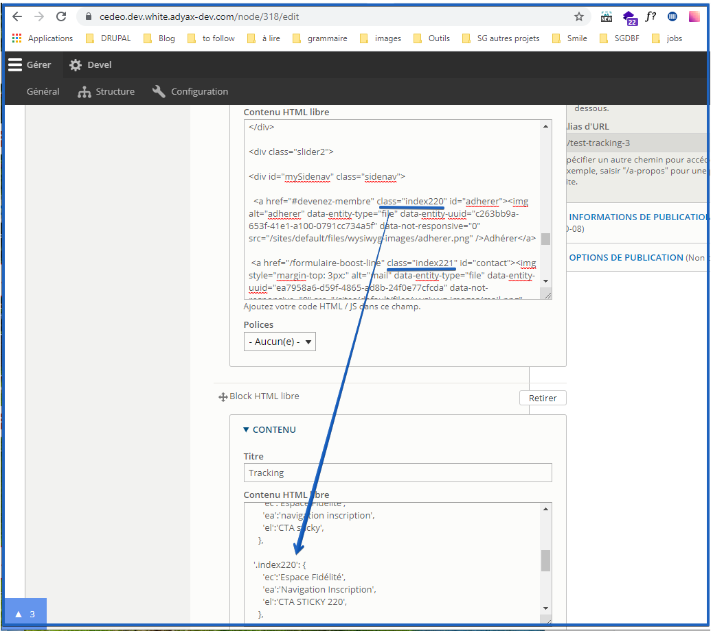
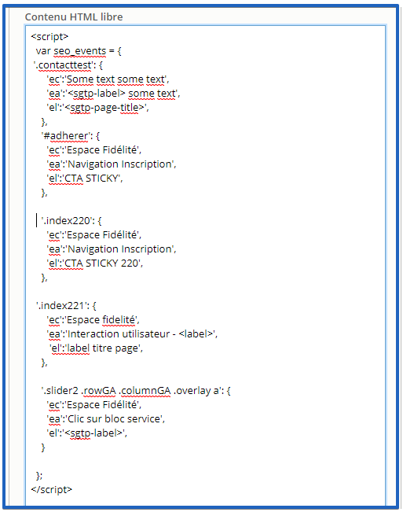

# **Analytics - specific placeholders**

For tracking purposes, the following placeholders have been developed.
They can be added by contributors in any content type.

### Method 1

The following HTML class shall be added to a link :
'class="sgt-data-event" data-sgt-ca="Some categorie" data-sgt-ac="Some
action" data-sgt-la=Some label"'

And following placeholders can be used :

-   &lt;sgtp-selector-label:\[CSS selector\]&gt; : The placeholder will
     return the text inside the first element specified in the css
     selector.

-   &lt;sgtp-page-title&gt; : The placeholder will return the current
     page title.

-   &lt;sgtp-label&gt; : The placeholder will return the text inside the
     current element

**Note** : placeholders can be used inside the text:

&lt;a href="/formulaire-boost-line" class="sgt-data-event"
data-sgt-ca="Some categorie" data-sgt-ac="Some action" data-sgt-la="Some
text &lt;sgtp-label&gt; other some text"&gt;Nous contacter&lt;/a&gt;

**Note** : two placeholders can not be added in one parameter :
data-sgt-la="Two placeholders at once &lt;sgtp-page-title&gt;
&lt;sgtp-label&gt; some text"

For example:

&lt;a href="/la-maison-saint-gobain-gagnez-des-chantiers-membre"
class="sgt-data-event" data-sgt-ca="Espace Fidélité" data-sgt-ac="Clic
sur bloc service" data-sgt-la="La Maison Saint-Gobain"&gt;

&lt;a href="/configurateur-chantier-solu-non-membre"
class="sgt-data-event" data-sgt-ca="Espace Fidélité"
data-sgt-ac="Navigation slider - &lt;sgtp-label&gt;"
data-sgt-la="&lt;sgtp-selector-label:button.tablinks.active&gt;"&gt;Découvrir&lt;/a&gt;

&lt;a href="/coup-de-pouce-mon-energie-tout-compris-total-membre"
class="sgt-data-event" data-sgt-ca="Espace Fidélité" data-sgt-ac="Clic
sur bloc service" data-sgt-la="&lt;sgtp-page-title&gt;"&gt;

&lt;a href="/formulaire-boost-line" class="sgt-data-event"
data-sgt-ca="Some categorie" data-sgt-ac="Some action"
data-sgt-la="&lt;sgtp-label&gt;"&gt;Nous contacter&lt;/a&gt;

### Method 2

In a html block, the contributor should choose which element is to be
tracked.

And then, in a separate html block, define the attributes to be sent for
tracking purposes

**Note** : if both methods are used in the same element, method 1 will
be the one active.

