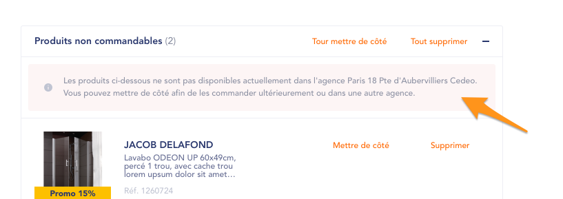
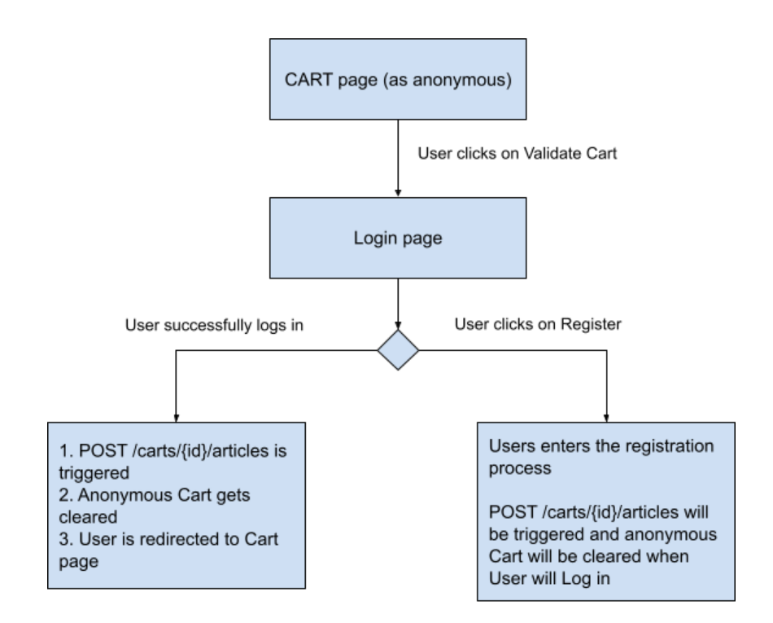
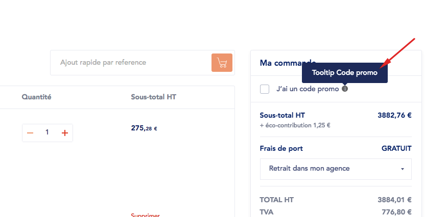

# **Anonymous cart**

Some of the Brand websites do authorize anonymous Users to add to Cart. Next options need to be enabled / set up : 

* Anonymous Cart management is enabled on Drupal side (it can be enabled / disabled per site)
* onlineAvailability logic reflects the ability to add products to cart as an Anonymous User (VA / VAR). This is managed on SGDBF side. 

Anonymous Users can then access Cart page (including “empty cart state”), and add Products to Cart. Anonymous Cart is stored in Drupal session. Product IDs / quantities / prices are stored. 

Note that “notInAgencyPortfolio” case is also managed : if, as Anonymous, User adds product to cart, then changes agency, and previously added products are not available in new-selected agency, those products are displayed in the “notInAgencyPortfolio” block on Cart page.

<span style="color:red">!!</span> In addition, a warning message is displayed above “notInAgencyPortfolio” block (ONLY for anonymous Cart), with next message (translatable from Translate Interface) :

```
Les produits qui ne sont pas vendus par votre agence @agencyName ne seront pas sauvegardés dans votre panier lors de votre connexion.
```

Design to use for that message is the next one : 



When User logs in, items from anonymous cart are sent via POST /carts/{id}/articles, and if service returns a success, anonymous cart gets cleared. 
Below is a schema that illustrates possible User journeys from Cart page : 



Note that POST POST /carts/{id}/articles is triggered / Anonymous cart is cleared if User logs in even if not coming from the Cart page. 

## **Anonymous Cart page specificities**

On Anonymous Cart page, next elements are disabled :

* Promocodes feature is not available. Field is <del>greyed</del> hidden <del>and it is possible to define a specific tooltip message for Anonymous cart state (different from tooltip for regular cart) :</del>



* Delivery options selection is hidden. A string (translatable from Translate Interface) is displayed instead of  the drop-down. Base string :

```
Veuillez vous connecter pour définir vos options de livraison. 
```

* Quick Add to cart is disabled

## **Product prices and availabilities**

Regarding products availabilities : if anonymous User did add products to cart, and then changes agencies, it is required to check if added-to-cart products will still be available in the new-selected agencies. To do so, service **GET articles/articles-by-ids** is triggered on agency change. This service returns the list of products which are available and which are not available in new-selected agency. 

Regarding product prices, an general setting allows to define if they are retrieved from /pricing service, or from articleDto (this applies for anonymous Users only). See related section for details.  
