# **Bulk add to Cart**

This feature can be enabled / disabled per site. It is built as a Vue JS
application. Its purpose is to propose several ways of adding products
to cart. It is divided into 3 sub-features :

-   Manual add to Cart

-   CSV import add to Cart

-   Scan add to Cart (available on mobile devices only)

**!!** Note that CSV tab must be displayed first (on the left) - even if
on design it is presented in the middle.

Note that it is also possible to enable / disable Scan feature, and Free
text area input field block.

**!!** If anonymous cart is disabled on site level, then trying to
access the Bulk add to Cart section (any tab) redirects User to the
login page.

On mobile, accessing /commande-express will display the Scan feature by
default.

On desktop, accessing /commande-express will display the CSV feature
(1st tab) by default.

## **General elements**

**Settings **

| Expected URL alias - manual add to cart | ../commande-express/saisie-manuelle |
| --------------------------------------- | ----------------------------------- |
| Expected URL alias - CSV import         | ../commande-express/import-csv      |
| Expected URL alias - Scan               | ../commande-express/scan            |
| Breadcrumbs                             | \[site:name\] > Commande Express    |
| Meta-title                              | Configurable from back-office       |
| Meta-description                        | Configurable from back-office       |
| Translate Interface Context             | Commande Express                    |

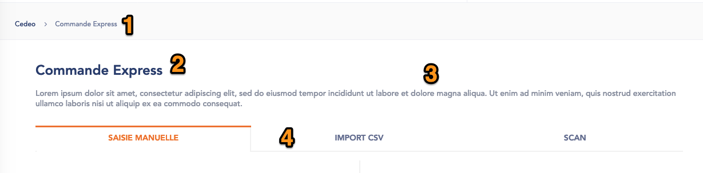

1.  Breadcrumbs

2.  Page title : translatable from Translate Interface

3.  Page description : translatable from Translate Interface. Base
     string :

  --------------------------------------------------------------------------------------------------------------------------------------------------------------------------------------------------------------------------
  Entrez les produits que vous souhaitez ajouter à votre panier soit par saisie manuelle, Scan, en téléchargeant un fichier excel (au format CSV) ou en copiant directement des références \[site:name\] ou fournisseurs).
  --------------------------------------------------------------------------------------------------------------------------------------------------------------------------------------------------------------------------

4\.  Tabs : order of the tabs is not configurable. Currently selected tab
     is highlighted with Brand Color 2. Tab labels are translatable
     from Translate Interface. Base strings :

-   IMPORT CSV

-   SAISIE MANUELLE

-   SCAN

## **Manual add to Cart**

Manual add to Cart is composed of 2 parts :

-   Product ID input fields / Quantity input fields

-   Free text area input field

As soon as User starts to input in Product ID input field (on the left
side), then Free text area block (on the right side) gets disabled - and
if User starts to input in Free text area (on the right side), then
Product ID inputs fields block gets disabled.

As a result, User can’t add both Add to Cart methods at the same time.

### Product ID input fields / Quantity input fields

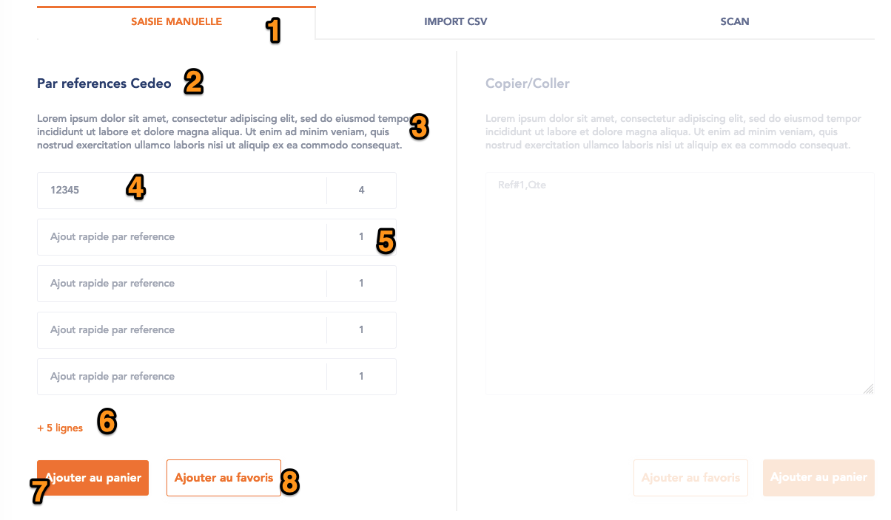

1.  **Tab title**

2.  **Block title** : translatable from Translate Interface. Base string
     : Références fournisseurs ou \[site:name\]

3.  **Block description** : translatable from Translate Interface. Base
     string :

  ----------------------------------------------------------------------------------------------------------------
  Préparez votre commande à partir des références du catalogue \[site:name\] ou avec les références fournisseurs
  ----------------------------------------------------------------------------------------------------------------

4\.  **Product input field** : by default, 5 are displayed on the page.
     There is no auto-complete / suggest feature for this field.

5\.  **Quantity input field** : by default, 5 are displayed on the page
     (next to each default Product input field).

6\.  **Add 5 more lines** : on-click, dynamically adds 5 additional
     Product input field / Quantity input field couples. Link label is
     translatable from Translate Interface. Brand Color 2 applies on
     it.

7\.  **Add to Cart button** : on-click, **POST /carts/{id}/articles** is
     triggered, and Added to Cart pop-in is shown. See [*related
     section*](#_ciflmncqkfso) for details. Button label is
     translatable from Translate interface.

8\.  **Add to Wishlist** : see [*related section*](#add-to-wishlist)**.**
     Button label is translatable from Translate Interface.

### Free text area input field

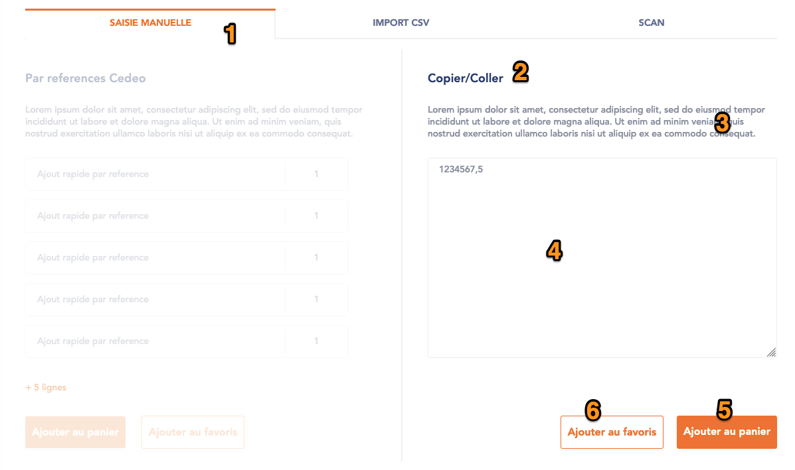

1.  **Tab title**

2.  **Block title** : translatable from Translate Interface. Base string
     : Copier/Coller

3.  **Block description** : translatable from Translate Interface. Base
     string :

  ------------------------------------------------------------------------------------------------------------------------------------------------------------------------------------------------
  Copiez directement la référence du premier produit et la quantité souhaitée (en les séparant par des virgules), puis allez à la ligne. Faites de même pour chaque produit à ajouter au panier.
  ------------------------------------------------------------------------------------------------------------------------------------------------------------------------------------------------

4\.  **Free input text**. Placeholder is : Ref\#1,Qte (translatable from
     Translate Interface). There are no front-end validation rules on
     the field, it is up to User to respect the input format :

-   Reference,quantity

-   Reference,quantity,

-   Etc

5\.  **Add to Cart button** : on-click, **POST /carts/{id}/articles** is
     triggered, and Added to Cart pop-in is shown. See [*related
     section*](#_ciflmncqkfso) for details. Button label is
     translatable from Translate interface.

6\.  **Add to Wishlist** : see [*related section*](#add-to-wishlist)**.**
     Button label is translatable from Translate Interface.

## **CSV Import**

**!!** CSV import option must be hidden from the “Tabs selection
drop-down list” on mobile (even if page remains accessible via direct
URL).

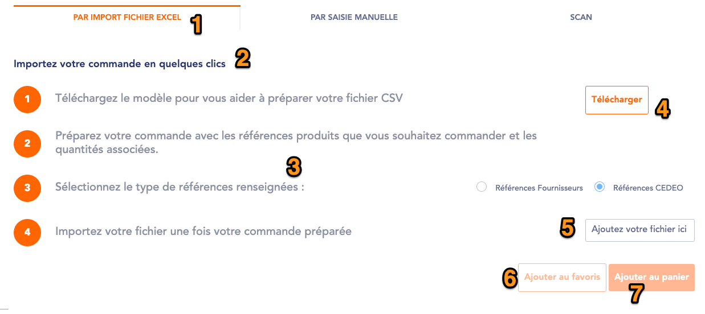

1.  **Tab title**

2.  **Page title** : translatable from Translate Interface. Base string
     :

  -------------------------------------------
  Importez votre commande en quelques clics
  -------------------------------------------

3\.  **Instruction steps** : each text is translatable from Translate
     Interface. Numbered list background color uses Brand Color 2.

-   *Step 1 base string* : Téléchargez le modèle pour vous aider à
     préparer votre fichier CSV

-   *Step 2 base string* : Préparez votre commande avec les références
     produits que vous souhaitez commander et les quantités associées.

-   *Step 3 base string* : Sélectionnez le type de références
     renseignées :

	-   2 radio buttons allow to define input data type (either
         References or Product IDs)

-   *Step 4 base string* : Importez votre fichier une fois votre
     commande préparée

4\.  **Download CSV model file** : on-click, file gets downloaded on
     User’s desktop / device. File is contributed on back-office.
     **!!** Button must use the “secondary CTA” style

5\.  **Import file CTA** : Once the file is uploaded, file name is
     displayed (trimmed with “...” if too long), and a cross allows to
     remove the file. If file gets removed, button is displayed again.
     Button label (translatable from Translate Interface) : Importer

6\.  **Add to Wishlist** : see [*related section*](#add-to-wishlist)**.**
     Button label is translatable from Translate Interface.

7\.  **Add to Cart button** : on-click, **POST /carts/{id}/articles** is
     triggered, and Added to Cart pop-in is shown. See [*related
     section*](#_ciflmncqkfso) for details. Button label is
     translatable from Translate interface.

=&gt; Note that both buttons are disabled until a file gets uploaded.

## **Added to cart pop-in**

Once **POST /carts/{id}/articles** is done, depending on response from
service, products will be displayed on the Added to Cart confirmation
pop-in, as following :

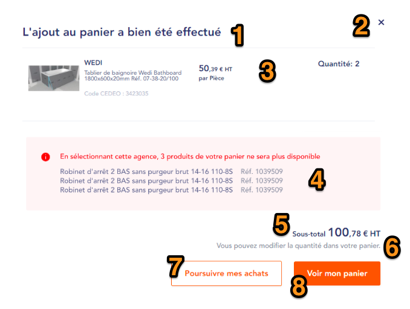

1.  **Pop-in title** : translatable from Translate Interface

2.  **Closing cross** : on-click, closes pop-in (same as clicking
     outside pop-in)

3.  **Products added to Cart**. For each, display :

	-   Product thumbnail

	-   Product brand

	-   Product title

	-   Product site reference

	-   “New” flag if product is flagged as so

	-   “Promo” flag if product is flagged as so

	-   Price / Tax label (HT) / product unit. Note that price and tax label
     depend on user profile. Please refer to the [*corresponding
     section*](#prices-displaying) for details

	-   Quantity : label is translatable from Translate Interface. Quantity
     displayed is the one added to Cart. Note that quantity can’t be
     changed from the pop-in. Please refer to [*subsection
     below*](#quantities-management) regarding Quantities.

4.  **Products that were not added to cart block** :

	-   Label (in red) : Les articles suivants ne sont pas commandables en
     ligne dans votre agence \[current:agency:name\] et n’ont pas été
     ajouté dans votre panier :

	-   Items from ***errrorInfo*, notInAgencyPortfolio, notPriced,
     notAvailableOnline.** For each, display :

    		-   Product name

		-   Product site reference (label “Réf.” is translatable from
         Translate Interface)

5.  **Sub-total** : sum of all line items \* quantities. It concerns
     ONLY product(s) which just have been added to Cart (and not full
     cart sub-total). Note that tax label depends on user profile.
     Label “sous-total” is translatable from Translate Interface

6.  **Description text** : translatable from Translate Interface

7.  **Continue shopping button** : on-click, closes the pop-in. Label is
     translatable from Translate Interface

8.  **See cart button** : on-click, redirects user to his cart. Label is
     translatable from Translate Interface

### Quantities management

Some products added to cart might not have enough quantity comparing to
what was set by User. For example :

-   User goes to Manual Add to Cart, and inputs product ID 1234567. He
     sets quantity = 10 for it.

-   User hits Add to Cart CTA. Service **POST /carts/{id}/articles** is
     triggered, product is passed with Quantity = 10

-   On service side, product’s available quantity is only 8. In this
     case, on Added to Cart confirmation pop-in, display Product with
     quantity = 8 (based on service response)

Also, some products might already be added to cart when User adds from
Bulk Add to Cart. For example :

-   User has product A in his cart, quantity = 3

-   User imports product A from CSV, he sets quantity = 5.

-   User hits Add to Cart button. Service **POST /carts/{id}/articles**
     is triggered, product A is passed with Quantity = 5

-   =&gt; so, that would be a total of 8 (quantity) for that product

-   On Added to Cart confirmation pop-in, display Product A with
     quantity = 5, since only 5 were added from the Bulk Add to Cart.
     Calculation (substract) is done on Drupal side, to display correct
     quantity on the added to Cart confirmation pop-in.

## **Add to wishlist**
---------------

Onclick on Add to Wishlist button, Wishlist pop-in opens.

**!!** Note that wishlist pop-in is slightly different from the regular
one - since here we can add several products at once to the Wishlist,
then we should not display product information on the Wishllist pop-in.\
Other wishlist features (create new list, add to existing list) can be
used, EXCEPT “remove” from wishlist, since there are very low chances
that all products currently being added to wishlist already are present
on a wishlist.

Wishlists feature details can be found in [*next section*](#section-26).

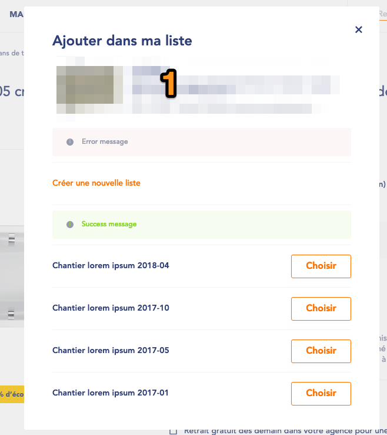

1.  **Product info** : do not display on wishlist pop-in when used from
     Bulk Add to Cart feature.

## **Add to cart / wishlist - method selection**

On next Bulk Add to Cart methods :

-   Product ID input fields / Quantity input fields

-   Free text area input field

-   CSV import

User must be able to add products to cart / wishlist using next methods
:

-   By Product ID

-   By Supplier reference ( = ***supplierReference***)

Process is next :

-   User adds references (no matter if it is Product IDs or Supplier
     References)

-   Then, User must select which type of data he input, thanks to
     dedicated radio-buttons

-   **!!** Note that it should be possible to define which one of the 2
     radio-buttons is defined by default (on site level)

***On Product ID input fields / Quantity input fields tab :***

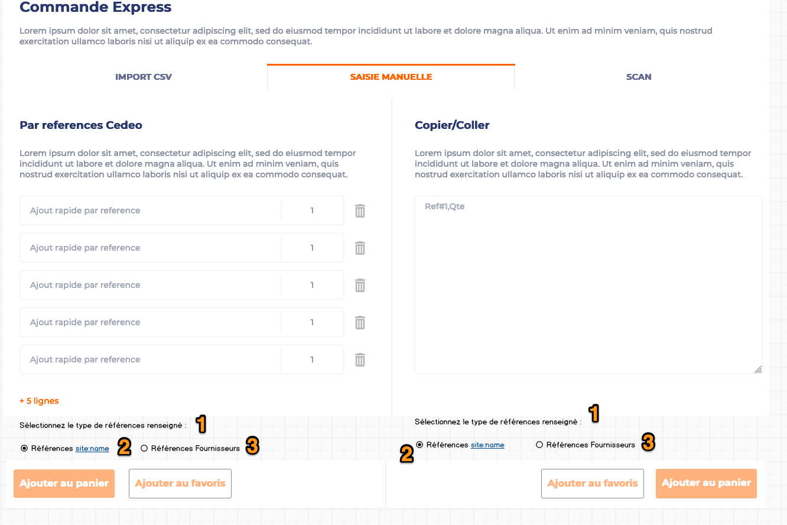

1.  **Description text :** translatable from Translate Interface. Base
     string :

  ------------------------------------------------
  Sélectionnez le type de références renseigné :
  ------------------------------------------------

2\.  **Product ID radio-button :** label is translatable from Translate
     Interface. Base string :

  --------------------------
  Références \[site:name\]
  --------------------------

Where \[site:name\] is dynamic and corresponds to current site name.

3\.  **Supplier references radio-button :** label is translatable from
     Translate Interface. Base string :

  -------------------------
  Références Fournisseurs
  -------------------------

***On CSV Import tab :***

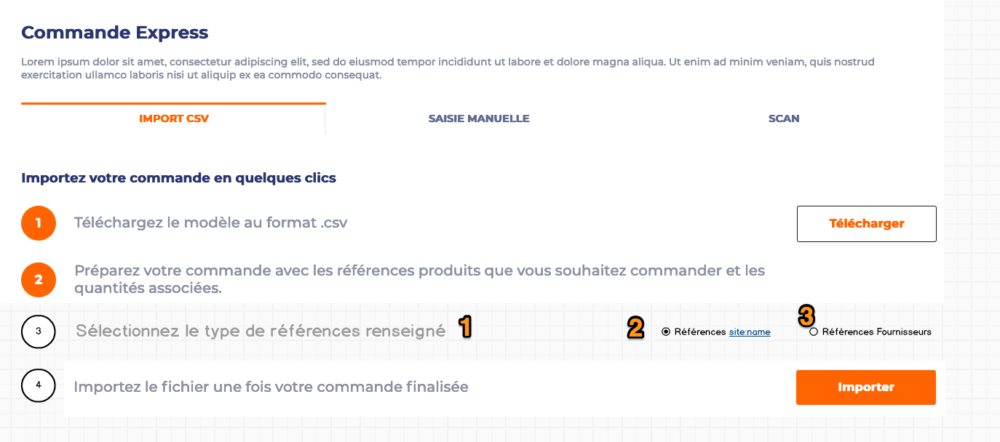

1.  **Step 3 description** : translatable from Translate Interface. Base
     string :

  ----------------------------------------------
  Sélectionnez le type de références renseigné
  ----------------------------------------------

2\.  **Product ID radio-button :** label is translatable from Translate
     Interface. Base string :

  --------------------------
  Références \[site:name\]
  --------------------------

Where \[site:name\] is dynamic and corresponds to current site name.

3\.  **Supplier references radio-button :** label is translatable from
     Translate Interface. Base string :

  -------------------------
  Références Fournisseurs
  -------------------------

***Services triggering :***

-   If Product ID method was selected by User, then regular Add to Cart
     service is triggered

-   If Supplier method was selected by User, then **GET
     /api/v1/articles-by-supplier-references** is triggered in order to
     convert supplier References into Product IDs, then regular Add to
     Cart service is triggered

	-   **!!** Note that if for some products, there is no
         correspondence returned, then such products are ignored (not
         added to Cart)

## **Scan**

Scan feature is only available on Mobile devices. It uses the Scandit
external tool to perform the actual scanning.

Scan feature can be enabled in BO. Icon and visibility contributed in
here : /admin/structure/config\_pages/site\_settings/edit

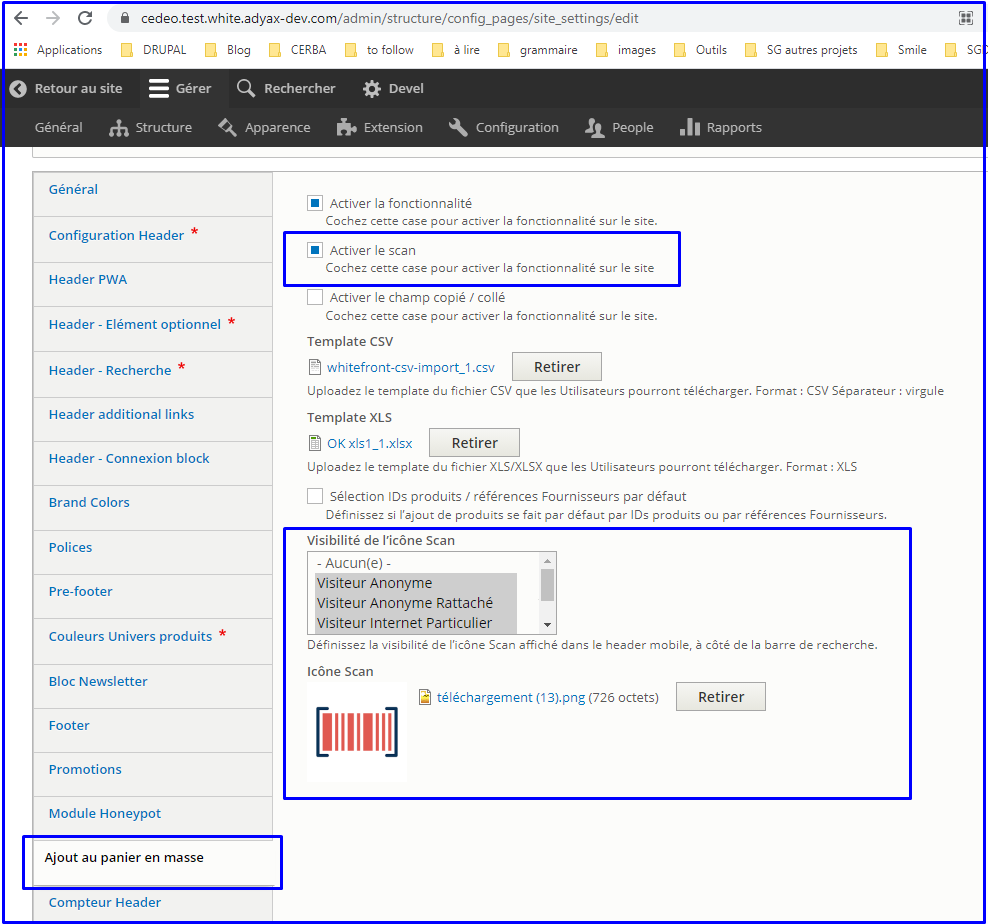

On desktop, an informative text is shown as following :

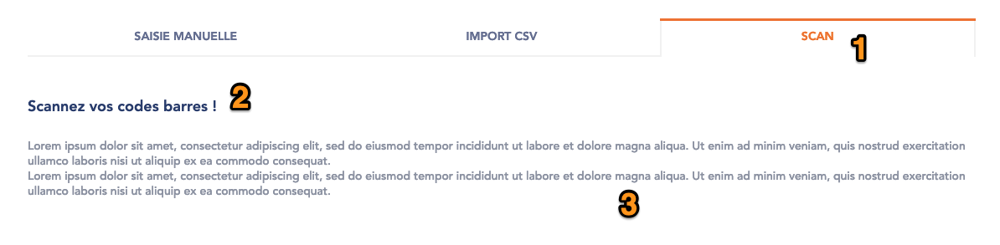

1.  **Tab name**

2.  **Block title** : translatable from Translate Interface. Base string
     :

  ----------------------------
  Scannez vos codes barres !
  ----------------------------

3\.  **Block description** : translatable from Translate Interface. Base
    > string :

  -----------------------------------------------------------------------------------------------------------------------------------------------------------------------------------------------------------------------------------------------------------------------------------------------------------------
  Cette fonctionnalité est uniquement disponible sur mobile ! Rendez-vous sur votre smartphone pour scanner les codes-barres des produits dont vous souhaitez consulter les informations (descriptif, caractéristiques techniques, documentations associées etc.) ou pour les ajouter directement à votre panier.
  -----------------------------------------------------------------------------------------------------------------------------------------------------------------------------------------------------------------------------------------------------------------------------------------------------------------

On mobile, scan block is rendered as following :

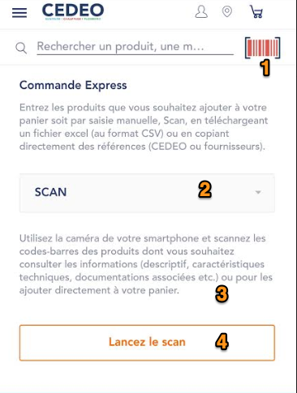

1.  **Scan quick access** : see [*related section*](#scan-quick-access)
     for details

2.  **Scan tab** : selected by default when accessing /commande-express
     on mobile

3.  **Description text** : translatable from Translate Interface. Base
     string :

  ---------------------------------------------------------------------------------------------------------------------------------------------------------------------------------------------------------------------------------------------------------
  Utilisez la caméra de votre smartphone et scannez les codes-barres des produits dont vous souhaitez consulter les informations (descriptif, caractéristiques techniques, documentations associées etc.) ou pour les ajouter directement à votre panier.
  ---------------------------------------------------------------------------------------------------------------------------------------------------------------------------------------------------------------------------------------------------------

4\.  **Launch scan CTA** : on-click, launches the camera (see next
     screen).

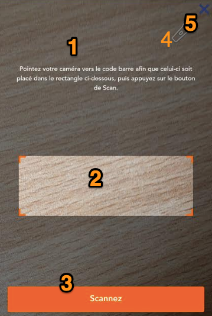

1.  **Description text** (translatable from Translate Interface). Base
     string :

  ----------------------------------------------------------------------------------------------------------------------------------------
  Pointez votre caméra vers le code barre afin que celui-ci soit placé dans le rectangle ci-dessous, puis appuyez sur le bouton de Scan.
  ----------------------------------------------------------------------------------------------------------------------------------------

2\.  **Scan area** : User must point his camera to the barcode using this
     area. Outside of the area, a grey overlay is applied.

3\.  **Scan button** : on-click, the scanning is performed. Once Scan has
     been done, several cases can be triggered (see below)

4\.  **Light icon** : managed by Scandit

5\.  **Closing cross** : on-click, closes the scan Camera overlay.

***Scan cases :***

Depending on response from service, different redirects are performed :

-   Product is found in current agency =&gt; User gets redirected to the
     corresponding Product detail page

-   Product exists but is ***notInAgencyPortoflio*** =&gt; User is
     redirected to the specific 404 page - notInAgencyPortfolio case
     (see [*related
     section*](#light-pdp-va---notinagencyportfolio-article-case-for-va))

-   Product is not found at all, or service returns an error =&gt; User
     is redirected to the Search Results page - empty state (see
     [*related section*](#_hfa9jrs8kh7c))

### Scan quick access

The scan quick access icon visibility can be defined per role. From
back-office, it is possible to configure its related PNG icon.

On-tap, User is redirected to the Scan feature &gt; Camera overlay
opened.
