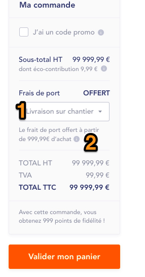

# **Cart**

## **Delivery methods**

On Cart page, User can select delivery method among available ones. Delivery methods are retrieved from Cart object (deliveryOptions.id). This field can have next values :

* L = corresponds to Click & Delivery
* E = corresponds to Click & Collect

**deliveryOptions** object has following fields :

* ** *id* :** used to define which delivery methods are available for current Cart
* ** *Label* :** label to be displayed in drop-down ** *(1)* **
* ** *shippingLabel* :** label to be displayed below drop-down ** *(2)* **
* ** *shippingFreeFrom* :** amount from which delivery cost is free. It applies only if id = L



1. ** *deliveryLabel* ** values in drop-down
2. ** *shippingLabel* ** value.

### Shipping costs 

There are 3 options regarding shipping costs management. Each option implies specific labels displaying / shipping cost calculation.

If current selected delivery method == E (Click & Collect), then display :
Frais de port = GRATUIT (“Frais de port” is static label, translatable from Translate Interface)

<span style="color:red">!!</span> Note that following rules apply ONLY if current selected delivery method == L (Click & Delivery).
From customer object, field shipping can have next values : 

* F
* N
* O

```
IF cart is empty, THEN 
    IF Shipping from CUSTOMER object = F =THEN leave "0,00€"
   	 IF Shipping from CUSTOMER object = N THEN leave « OFFERT » 
  		IF Shipping from CUSTOMER object = O THEN display "0,00 €" 
ELSE 
IF cart.deliveryOptions.shippingCost = 0.00, THEN
    		IF customer.shipping = F THEN display « FORFAIT » + text « Frais de port Inclus » 
    		ELSE display « OFFERT » 
ELSE
		IF htTotalArticles is less than cart.deliveryOptions.shippingFreeFrom, THEN display value from cart.deliveryOptions.shippingCost.
		ELSE display « OFFERT » 
```


