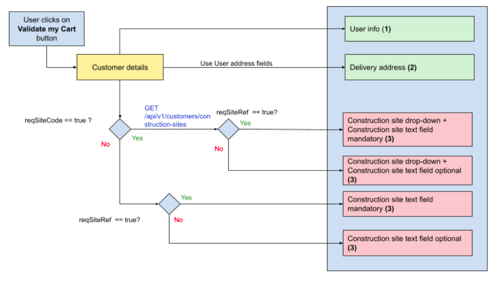

# **Checkout**

## **Global schema**

### Step 1 - Access to Checkout Step 1 (Delivery)


Step 1 - Access to Checkout step 1 (Delivery)

**(1)** Is used to pre-fill the “Delivery Contact” block
**(2)** Is used to pre-fill the Delivery address (in case Click & Delivery option is chosen by User)
**(3)** Is used to manage the “My references” block. Note that if ** *reqSiteCode == false* **, then Construction Site drop-down field is not displayed at all. Also, in cases where Construction Site Text field is mandatory, a star “*” must be displayed on front-end next to it. 

**!! (1)** Note that in some cases, for a User with reqSiteCode = true, service doesn’t return any values.
In such case :

* Drop-down field must be disabled
* Button “Passer au paiement” is disabled
* An error message is displayed on top of the page (using error message styling) :

```
Vous ne disposez d'aucun chantier ouvert dans [agencyName]. Veuillez contacter votre agence ou effectuez votre commande dans une agence dans laquelle vos chantiers sont déclarés.
```

=> Message is transtable from Translate Interface. 

**!! (2)** Note that a setting allows to bypass ** *reqSiteCode* ** value. If ** *reqSiteCode* ** is set as being bypassed, then, even if ** *reqSiteCode* ** value = true (= Construction site drop-down is mandatory on front-end normally), this drop-down will not be mandatory anymore, and User can go to next Checkout step without selecting a value from that Drop-down. 
It applies on both Click & Delivery / Click & Collect options (checkout step 1). 

There are 2 cases :

1. User has reqSiteCode = true, and dedicated servic) returns value : User can go to next checkout step without selecting a Construction site value in drop-down (which is displayed with its values)
2. User has reqSiteCode = true, and dedicated service (/construction-sites) does not return any value : Drop-down is displayed as disabled on Front-end, but User can go to next checkout step, and error message (see Note **(1)** above) is not displayed.


**!! (3)** Note that reqSiteCode and reqSiteRef fields are present only for VI CLI within /account response. 
But, reqSiteRef field is always displayed on checkout (as optional) for VI Users.

**!! (4)** Note that even if reqSiteCode = false for a User, then GET /construction-sites is called anyway :

* If service returns values, then show Site Codes drop-down (not mandatory to select a value to go to next Checkout step)
* If service does not return any value, then do not display the drop-down 

**!! (5)** Note that when reqSiteCode displays values (returned from /construction-sites) - in all cases no item from /construction-sites must be selected by default. Instead, ** *placeholder* ** “Sélectionnez un chantier” is selected by default (translatable from Translate Interface).  


