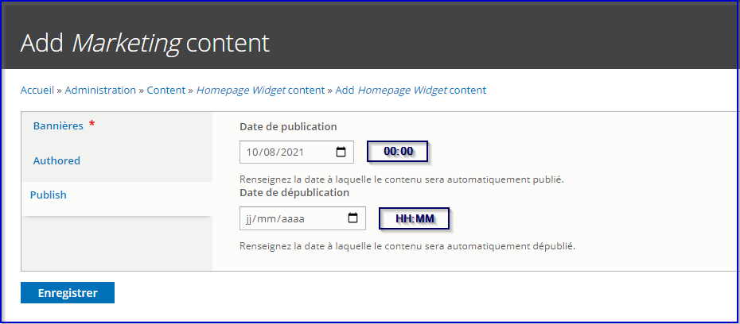

# **Content scheduling**

Some entities can be scheduled regarding publication, meaning that it is
possible to :

-   Define a start date and an hour, from which content will be
     published

-   Define an end date and an hour, from which content will be
     unpublished

Time zone should be Paris time zone.

<del>Note : it is not possible to define specific time for the scheduling,
only dates</del>.

Examples : contributor shall be able to choose to published content from
:

-   DD/MM/YYYY at HH:MM and no end date nor end hour

-   DD/MM/YYYY at HH:MM until DD/MM/YYYY at HH:MM

System will check every night which contents must be published /
unpublished according to Start / End dates set.

Note that if a content is set to be published between day 1 and day 5,
then if it gets manually unpublished on day 3, it will be automatically
re-published on day 4 (and will be of course be unpublished
automatically after day 5).

Entities to benefit from the Scheduling feature are :

**Content types :**

-   Page simple : ../node/add/page

-   Mini catalogue : ../node/add/mini\_catalog

-   Mini catalogue advanced

-   Page SEO : ../node/add/seo

-   PDP &gt; marketing campaigns (opération marketing) :
     /admin/structure/config\_pages/products\_settings/edit

**Home page entities :**

-   Widget Slider : ../admin/content/homepage\_widget/add/slider

 **Note :** To be done per slider AND also per slide

-   on the "slider" tab, for each SLIDE, a publication date can be
     contributed

-   on the "published" tab, publication date for SLIDER can be
     contributed.

 When adding a publication date for a slide, the contributor should be
 aware of the publication date of the slider so no date
 incompatibilities happen.

-   Widget marketing line :
     ../admin/content/homepage\_widget/add/marketing

-   Grille de produits Page d’accueil (homepage\_products\_grid)

-   Carousel de produits Page d’accueil (homepage\_products\_list)

Rules are next :

-   Existing content should not be affected (i.e. no start / end date
     applied after deployment of the solution) (in other words, adding
     scheduling options should not affect existing content by
     publishing unpublished content / unpublishing published content)

-   By default, for newly-created content, start date is defined as
     current date (so content gets published) and start hour is empty,
     and there is no end date nor end hour defined

-   If hour is empty = 00h00

-   Start date should be “previous” to end date

-   If both start date and end date are set, then content is published
     accordingly
