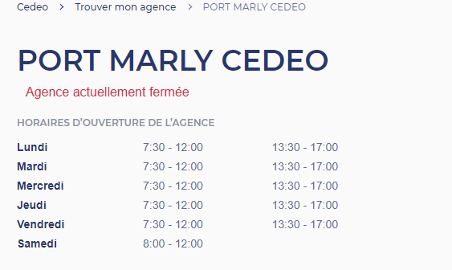

# **COVID-19 Features**

## **Closed agencies**

From back-office, it is possible to define a list of agencies which will
be considered as Closed. In such case :

-   Validate my Cart CTA on Cart page is disabled, so User can’t access
     the Checkout

-   A message is displayed on Cart page to inform User about why he
     can’t proceed with Checkout

List of closed agencies can be defined in Back-office using 2 ways :

-   Text field (multiple)

-   Text area

Also, a checkbox allows to define all agencies as Closed.

Regarding the message to display on the Cart page, it is configurable
from back-office (not from Translate Interface). Next fields are
available :

-   Text area (advanced decorated text)

-   Background color

-   Text color

  
*Position of the message on Cart page*

### Opening hours displaying - closed agencies

A setting in back-office allows to display a specific Opening Hours
string. If checked, the logic applies for all agencies listed as Closed.
Label to display : *Agence actuellement fermée* (translatable) in Red
color.

This string must be displayed on next places :

-   Header

-   My Agency pop-in

-   Agency detail page

-   Agency Map page

-   Product Locator

### Opening hours displaying - 6 days rule 

This section applies in next context :

-   Agency is NOT defined as closed from Drupal back-office

In explanations below, “agency opened” / “agency closed” are from the
agency DTO / Product Locator DTO standpoint.

**!!** for Product Locator, if field ***closed*** = true and
***nextOpeningDate*** field is empty, display string *Agence
actuellement fermée* (translatable).

Based on agency DTO data, Drupal determines if agency is currently open
or closed, and displays information strings accordingly :

-   If agency is currently open, we display *Ouvert jusqu’à \[time\]*

-   If agency is currently closed, but opens today, we display *Réouvre
     à \[time\] *

-   If agency is currently closed, and re-opens on another day, we
     display *Réouvre \[day\] à \[time\]*

	-   Note that \[day\] is output as “day name”, like Monday, Tuesday,
         etc

**New rule :**

-   If agency is currently closed, and next opening day is in more than
     6 days, then :

1.  Display string *Agence actuellement fermée* (translatable) on next
     places :

	-   Agency detail page

	-   Agency results page

	-   Product Locator

	-   Agency pop-in

2.  Display string *Réouverture prévue le \[date\]* (translatable),
     where \[date\] is output as DD/MM/YYYY on the Agency detail page :

## **Restricted Users**

Some Users are restricted from proceeding with Checkout. This means
that, on Cart page, Validate my Cart CTA is disabled.

From back-office, a checkbox allows to enable the *Restricted Users*
logic. If checked, then :

-   All PART Users will have the disabled Validate My Cart CTA

-   A message will be displayed on Cart page. Message is configurable
     from back-office (not from Translate Interface). Next fields are
     available :

	-   Text area (advanced decorated text)

	-   Background color

	-   Text color

Note that if current User is restricted, and his current agency is
closed, then the Restricted User message takes priority over the Closed
Agency message on Cart page.
