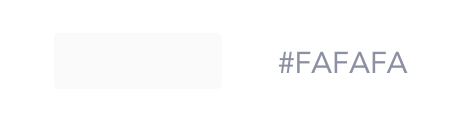

# **Design system**

From Drupal back-office, several styling elements can be configured. Specifications below are based on initial design - which is used as a reference to determine which elements are configurable / which ones are not.
Exceptions are also listed (for example, footer background uses Primary color in initial design, but footer color should be managed independently from Global Color Scheme). 

## **Icons management**

All icons over the website are configurable from back-office. They will be managed in SVG format, and contributors will be able to upload each SVG icon using dedicated upload fields. Color scheme then applies over the SVG icons.
SVG icons are configurable from a dedicated Configuration Page. 

Note : there will be some exceptions, where icons will be managed as PNGs, using dedicated File upload fields. Such icons will be mentioned in this Specifications document. 

## **Fonts management**

From back-office, it is possible to configure fonts to be used on the website, using a predefined list of Font families (via Drop-down list). On initial design, main font used is Avenir (with its different variants) :

Note that Typography scale can’t be managed from back-office.

Other fonts to be available from back-office :

* Lato
* Open Sans
* Ubuntu
* Roboto
* Helvetica

## **Colors management**

There are 5 main groups of colors over the website : 

* Brand colors
* Statuses colors
* Hardcoded colors
* Category colors
* General background color

### Brand colors

There are 3 Brand colors which are customizable from back-office, using color pickers. Values below are based on initial design : 

* Primary : #29376D
* Secondary : #FF6600
* Third : #646B91

The Global Color Scheme applies everywhere on site where those colors are used (including fonts, SVG icons, tooltips, backgrounds…), except on the following places :

* Search bar (in header) Icon and Underline - Add background of search bar + background of header
* Products mega-menu level 1 background 
* Informative bars 
* Reinsurance section background
* Footer and Pre-footer backgrounds 

=> For those places, colors will be managed independently (on block / section level). 
### Statuses colors

There are 4 statuses colors which are customizable from back-office, using color pickers. Values below are based on initial design :

* Promotion color : #FDC000
* Status:in stock : #43BC7D
* Status:out of stock : #FF3232
* Status:day+1 stock : [to be provided by designers]

### Hardcoded colors

Hardcoded colors are not configurable from back-office. They are mainly used for standard text. Initial design is used as a reference to determine where those colors are used.

* #8B90A2
* #C0C4D2
* <del>#646B91</del>

“Interaction:selected” color is also not configurable from back-office : #74B6FF

### Categories colors

Categories colors are optional. It is possible to set, for each Products Catalog Level 1 Category, a specific color (using color picker). If set for a category, this color will then be used in various places, such as in Products Mega-menu, Category Landing Page…

###General background color 

General background color is customizable from back-office using color picker. On initial design, its value is #FAFAFA

## **CTAs management**

Buttons styles are configurable from back-office. Site admins can select buttons styles among a predefined list of styles. For each button style, there are 4 states :

* Regular (Normal / hover / disabled)
* Outline (Normal / hover / disabled)
* Small (Normal / hover / disabled)
* Small - Outline (Normal / hover / disabled)

By default, secondary color applies on buttons. It is also possible to override the secondary color, in order to use a different one for buttons. Color defined applies to ALL buttons over the site. 
Regarding text color, it is white by default. It is also possible to override default buttons text color using a dedicated color picker. 

NEW : a third color is available for CTA. It can be configurated here : /structure/config_pages/site_settings/edit

Two fields can be edited : 

* Background color
* Label : Couleur du bouton tertiaire
Helptext : Cette couleur est appliquée sur le style “tertiaire” des boutons.

* Font color

Label : Couleur du texte du bouton tertiaire
Helptext : Cette couleur est appliquée sur le style “tertiaire” des boutons.

There are 2 general pre-defined styles for CTAs (contributor can choose 1 among those - it will automatically apply on the different states listed above). 

## **Forms input fields management**

Form input fields shapes are configurable from back-office. Site admins can select styles among a predefined list of styles. No matter what style is chosen for form inputs fields, the behavior on front-end will always be the same. Styles allow to define the shape of the fields (rounded corners / sharp corners).

Rounded corners shape

SHARP CORNER SHAPE DESIGN TO BE PROVIDED BY DESIGN TEAM

## **Drop-down lists management**

Drop-down list shapes are configurable from back-office. Site admins can select styles among a predefined list of styles. No matter what style is chosen for Drop-down fields, the behavior on front-end will always be the same. Styles allow to define the shape of the drop-downs (rounded corners / sharp corners).

Rounded corners shape

SHARP CORNER SHAPE DESIGN TO BE PROVIDED BY DESIGN TEAM

