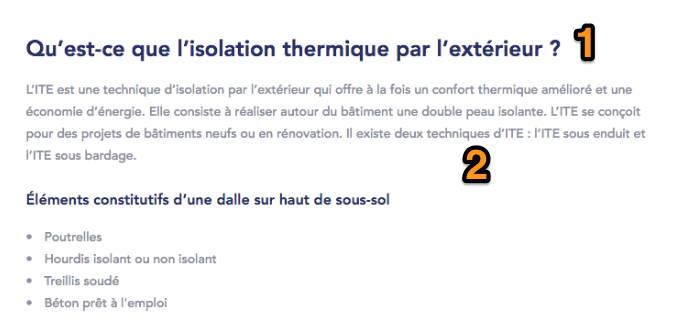
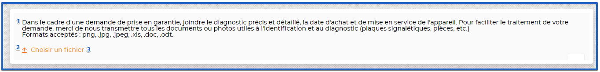
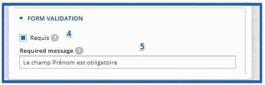

# **Drupal form builder**

A dedicated Content Type allows to add forms built with Webform module.
Several webforms can be added on a single node.\
Also, it is possible to link Drupal Form Page to a [*Sidebar
menu*](#sidebar-menus), in this case front-end displaying adjusts
accordingly.

It is possible to define page visibility per role, using checkboxes. By
default, all roles have access to the page (all checkboxes are checked).

**!!** Webform module has a lot of options : only options related to
requirements below will be used, all other options are not part of the
scope - thus their behavior (on both back-end and front-end) must not be
taken into account during testing and contribution.

**!!** Custom front-end validations might not be supported by Contrib
webform module. We stick to what module provides.

| URL alias                   | ../\[node:title\]              |
| --------------------------- | ------------------------------ |
| Breadcrumbs                 | \[site:name\] > \[node:title\] |
| Meta-title                  | Configurable from back-office  |
| Meta-description            | Configurable from back-office  |
| Translate Interface Context | Formulaire Drupal              |

Drupal Form CT is composed of several Line types :

-   WYSIWYG line

-   Webform line

**!!** Node title is not presented on screenshots below, but must be
present on the page.

## **WYSIWYG Line**

1.  **Block title** : part of the WYSIWYG (not managed as a dedicated
     field)

2.  **Block content** : filtered HTML (full WYSIWYG)

## **Webform Line**

Webform Line allows to entityref a Webform entity. On-click on Submit,
webform is dynamically submitted (no page reload).

## **Webform options**

As a global rule, Contributor can define Fieldsets which allow to have 2
columns for some of the form fields. For example :

-   Text field (100% width)

-   Text field (50% width) - Text field (50% width)

-   Drop-down list (100% width)

-   Date field (50% width) - Date field (50% width)

Next field types can be used on Webform :

|Field Type                                |Options / Description                                                                                                                                                                                                                                                                                                                                                                                                                                   |
|------------------------------------------|--------------------------------------------------------------------------------------------------------------------------------------------------------------------------------------------------------------------------------------------------------------------------------------------------------------------------------------------------------------------------------------------------------------------------------------------------------|
|Text input                                |- Must be possible to specify the max amount of chars to be input   - Must be possible to define field label, placeholder   - Must be possible to define a Help Text displayed below field, and a tooltip displayed next to field name                                                                                                                                                                                                                     |
|Text area                                 |- Must be possible to specify the max amount of chars to be input   - Must be possible to define field label, placeholder   - Must be possible to define a Help Text displayed below field, and a tooltip displayed next to field name                                                                                                                                                                                                                     |
|Radio buttons                             |- Amount of options is not limited   - Field name + options labels can be contributed   - Must be possible to define a Help Text displayed below field, and a tooltip displayed next to field name                                                                                                                                                                                                                                                         |
|Checkbox                                  |- Amount of options is not limited   - Field name + options labels can be contributed   - Must be possible to define a Help Text displayed below field, and a tooltip displayed next to field name                                                                                                                                                                                                                                                         |
|Drop-down list                            |- Amount of options is not limited   - Field name + options labels can be contributed   - Must be possible to define a Help Text displayed below field, and a tooltip displayed next to field name                                                                                                                                                                                                                                                         |
|Calendar / Date                           |- Field name can be contributed   - Must be possible to define a Help Text displayed below field, and a tooltip displayed next to field name                                                                                                                                                                                                                                                                                                              |
|Region / Agency selection Drop-down lists |Custom fields, with service calls. User must select his region first, and depending on selection, list of corresponding agencies is displayed on the 2nd drop down list                                                                                                                                                                                                                                                                                 |
|Email                                     |Email field type, with front-end validation. On form configuration, it should be possible to define that confirmation email will be sent to input email address                                                                                                                                                                                                                                                                                         |
|Email + Email confirmation fields         |Custom fields, with dependency. <del>Front-end validation applies, to make sure that value input in “Email confirmation” field matches with input in “Email” field</del>.  It should be possible to define that confirmation email will be sent to input email address                                                                                                                                                                                             |
|Upload file                               |It should include :   - an optional text description (1)   - A translatable label : “Choisir un fichier” (3)   - A default upload icon - to be displayed to the left of the label (2)  - Authorised files are : png, jpg, jpeg, pdf  - A form validation checkbox should be available in BO (4)  - A requirement message should be available for contribution (5). If form validation is required, then the requirement message is displayed if field is empty. |

  
*Webform - upload file wireframe*

  
*Webform - upload file BO example*

## **Webform emails**

Contributor can define email address(es) to which an email will be sent
after form submission :

-   1 dedicated email to User who submitted the form

-   1 dedicated email to email address(es) set (i.e. email to “Admins”)

Default email template is used for that, and both subjects and bodies
can be defined within the Webform module.

Note that it should also be possible to configure that a copy of email
sent to “Admins” will be sent to Agency selected in the form, in case
couple Regions / Agencies is used on the form.

## **Webform submissions**

Webform submissions are stored in database, and can be reviewed by
Contributors.

They can also be exported with next formats :

-   Delimited text (CSV)

-   HTML table

-   JSON documents

-   YAML documents
