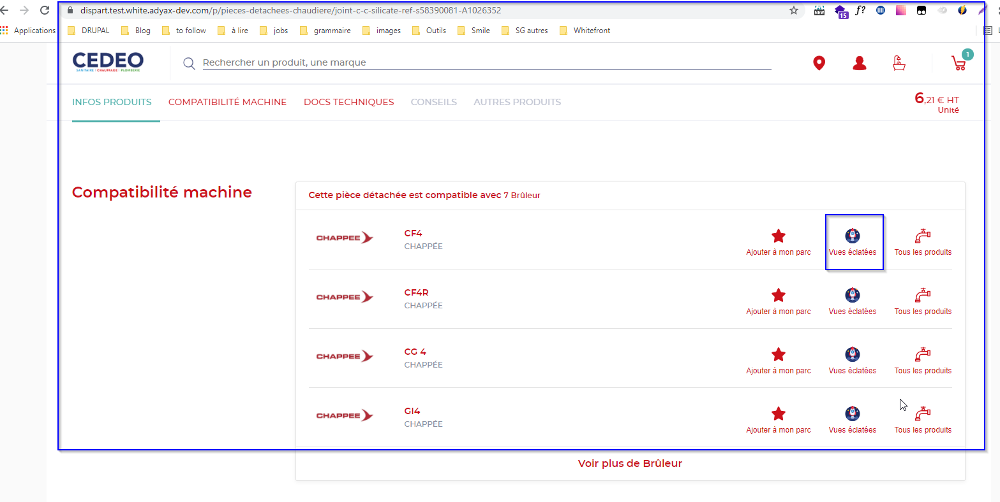

# **Exploded views module**

**Settings **

| Expected URL alias          | ../vues-eclatees              |
| --------------------------- | ----------------------------- |
| Breadcrumbs                 | \-                            |
| Meta-title                  | Configurable from back-office |
| Meta-description            | Configurable from back-office |
| Translate Interface Context | \-                            |

Exploded Views module is an external module embedded on Whitefront site.

**!!** Exploded views page can be enabled / disabled per site
(Business-wise, it will be enabled ONLY on Dispart site). If disabled,
accessing direct URL redirects to 404 page.

This can be done in : admin/config/sgdbf/config\_overrides

By default, box is unchecked and Exploded view pages are only available
for VI profiles.

if the box is checked : URL /vues-eclatees will be available to VA, VAR
user too.


**!!** There is no footer displayed on the Exploded views page.\
**!!** There is a dedicated markup on the Exploded views page :

```
<meta
   name="viewport" 
   content="width=device-width, initial-scale=1, shrink-to-fit=no" 
 />
```

Also, note that content of the pages is displayed screen-wide.

Module is composed of 2 pages :

-   Search page

-   Results page. From Results page, User can add products to the cart

  
*Rendering of the search page*

  
*Rendering of the Results page*

On Results page, the only thing which is managed on Drupal side is the
Add to Cart process :


**!!** If User is anonymous, and anonymous Cart is disabled, then
clicking on Add to Cart button redirects User to login page. After
login, User is redirected back to the Results page.

Clicking on Add to Cart triggers the Add to Cart process, and Added to
Cart confirmation pop-in appears. Quantity input by User must be taken
into account during the add to Cart process.

**!!** All other features (such as “Demander un devis” CTA) are NOT
managed on Drupal side.

From search results, PLP and PDP, exploded views is available for VI
users. On clik, user is redirected to the exploded view page

When feature is enable for VA, VAR they should also access directly the
exploded view page (without going trough login process)

  
*PLP page*

  
*Search page*

  
*Exploded view page*
