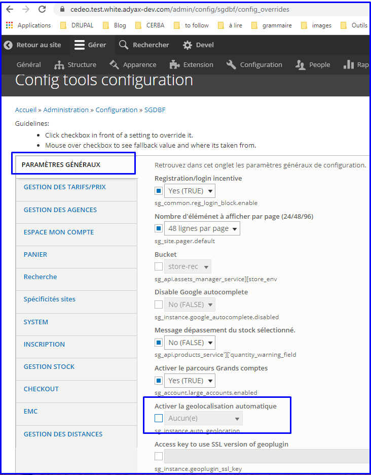
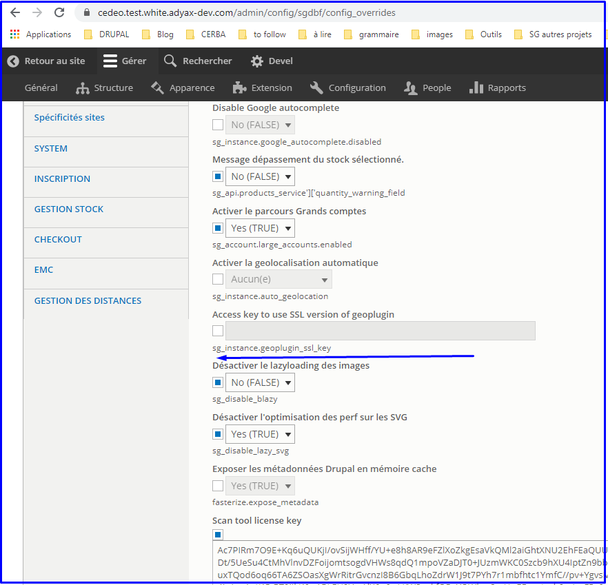
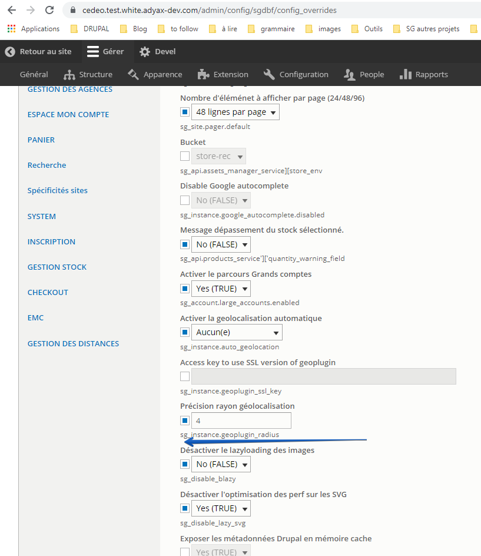

# **Geolocalisation**

For VA users ONLY.

Website admins shall be able to enable/disable the geolocalisation
feature in BO, in here : admin/config/sgdbf/config\_overrides &gt;
paramètres généraux

Label : activer la geolocalisation automatique

By default value : none, the feature is disabled.

The geoplugin.com plugin has been used. Site admin shall be able to
contribute the key to use SSL version of the plugin.

Label : Access key to use SSL version of geoplugin

When enabled, website admins have the following choices :

-   Native + No page reload : not fully implemented?

-   Native + page reload : browser’s geoloc pop-up is displayed, if
     users clicks on “authorise geoloc”, then find the nearest agency
     of the user. Reattach the user to this agency and automatically
     reload the page

-   Plugin + No page reload : not fully implemented?

-   Plugin + page reload : plugin’s geoloc, if users clicks on
     “authorise geoloc”, then find the nearest agency of the user.
     Reattach the user to this agency and automatically reload the
     page.

In order to sort the agencies list retrieved from webservice please call
/api/v1/agencies/agencies-by-gps by adding &sort=location.distance

Automatic geoloc and VA rattachement pop-up

Automatic geoloc should work with the [*VA rattachement
pop-up*](#select-an-agency-pop-up-va-va-rattachement-to-an-agency) WHEN
ENABLED, so implement the following rules for the **4 geoloc methods**
(with page reload AND without page reload) :

-   IF geoloc is disabled THEN keep existing VA rattachement pop-up
     behaviour

-   IF geoloc is enabled AND :

	-   User is geolocalized with success THEN

		-   Do NOT display the VA rattachement pop-up BUT DO display the
             confirmation pop-up with the agency information for 5 sec.

-   Geolocalisation fails THEN display VA rattachement pop-up

**Note** : If VA rattachement pop-up is disabled for a particular page
or if it is totally disabled (as a feature) AND geoloc fails, do not
display the rattachement pop-up

### Geoloc accuracy radius

In BO, add an accuracy radius filter and apply the following rule :

-   if accuracy &gt; contributed accuracy radius =&gt; do not apply
     automatic geolocalisation of the user

-   if accuracy &lt; or = contributed accuracy radius =&gt;
     automatically geoloc the user

Label : Précision rayon géolocalisation

### Geoloc user agent filtering

In BO, /admin/config/sgdbf/config\_overrides &gt; parametres généraux
contributor shall be able to filter the geolocalisation call by user
agent name.

So for user agent name’s contributed in BO, the geoloc call will not be
applied.

Label : Ne pas appliquer la géolocalisation à ces “user agents”.

