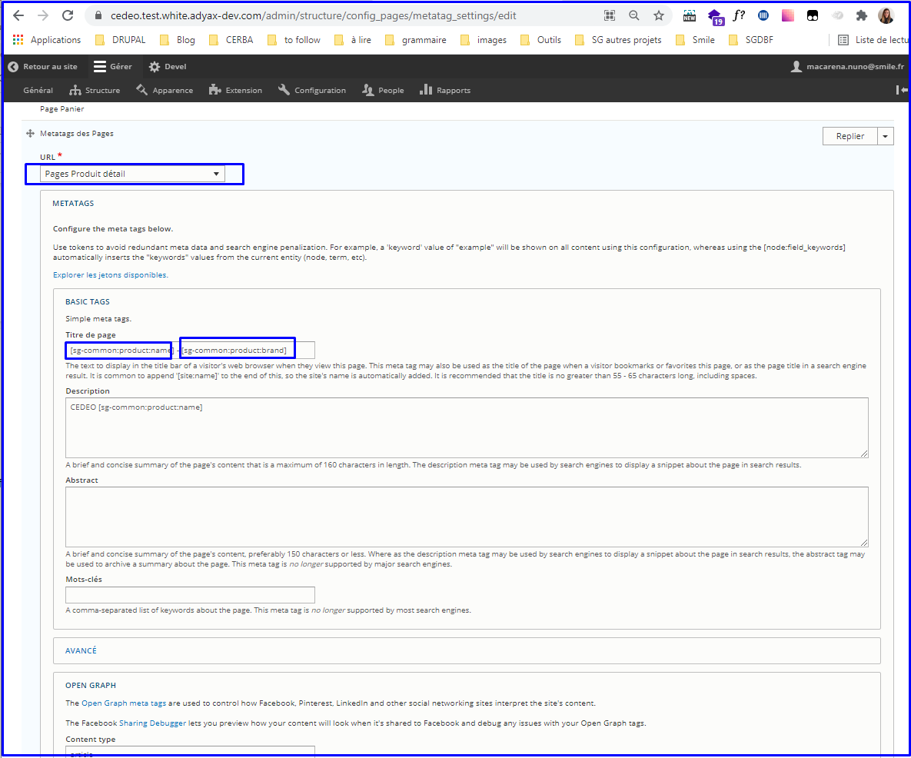
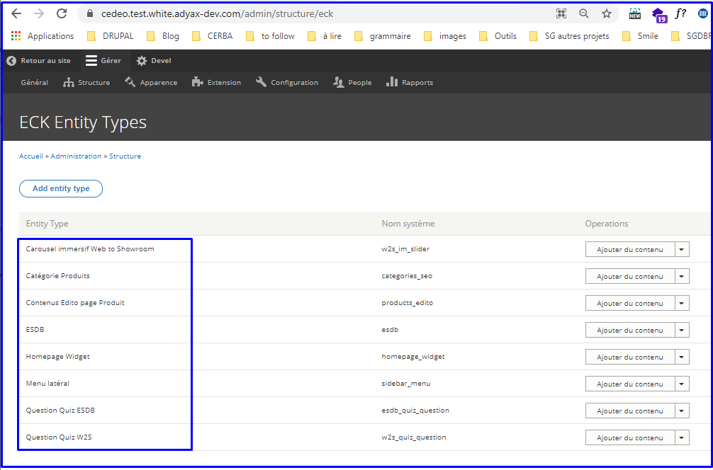

# **Meta tags**

In BO, Site admins can contribute meta tags data for different pages in
here : /admin/structure/config\_pages/metatag\_settings/edit

A list of tokens is available for Site admins to be used too :

-   \[sg-common:category:name\]

-   \[sg-common:category:parent-name\]

-   \[sg-common:product:name\]

-   \[sg-common:product:brand\]

-   \[sg-common:global-title\]

-   \[sg-common:agency:city\]

-   \[sg-common:agency:zip-code\]

-   \[sg-common:agency:name\]

-   \[sg-common:agency:street\]

-   \[sg-common:agency:region\]

-   \[sg-common:agency:department\]

-   \[sg-common:category:combined-name\]

-   \[sg-common:category:page-number\] : This token will follow the
     following rule of display :

	-   for page one : do not display page number in the meta data title

	-   for following pages (ex : pages 2, pages 3, etc.) : DO display
         pages number in the meta data title

-   \[site:name\]

-   \[sg-common:filter-name\] : this token can be used in PLP, PLP
     category + brands, search pages and will add the label of selected
     filters to the meta tags.

**Note** : for some pages, these meta tags can be overridden if Site
admins contribute ECK Entity types in here : /admin/structure/eck

See [*Categories SEO entities
dashboard*](#categories-seo-entities-dashboard)

