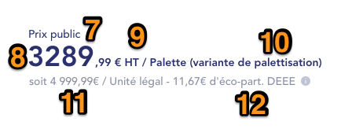
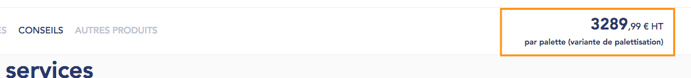
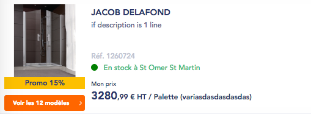

# **Products catalog**

## **Prices displaying**

Price displaying is specific to user role (including labels and tax information). Note that same rules apply on both Product detail page and Product Boxes (used on Product Listing page, Search Results, Carousels…).

### Labels / tax information management

| Role  | Price label  | Tax label  | Price object to use  | Price label with promotion  |
|---|---|---|---|---|
| VA  | Prix public  | TTC  | With taxes  | Prix promo  |
| VAR  | Prix public  | TTC  | With taxes  | Prix promo  |
| VI Part  | Prix public  | TTC  | With taxes  | Prix promo  |
| VI Pro  | Prix public  | HT  | Without taxes  | Prix promo  |
| VI CLI  | Mon prix  | HT  | Without taxes  | Mon prix promo  |

**Price label** and **Price label with promotion** can be contributed independently for each role (note that same strings are applied for VI CLI and VI CLI CLUB, no distinction between both). 
If, for a role, **Price label** or **Price label with promotion** is left empty, then default value presented in table above is used. 

<span style="color:red">!!</span> For VI CLI, since prices displayed are specific to the user, Public Price is always displayed below. 
<span style="color:red">!!</span> On Product detail page (and Product PDF files), 2 labels are actually shown for VI CLI :
 
* Price label OR price label with promotion (depending on product settings)
* Public price
* => All those labels must be translatable

<span style="color:red">!!</span> All default labels are translatable from Translate Interface (Context : Labels Prix)
<span style="color:red">!!</span> On Product Boxes (used on Product Listing page, Search Results, Carousels…), a tooltip is displayed near price label for <u>**VA and VAR only**</u>. On mouse-over, the following is displayed (content is translatable from Translate Interface) :


### Prices management
#### VA (Visiteur Anonyme), VAR (Visiteur Anonyme Rattaché) :


1. **Price label :** please refer to the corresponding section for details
2. **Price :** retrieved from Pricing service (field to use : ** *ttcPrices.publicPrice* **). Note that for VA, default Agency ID is passed. For VAR, current user Agency ID is passed
3. **Tax label :** please refer to the corresponding section for details
4. **Product unit**  
5. **Price per legal unit**
6. **Eco-tax information :** displayed if exists. Please refer to the corresponding section for details

#### VI Part (Visiteur Internet Particulier) :


1. **Price label :** please refer to the corresponding section for details
2. **Price :** retrieved from Pricing service (field to use : ** *ttcPrices.unitPrice* **). 
3. **Tax label :** please refer to the corresponding section for details
4. **Product unit**  
5. **Price per legal unit**  
6. **Eco-tax information :** displayed if exists. Please refer to the corresponding section for details

#### VI Pro (Visiteur Internet Professionnel) :


7. **Price label :** please refer to the corresponding section for details
8. **Price :** retrieved from Pricing service (field to use : ** *htPrices.unitPrice* **). 
9. **Tax label :** please refer to the corresponding section for details
10. **Product unit**  
11. **Price per legal unit** 
12. **Eco-tax information :** displayed if exists. Please refer to the corresponding section for details

#### VI CLI (Visiteur Internet Client) :


13. **Price label :** please refer to the corresponding section for details
14. **Price :** retrieved from Pricing service (field to use : htPrices.unitPrice)
15. **Tax label :** please refer to the corresponding section for details
16. **Product unit**  
17. **Price per legal unit** 
18. **Eco-tax information :** displayed if exists. Please refer to the corresponding section for details
19. **Public price :** retrieved from Pricing service (field to use : ** *htPrices.publicPrice* **). Tax unit is “HT” (translatable from Translate Interface). Label “Prix public” is also translatable.

#### Eco-tax management

Eco-tax(es) information is retrieved from the Pricing service, using ** *ecoTaxes* ** object. If this object is present for a product, then eco-tax(es) need to be displayed on front-end. Note that there can be several eco-taxes for a single product. 

Note that a setting in Drupal allows to define if eco-tax price is included or excluded from the price displaying. It is possible to configure it independently for next roles :

* VA
* VAR
* PART
* PRO

If set to FALSE, then the eco-tax price is excluded from the price. 


1. **Eco-tax string on the Product detail page :** sum of the Product eco-taxes (calculated on Drupal side). Translatable from Translate Interface.
	* If eco-tax is EXCLUDED from the price, then string must be : + *[eco-tax:value]* € d’éco part. DEEE
	* If eco-tax is INCLUDED in the price, then string must be : Dont *[eco-tax:value]* € d’éco part. DEEE

<span style="color:red">!!</span> On all other places than product detail page, eco-tax strings are different :

* If eco-tax is EXCLUDED from the price, then string must be : + éco-contribution *[eco-tax:value]* €
* If eco-tax is INCLUDED in the price, then string must be : Dont éco-contribution *[eco-tax:value]* €

`2.` **Tooltip icon :** on mouse-over, tooltip displays


`3.` **Tooltip content :** displays the eco-tax(es) information.

### Price availability per profile

It is possible to hide prices over the website per anonymous / logged in (anonymous users / logged in users). This is done through a dedicated setting in settings.inc (so, it is not configurable from Drupal back-office)

<span style="color:red">Update 13/02/2019</span> : it is possible to hide prices over the website for :

* VA
* VAR
* Logged in Users

=> So, setting can be applied independently for each of those. 

When disable for one of these profiles, it will :

* Prevent all ajax calls to /pricing services on next pages / blocks :  
	* Homepage
	* Product Listing Page (Search Results)
	* Promotions Pages
	* Brands Landing & Brand Details
	* Product Detail Page (both the product itself and its related articles), as well as “Download product page with prices (both TTC / HT). 
	* Product Locator Pop-in
	* Variants Pop-in
	* Wishlist detail page
* Disable all “AddtoCart” CTAs when applicable on the above pages / pop-ins (should already be implemented)
* Disable the top right “Cart” CTA from the header // Access to cart by direct URL

In case price display would be disabled for authenticated users, then in addition of the above :

* Disable access via direct URL / hide menu entry to “Mes Tarifs” in My Account (Prices download tab)
* Disable “AddtoCart” CTA from documents details (Delivery Notes, Orders, Wishlists)

Below are places where prices should be hidden :

#### 1. Product detail page


Elements below must move up to be aligned with top of image.



Price must be hidden on sticky bar.

#### 2. Product Listing page (including Search results page)


#### 3. Home Page blocks / Product boxes


<span style="color:red">!!</span> Note : prices must be hidden on all product boxes (related products, carousels, Early Birds blocks…).

#### 4. Variants pop-in


<span style="color:red">!!</span> “Prix et disponibilité” column label must be changed to “Disponibilité”. Also, availability info (“En stock à St Omer St Martin”) must be vertically centered on row (since price is hidden).

#### 5. Product Locator pop-in


<span style="color:red">!!</span> Availability info (“En stock à St Omer St Martin”) must be vertically centered on row (since price is hidden).

#### 6. Request information pop-in


Prices column (including column label) is hidden. 

#### 7. Web to showroom detail page


#### 8. Account - Wishlists


<span style="color:red">!!</span> Column “Sous-total HT” must be completely hidden. Also, “Add to cart” button must be disabled. 


In addition, all Progressive prices CTAs must be hidden. This applies on :

* Product Detail page
* Variants pop-in 
* Wishlist detail page

### Case when price = 0.00

In some cases, price returned for a product is “0.00”. 

```
{
 "3327923": {
   "conditionId": "",
   "numCdte": "0",
   "vat": "20",
   "htPrices": {
     "netPrice": "0.00",
     "unitPrice": "0.00",
     "publicPrice": "0.00"
   },
   "ttcPrices": {
     "netPrice": "0.00",
     "unitPrice": "0.00",
     "publicPrice": "0.00"
   },
   "priceQuantity": null,
   "priceColumns": {
     "PC1": 0,
     "PC2": 0,
     "PC3": 0,
     "PC4": 0,
     "PC5": 0
   }
 }
}
```

In such case, a specific behavior is implemented on the website : instead of price displaying, display a string (translatable from Translate Interface). Strings are different on product detail page and product boxes, see details below. 

<span style="color:red">!!</span> Note that exact same logic applies when price returned = null for a product. 

#### On product detail page


1. **Price label :** not displayed
2. **Static string** displayed instead of price
3. **Static string** displayed instead of price

In such case, Price label (“Prix public”, “Mon prix”...) is not displayed. Price itself is replaced by next string (translatable from Translate Interface) :

Prix(€) et disponibilité variables selon agence 


It also must be applied on the Sticky bar.

#### On Product boxes (listings, carousels…)


1. **Price label :** not displayed 
2. **Static string** displayed instead of price

In such case, Price label (“Prix public”, “Mon prix”...) is not displayed. Price itself is replaced by next string (translatable from Translate Interface) :

Prix(€) et disponibilité variables selon agence

#### Other places 
On other places listed below, price is replaced by same string as the one of Product detail page :

* Variants pop-in
* Product Locator 
* Wishlist detail
* Request info form

#### Download PDF cases
Regarding PDF download (used on Product page detail and in My Account  > Advanced download feature) : when User selects “download with price” (either Prix public TTC, prix public HT, Mon prix HT, etc) => price is replaced by string

Prix(€) et disponibilité variables selon agence 

=> Same string as the one used on Product detail page

### Promotions management
There are 2 types of promotions which can apply to products :

* Web promotions
* Agency promotions

Note : a product can’t be flagged with both types of promotion at the same time.

From Drupal back-office, it is possible to define label to apply for each promotion type. Note that all products flagged as Web promotion will have the same label displayed on front (and same logic for Agency promotion).
Promotion background colors are defined from Site Settings page (as part of the Design System). Promotion labels colors are also defined from Site Settings page. 


Examples of front-end rendering on Product Listing page.

On Product Listing page / Product Detail Page / all carousels (HP, Related Products…), Promotion information is retrieved from the /pricing service. On Cart page, Promotion information is retrieved from the /carts service (item.pricing.promotion). If product has pricing.promotion object, then it must be displayed as promotion, using next fields :

```
promotion" => array:7 [▼
        "id" => "13ba2913-d3b4-47fa-b540-eb30da725ea2"
        "name" => "Promotion NAME"
        "endDate" => "2021-07-31"
        "htCrossedPrice" => "2428.00"
        "type" => "WEB"
        "periodicities" => array:7 [▶]
        "label" => "TEST Cris"
```

* **Id :** do not take into account
* **Name :** do not take into account
* **endDate :** if endDate > current date ( = if endDate is in the past), do not display product as Promotion
* **htCrossedPrice :** do not take into account
* **Type :**
	* If = WEB, then for Web Promotion label display the value from “label” key. 
	* <del>If label value =null, then display the Web Promotion label.</del>
	* If = AGENCY, then Agency Promotion will apply
	* If = NULL, then do not display product as Promotion
 
!! Note that price itself must be taken as usual, from the **/pricing** ** *htPrices* ** / the ** *ttcPrices* ** object depending on User Role. 
Finally, prices labels to display are detailed in the following section. 

## Agreements to sell / stock information
Agreements to sell and stock information have an impact on the CTAs to be displayed on Product boxes and Product detail page. For each CTA, behavior is passed to Drupal via services. 

Regarding * **onlineAvailability** *, info is retrieved partially  from a dedicated service * **/articles/online-availability** *, and from * **search/articles** * :

* **color :** used to define color of the pellet and label on Product Listing page (1) (search/articles)
* **label :** label to display on the Product Listing page (2) (search/articles)
* **cta :** Retrieved from /articles/online-availability. value defines behavior of the “Add to Cart” button, on both Product Listing page and Product Detail page. It also defines button style to display. It can have next values :
	* INFO -> on-click, will redirect to a contact form  -> secondary CTA style is used
	* LOCATOR -> on-click, triggers Product Locator -> secondary CTA style is used
	* CART -> on-click, triggers Add to Cart -> Primary CTA style is used
	* AUTH -> on-click, redirects User to Login page -> secondary CTA style is used. Note that page from which User clicked must be kept as a referrer, so after login User is redirected to initial page.  
	* ctaLabel : button label to display on both Product Listing and Product detail page (3) (/articles/online-availability)

Note that onlineAvailability info depends on User, this is why it is managed via a dedicated service. CTA will be loaded using AJAX, as for prices. A loading throbber must be used until service sends back response. 

Regarding ** *salesAgreement* **, **/articles/{id}** is used. following object is used for this purpose :

### **salesAgreement**
* collect : displayed on Product detail page (4)
* delivery : displayed on Product detail page (5)

Note that salesAgreement items are not displayed on front if their value is NULL. salesAgreement icons are managed from Drupal back-office (Icons Configuration Page). 


## **Stock availability / quantities management**
This section describes logics applied regarding Products stock availability.

### Adding quantities to Cart
<del>From settings.inc, a field allows to define if Quantity selector is related to either :

* stacQuantity
* availableQuantity
* stockSource (see related section)
* Empty value

<span style="color:red">!!</span> If setting if left empty, then no stock control is applied over the website when adding a Product to Cart. The 2 next rules can be applied on top of Empty value :

* Warning message on Cart page (see related section)
* supplyMinQuantity (see related section)
</del>

From ** *settings.inc* **, a field allows to define for which stockSource(s) Max Quantity is checked. Note that Max Quantity always applies to the Billing field. 

* For each product, find stockSource in logisticsSettings with the smallest order.
* Then, check if this stockSource is also present in the setting
	* If yes, then use its corresponding maxQty value for stock control
	* If no, then the product is considered as unlimited stocks, and the 2 next rules can be applied on top :
		* Warning message on Cart page (see related section)
		* supplyMinQuantity (see related section) 

<u>**Setting name**</u> : *$config['sg_api.products_service']['quantity_widget_field']*
Values to be separated with commas, example : 

* *$config['sg_api.products_service']['quantity_widget_field']* = STAC,ENR,DISPART


1. If ** *[maxQty]* ** > 0 **AND** onlineAvailability = CART, then show active quantity widget, with default value = 1 (http://prntscr.com/l4080a) User can’t add more than [quantity:value] to the Cart :


2. If ** *[maxQty]* ** > 0 **AND** onlineAvailability != CART, then show disabled quantity widget, with default value = 1 :


3. If ** *[maxQty]* ** = 0 or null, then no matter what is onlineAvailability value, quantity widget is shown as disabled, with value = 0 :


#### Max quantity is already added to Cart

When adding a product to cart, a check is performed regarding :

* Is the product available at the current agency ? Process is described in next section.
* Is product quantity set by User available ? Process is described below :

Since Max quantity check is performed on Drupal side, let’s consider next situation :

1. User adds a product to the cart with some quantity - for example from PDP
2. User then tries to add more quantity (for example from same PDP), but as a result Quantity 1 + Quantity 2 > Max Quantity. 
3 .In such case, on 2nd Add to Cart, actual Add to Cart will be denied, and a specific error message is shown in Added to Cart pop-in.

Note that the 3 cases presented below can be triggered :


1.** On add to Cart, product is not available on current agency :**


Pop-in title :

* If no article was added to the cart, title is : L’ajout au panier n’a pas été effectué
* If at least 1 article was added to the cart, title is : L’ajout au panier a été effectué

Information message : *Les articles suivants ne sont pas commandables en ligne dans votre agence [current:agency:name] et n’ont pas été ajoutés dans votre panier :*

2. **On add to Cart, product quantity is not validated :**


Pop-in title : 

* If no article was added to the cart, title is : L’ajout au panier n’a pas été effectué
* If at least 1 article was added to the cart, title is : L’ajout au panier a été effectué

Information message : *Les articles suivants sont déjà ajoutés au panier. Vous pouvez mettre à jour la quantité depuis la page panier, en fonction des stocks disponibles :*

3. **On add to Cart, there are both “product is not available on current agency” and “product quantity is not validated” :**


Pop-in title : 

* If no article was added to the cart, title is : L’ajout au panier n’a pas été effectué
* If at least 1 article was added to the cart, title is : L’ajout au panier a été effectué

Information messages : see points 1. and 2. For each case

### Stock email alert on Product page

<span style="color:red">!!</span> In any case, the Agency stock email alert is not displayed for VA Users. 

All fields mentioned in the rule below are taken from the  **/online-availability service**. 

Rule for display is next : 

* stockSource AGENCY exists for current product **AND** stockSource AGENCY maxQuantity = 0 (or null) **AND** availability != V **AND** availability != D


String is translatable and built as following : 
0 unité(s) en stock à [agency:name] -


Link label Être alerté(e) is also translatable. On-click, iit opens the corresponding pop-in : 


1. **Pop-in title :** translatable from Translate Interface
2. **Closing cross :** on-click, closes the pop-in
3. **Pop-in description :** translatable from Translate Interface
4. **Email input field :** pre-filled with user email address if user is logged in. User can then change it if needed. Field label is translatable from Translate Interface
5. **Cancel button :** on-click, closes the pop-in
6. **Validate button :** 
	* If field is not filled / if email address does not have the email address format, then a standard Drupal error message is displayed on top of the pop-up : Vous devez entrer un email valide
	* If field is well filled with email address, pop-in dynamically updates to show the following : 


7. **Pop-in title :** translatable from Translate Interface
8. **Pop-in description :** Nous vous informerons par email à l’adresse [input:email_address] lorsque le produit ci-dessous sera de nouveau disponible dans votre agence [agency:name] : (static strings translatable from Translate Interface)
9. **Product main image** (not clickable)
10. **Product brand**
11. **Product title**
12. **Product site reference**

Product availability alert management is handled on Drupal side : when a user subscribes to email alert for a product, then a record is created on Drupal site (email address + product + agency). Then, a cron runs once per day to check if product stock is now available (via *[quantity]* for related agency). If ** *[quantity:value] > 0* **, then an automatic email is sent to user (see content below). Email address + product record are then automatically removed from database.

Email uses the standard Notification email template. Content is the following :

```
Bonjour, 

Nous avons le plaisir de vous annoncer que le produit [product:name] est de nouveau disponible dans l’agence [agency:name]. Vous pouvez y accéder en cliquant sur le lien suivant : [product:name] .
Assurez-vous d’être bien rattaché à l’agence [agency:name] pour ajouter ce produit dans votre panier. 


Cordialement,

Le Service Internet
```

### Stock Control on Cart page

If Stock control setting if left empty in settings.inc, then no stock control is applied over the website, BUT it is possible to display a specific warning message on Cart page to inform User that he won’t potentially receive all his expected quantities. Rule is the following :


* From settings.inc, a dedicated setting allows to define “warning message displaying on cart page”. Values can be :
	* stacQuantity
	* availableQuantity
	* stockSource (see related section)
	* Empty : in such case rule does not apply, and no message is shown 

<u>**Setting name**</u> : *$config['sg_api.products_service']['quantity_warning_field']* 

In rules below, selected option is written as [quantity].

On Cart page, each product quantity is compared with [quantity] value. If quantity > [quantity], then a message is displayed on cart page, above products list.

Message (translatable from Translate Interface) :

```
Votre commande sera disponible lorsque tous les articles seront réapprovisionnés.
```

Message is displayed as soon and as long as at least 1 product matches the condition “quantity > [quantity]”.
Note that even if message is displayed, User can still proceed to checkout. 

Message layout :


### stockSource Quantity control
If *$config['sg_api.products_service']['quantity_widget_field']* = stockSource, then next logic applies : 

In articleDTO, each Stock Source has a field *logisticsSettings.maxQuantity*, which corresponds to the maximum quantity a User can order for each Stock Source, except if *article.checkStock = false* (see related section). 

Quantity widget / Calculation Tool must be blocked to the biggest value of all those Stock Sources, for example :

* Product has 2 Stock Sources 
	* ENR - logisticsSettings.maxQuantity = 10
	* DISPART - logisticsSettings.maxQuantity = 5
* It should not be possible to add more than 10 items using the Quantity Widget

When adding a product to the Cart, a new parameter must be passed to POST /v1/carts/{id}/articles : stockSource
```
[
  {
    "articleId": "string",
    "articleQuantity": 0,
    "stockSource": "AGENCY"
  }
]

```
Value to pass is the 1st stockSource (considering order of stockSources in articleDTO) which has enough quantity, for example :

* Product has 2 Stock Sources 
	* ENR - logisticsSettings.maxQuantity = 10
	* DISPART - logisticsSettings.maxQuantity = 5
* If User adds quantity = 3, then stockSource ENR will be passed, because it is the first which is available and meets requested quantity
* If User adds quantity = 9, then stockSource ENR will be passed, because it is the first which is available and meets requested quantity

#### checkStock rule

A new field **checkStock** is added on articleDTO level :

* If this field has value = false, then no stock control is applied, and User can add as many quantities as he wants
* If this field has value = true, then User can’t add more than biggest logisticsSettings.maxQuantity

##### **Use cases  :**

* All stockSource have *logisticsSettings.maxQuantity* = 0, and *checkStock* = false => User can add as many quantities as he wants to Cart
* All stockSource have *logisticsSettings.maxQuantity* = 0, and *checkStock* = true => Quantity widget and Add to Cart CTA are disabled
* stockSource has *logisticsSettings.maxQuantity* = 5, and *checkStock* = true  => User can’t add more than 5 items
* User uses the “Reorder feature” from Order detail page. Order contains 1 product with Quantity = 5
	* stockSource 1 has *logisticsSettings.maxQuantity* = 2
	* stockSource 2 has *logisticsSettings.maxQuantity* = 3
		* If *checkStock* = false, then User can add as many quantities as he wants to Cart
		* If *checkStock* = true, then Quantity widget and Add to Cart CTA are disabled. They become available again if User decreases quantity to 3. 

#### Stock control on Cart page

This logic applies if *$config['sg_api.products_service']['quantity_warning_field']* = stockSource

As soon as a product in Cart has Product quantity > biggest **logisticsSettings.maxQuantity**, then a message is displayed on Cart page :

Message (translatable from Translate Interface) :

```
Votre commande sera disponible lorsque tous les articles seront réapprovisionnés.
```

Message is displayed as soon and as long as at least 1 product matches the condition (product quantity is bigger than biggest *logisticsSettings.maxQuantity*, AND *checkStock* = false). Message disappears if Product quantity gets decreased to match biggest logisticsSettings.maxQuantity.

Note that even if message is displayed, User can still proceed to checkout. 

Message layout :


### supplyMinQuantity rule

<del>**Context** : on pointp.fr, setting $config['sg_api.products_service']['quantity_widget_field'] has empty value : this means that stock is considered as unlimited, User can order as many quantities as he wants.

On the other hand, if a product has no stock (article.availableQuantity = null), then it is possible that Agency has to order a minimum Quantity amount to its Supplier (for example, Agency has to order 10 doors minimum to its Supplier to get refilled). 
In addition, product must have availability = V</del>

**Context** : if a product has no stock, then it is possible that the Agency has to order a minimum Quantity amount to its Supplier (for example, Agency has to order 10 doors minimum to its Supplier to get refilled).
To make sure that User will not order less than this “Supplier minimum Quantity”, the supplyMinQuantity rule is implemented. 

A dedicated setting in settings.inc allows this rule to be enabled.

<u>**Setting name**</u> : *$config['sg_api.products_service']['supply_min_quantity_field']* 
Values are either 0 (disabled) or 1 (enabled).

<del>**IF** for a Product, stock control is not applied (see related section), and **IF** *$config['sg_api.products_service']['supply_min_quantity_field']* = 1, and **IF** article.availableQuantity = null, and **IF** article.availability = V, then the ** *supplyMinQuantity* ** rule is triggered. 

From articleDTO, the supplyInfo object returns data needed to define supplyMinQuantity.</del> 

In addition, rule is triggered if : 

* <del>Current product has 1 single stockSource, either AGENCY or STAC AND</del>
* <del>checkStock = false AND</del>
* <del>If stockSource = AGENCY, THEN availability = “V” OR null AND</del>
* <del>If stockSource = STAC, THEN stacAvailability = “V” OR null AND</del>
* <del>supplyInfo is not empty</del>

Make a loop on logisticsSettings.maxQuantity regardless of stockSource, if you find a value different from "999999" or "0" or null, we don't show the MinQty.

So we will check :

* checkStock = false
* logisticsSettings.maxQuantity = "999999" or "0" or null (for each stockSource)
* supplyInfo.supplyMinQty not empty
* availability: V or null
* stacAvailability: V or null

=> Data is taken from **GET /online-availability**.

Unit for ** *supplyMinQuantity* ** is taken from ** *supplyUnitCode* **. Depending on Product’s quantity widget configuration, its value might result from a calculation, to make sure that indivisible field remains as indivisible (update to the upper integer).  

<span style="color:red">!!</span> Note that if the supplyMinQuantity rule is not enabled / is enabled but does not match conditions for a product, then the ** *defaultQuantity* ** rule is triggered.

* ** *DefaultQuantity* ** is defined as 1 and applies on the Indivisible field if exists
* If a product does not have any indivisible field, then ** *defaultQuantity* ** is defined as 0,001 and applies on the Billing field. Default input value is set to 1.   

#### Display on product page

On Product detail page :

##### **1. Minimum quantity is set to the Quantity input field as default quantity**

Note that since MinQuantity applies to the Packet field, depending on Product configuration a calculation must be done to get the correct Billing (Uf) value. 

##### **2. A dedicated string that indicates minimum quantity is displayed**

* If simple Quantity Widget is used, string Qté min : *[n] [packet:unit]* is displayed below the input field
* If calculation tool is used, string Qté min : *[n] [packet:unit]*, soit *[n] [billing:unit]* is displayed below 
* If calculation tool with 3 inputs is used, string Qté min : *[n] [indivisible:unit]*, soit *[n] [packet:unit]*, soit *[n] [billing:unit]* is displayed below 

<span style="color:red">!!</span> Note that string display depends on case triggered :

* If ** *supplyMinQuantity* ** case is triggered, then the string is always displayed, no matter what is the input quantity.
	* <span style="color:red">!!</span> Special rule : if product has the simple Quantity widget, and ** *supplyMinQuantity* ** = 1, then do not display the supplyMinQuantity string below the widget  and below main price block

* If the ** *default minimum Quantity* ** case is triggered, then the string is displayed only if User defines a quantity which is less than the default minimum Quantity. 


When opening the calculation tool, the minQuantity is displayed below the Packet field. String Qté min : *[n] [packet:unit]* is used. 

##### **3. User is not restricted regarding Quantity input (using +/- signs / manual input)** 

If User decreases quantity to less than minQuantity, then :

* Add to Cart button gets disabled
* MinQuantity strings get switched to Red color, to show User that something is wrong with current input quantity

#### Display on Cart page
On Cart page, the minQuantity dedicated strings are displayed, with the exact same rules as on Product page.

<span style="color:red">!!</span> ** Special rule** : if product has the simple Quantity widget, and ** *supplyMinQuantity* ** = 1, then do not display the supplyMinQuantity string below the widget.

In addition, if at least one of the products has less quantity than the minimum quantity :

* Display a warning message on top of the Cart page


Styles to apply for the message (!! wrong message on screenshot)

Static string is translatable from Translate Interface :

```
Certains produits de votre panier ont des quantités invalides. Veuillez vérifier les quantités choisies avant de procéder à la commande.
```

* Disable the Go to Checkout button

### Incremental quantity : supplyMinQuantityLog feature - on hold

The objective of this feature is to implement a new behaviour for the Minqty rule. 
In this feature, a product having the Minqty data will mean that the user can increment the number of items of the product in the min qty value.

Ex : if minqty = 10, the user can add/remove to cart products by +10 : 10, 20, 30, 40, etc.
If minqty = 2, the user can add/remove products by +2 : 2, 4, 6, 8, 10, etc.

Webmaster shall be able to enable/disable this feature in BO, in /admin/config/sgdbf/config_overrides, “gestion stock” tab

Label : Gestion MinqtyLog


If enable and, 

* supplyInfo.supplyMinQty NOT null => apply MinQtyLog logic

In this case, this logic will be applied :

* for ALL stockSources (and not only to agencies)
* for ALL products in stock AND not in stock
* supplyInfo.supplyMinQty = null => do not apply MinQtyLog logic, thus keep old minqty logic (see concerned section)

#### If product has a simple quantity widget


We keep the current display but do NOT allow the user to directly contribute the number of items he/she wants.
User will ONLY be able to use +/- 

<span style="color:red">Note</span> : exception will be done in the case of a product with a simple quantity widget AND supplyInfo.supplyMinQty=1. 
In this case, 

* we allow the user to directly contribute the number of items he wants.
* DO not display static strings “minimum de commande”


#### If product has a calculation widget

Display all calculation units as currently.

The user will NOT be able to directly contribute the number of items he/she wants. The user will ONLY be able to use +/- of the **supplyunitlabel**.
Other calculation units will update automatically as currently.

Ex (screenshot below) : product 6237562 has :

* Supplyminqty =1
* supplyunitlabel=Carton

In FE, the user will see the calculation widget as currently with : 

* Panneau plaque => user will ONLY be able to use +/- thus adding or removing +/-7 items each time. 
* The automatic update calculations in “square meters” units will be done as currently but : 
* M2 (square metters) => the user will NOT be able to click on it, to directly use this unit


## **F-Gaz management**
Some products are under the “F-Gaz” legal rule, which is a business rule regarding some products of the catalog. For such products, field isRefrigerant == true. On front-end, it implies the displaying of a dedicated block on Product page and on Cart page.

### Product page


F-Gaz logo is configurable from back-office (regular ImageField). 
F-Gaz title is configurable from back-office. 
F-Gaz description is configurable from back-office.
Learn More link and label are configurable from back-office (with option “open in a new tab”).

### Cart page


F-Gaz logo is configurable from back-office (regular ImageField). 
F-Gaz description is configurable from back-office.
Learn More link and label are configurable from back-office (with option “open in a new tab”).

### Order confirmation emails
When an order contains at least 1 F-Gaz product, then F-Gaz information must appear on order confirmation email sent to :

* User - see details in related section
* Agency / contact - see details in related section

## **Quantity Widget / Calculation tool**
New implementation of the Quantity widget / calculation tool can be found in the next document.


<del>For some products, a conversion tool is used, in order to type an “Order unit” which is different from the “Invoice unit”. For example :</del>

<del>Following fields (from Product object) are used :</del>

* <del>ufUnit (invoicing unit, i.e. square meters)</del>
* <del>ucUnit (Ordering unit, i.e. boxes)</del>
* <del>ufIndivisible (boolean - if true, it means that invoicing unit can’t be divided. For example, if for a product ufUnit = m2, and ufIndivisible = true, then it is not possible to buy 0.5 m2 of that product)</del>
* <del>ucIndivisible (boolean - if true, it means that Ordering unit can’t be divided. For example, if for a product ufUnit = box, and ucIndivisible = true, then it is not possible to buy half of a box of that product)</del>
* <del>coefUfToUc (value which is used to do the calculations).</del> 

<del>On front-end, the following block will be displayed if coefUfToUc is different from 1 for a product :</del>

 

1. <del> Current selected quantity. Updates depending on calculation. “Qté :” is translatable from Translate Interface. UN must be replaced by actual ufUnit. If ufUnit value is too long to fit, it must be trimmed with “...”.</del>
2. <del>Arrow : on-click, opens / collapses the calculation tool</del>
3. <del>Label : translatable from Translate Interface</del>
4. <del>Invoicing unit (ufUnit) input field :** label (unit) is taken from current product ufUnit value</del>
5. <del>Ordering unit (ucUnit) input field :** label (unit) is taken from current product ucUnit value</del>
6. <del>Result : label “Qté requise” is translatable from Translate Interface. Amount is calculated, and unit is taken from ucUnit value</del>

### <del>Calculation rules :</del>

<del><span style="color:red">!!</span> coefUfToUc can be either positive or negative - depending on it, it will define which calculation to apply - BUT, for the calculation itself, only use the absolute value (no negative values for calculations).</del> 

* <del>If user fills in ufUnit input field, and coefUfToUc is negative, then Uc value = [ufUnit input] / [coefUfToUc]</del>
* <del>If user fills in ucUnit input field, and coefUfToUc is negative, then Uf value = [ucUnit input] * [coefUfToUc]</del>
* <del>If user fills in ufUnit input field, and coefUfToUc is positive, then Uc value = [ufUnit input] * [coefUfToUc]</del>
* <del>If user fills in ucUnit input field, and coefUfToUc is positive, then Uf value = [ucUnit input] / [coefUfToUc]</del>

<del>If both ufIndivisible and ucIndivisible = false, then result displayed on front is not rounded up.</del> 

<del>If one of the ufIndivisible or ucIndivisible = true, result displayed on front is rounded to the upper integer value. Also, input values are also rounded up dynamically, depending if input value (Uc or Uf) is se as Indivisible = true. 
Calculation rules and examples are available in the following document.</del>

## **Pallets management**

<span style="color:red">!!</span> Note that Pallets management can be enabled / disabled per site, using a dedicated setting in settings.inc.

On some sites (for example Point P), some products are sold on pallets. When such products are delivered to the User, they are packed on pallets, and the User needs to return the pallet to the Agency.
To make sure that the User will return the pallet(s), User has to pay for the pallet(s) during its order, and he will return the pallet(s) to the agency, he will get a refund for the pallet(s) price. 

When a product has a pallet, specific information needs to be displayed on both Product detail page and Cart page. 
<span style="color:red">!!</span> Note that changing product quantity also has an impact on the amount of pallets, so prices should be updated accordingly. 

A new field palletId has been added to the articleDTO to determine if product has a pallet or not.
Example :
 
* pointp / 22090
* Agency : 3554 
* Product : 1057148

```
"palletId": "6983254",
  "units": [
    {
      "code": "M",
      "label": "Mètre",
      "coefFromUcUnit": -0.9
    },
    {
      "code": "PA",
      "label": "Palette",
      "coefFromUcUnit": 8
    }
  ],
```

Note that palletId returns an ID, which then is used to get Pallet price via the /pricing service. 
 
<span style="color:red">!!</span> **Notes :**
Some pallets also have a palletId : this is considered as corrupted data, and should not be taken into account


### Pallets on Product detail page

On Product detail page, if palletId has a value, then some information needs to be added on the page :


#### 1. **New string below Prices block**


String to display depends on a set of rules. All strings are translatable from Translate Interface.

** *1. If simple quantity Widget is shown, then display :* **

```
Conditionné par palette* de [amount of packets] [unitTypes.ucUnit]
```

Where **[amount of packets]** is calculated as following :

* If PA.coefFromUcUnit > 0, **[amount of packets]** = 1 * PA.coefFromUcUnit
* If PA.coefFromUcUnit < 0, **[amount of packets]** = 1 / PA.coefFromUcUnit

Test product :

* pointp / 22090
* Agency : 3236
* Product : 1057129

** *2. If Calculation tool is shown, then display :* **

```
Conditionné par palette* de [amount of packets] [unitTypes.ucUnit], soit [amount of billing] [unitTypes.ufUnit]
```

Where **[amount of packets]** is calculated as following :

* If PA.coefFromUcUnit > 0, **[amount of packets]** = 1 * PA.coefFromUcUnit
* If PA.coefFromUcUnit < 0, **[amount of packets]** = 1 / PA.coefFromUcUnit

And where **[amount of billing]** is calculated as follows : 

* If billing.coefFromUcUnit > 0, **[amount of billing] = **[amount of packets]**  / billing.coefFromUcUnit
* If billing.coefFromUcUnit < 0, **[amount of billing]** = **[amount of packets]** * billing.coefFromUcUnit

<span style="color:red">!!</span> If there is no “PA” in units.code to make the conversion, then text is not displayed at all. 


#### 2. **New block below Add to Cart CTA**


#### 2. **New string in Calculation tool**


<span style="color:red">!!</span> Design mistake, in such case BILLING and PACKET fields are disabled, and INDIV field is active. 

String (transatable) is built as following :
 
* *Palette consignée en agence : [pallet:amount][pallet:price] € [tax:unit]

Note that sub-total (Sous-total) displayed on the calculation tool must reflect Pallet price. It is then calculated based on rules described in next section. 

### Add to Cart process
On-click on Add to Cart, product ID is passed, and Pallet ID is passed too (as a regular product) according to the rules described below.  

<span style="color:red">!!</span> ** Notes :**

* if /pricing does not return any price, then Pallet ID is not passed on Add to Cart action, only product itself is passed to Cart. 
* Pallet Quantities should NOT be checked when adding to Cart
* Pallet ID can be input in the Bulk Add to Cart application : in real cases scenarios this should not happen, so it does not have to be checked
* If Pallet object is not present in current agency, on Add to Cart action an error will be returned. This is data corruption, so only Product will be actually added to Cart in such case

**Rules :**

* A setting from settings.inc allows to define a threshold from which pallet inclusion to the cart is triggered. This threshold is ed in percentage %.
* Threshold applies on PA.coefFromUcUnit to determine quantity from which Pallet gets added to the cart 

**Example :**

* Setting in settings.inc is defined as 50%.
* Test product : 
	* pointp / 22090
	* Agency : 3236
	* Product : 1057129

```
"palletId": "6983254",
  "units": [
    {
      "code": "M",
      "label": "Mètre",
      "coefFromUcUnit": -1
    },
    {
      "code": "PA",
      "label": "Palette",
      "coefFromUcUnit": 8
    }
  ],
  "unitTypes": {
    "billing": "PI",
    "packet": "PI",
    "legal": "M",
    "indivisible": "PI",
    "ufUnit": "Pièce",
    "ucUnit": "Pièce",
    "ulUnit": "Mètre",
    "indivUnit": "Pièce"
```

=> This product is then shipped as 8 PI on 1 Pallet, according to data. 
Then, based on defined setting :

* From Quantity (packet) 1 to 3 => 0 pallets are added to the Cart
* From Quantity (packet) 4 to 11 => 1 pallet is added to the Cart
* From Quantity (packet) 12 to 19 => 2 pallets are added to the Cart
* From Quantity (packet) 20 to 27 => 3 pallets are added to the Cart
* Etc

### Pallets on Cart page
If some products that include pallets are added to the Cart, then a specific display is triggered on Cart page for such products. 


Design implementation of 09/2020 

Pallets block needs to be displayed below the Product ONLY whenever the pallets are triggered.


Pallet block is composed of :

* Block title (translatable) : 

```
Vendu avec une palette (remboursement partiel si restitution en agence).
Info : [@packets_amount] [@product.ucUnit] / palette
```

* Pallet SVG icon (instead of Product thumbnail) (same icon as on Product detail page)
* Product label (pallet label)
* Product ID (pallet Id)
* [unit:price] / consigne, where consigne is a static string, translatable from Translate Interface
* Quantity : no quantity widget is shown, instead pallet quantity is displayed
* Total price : [unit:price] / quantity

Note that if User increases / decreases the Product quantity, pallet quantity must adjust accordingly, based on rules from this section.

Finally, both Product price and its related pallet(s) price must be counted in sidebar summary prices. 

From Cart service, products and pallets will be returned (as regular articles).
Then, on Product array, if field palletId is filled :

* Use its value to find which Pallet product from Cart corresponds to it
* Display the corresponding pallet info below Product, as presented in design above

<span style="color:red">!!</span> Pallet blocks should also be displayed on the VUE Checkout pages, since line items are also displayed on those pages (Delivery / Payment / Confirmation). 

## **Product variants**

Some products have variants, which means that they exist in different declinations (for example, with different widths / lengths…). 
Variants information is displayed 
on Product boxes (listing pages, carousels… - except Home Page blocks) and on Product detail page. There are 2 ways of managing variants on the Product detail page. 

### Variants on Product boxes 
On product boxes (listing pages, carousels…), if a product has variants, it is then displayed as following on front-end :


Desktop

Mobile

* Tag “Voir les [n] modèles” is displayed on the product box. [n] is the amount of variables available for current product. Clicking on the Tag opens the Variants pop-in (no matter if product variant is handled as DROPDOWN or TABLE - always show Variants pop-in). 
* <span style="color:red">!!</span> Note that if a product is both flagged as “New” and “Variant”, then Variants tag takes the priority over the “New” tag on front-end. 

For such products, object ** *variant* ** from /search service is used. If ** *variant object* ** != from null, then display the Variants tag. Amount of variants to display is retrieved from field ** *variant.count* **
Note that for related products, service /article/related needs to be used. 

<span style="color:purple">NEW : in order to avoid cases where there are no variants for the product in the concerned agency, we keep variant param nation-wide (pass null agency value to WS). In this case WS will provide data for products variant within the full catalogue and NOT only for the user's agency.</span>

### Variants on Product detail page

There are 2 ways to manage variants on product detail page. For each product which has variant, way to go is based on field display value (from article/id service) :

* DROPDOWN : display a drop-down on product page
* TABLE : display a button on product page that opens the Variants pop-in 


#### Product page : TABLE 

If ** *display* ** value = TABLE, then a button is displayed on product detail page as following :


Label “Voir les [n] modèles” is translatable from Translate Interface. Amount of available variants ([n]) is retrieved from ** *variant.count field* **. 
Onclick on the button, Variants table pop-in opens (full screen). Its content is retrieved from **/articles/id/variants** service.  


1. **Pop-in title :** translatable via Translate Interface
2. **Sub-total :** label is translatable from Translate Interface. Sum is calculated on front-end. Tax label (HT / TTC) depends on User profile. Sub-total is the one of products added to cart from the Variants pop-in (!! not the sub-total of the whole cart!) 
3. **Add to Cart button :** displayed as enabled if at least one of the products from the table can be ordered (cta = CART) - else, button is disabled. On-click on Add to Cart button, products for which quantity was set are added to Cart. Note that on-click on Add to Cart button, Variants pop-in closes, and “Added to Cart” confirmation pop-in is displayed, showing Products added to Cart from the Variants pop-in. 
4. **Cross icon :** on-click, closes the pop-in
5. **Product info :** retrieved from Product from which the pop-in was open. Display :
	* Brand
	* Product name
	* Tarif par ** *[product:unit]* **, where static string is translatable from Translate Interface
6. **Table column headers**, composed of :
	* ** *Product ID* ** (label is translatable from Translate Interface)
	* ** *Variant axes* ** (“Extensibilité (en cm)” / “Largeur d’accès (en cm)” / “Type de vitrage de paroi sanitaire”). There can be up to 3 variant axes - retrieved from Variants service
	* ** *Price and agreement to sell* ** (label is translatable from Translate Interface)
	* Quantity (label is translatable from Translate Interface)
7. **Table values**, composed of :
	* ** *Product ID* ** for each product
	* ** *Variant axes values* ** for each product (retrieved from Variants service)
	* ** *Price and agreement to sell :* **
		* Price is retrieved from Pricing service
		* Tax label depends on user role (HT / TTC)
		* Agreement to sell value (label and color retrieved via Variants service). Cut via CSS if too long, with “...”)
8. **Quantity selector / Call to action**. Depending on product:cta value (INFO / LOCATOR / CART), it can be :
	* If cta = CART, then either standard quantity selector or Calculation tool, depending on Product 
	* If cta = LOCATOR, then button (with secondary CTA style) + label retrieved via service
	* If cta = INFO, then button  (with secondary CTA style) + label retrieved via service
9. Progressive price CTA : V2

#### Product page : DROPDOWN

If display value = DROPDOWN, then a drop-down is displayed on product detail page instead of the button 

<span style="color:red">V2.

Questions : can there be cases where we use drop-down with several variant axes? If yes, need to update front-end + define max amount of drop-downs. 
</span>


## **Progressive prices**

Some products are eligible to Progressive prices (also called “bulk prices”), meaning that buying more of them will lead to unit prices decrease upon quantity threshold.

Such products are identified through pricing service response each time loaded in ajax whenever ‘productQuantity’ is not null.

### Service request

Sample request:
http://ingress.ibm.ppr.docker4sg.saint-gobain.net:12090/impulse-pricing-query/api/v1/prices/articles?websiteId=cedeo&agencyId=3186

Body:
```
[
  {
    "articleId": "1688004",
    "quantity": 1
  }
]
```

Sample response:
```
{
  "c": {
    "conditionId": "",
    "numCdte": "0",
    "vat": "20",
    "htPrices": {
      "netPrice": "143.43",
      "unitPrice": "143.43",
      "publicPrice": "143.43"
    },
    "ttcPrices": {
      "netPrice": "172.12",
      "unitPrice": "172.12",
      "publicPrice": "172.12"
    },
    "priceQuantity": {
      "used": false,
      "thresholds": [
        {
          "quantity": 10,
          "price": 142.43
        },
        {
          "quantity": 20,
          "price": 141.43
        },
        {
          "quantity": 30,
          "price": 140.43
        },
        {
          "quantity": 40,
          "price": 139.43
        }
      ]
    }
  }
}
```

For such products, it will displayed on the following places on front-end :

### Front-end displaying

#### Product page

Since Progressive prices info is retrieved from Prices service, block must be loaded in AJAX. No loader will be used. So, if a product does have progressive prices, there will be a small “jump” effect to display the Progressive prices block. 


1. **1st threshold string :** built as following : 
	* *[n]* achetés, where [n] is the 1st threshold quantity available for the current product. String is translatable from Translate Interface. [n] value does NOT change on page, no matter quantity set by User.
2. **Unit price string :** built as following :
	* *[price] [tax:label] / [ufUnit]*, where [price] corresponds to the threshold used for point 1.
	* [tax:label] depends on User Profile. String is translatable from Translate Interface. 
	* **CTA :** label is translatable from Translate Interface. On-click, it opens the Quantitative prices pop-in. 

#### Variants pop-in 

Since Progressive prices info is retrieved from Prices service, display a loader while waiting for service response.
 


1. **CTA :** label is translatable from Translate Interface. On-click, it opens the Quantitative prices pop-in. CTA uses the Brand main button text color (Couleur du texte du bouton principal). 

#### Cart page


**CTA :** label is translatable from Translate Interface. On-click, it opens the Quantitative prices pop-in. 
	CTA uses the Brand main button text color (Couleur du texte du bouton principal). 

#### Wishlist detail page


**CTA :** label is translatable from Translate Interface. On-click, it opens the Quantitative prices pop-in. 
CTA uses the Brand 2nd color. 

### Quantitative prices pop-in 

On-click on CTA, the following pop-in opens. 


1. **Pop-in title :** Profiter des prix dégressifs. Translatable from Translate Interface
2. **Closing cross :** on-click, closes the pop-in (same as clicking outside pop-in)
3. **Current product info**, composed of :
	* Image
	* Brand
	* Product name
4. **Unit price**, composed of :
	* Label : Prix unitaire
	* Value (VA / VAR ) : [ttcPrices.publicPrice] TTC / Unité
	* Value ( VI PART) : [ttcPrices.unitPrice] TTC / Unité
	* Value (VI PRO / VI CLI / CLI CLUB) : [htPrices.unitPrice] HT/ Unité
* **Other lines**, composed of :
	* Label : Dès [priceQuantity.thresholds.quantity] achetés
	* Value (VA / VAR / VI PART) : [priceQuantity.thresholds.ttcPrice] TTC / Unité
	* Value (VI PRO / VI CLI) : [priceQuantity.thresholds.htPrice] HT / Unité
5. **Call to action :** CTA label and action will depend on online availability status as currently applicable for all product redirections. If we can’t do otherwise, we’ll then have to trigger an asynchronous call to GET /articles/online-availability to retrieve that value and set the CTA accordingly.

If ‘onlineAvailability.cta’ = ‘CART’ then clicking on the CTA will trigger a call to POST /carts/{id}/articles inputting the selected quantity. Ideally, the pop-in will remain open and a loader will appear until the add-to-cart confirmation data gets displayed. 

In case of any error, users will stay on the pop-in with the message configured in the CMS for the key that service sent back. If the key is not mapped, then the generic message will appear “Une erreur est survenue. Nous sommes désolés pour la gêne occasionnée et vous invitons à contacter notre service Internet si le problème persiste.”

If ‘onlineAvailability.cta’ = ‘CART’ then clicking on the CTA will add the corresponding quantity to the Quantity Input field (and not add directly to cart). User then has to press the Add to Cart button to add product(s) to Cart. 

If ‘onlineAvailability.cta’ != ‘CART’ then all CTAs will not be displayed at all.

### Top Article flag (Top prix)

Products can be flagged as "top articles" by business teams from the PIM. This information is available from product data within the field "isTopArticle" (boolean). 

<span style="color:red">!!</span> Note that Top Article feature can be enabled / disabled per site in /admin/config/sgdbf/config_overrides > gestion de stock

<del>For thoses products (isTopArticle: true) a specific label is displayed at the top left of product boxes and on product sliders (HP, Product detail page, early-birds blocks...) as well as on the main image of the Product detail page. Label is translatable from Translate Interface.</del>


<del>Color of the label background is configurable from back-office. Color of the label text is configurable too.</del> 


If the feature is enabled, and a product is a Top Article (isTopArticle: true) AND if an image is contributed in BO, then the image is displayed in :

* PLP pages and product boxes : image is displayed above the brand name
* Product sliders : image is displayed underneath the product description
* For product sliders, if more than one image is to be displayed, display them all following this order of display :  Top Prix / Destock / Made in France /Norme zéro ressaut / ESDB
* PDP : image is displayed in the top left side of the product image. 
* For info : a product can either be a Top article or a Destocking : Top article > Destock > New 

**Note** : New is not used anymore.

The image for PDP can be uploaded in BO,here : /admin/structure/config_pages/site_settings/edit > promotions.
Label : Icône top article
If there is No image uploaded, then no image nor label is displayed on the PDP.

The image for PLP and product sliders can be uploaded in BO, here : /admin/structure/config_pages/site_settings/edit > promotions.
Label : Icône top article pour la PLP
If there is No image uploaded, then no image nor label is displayed on the PLP.


**Note :** even if data for the label is contributed it will NOT be taken into account. Label is NOT displayed.
/admin/structure/config_pages/site_settings/edit > promotions

![img78][../img/img78.png)
Wireframe for PLP and product boxes - **not available yet**


wireframe for horizontal product slider


Implementation on PDP


<del>! Note that from back-office, it is possible to upload a PNG icon. If set, it will override displaying of the default Top article Flag shown in screenshot above. 
Rules below apply in both case (default Top Article flag or custom PNG).</del> 

<del>Regarding displaying priorities :</del> 

* <del>if a product is both flagged as “New” and “Variant”, then Variants tag takes the priority over the “New” tag on front-end.</del>
* <del>If product is both flagged as "New" and "topArticle" then "top article" takes the priority</del>
* <del>If product is both flagged as "topArticle" and "Variant" then "Variant" takes the priority (not applicable on Product detail page, since Variants info is not displayed over the image on Product detail page)</del>
* <del>If product is flagged as “New”, “Variant” and “TopArticle”, then “Variants” takes the priority</del>


### Destocking articles flag

Products can be flagged as "Destocking articles" (having a big discount)
Webmaster shall be able to enable/disable this feature in /admin/config/sgdbf/config_overrides > gestion de stock
Label : Affichage du picto Déstockage


Destocking information is available in a Flag : 
"isDestock" : true/false

If the feature is enabled, and a product is a destocking product :

* isDestock = true

AND if an image is contributed in BO, then this image is displayed in : <del>or label on the top left of the product box:</del>
 
* PLP pages and product boxes : image is displayed above the brand name
* Product sliders : image is displayed underneath the product description

For product sliders, if more than one image is to be displayed, display them all following this order of display :   Destock / Made in France / ESDB

* PDP : image is displayed in the top left side of the product image. 
* For info : a product can either be a Top article or a Destocking > New > 

**Note :**  New is not used anymore.

The image for PDP can be contributed in here : /admin/structure/config_pages/site_settings/edit > promotions
Label : Icône Destockage
If there is No image uploaded, then no image nor label is displayed in PDP.

The image for PLP and product sliders can be uploaded in BO, here : /admin/structure/config_pages/site_settings/edit > promotions.
Label : Icône Destockage pour la PLP
If there is No image uploaded, then no image nor label is displayed on the PLP.


**Note :** even if data for the label is contributed it will NOT be taken into account. Label is NOT displayed.
/admin/structure/config_pages/site_settings/edit > promotions


Implementation on PDP


Wireframe for PLP and product boxes -> **For the moment, Destock icon can not be displayed in PLP**


wireframe for horizontal product slider


<del>Wireframe for product slider</del>


<del>Wireframe for product slider</del>


<del>Wireframe for PLP</del>


<del>Wireframe for PLP</del>

<del>Label is translatable from Translate Interface.</del>

<del>Destockage</del>

<del>Contexte : Promotions</del>

<del>Webmaster can contribute this feature in here : /admin/structure/config_pages/site_settings/edit > Promotions
 Following fields are available :</del>

* <del>Background color for the label (Couleur Déstockage)</del>
* <del>Font color of the label (Couleur libellé Déstockage)</del>
* <del>Icon upload (Icone Déstockage)</del>


<del>By default the label is displayed. But if the icon is contributed, then the icon shall be displayed first.
Priorities for displaying existing labels : Variant > Destocking > Top article > New > ESDB</del>

### Made in France flag

Products can be flagged as "Made in France". This information is available in new params from ArticleDto 

* technicalCharacteristics.id= “SP10-018”
* technicalCharacteristics.values = "Oui"

So, if a product is flagged as “Made in France” AND a specific image is contributed in BO, then this image is displayed in :  

* <del>PLP pages and product boxes : image is displayed above the brand name</del>
 Product sliders : image is displayed underneath the product description
* For product sliders, if more than one image is to be displayed, display them all following this order of display :  Top Prix / Destock / Made in France / ESDB

* PDP : image is displayed underneath product information. If several images are to be displayed, display them all following the order : Made in France > Norme zéro ressaut > NF legal logo > ESDB flag


Webmaster can contribute this image in here : /admin/structure/config_pages/products_settings/edit > pictograms

Label : Icône Made in France
If there is No image uploaded, then no image is displayed.


Wireframe for PDP


Wireframe for PLP and product boxes -> **for the moment, this icon is not displayed in PLP**


wireframe for horizontal product slider 

### Zero ressaut flag

Products can be flagged as "Norme zéro ressaut". This information is available in new params from ArticleDto 

* technicalCharacteristics.id= “SP17-062”
* technicalCharacteristics.values = "Oui"

So, if a product is flagged as “Norme zéro ressaut” AND a specific image is contributed in BO, then this image is displayed in :  

* <sdel>PLP pages and product boxes : image is displayed above the brand name</del>
* Product sliders : image is displayed underneath the product description
For product sliders, if more than one image is to be displayed, display them all following this order of display :  Top Prix / Destock / Made in France / Norme zéro ressaut / ESDB

* PDP : image is displayed underneath product information. If several images are to be displayed, display them all following the order : Made in France > Norme zéro ressaut > NF legal logo > ESDB flag


Webmaster can contribute this image in here : /admin/structure/config_pages/products_settings/edit > pictograms

Label : Icône Zéro ressaut
If there is No image uploaded, then no image is displayed.


Wireframe for PDP


Wireframe for PLP and product boxes -> **for the moment, this icon is not displayed in PLP**

wireframe for horizontal product slider --> **for the moment, this icon is not displayed in sliders**
