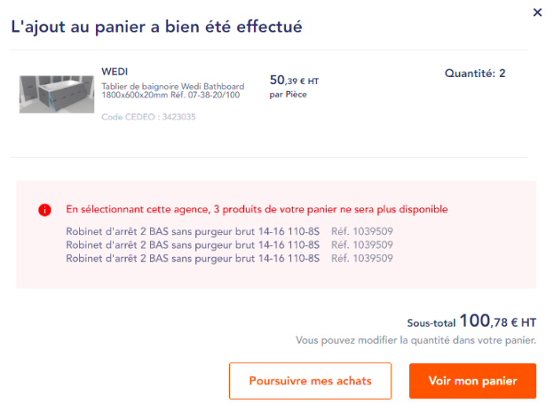

# **Schneider page**

Schneider page is a unique page which embeds an external webcomponent.
Leaving Token field empty disables the page. If disabled, trying to
access the page via direct URL will redirect to 404 page.

Note that User can’t add to Cart if Prices are hidden for current
*anonymous / logged in* User state, but Schneider page remains
available.

Page has fixed template (it does not use the “Lines” concept).

Finally, page visibility per User Role can be defined.

**Settings **

| Expected URL alias          | /schneider                     |
| --------------------------- | ------------------------------ |
| Breadcrumbs                 | \[site:name\] > \[page:title\] |
| Meta-title                  | Configurable from back-office  |
| Meta-description            | Configurable from back-office  |
| Translate Interface Context | Schneider                      |

**Context** : Schneider webcomponent is a Product configurator, built as
a multi-steps form. Once all form steps are performed, it shows a list
of products as a result. Those products can then be added to Whitefront
cart, to be purchased from the website. Add to Cart process is described
below.

Note that webcomponent front-end rendering / features is not part of
Whitefront scope - if any changes are required, they must be addressed
to the Schneider team.

Page is composed of next elements :

-   Breadcrumbs

-   Page title

-   WYSIWYG block 1

-   Schneider embedded webcomponent

-   WYSIWYG block 2

=&gt; Simple page template can be used to build front-end rendering of
the Schneider page :
[*https://cedeo.html.white.adyax-dev.com/wysiwyg.php*](https://cedeo.html.white.adyax-dev.com/wysiwyg.php)

Note that Schneider token can be edited from back-office (as a use case,
Token might change at some point, so site admin should be able to change
it). Rest of the code can’t be updated from back-office.

Code is available from
[*https://jsfiddle.net/rnp7a83z/55/*](https://jsfiddle.net/rnp7a83z/55/)

**!!** Code update is available in
[*https://prj.adyax.com/attachments/download/234786/CDL-ELEC.docx*](https://prj.adyax.com/attachments/download/234786/CDL-ELEC.docx)

## **Add to cart process**


This section describes how to add products from Schneider app to
Whitefront site. Note that an intermediate step is required to get
Products ID correspondences, since Schneider has its own Product IDs.

Once all steps have been performed on the Schneider multi-steps form, a
button “Add to cart” is displayed (by Schneider application). Clicking
on the button will trigger next process :

-   List of products are passed to service ***GET
     /articles-by-supplier-references***.

	-   websiteId (string, mandatory)

	-   supplierReferences (array.string, mandatory in body)

 *Response :*
```
[
{
  "supplierReference": "A725R09",
  "articleId": "1234567"
}
]
```

 This service will return the list of Product IDs correspondences.

-   For example, Drupal passes Schneider reference A & B. Service will
     return next info :

	-   A =&gt; 1

	-   B =&gt; 2

-   Note that 1 and 2 are representing “Impulse Product IDs”


-   Then, Drupal calls ***POST /carts/{id}/articles ***

	-   From example above, Product IDs to be passed are 1 and 2, in
         addition to quantity for each product

-   Once products have been added to cart, the Added to Cart pop-in
     appear. You can refer to [*corresponding
     section*](#added-to-cart-pop-in) for details.

Note that ***cartDTO*** will also return list of products that could not
be added to cart (for example, if they exist on Schneider side, but not
on Impulse side). In such case, they will be displayed as following on
the pop-in (in Red block) :



Red block lists Items from ***errrorInfo*** **notInPortfolio,
notInAgencyPortfolio, notPriced, notAvailableOnline.** For each, display
:

-   Product name

-   Product site reference (label “Réf.” is translatable from Translate
     Interface)
