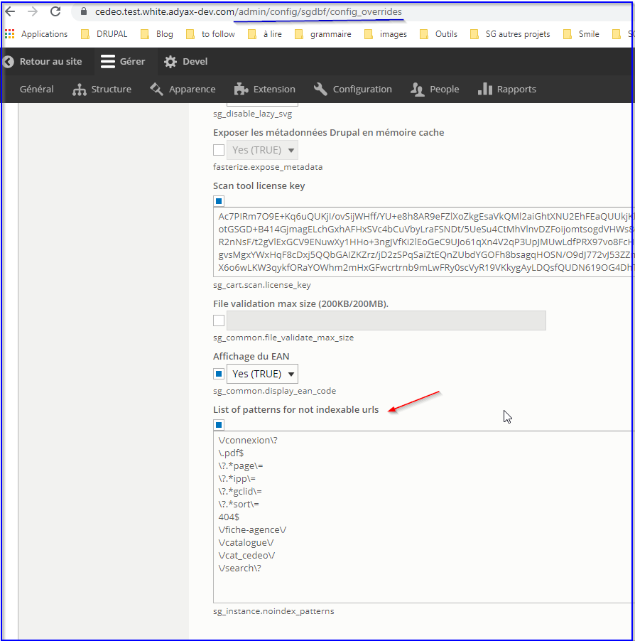

# **SEO**

In BO, in /admin/config/sgdbf/config\_overrides &gt; paramètres
généraux, administrators should be able to contribute patterns that
should not be crawlable.

**Note** : if for some URLs that have a pagination (page 2, page 3,
etc.), administrator wishes to apply "no index, no follow" attributes
ONLY to page 1 URL, he needs to contribute the correct pattern.

**-&gt; recommendation** : to use php regular expression patterns.

For PLP pages with pagination, find a way to always display the page
number at the end of the meta title (except for page 1 where it is not
displayed) EVEN if this meta title is overridden in ECK entity types by
contributor.

Ex :
https://www.cedeo.fr/c/accessoires-de-climatisation/x3snv3\_dig\_2008713R6/page-2

Accessoires de climatisation - Climatisation | Cedeo - Page 2

Other SEO request :

-   Display category filters in PLP H1, [*see concerned section category
     title*](#products-listing-page)

-   Display category filters in PLP category+brand H1, [*see concerned
     section brand
     facets.*](https://docs.google.com/document/d/1yVb5CW7FBinU3MYea7s7UHUX-8-QGAIQ-9-UV51WWdk/edit#)

-   Display category filters in search page H1, [*see concerned section
     facets.*](#search-results)

### Delete &lt;noindex, nofollow&gt; for old URLs

The following pages :

- ALL pages of type http://www.cedeo.fr/fiche-agence/xxxxxxxxx

- ALL pages of type https://www.cedeo.fr/catalogue/xxxxxxx

- ALL pages of type https://www.cedeo.fr/connexionxxxxxxxxx

have to be crawlable : have index, follow attributes (thus delete
&lt;noindex, nofollow&gt;)

### DUST (Duplicate Urls Same Text)

All pages should have a self-canonical URL in the HTML code like this :

Link: &lt;URL&gt;; rel="canonical"

**NOTE** : filtered pages should not be concerned by this rule
