# **Templates**

## **Common elements**

### Header desktop

| Translate Interface Context | Header |
| --- | --- |

Header has different states depending on user profile (see details below). 


New implementation

1. **Burger menu**
It is always displayed. See dedicated section
2. **Site logo** : configurable from back-office
3. **Search widget**
	* **@design :** Its length will need to adjust to the available espace.
	* **@design :** by default “search” icon is greyed and once the user inputs something, it becomes “active”
Behavior is described in the dedicated section for search widget.
placeholder is translatable from Translate Interface. Icon is configurable from back-office. <del>Underline can be enabled / disabled from back-office - and its color can be customized via a dedicated field.</del> 
4. **Agency item :** icon is configurable from back-office. Label **“Selectionner une agence”** is translatable from Translate Interface. Item has different states depending on User profile, see below. Note that when user is linked to an agency, icon state changes. 
5. **User item :**  icon is configurable from back-office. <del>Label “Mon espace perso” is translatable from Translate Interface</del>. Item has different states depending on User profile, see below. Note that when user is logged in, icon state changes. 
6. **Wishlists item :** icon is configurable from back-office in here : /admin/structure/config_pages/site_settings/edit > header element optionnel
	* **@design :** no notification number to be displayed.
<del>Label “Mes listes” is translatable from Translate Interface. If current user has wishlists, then display “[amount of wishlists] listes” below “Mes listes” label. “listes” is translatable from Translate Interface.</del>
	From back-office, it is possible to override the Wishlists item (by configuring a set of Icon <del>+ label +</del> 
	redirect URL - with option “open in a new tab”) for each user role (VA / VAR / VI Part / VI Pro / VI CLI / 
	VI CLI CLUB). <del>If so, then Lists count (“6 listes” on screenshot) is not displayed</del>.

7. **Cart item :** icon is configurable from back-office. If there are some products added to cart, then display Red pellet with amount of products 
8. **Products menu entry :** label is translatable from Translate Interface. Icon is configurable from back-office. See details in the Main navigation section. 
On click, it opens burger menu
9. **Drupal menu entries :**: configurable from back-office. See details in the Main navigation section. 


10. **Dynamique optional icon**
**@design :** icons are always displayed to the right of the agency item
Icon is configurable from back-office in here : /admin/structure/config_pages/site_settings/edit > header element optionnel. 
Label : Icônes optionnelles
The contributor can define :
	* an svg Icon 
	* Icon is user-sensitive so add a visibility block
	* direct URL - with option “open in a new tab” for each user role (VA, VAR, PART, PRO, CLUB, COLLAB)	
11. **Pro menu - Drupal menu entries :**: configurable from back-office. See details in the Main navigation section. 
12. **Part menu - Drupal menu entries :**: configurable from back-office. See details in the Main navigation section.
13. **Optional image** (ex : boost)
	* @design : images are always displayed to the left of the agency item.
In BO, site admins can contribute an image in : admin/structure/config_pages/site_settings/edit.
	Create a new tab “Header - icones optionnels”.
Label : Header - Images optionnelles 
For each image, Site admins shall be able to contribute : 
		* A desktop image (jpg/png) + alt tag non mandatory
		* A mobile image (jpg/png) + alt tag non mandatory
		* A link with the possibility to open it in a new tab (checkbox)
		* Users roles visibility :


Desktop wireframes

#### Header variants

Main items are described in the following section. Please refer to it regarding configurable items (icons…).  Descriptions below show additional details ONLY. 

##### Header variant (VA)


Non final implementation with no optional image


New implementation with optional image displayed to the left of the agency item


1. **Agency item :** <del>“Trouver mon agence” label is translatable from Translatable Interface. On-click, redirects to Agencies Landing page. 
Selectionner une agence label</del>
On click, the VA rattachement pop-in is displayed
2. **User item :** <del>“Me connecter” label is translatable from Translate Interface</del>. On-click, redirects <del>to Login page</del>. quick ODC access pop-up
3. **Wishlists item :** on-click, redirects to Login page. If Wishlists item is overridden by custom item, then on-click redirects to URL set for that custom item. 
4. : on-click, redirects to Login page
5. **Optional image**


##### Header variant (VAR)

Since a VAR user is a VA (anonymous user) except that he is linked to an agency, then only Agency item is different. All other items behave in the same way as VA user.


Old implementation


1. **Agency item :** [agency:name]. On-click, opens the “My Agency” pop-in. 
	* **@design :** do not display label, only the agency name.
2. **User item :** “Me connecter” label is translatable from Translate Interface. On-click, redirects to Login page. 
3. **Wishlists item :** on-click, redirects to Login page. If Wishlists item is overridden by custom item, then on-click redirects to URL set for that custom item.
4. **Cart item :** VAR users can add products to cart if corresponding setting is defined in back-office. If VAR users can’t add products to cart, then Red pellet is not shown at all. 
	* If VAR can add products to cart : on-click, redirects to Cart page
	* If VAR can’t add products to cart : on-click, redirects to Login page
5. **Optional image**

##### <del>Header with login block  (VA, VAR)</del>

<del>ONLY on desktop and for VA, VAR users, the webmaster shall be able to display a new block to encourage the user to register to the website.</del>

<del>In BO webmaster shall be able to enable/disable the connexion bloc, in here : /admin/config/sgdbf/config_overrides, “paramètres généraux” tab</del>


<del>By default, this feature shall be disabled and thus the block NOT displayed.
When enabled, the following block shall be displayed.</del>


<del>There two translatable strings :</del> 

1. **<del>First visit</del>**
<del>Première visite?
Contexte : Header</del>
2. **<del>Log in</del>**
<del>Commencez ici</del>
<del>Contexte : Header</del>
<del>Webmaster shall be able to contribute the background colors of the block and the link as the block is clicable.</del>
3. <del>Main background color : add a color picker</del>
4. <del>Inner background color : add a color picker</del>
5. <del>URL field
On click on the block, the user shall be redirected to the contributed link. By default, the user will be redirected to the connexion page : /connexion</del>


##### Header with quick ODC access (VA, VAR)

**ONLY on desktop and for VA, VAR users**, the webmaster shall be able to display a pop-up to facilitate user access to ODC (login/account creation).

In BO webmaster shall be able to enable/disable the pop-up, in here : /admin/config/sgdbf/config_overrides, “paramètres généraux” tab
Label : Activer la pop-up de connexion/inscription
By default setting is enabled.

On <del>hover</del> click, on the login/registration block, the pop-up will be displayed.
:w


Old implementation


New implementation

1. **<del>Login link</del>**
<del>Translatable string</del>
 ```
 Connexion
 ```
<del>Contexte : Header
 On click, the user is redirected to the login page : /connexion</del>

2. **<del>Sign up link</del>**
<del>Translatable string</del>
```
Inscription
```
<del>Contexte : Header
On click, the user is redirected to the registration tunnel (action type selection step) : /inscription</del>

1. **Login Title**
Translatable string
 ```
 Vous avez déjà un compte?
 ```
2. **Login Sub-title**
Translatable string
 ```
 Connectez-vous!
 ```
3. **Close pop-up**
On click, the pop-up closes.
4. **Email field**
Same behavior, FE validation and errors displayed as in login.

5. **Password field**
Same behavior, FE validation and errors displayed as in login.
Eye icon is missing - to be added


6. **Remember me**
Same behaviour as in login.
7. **Forgotten password**
Same behaviour as in login. On-click, redirects to the Forgotten password page. 
	* **Design :** to be displayed underneath the field
	* **Design :** no color + underline
8. **Login CTA**
Label is translatable from Translate Interface
 ```
 Connexion
 ```
On-click, login service is triggered. A loader is displayed to show the user that the redirection is ongoing.	
	* If logging is successful then the page is reloaded and the user is logged in. He will remain in the current page with logged in status.
	* If logging fails then page is NOT reloaded and the following error message is displayed in the pop-up.
Translatable string
 ```
 Une erreur s’est produite. Veuillez relancer une nouvelle inscription.
 ```
9. **Sign up title**
 Translatable string
 ```
 Pas encore inscrit?
 ```
10. **Sign up sub-title**
 Translatable string
 ```
 Créez votre compte rapidement!
 ```
11. **Sign up CTA**
 Label is translatable
 ```
 Créer mon compte
 ```
On click, the user is redirected to the registration page : /inscription
A loader is displayed to show the user that the redirection is ongoing.

##### Header variant (VI Part, VI Pro, VI CLI)


Old implementation


New implementation

**Note :** It is the same header as for VAR.

1. **Agency item :** [agency:name] is displayed. On-click, opens the “My agency” pop-in. 
	* **@design :** do not display label, only the agency name.
2. **User item :** <del>display [civility] [Last Name].
On-click, redirects to My Account Landing Page</del>
On hover, a quick access dashboard is displayed, see concerned section
3. **Wishlists item :** on-click, redirects to My Wishlists page. If Wishlists item is overridden by custom item, then on-click redirects to URL set for that custom item.
4. **Cart item :** on-click, redirects to Cart page. 
5. **Optional image**


**Note :** for VI users, an agency alert pop-up might be displayed in some conditions, see concerned section here, informing the user he is not rattached to his by default agency.


##### Quick access dashboard for VI

For VI users, on hover on the user item an overlayer is displayed. When hover is out, quick access dashboard is hidden.
ONLY for desktop.


`0.` **Title**
 Translatable string
 ```
 Bonjour @user_name
 ```
	* **@design :** mising for the moment. FE make a proposition

1. **My Account**
 It is displayed by default.
 On click, the user is redirected to My Account Landing Page (/mon-compte)
 String is translatable
 ```
 Mon espace client
 ```
2. **Logout**
 **NEW design :** It is a CTA (primary)
 It is displayed by default.
 On click, the user is logged out.
 String is translatable
 ```
 Me déconnecter
 ```
3. **My account block**
 In BO, in /admin/structure/config_pages/site_settings/edit > Header - EMC quick access contributor can edit this block and add as many “My account items” as wanted. If no items are contributed, this block is not displayed.


Tab label : Header - EMC quick access
Section label : Items de Mon Espace personnel

These items are user sensitive. A visibility block will be displayed in BO. Contributors can select for which roles these items can be displayed on the website. If the checkbox is checked, the corresponding role will see the item.

For each item, contributor can contribute : 

* Link field containing title and URL. Multiple links can be added.
Contributor can choose to open this link in the same or in a new tab (checkbox)
	
On click on each item’s block, the user is redirected to the concerned page.

**Error in design :** no notifications to be displayed.

</br>
4. **Promotion block**
In BO, in /admin/structure/config_pages/site_settings/edit > Header - EMC quick access, contributor can edit this block. If no item is contributed, this block is not displayed.
This block is user sensitive. A visibility block will be displayed in BO. Contributors can select for which roles this block can be displayed on the website. If the checkbox is checked, the corresponding role will see the block. Each role can only see one promotion block.

Section label : Bloc de promotion

For promotion item, contributor can contribute : 

* **4.1 Image.** Mandatory field
* **4.2 Title.** Mandatory text field
* **4.3 Description.** Optional field
* **4.4 Tag.** optional. Text field
* **Tag background color.** Contributor can choose a color (colorpicker) for the background color of the tag..
* **URL.** optional URL field. Contributor can choose to open this link in the same or in a new tab (checkbox)
On click on the block, the user is redirected to the concerned page.


### Header mobile 

**@design :** main navigation menu is not displayed


**NEW :** ONLY on mobile and ONLY on scroll up, header and search bar become sticky.


1. **Burger icon :** on-tap, opens the navigation menu. Icon is configurable from back-office.
2. **Site logo :** configurable from back-office (same logo as for desktop)
3. PWA item : icon is configurable from back-office. Clicking on the icon opens the “How to install web app” layer. By default, pop-in is displayed on Home Page only (not on other pages). Once user has tapped on the icon, a cookie is set and pop-in in not shown anymore. Pop-in label is translatable from Translate Interface. 
4. **Agency item :**  icon is configurable from back-office (same icon as for desktop)
5. **Cart item :** icon is configurable from back-office. If there are some products added to cart, then display Red pellet with amount of products 
6. **Search bar :** placeholder is translatable from Translate Interface. Icon is configurable from back-office. Underline can be enabled / disabled from back-office - and its color can be customized via a dedicated field. 
7. **User item**
8. **Optional image**
	See details in header desktop section.


Mobile wireframe

#### Mobile navigation - additional links

On mobile version, additional links are displayed in the main navigation menu. Depending on user role, specific items are displayed (see details below).


1. **Appeler mon agene link (call my agency) :** on-tap, triggers the Phone application. Icon is configurable from back-office, label is translatable from Translate Interface. Phone number is retrieved from default agency. Link is displayed for  VI Part / VI Pro / VI CLI
2. **<del>Appeler mon ATC link (call my ATC) :</del>** <del>on-tap, triggers the phone application. Icon is configurable from back-office, label is translatable from Translate Interface. Phone number is retrieved from ???
	Link is displayed for ???. This link is hidden for now.</del>
3. **Contacter Cedeo link (contact Cedeo) :** mailto: - on-tap, opens the Mail application. Icon is configurable from back-office, label is translatable from Translate Interface.
	Same email address for all roles or not?? 
4. **Installer la web app (install the PWA) :** on-tap, opens the PWA layer. Icon is configurable from back-office, label is translatable from Translate Interface. Displayed for all Roles
5. **Contactez-nous link :** same behaviour as in footer, on click, it redirects towards a page. This redirection can be configured in BO, in admin/structure/config_pages/site_settings/edit


### Main navigation

Main navigation is composed of 2 parts: 

* Products mega-menu entry which is always displayed on the left. And is an anchor to burger menu’s Products entry. <del>Its items are retrieved from the /menu webservice (1). See related information in the burger menu section.</del>
* Main menu - Other Always display in the left side of the main navigation, after the product item menu. These items are managed in Drupal, using Drupal menu
Label : Main Menu 
Differents sections can be created within the main menu in order to have separators between the menu items (2, 3, 4) 
**Note :** it there are no menu items between 2 separators items, then the first separator is not displayed on the page

**@design :** the last right main menu item always has a double arrow to its right.


New implementation


Old implementation


**As many menu items can be added for each menu.**
For all of them, there can be up to 2 levels maximum (but it will be up to contributors to respect this rule on back-office side). 
For each link, it is possible to define visibility per  Role. 


<del>Note that for a good rendering, there should not be more than 4 Drupal menu entries level 1.</del> It will be up to contributors to make sure rendering in FE is optimal (it will not be limited from Drupal side). 


<del>Old implementation</del>


New implementation

For each menu, the contributor can :
 
* Drupal menu entry level 1 (parent menu): 
	* In BO, the contributor can choose whether the level 1 items should be visible or not for users in the main navigation menu by checking the checkbox “Activé”. If the checkbox is checked then the menu item level 1 is displayed.
	* On click, the item has an active state (colored). 
	* On clicking on the menu item, the user is redirected to the contributed link (mandatory). 
<del>Level 1 item is not clickable if there is no link configured for it.</del> 
	* Contributor can define an anchor towards the burger menu so on click on the parent item of the main navigation menu, the user is redirected to the concerned page of the burger menu (ex : on click on “espace deco”, user is redirected to the burger menu with the “espace déco” layer open)
Note : if a link is contributed in the parent item, the anchor redirection towards the burger menu will have a higher priority.

* Special menu entry 1 : (ex : promo)
for each Drupal menu item, it is possible to define a highlight color (using color picker). If a highlight color is defined, then the label is displayed with white color. 


* Drupal menu entries level 2 (children menu items) : 
<del>on-click, redirects to defined URL (with option “open in a new tab”). Items are added from top left to bottom right as following :
	1 - 2 - 3 
	4 - 5 - 6
Etc. Amount of links is not limited.</del>
	* If a parent item has children then it is required to set “#” in the link field, to have correct behavior. they will not be displayed in the left nor middle main navigation menu. Children menu items are ONLY displayed in the right main menu. On click, on right menu entry level 1, a mega-menu is displayed with children items and their contributed icons. On click on each children item, the user is redirected to the concerned page opened in a new tab or not.
**Note :** if an anchor is set for a parent menu item, this behaviour will be overridden and on click user will open the burger menu. 
	* The contributor shall be able to define a “separator” item, so different menu section can be separated by a horizontal line


<del>Marketing block : 
In /admin/structure/config_pages/content_site_settings/edit > entrées menu contenu, contributor can edit an image field, optional. For each Level 1 item,  image field, optional. For each Level 1 item, is clickable (redirects to defined URL (with option “open in a new tab”). </del>

### Burger menu

In BO, the contributor can define the tree of the burger menu in the Drupal menu entries > burger menu, /admin/structure/menu. 
Here, for each menu item, he can, as in the main navigation menu :

* edit parent and children items
* add svg icons to the links
* Define a “separator” item, so each burger menu section is separated by a horizontal line
* Edit custom styles : highlighted color, menu label color text, font selection

The burger icon will ALWAYS be displayed in the page (even in desktop mode)
A click on the burger menu icon, opens the menu pop-up on the entire height of the page. If the user clicks out of the pop-up, the whole menu will close up.


There is a hover effect on menu items and their arrow.


Hover effect - burger menu layer 1 level

**@design :** On click on a Level 1 link that has children, there is a slide effect from left to right and the next layer of the burger menu will be displayed.
On click on the back arrow, the user goes back to the previous layer of the burger menu.


Burger menu - level 1 menu layer                                                            Burger menu - level 2 menu layer


On click on a level 2 menu item with children, the burger menu is expanded, so it shows all related children links in the right side of the burger menu.


Burger menu - level 2 menu layer                                                        Burger menu - level 3 menu layer


On click on an item menu with no children, the user is redirected to the link contributed in the drupal menu.


New implementation - initial state of the burger menu (Level 1 menu items)


1. **Closing “x”.** On click on “x”, the burger menu closes
2. **Brand icon.** Can be uploaded in BO, in the burger menu config page.
3. **Menu section**
	* Each burger menu section is separated by a horizontal line.
	* The contributor shall be able to create as many sections as he wants. In each section, the contributor can add as many menu items as he wants. This can be done directly in the drupal menu by using a “separator” item.


#### Products mega-menu

Mandatory menu entry. It is always displayed and built automatically from WS.
On click, on the product menu entry in the burger menu, the user will go to the N1 level menu layer with a “slide” effect.
On click on the product menu from the main navigation, the burger menu opens, with the product layer opened on the N1 - level layer.


<del>Old implementation - Products mega-menu - 2 levels shown</del>


New implementation -  categories  level 1 of the product menu are shown

<span style="color:red">!!</span> Menu background color can be configured from back-office. If not set, then Brand Color 1 is used as a fallback. 

1. **Products menu entry :** highlighted state
	* @design : error in design, item has a by default color.
label is translatable from Translate Interface
It displays the list of N1 categories with a vertical scroll if necessary
2. **Categories level 1:** for each level 1 category, it is possible to define a hover color from back-office (using Color picker) (optional). This color is then used when the category is active. If no color is defined, then the site default “mouse-over” color is used. 
On-click, shows an expanded layer with Level 2 and level 3 category items. If the user clicks outside of the mega-menu, it will close up. Clicking on the “x” will also close the mega-menu.
Quantity of items to display is unlimited, <del>if service send 20, then 20 is displayed on the 1st level.</del> Display all items sent by the service.


New implementation product mega menu - N2 and N3 category items shown

**@design :** if needed, a vertical scroll could be implemented so the user can see all items.

`6.` **Parent category** link (see all products from this category) : 
Title is a translatable string.
@design : error, title is missing
```
@Parent category title - Voir tout
```


on-click, redirects to :

* Category Landing Page if configured for current Level 1 item 
* Products Listing Page if no Category Landing Page configured for current Level 1 item
* Parent category label must be displayed in bold 
	Note that link color is inherited from color defined for Level 1 category. 

	Link label is translatable from translate Interface. 

`3.` **Categories Level 2 :** on-click, shows children categories (level 3). If no Level 3 categories for a Level 2 item, then 
They are displayed with level 3 categories. On-click it redirects to :

* Category Landing Page if configured for current Level 2 item 
* Products Listing Page if no Category Landing Page configured for current Level 2 item
* **!!** Missing on design : selected level 2 item must re-use color defined for parent level 1, including mousing-over effet and “color bar” on the left

`4.` **Categories Level 3 :** All items are displayed, on-click it redirects to :

* Category Landing Page if configured for current Level 3 item 
* Products Listing Page if no Category Landing Page configured for current Level 3 item
* !! Missing on design : mousing-over a level 3 implies that label will re-use color defined for parent level 1

`5.` **Marketing block :** image field, optional. For each Level 1 item, it is possible to define a Marketing Block, in /admin/structure/config_pages/content_site_settings/edit > Entrée menus produit
Marketing block is clickable (redirects to defined URL (with option “open in a new tab”). 
Marketing blocks are user profile-sensitive. 


<del>Products mega-menu - 3 levels shown</del>

1. <del>Parent category link (see all products from this category) : on-click, redirects to :</del>
	* <del>Category Landing Page if configured for current Level 2 item </del>
	* <del>Products Listing Page if no Category Landing Page configured for current Level 2 item</del>
	* <del>!! design mistake : Parent category label must be displayed in bold instead of “Voir tout l’univers”</del>
	<del>Note that link color is inherited from color defined for Level 1 category. Link label is translatable from
	Translate Interface.</del>
2. <del>Categories Level 3 : on-click it redirects to :</del>
	* <del>Category Landing Page if configured for current Level 2 item </del>
	* <del>Products Listing Page if no Category Landing Page configured for current Level 2 item</del>
	* <del>!! Missing on design : mousing-over a level 3 implies that label will  re-use color defined for parent level 1</del>
3. <del>Marketing block : configured on Category Level 1 level. Marketing block is clickable (redirects to defined URL (with option “open in a new tab”).</del> 

<del>Marketing blocks are user profile-sensitive. In BO, a visibility role block is available for the following roles : 
/admin/structure/config_pages/content_site_settings/edit
If the checkbox is checked, the corresponding role will see the content</del>

#### Burger mega menu - image list Drupal items advanced mega-menu

In /admin/structure/config_pages/content_site_settings/edit > Menu burger  <del>Menu principal avancé</del> contributors <del>can define a Drupal items advanced mega-menu for each Drupal menu level 1 item</del>. enhance the burger menu by adding a list of image links.

Note that, if for the same Drupal level 1 menu item, both Drupal items advanced mega-menu and ESDB Main menu entry are configured, then the ESDB Main menu entry takes the priority. 


Old implementation


Burger menu - level 3 layer : menu links with images

This image links layer can ONLY be displayed in the level 3 layer of the burger menu.

In BO, the contributor shall be able to choose to which drupal menu item apply the following image enhancement. 
For each menu entry, the contributor shall be able to add the following elements : 

1. **Level menu entry title :** To be contributed in the BO (Drupal menu entries > burger menu). For each entry title, the contributor can add as many images +labels as wanted.
2. **<del>2nd</del> level menu entry image :** configurable from back-office. Correct size must be respected by contributors for a correct display. 
3. **<del>2nd</del> level menu entry label :** configurable from back-office.
	* !! Note that both label and image are clickable. For each couple, contributor can define one link 
	(with option Open in a new tab). 
	Also, there are no limitations regarding amount of level 2 items to be added. For a correct display, 
	contributor should stick to 4 items maximum.
	* **@design  :** apply hover effect on clicable links
	* **Background color and font color :** configurable from back-office, defined on level 2 each menu entries block. 
4. **“See all “ link.**
Menu and link can be contributed in the main navigation menu.The contributor shall be able to display it where ever he wants in the page (top, middle, bottom)
	* **@design :** it must be visible to the user, even if displayed on top of the burger menu.

**Marketing block :** 
Marketing blocks are user profile-sensitive. 
In /admin/structure/config_pages/content_site_settings/edit > entrées menu contenu, the contributor can edit :

* **A title (5).** Mandatory field
* **A link.** 
* an **image field (6)**, mandatory field. For each Level 1 menu item,  image field, optional, is clickable (redirects to defined URL (with option “open in a new tab”). 
* A **subtitle (7).**
* A **description (8).** 
	
#### Burger mega menu - link list

In /admin/structure/config_pages/content_site_settings/edit > Menu burger  contributors can enhance the burger menu by adding a list of image links.

This image links display can be ONLY displayed in the level 3 layer of the burger menu.


Burger menu - level 3 layer of the menu links


In BO, the contributor shall be able to choose to which drupal menu item apply the following link enhancement. 


For each menu entry, the contributor shall be able to add the following elements : 

1. **Level menu entry title :** To be contributed in the BO (Drupal menu entries > burger menu). 
The contributor can add as many menu entries as wanted.
2. **<del>2nd</del> level menu entry link :** URL and label are configurable from back-office (Drupal menu entries > burger menu), with option Open in a new tab. 
	There are no limitations regarding the amount of links to be added. 
	* @design  : apply hover effect on the clicable links.
	* **Background color and font color :** configurable from back-office, defined on <del>level 2</del> each menu entries block. 
3. **Marketing block :** see related section in burger mega menu - images.

### Sticky Header

<del>!! A setting allows to enable / disable the sticky header on the website.</del> 
<span style="color:red">!!</span> Note that sticky header only applies to the Desktop version. 

<del>If enabled</del>, when scrolling down on a page, it looks like this : 


Old implementation


New implementation

Note that a smooth transition must be implemented between regular header and sticky header. 

**NEW :** top header is always sticky and the same icons as in top header are displayed. No need of a simplified version of the top header.

1. **Site logo**
2. **Search bar :** on-click, it expands the Search layer. Search works exactly the same as from default Header.
 
3. **Agency icon :** same behavior as the one from default header.
4. **User icon :** if logged in, redirects to My Account, else to the login page
5. **Whislist icon :** configurable from Back-office 
6. **Cart icon :** if products are in the cart, the red Pellet with amount of products must be displayed. On mouse-over, mini-cart appears if enabled. On-click, redirects to Cart page
7. **Burger menu**
8. Any other icon or image displayed in the top header shall be displayed


### Information bars

For each page specified below, Contributors are able to define specific text for all profiles : 

* VA
* VAR
* VI_PART
* VI_PRO
* VI_CLI (including CLI CLUB extension)

Hereafter is the list of pages where the bar should be customizable:

* Homepage (homepage) // **French label : Page d’accueil**
* Search results page (Search) // **French label : Résultats de recherche**
* Product detail pages // **French label : Pages Produit détail **
* Product Listing Pages (Page Catalogue) // **French label : Liste Produits**
* Category Landing Pages (Landing Categorie) // **French label : Landing Catégorie**
* Promotions pages (Web Promotions + Promotions Agence) // **French label : Pages Promotions**
* Brands Listing page (Brand landing) // **French label : Marque détail**
* Brands Details pages (Marque) // **French label : Landing Marques**
* Cart Page (Cart) // **French label : Panier**
* Store Locator Landing Page (Agency Landing) // **French label : Landing agences**
* Store Locator Results Page // **French label : Résultats agences **
* Agency Details Page (Agency detail + Agency/Showroom) // **French label : Agence détail**
* My Account (same content for all pages) (My Account pages / My Account) // **French label : Mon compte**
* All pages // **French label : Toutes les pages**
* VUE Checkout - Delivery // **French label : Checkout - Livraison**
* VUE Checkout - Payment // **Frenche label : Checkout - Paiement**
* VUE Checkout - Confirmation // **French label : Checkout - Confirmation**

Contributors can also specify a text to be applied on All Pages - even ones not listed above (i.e: editorial pages) ; applicable when there is no specific content contributed for a certain type of page. 

Use case example: we may want to incite VA users throughout all the website pages to select an agency ; so that they can browse its own product catalog.

Note that using closing cross will close bars on all pages (closing is not specific per message). 


This information messages can be contributed by site admins in /admin/structure/config_pages/content_site_settings/edit > Messages d’information > blocs supplémentaires


**NEW :** For all information message’s blocks, add a new visibility checkbox for IE users.

Label : Navigateur IE uniquement

Whenever this checkbox is checked, the message will ONLY be displayed for users using IE browser.

### Search widget

|Translate Interface Context|Widget Recherche|
|---|---|


<del>Clicking on the Search bar in header will expand it as shown below. It will overlap the main menu items. On mobile, it opens a full-screen layer.</del> 

**@design :** By default, the search icon is greyed. When the user starts filling the search input, the search icon is not greyed anymore.


New implementation


Old implementation

**NOTE :** User search is preserved after page reload.
When the user will click on the search widget with a prefilled search input, search bar expands and the cursor is placed at the end of the string. If search input is too long, cut the string as it is currently the case


1. **Search input field :** placeholder “Rechercher un produit, une marque…” must stay visible until User starts to type some chars. Placeholder is translatable from Translate Interface. 
2. **<del>Search icon</del> Enter key:** On-click, redirects to Search Results page, filtered on input keyword - or to page defined in back-office for searched keyword (see related section about this). 
3. **Cross icon :** on-click, closes the expanded search input field
4. **Recent search expanded layer :** displayed only if user performed searches already. If so, the 8 4 latest ones are shown (most recent on top) on desktop. On mobile, show 1st half of the results presented on Desktop.  Label “Recherches récentes” is translatable from Translate Interface. Clicking on one of the Search strings will redirect user to the Search Results page, filtered on searched string. 
Note that if User clicks on a suggestion (either Products or keywords), then :
	* If Keyword suggestion, save clicked suggestion in Search history
	* If Product suggestion, save clicked product name in Search history 
5. **Clear history link :** on-click, recent search history list is cleared, and Recent search expanded layer gets closed. 

<span style="color:red">!!</span> Note : line right below input text field uses the Brand Secondary color. 


 * @design : standar mobile responsive behaviour will be implemented
 * @design : characters matching imputed keywords are displayed in bold
 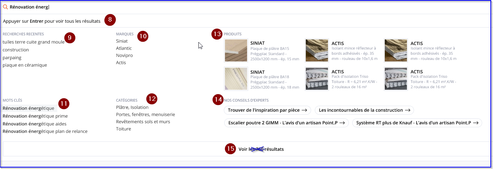

`6.` **Loader :** as soon as the user types 3 characters, a string and a loader are displayed to inform the user that the search is ongoing.
	* **Design :** loader is to be displayed to the right of the search icon
 Translatable string : 
 ```
 Recherche en cours …
 ```

`7.` **Search input field :** as soon as user starts to type, the “suggestions” layer gets opened. Suggestions are returned by the Search service (except for the Drupal content suggestions). Suggest service is triggered after 3rd char input. 
User can contribute up to 260 characters

`8.` **Information message**
Translatable string, not clickable. To be displayed once there are search results displayed. When user clicks on “enter” on his keyword, he goes to the search result page.
**Note :** do not display information message in mobile
```
Appuyer sur Entrer pour voir tous les résultats
```

`9.` **Recent search** corresponding to entered terms by user.
See previous pt 4. 
The recent search block is displayed IF recent searches exist AND if the entered terms by the user correspond to a recent search. Concerned recent results shall be displayed.
Ex : user searches for “des”, then show recent search results with these terms and not ALL recent searches.


For brands, keywords and category’s suggestions call WS : 
Search-query
/api/v1/search/suggest-with-source

Service returns a Dto like :
```
[ {
"entry": "Mitigeurs",
"source": "catalogue_xml_lb_usg3_cedeo",
"distance": 0,
"score": 1302
}, {
"entry": "Mitigeur mécanique lavabo",
"source": "catalogue_xml_lb_usg4_cedeo",
"distance": 0,
"score": 826
}, {
"entry": "Mitigeur lavabo",
"source": "catalogue_xml_lb_usg4_cedeo",
"distance": 0,
"score": 804
}, {
"entry": "Mitigeur baignoire",
"source": "catalogue_xml_lb_usg4_cedeo",
"distance": 0,
"score": 173
}, {
"entry": "Mitigeur mécanique baignoire",
"source": "catalogue_xml_lb_usg4_cedeo",
"distance": 0,
"score": 173
}, {
"entry": "Mitigeur cuisine",
"source": "catalogue_xml_lb_usg4_cedeo",
"distance": 0,
"score": 169
}]
```
`10.` **Brands block**
In BO, in /admin/config/sgdbf/config_overrides > recherche, the contributor shall be able to edit brands ID.
WS return suggestions with terms associated to the ID Marque : 
catalogue_xml_lb_marque_enseigne
	Note : do not hardcode this value.

Up to 4 suggestions can be shown. For each, typed chars are displayed in bold.
Clicking on a suggestion redirects to the Search Results page, filtered on corresponding string - or to page defined in back-office for searched keyword (see related section about this). 
Label “Marques” is translatable from Translate Interface. 
	
`11.` **Keywords block**
In BO, in /admin/config/sgdbf/config_overrides > recherche, contributor shall be able to edit keywords ID.
WS returns suggestions with terms associated to the following IDs : Code article / Référence Fournisseur / Modèle / Gamme

* catalogue_xml_lb_ref_fournisseur_enseigne
* catalogue_xml_ref_fournisseur_without_leading_zeros_enseigne
* catalogue_xml_code_article_enseigne
* catalogue_xml_gamme_enseigne
* Catalogue_xml_modele_enseigne

**Note :** do not hardcode these values.

Up to 6 4 suggestions can be shown <del>on desktop, on mobile show 1st half of the results presented on Desktop.</del> For each, typed chars are displayed in bold.
 <del>Amount of results is displayed between brackets ().</del> Clicking on a suggestion redirects to the Search Results page, filtered on corresponding string - or to page defined in back-office for searched keyword (see related section about this). 
Label “<del>Suggestions de</del> Mots clés” is translatable from Translate Interface. 

`12.` Categories block
In BO, in /admin/config/sgdbf/config_overrides > recherche, contributor shall be able to edit keywords ID.
WS return suggestions with terms associated to the following IDs : 
	
* catalogue_xml_lb_usg3_enseigne
* catalogue_xml_lb_usg4_enseigne
* catalogue_xml_lb_usg2_enseigne
* catalogue_xml_lb_usg1_enseigne
* catalogue_xml_lb_usg5_enseigne
* catalogue_xml_lb_usg6_enseigne

**Note :** do not hardcode these values. Enseigne = site name

Up to 4 suggestions can be shown. For each, typed chars are displayed in bold.
Clicking on a suggestion redirects to the Search Results page, filtered on corresponding string - or to page defined in back-office for searched keyword (see related section about this). 
Label “Catégories” is translatable from Translate Interface. 

`13.` **Products block :** depending on input string, Search service will return products to display. There can be up to 4 6 products displayed. For each, display :

* Image
* Brand
* Title

	=> All elements are clickable. On-click, redirects to the corresponding Product page. 
	Displaying order of the products is the following : 
	1 - 2 - 3 /
	4 - 5 - 6
	Note that label “Suggestions de Produits” is translatable from Translate Interface. 

	Note : Keep the current WS used : v2/search/suggest.

`14.` **Drupal content suggestions :** <del>(not displayed on mobile) returned by SOLR. To be specified when Drupal content will be specified. Not displayed on screenshot.</del>

**Note :** In BO in /admin/config/sgdbf/config_overrides, contributor should be able to enable/disable the display of drupal content suggestions in the search dropdown.

* If enable (by default) : drupal content suggestions are displayed
* If disabled : drupal content suggestion are not displayed
He is also able to choose what content types are to be displayed or not. By default, all CT are displayed.

Depending on input string, Search service will return content to display. There can be up to 4 items displayed. 
For each, display the title (MAX 50 characters) and an arrow to the right of the title
@Design : If the title is longer than 50 charac, add “...” 	
=> All elements are clickable. On-click, redirects to the corresponding content page. 
	Note that label “Nos conseils d’experts” is translatable from Translate Interface.

`15.` **See all results button :** on-click, redirects user to the Search Results page, filtered on current keyword input in search field. Note that pressing the Entry key on keyboard also sends user to the Search Results page. 
**@design :** to be displayed at the bottom of the page, centered.
	Label is translatable string : Voir tous les résultats

!! When doing a Search, next types of results can be found :

* Keywords suggestions (displayed on the left)
* Recent search
* Brands
* Categories
* Drupal content
* Products (displayed on the right)

If, when doing a search :

* <del>There are Keyword suggestions found, but no Products => do not display the Suggestions de produits string and the Aucun résultat (no results) string corresponding to the Products block</del>
* <del>There are Products found, but no Keyword suggestions => do not display the Suggestions de mots clés string and the Aucun résultat (no results) string corresponding to the Keywords suggestions block</del>
* There are no result/suggestion for a block, then do not display that block. Others block of the same line will be adjusted horizontally (see screen underneath)
* If no results are found at all, then default No results state (as shown below) is applied. 

**@design :** horizontally adjust displaying of blocks when a block is not displayed 


Old implementation


Current implementation


`16.` **No results state :** label is translatable from Translate Interface
Label : Aucun résultat trouvé

### Specific keyword/suggestions search redirection

From back-office (dedicated Configuration Page), /admin/structure/config_pages/search_settings/edit > Fichier des redirections the site admin can upload a CSV file which allows to map specific keywords to specific URL, which means : 

* If User types and searches for a keyword that matches with correspondence table, he is then redirected to corresponding URL, instead of being redirected to search page
* This also applies to keywords displayed in the “Suggested keywords” block (when clicking on it) 

Note that Redirect logic should work, no matter if User inputs keyword/suggestion with lowercase / uppercase. For example :

* URL : cedeo.fr/sanitaire
* Associated keyword : sanitaire
* => If User types SANITAIRE, then he should still be redirected to cedeo.fr/sanitaire

Accents are also covered. For example, if I type “béton”, and “beton” is added to the associated keywords, it would work too. 

CSV file is built as following : 

|Keyword|URL|Comment|
|---|---|---|


1 line per keyword / URL/comment couple. Separator in file is semi-column (;)
For example, the file will have this format :
bonde douche;/c/vidage--siphon-et-bonde-de-douche/x3snv3_dig_2025691;Redirection ajoutée le 07/09/2021
vidages de douche;/c/vidage--siphon-et-bonde-de-douche/x3snv3_dig_2025691;Modification apportée le 05/09/2021

From Config page, site admin uploads the file, then saves page. 
File is then parsed, and its content is added into cache. Cache is then used to make proper redirects on front, according to what User types in search bar.
Note that when cache gets cleared, file content is automatically parsed again and re-added to cache. 

Once file is uploaded, a message must display to site admin:

* Amount of redirects added
* Amount of redirects skipped (ideally with details about which lines exactly were skipped)

Below file input field, a table (read-only mode) displays all added redirects, so site admin can easily see what has been added without having to re-open file. 


Note that since there is no DB update / entity creation involved in the process, then if file gets removed, all redirects are removed.  


---------

<del>From back-office, it is possible to map specific keywords to specific URL, which means :<del>

* <del>If User types and searches for a keyword that matches with correspondence table, he is then redirected to corresponding URL, instead of being redirected to search page</del>
* <del>This also applies to keywords displayed in the “Suggested keywords” block (when clicking on it)</del> 

<del>From back-office side, a dedicated configuration page allows to assign multiple keywords to a single URL. For example :</del>

<del>URL : cedeo.fr/sanitaire (which stands for the Sanitaire Category Landing page in this example)</del>

<del>Associated keywords :</del>

* <del>Sanitaire</del>
* <del>Sanitaires</del>
* <del>Saanitaire</del>
* <del>Sanitere</del>
* <del>Etc.</del>

<del>=> This allows to cover potential typos from User.</del> 

<del>Note that this logic should work, no matter if User inputs keyword with lowercase / uppercase. For example :</del>

* <del>URL : cedeo.fr/sanitaire</del>
* <del>Associated keyword : sanitaire</del>
* <del>=> If User types SANITAIRE, then he should still be redirected to cedeo.fr/sanitaire</del>

Accents are also covered. For example, if I type “béton”, and “beton” is added to the associated keywords, it would work too. 

### Select an agency pop-up (VA) : VA rattachement to an agency

It replaces the select an agency pop-up for VA.


Old implementation


New implementation

In BO, contributor can activate this pop-in by clicking on a checkbox, in admin/structure/config_pages/agencies_settings/edit.
Tab label : Pop-up de sélection d’agence (VA)
If activated, this pop-up is displayed only for VA Users.
Setting label : Activer la pop-in de sélection d’agence (VA)

From back-office, it is also possible to define on which pages this pop-up will be displayed, among :


| Pages                   | BO labels                |
|-------------------------|--------------------------|
| Home page               | Page d'accueil           |
| Product pages           | Fiches produits          |
| PLP                     | Page liste des produits  |
| PLP category+brand      | Page catégorie + marque  |
| PLP brand               | Page marque              |
| Agency promotion        | Promotions agence        |
| Web promotion           | Promotions web           |
| mini catalog advanced   | Mini catalogue avancé    |
| Search                  | Recherche                |
| Landing category pages  | Landing catégorie        |

`1.` **Title**
Label is translatable.
```
Trouver votre magasin facilement!
```

`2.` **Sub-title**
Label is translatable.
```
Suivez les stocks en temps réel et obtenez les meilleurs prix.
```

`3.` **Closing cross**
Only on click on the “x”, the pop-in will close. 
But on page reload if the user is VA it will be displayed again. This will be done until the user is rattached to an agency.

`4.` **Zip code**
Placeholder is translatable. 
```
Code postal
```

It shall be possible to search by zip code, region and town like in the store locator. 
Search includes the Google Places auto-complete (configured so it can only retrieve results from France, using Cities and Zipcode only - no exact addresses) 
**Note :** do not display history on previous searches.

`5.` **Geolocalisation**
SVG icon can be overriden in BO : /admin/structure/config_pages/icons_settings/edit -> Icône de suivi de géolocalisation
On click on the geoloc icon, the geoloc pop-up from the browser is open. The select an agency pop-up will close.


* If the user authorised the geoloc : Agency Search is triggered based on User’s current position. The user will be automatically attached to the 1st agency returned by the WS (see after the next steps).
* If the user refuses the geoloc : open the agency pop-up and display an information message in the pop-up underneath the zip code field
String is translatable
```
Vous avez refusé d’activer la géolocalisation. Nous vous invitons à utiliser la recherche manuelle pour trouver votre agence.
```

If the user authorises geoloc but no results are found :  open the agency pop-up and display the following information message in the pop-up underneath the zip code field.
String is translatable
```
Nous n'avons pas trouvé d'agence à proximité. Nous vous invitons à utiliser la recherche manuelle pour trouver votre agence."
```

`6.` **Choose an agency CTA**
By default CTA is disabled.
Label is translatable.
```
Choisir mon agence
```

On click, Agency Search is triggered based on User’s contribution, like in the store locator. 
The user will be automatically attached to the 1st agency returned by the WS (see after the next steps).
Display loader if needed.
Note : After this, the page is reloaded so content consistency for VAR is preserved.


`7.` **Choose an agency icon**
SVG icon can be overridden in BO : /admin/structure/config_pages/icons_settings/edit -> Icône de choix de l’agence


#### Once user is attached to an agency

In the header, the VAR user will see the agency to which he is rattached (see pt 1 - Header agency information) and right after a pop-up will be displayed for 5 seconds. Then it will close itself automatically.


Old implementation


New implementation


1. **Header agency information**
Same display as in the VAR header variant
2. **Closing cross**
While the pop-up is displayed, on click, the pop-up closes. Clicking outside of the pop-up will not close it.
3. <del>Title</del>
<del>Label is translatable. Displayed in capitals</del>

<del>Vous êtes sur l’agence</del>


`4.` **Agency information**
Display following agency information : 

* Agency name
* Opening hours
* Adresse
* <del>Téléphone</del>
* <del>mail</del>

	If an item is missing, skip it.

`5.` **“Read more” CTA**
String is translatable
By default is not visible as “opening hours” block is folded, see here after.
```
Voir la fiche de l’agence
```

On click, pop-up is closed and the user is redirected to the agency detail page (new tab)
Apply secondary colors to the CTA.

`6.` **“Switch agency” CTA**
String is translatable

SVG icon can be overridden in BO : /admin/structure/config_pages/icons_settings/edit -> Icône de choix de l’agence
On click, the store locator pop-up is displayed (it is a layer on top).
	
**Note :** if the user closes the store locator pop-up he will see the agency related pop-up.

`7.` **Opening hours block**

* Title : translatable string
```
Horaires de l’agence
```
* Today’s opening : keep existing behaviour
Ex : Ouvert jusqu’à 16h in green
* Full opening hours : by default this part is folded. User needs to click on the arrow to unfolded/folded.
Display : 
	* If open : week day opening hour - closing hours. Current day is displayed in the main brand color.
	* If closed : wording


`8.` **Showroom block**
Same behaviour as for the opening hours block.

* Title : translatable string
 ```
 Horaires du showroom
 ```
* Today’s opening : keep same behaviour
Ex : Ouvert jusqu’à 16h in green
* Full opening hours : by default this part is unfolded. User needs to click on the arrow to unfolded/folded.
Display : 
	* If open : week day opening hour - closing hours. Current day is displayed in the main brand color.
	* If closed : wording
* CTA “read more”
String is translatable
	By default is not visible as this block is folded.
 ```
 Voir la fiche du showroom
 ```

	On click, pop-up is closed and the user is redirected to the showroom detail page (new tab)
Apply secondary colors to the CTA.


`9.` **Change agency title**
	Translatable string
```
Changer d’agence matériaux facilement
```


`10.` **Change agency sub-title**
Translatable string (already existing)
```
Suivez les stocks en temps réel et obtenez les meilleurs prix
```

### <del>Select an agency banner (VA)</del>

<del>From back-office, a setting allows to enable / disable the Select an Agency banner (VA). If enabled, this banner is displayed only for VA Users.
admin/structure/config_pages/agencies_settings/edit</del>

<del>Note that from back-office, it is also possible to define on which pages this banner will be displayed, among :</del>

* <del>Home page</del>
* <del>Product pages</del>
* <del>Product Listing pages (including Search)</del>


<del>!! A setting in back-office allows to define the background color of the banner.</del> 
<del>!! A setting in back-office allows to define the font color of the text of the banner (see red arrows below)
admin/structure/config_pages/agencies_settings/edit</del>


<del>This banner is sticky :</del>

* <del>If sticky header is enabled, displayed below the sticky header</del>
* <del>If sticky header is not enabled, then this banner is sticky at the top of the page</del>

1. <del>Banner title : translatable. Base string : Sélectionnez votre agence</del>
2. <del>Banner description : translatable. Base string : Vous pourrez alors consulter le catalogue et accéder aux disponibilités des produits</del>
3. <del>Geolocation CTA : label is translatable. Base string : Je me géolocalise</del>
	<del>On-click :</del>
	* Browser geolocation pop-in is triggered 


-   <del>If User accepts, then :</del>

    -   <del>Agency Search is triggered based on User’s current position</del>

    -   <del>While the search is being performed, CTA label gets changed to
        : *En attente de ma géolocalisation* (translatable)</del>

    -   <del>When search is completed, 1st agency returned by the service
        is displayed to the User as following
        :</del> 
	
	

    -   <del>Title (translatable) : *Nous vous proposons l’agence :*</del>

    -   <del>Agency title + icon (icon is the same as the one already used
        for agencies)<del>

    -   <del>Select agency CTA : label is translatable : *Choisir cette
        agence*\
        On-click, User is linked to corresponding agency, and the
        Banner closes</del>

<del>**!!** If no results were found using geolocation, then a specific
message is displayed as following :</del>


<del>Base string (translatable) : *Nous n'avons pas trouvé d'agence à
proximité. Nous vous invitons à utiliser\
la recherche manuelle pour trouver votre agence.*~~

-   <del>If User refuses, CTA is replaced by a text (translatable) : *Vous
    avez refusé d’activer la géolocalisation. Nous vous invitons à
    utiliser la recherche manuelle pour trouver votre agence.*</del>


`4.`  <del>**Text** : translatable. Base string : *OU*\
    Not displayed if Geolocation was denied by User on browser level</del>

`5.`  <del>**Find agency CTA** : label is translatable. Base string :
    *Trouver mon agence*</del>

  <del>On-click, opens the Agency Search pop-in (see [*related
  specifications*](#change-agency-logic)). From here, User can then
  perform his search manually\
  Note that the *Select an Agency banner* gets closed.</del>

`6.`  <del>**Close icon** : on-click, closes the Banner, and User’s choice is
      preserved within a cookie until his next visit to the website.</del>

### (VI) Current agency is not by default agency - alert pop-up

The contributor needs to be able to alert VI users that they are
attached to an agency different from their default one, so they do not
order in the wrong agency.

Settings label : Activer la pop-up d’alerte agence (VI)

-   If enabled : VI users with current agency different from by default
    agency will see this pop-up/ message in the following pages :

    -   [*Header*](#in-header)

    -   [*Cart*](#in-cart)

    -   [*checkout*](#in-checkout)

-   If disabled : do not display the pop-up/message.

#### In Header

If the feature is activated, on the first page load ONLY and for VI
users, if the user is not rattached to his by default agency then
display this pop-up


***Note** : pop-up looks like the one for automatic VA rattachement but
it is an independent element.*

The pop-up is displayed for 5 seconds and then it closes automatically.
The user can close it before the 5 seconds by clicking on the cross
ONLY. Once the user has closed the pop-up, it does not reappear
anywhere.

1.  **Closing cross**
  While the pop-up is displayed, on click, the pop-up closes.
2.  **Title**
  Label is translatable. Displayed in capitals
  ```
  Vous êtes sur l’agence
  ```
3.  **Agency information**
  Display following agency information :

	-   Agency name

	-   Opening hours

	-   Adresse

	-   Téléphone

	-   mail	
  If an item is missing, skip it.

4.  **“Read more” CTA**
  On click, pop-up is closed and the user is redirected to the [*agency
  detail page*](#agency-detail-page) (new tab)
5.  **“Switch agency” CTA**
  On click, [*the store locator
  pop-up*](#chose-an-agency-store-locator-pop-up) is displayed (it is a
  layer on top).
  **Note** : if the user closes the store locator pop-up he will see the
  agency related pop-up.

#### In cart

If the feature is activated, for VI users, if the user is not rattached
to his by default agency then display this information message in the
cart page.

**Note** : it is not a problem if the header pop-up is also displayed.


1.  **Information icon**  
Hardcoded. Not clickable

2.  **Information message**  
Translatable string. Not clickable  
  ```
  IMPORTANT : Vous êtes sur le point de passer commande dans une agence différente de votre agence pilote @agency\_name!
  ```  
  @agency\_name : default agency name

3.  **“Switch agency” link**  
Translatable string. clickable  
  ```
  Changer d’agence
  ```  
  On clicking on this link, [*the store locator pop-up opens*](#chose-an-agency-store-locator-pop-up).

4.  **Font color**  
In BO, in /admin/structure/config\_pages/agencies\_settings/edit &gt;
Pop-up alerte agence (VI), the contributor shall be able to contribute
the font color (color picker).

5.  **Background color**  
In BO, in /admin/structure/config\_pages/agencies\_settings/edit &gt;
Pop-up alerte agence (VI), the contributor shall be able to contribute
the background color. (color picker)

#### In checkout

If the feature is activated, for VI users, if the user is not rattached
to his by default agency then display this information message in the
[*new checkout (first step) under the delivery
header*](https://docs.google.com/document/d/1UE21j6nTEwOvhxYFs1LNI4FTCmMDgQ1Ur1Q5L4j6P_g/edit#heading=h.ldi3jt6zq90c)


1.  **Information icon**  
Same as [*the cart information message*](#in-cart)

2.  **Information message**  
Same as [*the cart information message*](#in-cart)

3.  **“Switch agency” link**  
Translatable string. clicable  
  ```
  Changer d’agence
  ```  
  On clicking on this link, the user is redirected to the [*Agencies
landing page*](#agencies-landing-page) (/nos-agences). Open in the
same tab.

4.  **Font color**  
Same as [*the cart information message*](#in-cart)

5.  **Background color**  
Same as [*the cart information message*](#in-cart)

### My Agency pop-in 

  ----------------------------- ----------------
  Translate Interface Context   Pop-in Agences
  ----------------------------- ----------------

My Agency pop-in is accessible from Header, only for users who already
have selected an agency (VAR, VI Part, VI Pro, VI CLI). It is then not
available for VA users.


1.  **Agency icon** : configured from back-office (on [*Header
    level*](#header-desktop))

2.  **Pop-in title** : translatable from Translate Interface

3.  **Cross icon** : on-click, it closes the pop-in. Pop-in is also
    closed if clicking outside of it

4.  **Agency name**

5.  **Showroom string** : displayed if agency also has a Showroom.
    String is translatable from Translate Interface

6.  **Agency information** : label is translatable from Translate
    Interface. Block is composed of :

	-   ***Opening hours info*** :

		-   Ouvert jusqu’à \[hour\] (“Open until \[hour\])

		-   Réouvre le ….

		-   **!!** Note that colors for both states (opened / closed) must
        be configurable from back-office

	-   ***Address***

	-   ***Zipcode City***

	-   ***Phone number***. Note that label “Tél.” is translatable from
    	Translate Interface

	-   ***Itinerary*** : icon is configurable from back-office. Label is
    translatable from Translate Interface. On-click, opens Google Maps
    in a new tab, with Agency address pre-defined

	-   ***Email address*** : icon is configurable from back-office. agency
      email is displayed. On-click, opens user mail client (mailto:)

7.  **Showroom information** : This block is displayed only if agency
    also has a Showroom. Label is translatable from Translate
    Interface. Block is composed of :

	-   ***Opening hours info*** :
  
		-  Ouvert jusqu’à \[hour\] (“Open until \[hour\])

		-  Réouvre le ….

		-  **!!** Note that colors for both states (opened / closed) must be configurable from back-office

	-   ***Address***

	-   ***Zipcode City***

	-   ***Phone number***. Note that label “Tél.” is translatable from
    Translate Interface

	-   ***Itinerary*** : icon is configurable from back-office. Label is
    translatable from Translate Interface. On-click, opens Google Maps
    in a new tab, with Agency address pre-defined

	-   ***Email address*** : icon is configurable from back-office.
    Showroom email is displayed. On-click, opens user mail client
    (mailto:)

8.  **Change agency button** : behavior depends on configuration, see
    [*related section*](#change-agency-logic) for details.

9.  **See Agency page button** : on-click, redirects user to the
    corresponding Agency detail page.

Note that on mobile, pop-in will be displayed screen-wide. Also, an
additional “Appeler” (“call”) icon will be displayed :

  
10.  **Call icon** : on-tap, triggers the Phone application, pre-filled
     with the Agency phone number. Same logic applies for the Showroom
     phone number.

#### Change agency logic 

From the My Agency pop-in, clicking on the *Change agency* CTA depends
on User profile and configuration :

-   For VA Users, a setting in settings.inc allows to define logic to
    apply :

    -   If disabled, clicking on *Trouver mon agence* link in Header
        redirects User to the Agencies Landing page

    -   If enabled, clicking on *Trouver mon agence* link in Header
        triggers the process described below

-   For all other User profiles, the process described below always
      applies.

**!!** Note that exact same logic applies when clicking on “Modifier”
link on Cart page :


On-click on the *Change Agency* CTA, next pop-in opens on top of current
page :

### Chose an agency (store locator) pop-up


1.  **Pop-in title** : translatable. Base string : *Je choisis mon
    agence*

2.  **Pop-in description** : translatable. Base string : *Pour accéder
    au catalogue et à la disponibilité des produits, je sélectionne
    mon agence.*

3.  **Location input field** :

	-   placeholder is translatable, base string :[]{#t5x6imtgp0p5 .anchor}
    *Code postal, ville...*

	-   On-click in the input field, it shows the “Current location” item,
      as well as the last 5 previous searches (if exist). Previous
      searches can have been input either in this field or in the
      Location input field on Agencies Landing page.

	-   Starting from 3 chars, Google suggestions are shown.

	-   Complete behavior is described in [*next section*](#search-bar)


4.  **Search CTA** : Label is translatable. Base string : *Trouver mon
      agence*. CTA is disabled until a value is input in the Location
      input field. On-click, updates the pop-in content to next state :

**!!** ShowroomOnly (showrooms without agencies) are NOT shown in the
results, since a User can’t link himself to a Showroom.

5.  **Agencies count**. Strings are built as following and translatable
      :

	-   If several results : *\[@Count\] AGENCES \[@SITENAME\] À PROXIMITÉ*

	-   If only 1 result : : *\[@Count\] AGENCE \[@SITENAME\] À PROXIMITÉ*

6.  **Results list** : **!!** background should be white, not grey as on
      the screenshot. For each agency, display :

	-   Agency name

	-   Showroom tag in case Agency has a Showroom

	-   Agency address / zip code / city (displayed on several lines if too
      long)

	-   Itinerary link. Label Itinéraire is translatable. On-click,
      redirects to Google Maps, with the Destination field pre-filled
      with Agency address.

	-   Distance between Location input and agency address

	-   Opening hours state (same logic as on the Agencies Map page)

	-   Phone number (label *Tél.* is translatable)

	-   Email link. Label *Email* is translatable. On-click, mailto: to
      agency email address  

**!!** Note that in case of No Results, a message (translatable) is
displayed instead :
  ```
  Nous n’avons pas trouvé d’agence correspondant à votre recherche, merci de réessayer.
  ```

`7.`  **Select CTA** : label *Choisir* is translatable. on-click, the
      Agency Warning pop-in opens. If User clicks on Continue, he is
      then linked to the selected agency.  
**!!** If the agency i’m already linked to is displayed in the
results, then its CTA should be disabled (so User can’t click on it)  

**!!** Pop-in height is fixed. If there are more than 3 results, a
scroll bar is displayed.


### Reinsurance items & CTA items section

Pre-footer is composed of 2 main sections :

-   Reinsurance items section

-   CTA items section

Reinsurance and CTA sections will be displayed on all pages except
Product Listing pages / Search Results pages.


There can be up to 4 Reinsurance items. HTML of the page must fully
support 3 items and 4 items displaying.

Background color is configurable on Reinsurance items section level.
Text color is also configurable on Reinsurance items section (1 color
picker for title, 1 color picker for description) level.

1.  **Reinsurance icon** : configurable from back-office. **!!** Those
      icons are managed via dedicated upload fields.

2.  **Reinsurance title** : configurable from back-office

3.  **Reinsurance description** : configurable from back-office

There can be up to 4 CTA items. HTML of the page must fully support 3
items and 4 items displaying. For each CTA item, it is possible to
configure a link (with option “open in a new tab”).

`4.`  **CTA item icon** : configurable from back-office. **!!** Those
      icons are managed via dedicated upload fields.

`5.`  **CTA item title** : configurable from back-office

`6.`  **CTA item description** : configurable from back-office

### Pre-footer

  ----------------------------- ------------
  Translate Interface Context   Pre-footer
  ----------------------------- ------------

Pre-footer is composed of 2 parts :

-   Products menu entry which is always displayed on the left. Its items
      are retrieved from the /menu webservice

-   Other items which are managed in Drupal, using Drupal menu. For such
      items, it is possible to define visibility per profile for each
      link.

Background color is configurable on Pre-footer level. Text color is also
configurable on Pre-footer level.


1.  **Products entry** : always displayed, on the left. “Produits” label
      is translatable from Translate Interface. Sub-items are
      automatically retrieved from /menu service (show only Categories
      level 1).

2.  **Drupal pre-footer entry level 1 label** : not clickable if no link
      configured

3.  **Drupal pre-footer entry level 2 labels** : on-click, redirect to
      corresponding page (with option “open in a new tab”)

4.  **Contact block / Newsletter block :** see [*related
      section*](#contact-block-newsletter-block)

5.  **Social media icons** : there can be up to 6 items added. For each,
      icon + link (with option “open in a new tab”) are configurable.
      First one is on far-left, last one on far-right.

Note that for a good rendering, there should not be more than 2 Drupal
menu entries level 1. It will be up to contributors to respect this rule
(it will not be limited from Drupal side).

#### Contact block / newsletter block 

Contributors can configure display of next blocks in pre-footer :

-   Contact block only

-   Newsletter block only

-   Both Contact block and Newsletter block

If both blocks are set to be displayed, then Newsletter block is
displayed below Contact block.

Contact block looks like this :


1.  **Block title** : translatable from Translate Interface

2.  **Phone number / link** : label and link are translatable from
      Translate Interface

3.  **Subtitle** : translatable from Translate Interface

Newsletter block looks like this :


1.  **Newsletter block title** : translatable from Translate Interface

2.  **Description** : translatable from Translate Interface

3.  **Email field** : placeholder / “OK” label are translatable from
      Translate Interface. Front-end validation : email format.

**!!** Note that anti spamming mechanism must be implemented to avoid
robots to post in the Newsletter field.

On-click on OK, if input is correct (email address), then service **POST
/anonymous-newsletter-subscription** is triggered. If service sends back
success, then a validation message is displayed below Email input field
:

  ```
  Vous êtes désormais inscrit à la newsletter !
  ```

Message is translatable from Translate Interface.

Note that if email address is already registered, service will return
next error code : ***visitor.already.exists***

In such case, message to be displayed :

  ```
  Vous êtes déjà inscrit à la newsletter.
  ```

Message is translatable from Translate Interface.

Finally, if service sends back another error code, then message to be
displayed :

  ```
  Un problème est survenu.
  ```

Message is translatable from Translate Interface.

### Footer 

Background color is retrieved from the Pre-footer color (left part),
with some opacity applied on top of it. Text color is also configurable
on Footer level.


Drupal standard menu is used to manage footer. For each item, label +
link (with option “open in a new tab”) are configurable. There can be up
to 5 items (up to contributors). It is possible to define visibility per
profile for each link.

Note that on mobile, rendering will be the following :


1.  **Pre-footer mobile rendering**

2.  **Footer mobile rendering**. Note that “More” label is translatable
      from Translate Interface.

### Cookies bar 


1.  **Description text** : configurable from back-office. Clicking on
      the link opens corresponding page in a new tab.

2.  **OK button** : on-click, closes the Cookies bar, and a cookie is
      set for 13 months. Cookies bar will not show up anymore until that
      cookie gets cleared / expired.

**NEW** : Add a new link on the footer of each page of the website.

This link shall be displayed BEFORE the last footer item.

Label of the link : Gestion des cookies

The label is translatable.

On click on it, the user will see the cookies pop-up.


*Wireframe*


*Current implementation*


*Cookies pop-up*

### Sticky bar

Sticky bar display (Show / hide) is configured from back-office. It must
be possible to configure [*visibility*](#visibility-block) of the sticky
bar for all pages types of the website (i.e., if enabled for Product
page, then it is shown on all product pages).. By default, sticky bar is
not enabled.

On pages where sticky bar is enabled, by default it is shown as expanded
state. Clicking on the closing cross dynamically changes its display to
“collapsed” mode.

Sticky bar (both expanded / collapsed states) is sticky :) at the bottom
of the page.


1.  **Icon** : configured on Icons CP. Brand Color 2 applies on it.

2.  **Title** : Translatable from Translate Interface

3.  **Description** : translatable from Translate Interface

4.  **CTA** : label is translatable from Translate Interface. URL (with
      option “open in a new tab”) is set in back-office.

5.  **Closing cross** : on click, switches sticky bar to the “collapsed”
      state


6.  **Arrow** : on-click, switches sticky bar to the “expanded” state

7.  **Icon** : configured from Icons CP (same icon as on the “expanded”
      state)

### Loading throbber

A loading throbber is displayed on various places of the websites, so
User understands that something is being processed.

Loading throbber can be uploaded from Back-end (Site Settings CP &gt;
Général tab). If uploaded, then it applies on site.

If Loading throbber is left empty on back-end side, then fallback is the
following :

-   A CSS loading throbber is displayed (and can’t be managed via
      back-office)

-   This CSS throbber uses the Brand Primary color

### Pagination

This pagination behavior is used on following pages :

-   Product Listing page
      [*https://cedeo.html.white.adyax-dev.com/product-listing-page.php*](https://cedeo.html.white.adyax-dev.com/product-listing-page.php)

-   Search results page :
      [*https://cedeo.html.white.adyax-dev.com/search-results-page.php*](https://cedeo.html.white.adyax-dev.com/search-results-page.php)

-   Drupal search results page :
      [*https://cedeo.html.white.adyax-dev.com/search-results-drupal-content-page.php*](https://cedeo.html.white.adyax-dev.com/search-results-drupal-content-page.php)

-   [*Promotions page :
      https://cedeo.html.white.adyax-dev.com/search-results-promotion-page.php*](https://cedeo.html.white.adyax-dev.com/search-results-promotion-page.php)

-   Brands Listing page :
      [*https://cedeo.html.white.adyax-dev.com/brand-listing-page.php*](https://cedeo.html.white.adyax-dev.com/brand-listing-page.php)

-   Brand detail page :
      [*https://cedeo.html.white.adyax-dev.com/brand-detail-page.php*](https://cedeo.html.white.adyax-dev.com/brand-detail-page.php)

-   Advices Landing page :
      [*https://cedeo.html.white.adyax-dev.com/advice-landing.php*](https://cedeo.html.white.adyax-dev.com/advice-landing.php)

-   Machines search results page

-   Mini-catalogue page (if enabled)

**!!** Note that it must also be applied to hidden pagination used on
Point P Conseils Landing page.

**!!** Note that it is NOT used on My Account section (default
pagination applies on My Account pages).


**!!** small design mistake : point 4 should show from 1 to 9 .

1.  **Go to First page / Previous page**

2.  **Go to last page / next page**

3.  **Decade thresholds** : clicking on an item will update Page items
      (point 4) accordingly. Current selected decade is not highlighted
      (only current page item is highlighted).\  
      **!!** Decades line is shown ONLY if we have 10 or more pages. If
      less than 10 pages, do not show Decade threshold.  
Also, note that decade “10” should not be shown.  
Also, previous decades are not shown (i.e. i’m on page 42, then decades
20 / 30 are not shown).

4.  **Page items** : shows items corresponding to selected decade
      threshold

Example :

-   Clicking on 20 on 2nd line will show items 20 to 29 on 1st line
      (after page reload)

-   Clicking on 30 on 2nd line will show items 30 to 39 on 1st line
      (after page reload)

#### Pagination links encryption

For SEO purposes, pagination links must be encrypted as following :

*Legend :*


*IF current page is a "decade" (10, 20, 30, 40, etc), THEN :*


-   All links to pages are classic links (not encrypted)

-   Previous / next page and Go to 1st page / Go to last page are
      encrypted

-   **!!** special case : 1st page is considered as a decade for
      encryption. Example :
      [*http://www.purepeople.com/livenews/1*](http://www.purepeople.com/livenews/1)

-   **!!** mistake on schema : decades (“30, 40, 50, etc”, on 2nd line)
      must be encrypted on ALL pages, except page 1

*IF current page is not a "decade" , THEN :*


-   All links to pages are encrypted, including Previous / Next page and
      Go to 1st page / Go to last page

Encryption method uses base64 encoding, example is available in
[*\#346575*](https://prj.adyax.com/issues/346575).

#### Amount of results per page

From settings.inc, a setting allows to display default amount of results
shown per page on next pages :

-   Product Listing page
      [*https://cedeo.html.white.adyax-dev.com/product-listing-page.php*](https://cedeo.html.white.adyax-dev.com/product-listing-page.php)

-   Search results page :
      [*https://cedeo.html.white.adyax-dev.com/search-results-page.php*](https://cedeo.html.white.adyax-dev.com/search-results-page.php)

-   Promotions page (both Agency and Web) :
      [*https://cedeo.html.white.adyax-dev.com/search-results-promotion-page.php*](https://cedeo.html.white.adyax-dev.com/search-results-promotion-page.php)

-   Brand detail page :
      [*https://cedeo.html.white.adyax-dev.com/brand-detail-page.php*](https://cedeo.html.white.adyax-dev.com/brand-detail-page.php)

If setting is left empty, then 24 results are applied by default. It is
then possible to configure 48 or 96 (for recall, the 3 possible options
on front-end are 24, 48 and 96).

### Header top bar

A header top part is needed for Dispart website. So, from back-office,
it is possible to enable / disable this Header top bar displaying.

Header top bar is composed of next elements :

-   Text on the left

-   Text in the middle

-   Counter on the right


1.  **Left text** : text field, optional. Not displayed on mobile

2.  **Middle text** : text field, optional. Not displayed on mobile

3.  **Counter**, composed of :

	-   Translatable text (“Plus que” and “pour être livré demain”)

	-   Counter itself : from-back-office a field allows to define time on
      which counter is based. For example :

		-   I set “16:00” in back-office field

		-   If it is currently 14:00, then on front display “02h00”

**!!** Counter also has next rules :

-   If reference time is passed, then Counter is hidden

-   A dedicated field allows to define from what time Counter will be
      displayed (= Start time)

-   Even if enabled, Counter is NOT displayed on Fridays / Saturdays /
      Sundays

*Example :*

-   Reference time is set to **17:00**

-   Start time is set to **13:00**

	-   If current time is **14:00**, then Counter will show **3:00**

	-   If current time is **11:00**, then Counter is not shown

	-   If current time is **18:00**, then Counter is not shown

**!!** Note that counter can be enabled / disabled :

-   If top bar is disabled, counter is not shown, even if set as enabled

-   If top bar is enabled, counter is shown / hidden depending on its
      “enabling” setting (and according to rules above (see example))

#### Favicon

Favicon (icon on browser tab) can be contributed in BO :
/admin/appearance/settings/whitelogin

In the registration tunnel, favicon should be the same as the one
contributed in the BO.

## **Products catalog**

### Category Landing Page

**Settings **

| URL alias                    | [to check with client]                                                               |
|------------------------------|--------------------------------------------------------------------------------------|
| Breadcrumbs                  | [site:name] > [category N1 name] > [category N2 name] > … > [Current category name]  |
| Meta-title                   | Configurable from Landing Edit page                                                  |
| Meta-description             | Configurable from Landing Edit page                                                  |
| Translate Interface Context  | Landing Categorie                                                                    |


**NEW** : For SEO reasons, delete this meta : &lt;link rel=”canonical”
href=”CURRENT\_URL” /&gt;

For each category, it is possible to configure a dedicated Category
Landing Page in Drupal (optional) in /node/add/category

If for a category, there is no Category Landing Page defined, then
default Products Listing page will be used for such category.

From the Products mega-menu, if a Category Landing Page is defined for a
category, then clicking on it (“Voir tout l’univers”) will automatically
redirect to that Category Landing Page (else, to the Products Listing
page).

The Category Landing Page is composed of several block types (=Lines).
Each block is optional (except header, which has fixed position) - so if
not filled, it is not displayed on front-end. Order of block types can
be managed from back-office. Order of items within each block type can
be managed - see specifications for each block type below.

#### Header 


*Old implementation*


*New implementation*

1.  **Breadcrumbs**  
@design : to be adjusted if needed

2.  **Page title** (mandatory)  
  @design : display in a new place  
  **2.a. Icon title**  
Admins/contributors shall be able to upload an optional image (svg)
  for each landing category page, in /node/add/category. If there is no
  image, the title is aligned left.  
 
 

`3.`  **Page description** : (mandatory) - text length is up to
      Contributors  
@design : to be adjusted  
By default display the beginning of the category description + … + Link
for collapse/expand the wording  
Label is translatable :

	-   Collapse mode : Lire la suite (Read more)

	-   Expanded mode : Voir moins (See less)


*Wireframes : collapse mode*


*Wireframes : expanded mode*

`4.`  <del>**Background image** : displayed screen-wide, up to the maximum
      defined resolution (mandatory). Note that if field “Couleur du
      dégradé” from Content Site Settings &gt; Products listing tab is
      filled, it also apply over background image on the Category
      Landing page. </del>  
 @design : do not display the background image

`5.`  <del>**Category Landing color** : (optional) - if defined, it will be
      applied on the left of the block. It will also be used as
      mouse-over state for the Universes block (see below) and the
      Category Tree block.</del>  
Not to be used - delete field in BO

#### Universes block 


*Old implementation*


*New implementation*

On desktop, there can be up to N items configured. 4 items maximum will
be displayed per row.

<del>Only the first 3 are shown on mobile (and then a button “Voir toute la
gamme” is displayed, on click it shows the remaining items). Order is
defined as following :</del>  
<del>1 - 2 - 3</del>  
<del>4 - 5 - 6</del>  
@design : mobile experience : horizontal scroll


From back-office, contributor can define which category will be called
for each item (using auto-complete to the /menu service).

**!!** Note that if for an agency, some category is not available, then
corresponding block (including image) is not displayed on front-end (and
front-end must auto-adjust so there will be no “blank gap” between
blocks).

`6.`  <del>**Block title :** translatable from Translate Interface</del>  
Not to be displayed - delete the field

`7.`  <del>**“Voir toute la gamme” button** : on-click, redirects to the
      current category Products Listing Page. Label is translatable from
      Translate Interface</del>  
 Not to be displayed - delete the field

`8.`  **Background image** : defined on item level  
@design : adjust

`9.`  **Item name** : retrieved automatically based on category selected
      for current item  
 @design : adjust  
  Hover effect : on hover, title is underlined and a shadow effect is
  displayed

`10.`  <del>**Mouse-over state** : display Category Landing color if defined
      (see point. 1) - else display default Mouse-over color</del>  
Not to be used - delete it.

On-click on the item, redirects to :

-   Category Landing Page if it was configured for the category

-   Products Listing Page if no Category Landing Page defined for the
      category

#### Marketing Block 


`11.`  **Marketing item** : image field. A link can be set (with option
     “open in a new tab”) (optional).

As for Home Page Marketing lines, there are several available displaying
modes :

-   100

-   50 / 50

-   66 / 33

-   33 / 66

-   33 / 33 / 33

-   50 / 25 / 25

-   25 / 50 / 25

-   25 / 25 / 50

-   25 / 25 / 25 / 25

Marketing blocks are managed as paragraph. For each paragraph, it should
be possible to define Role\
visibility (using checkboxes).

#### Best Product sales block


Amount of products is not limited. Only 4 first will be shown on mobile.
Order is defined as following :  
1 - 2 - 3 - 4  
5 - 6 - 7 - 8

Contributor can select products manually, using auto-complete to the
/products/detail service, or choose to enable the Early Birds automatic
push instead. Early Birds system uses a dedicated web service.

`12.`  **Block title** : configurable from Back-office

`13.`  **Product items**

`14.`  **-**

#### Brands block

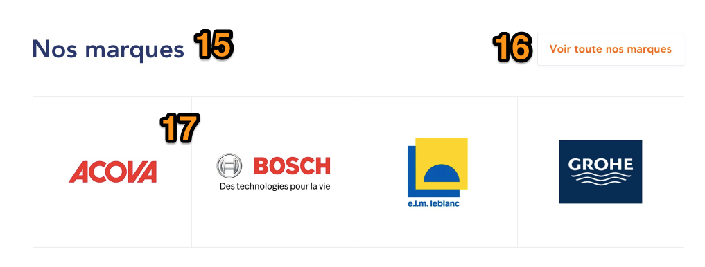

Contributor can select Brand nodes, using autocomplete (node reference
to Brand CT). Amount of items is not limited.

`15.`  **Block title** : configurable from BO

`16.`  **“Voir toute la gamme” link** : on-click, redirects to the [*Brands
      Landing Page*](#brand-landing-page). Label is translatable from
      Translate Interface

`17.`  **Brand item** : display logo. On-click, redirects user to the
      corresponding Brand detail page.

#### Category tree block 


Items 23. and 24. are automatically retrieved using the /menu service.
Current category’s levels 2 and 3 are displayed.

`22.` <del>**Block title** : “Toute la gamme” is a static string,
      translatable via Translate Interface. \[Sanitaire\] is category
      name of the current Category Landing Page. If Category Landing
      Color was defined, then use it here. If not, then use default site
      color.</del>  
 **@design** : Not to be used - delete it.

`23.` **Current category N+1 children items**. Order is defined as
      following  
1 - 2 - 3 - 4  
5 - 6 - 7 - 8  
Etc.  
On-click on each item, redirects to :  

-   corresponding Category Landing Page if defined

-   Products Listing page if no Category Landing page defined

`24.` **Current category N+2 children items**. On-click, redirects to :

-   Corresponding Category Landing Page if defined

-   Products Listing page if no Category Landing page defined

#### SEO Block 


`25.` **SEO text** : Decorated text

#### Category custom sliders 

  
*New design for category sliders*

  
*Hover effect on category sliders*

In BO, in /node/add/category, admins/contributors shall be able to
contribute as many Landing category sliders as wanted.

In desktop, a maximum of 7 slides will be displayed by default. No left
arrow to be displayed, when the slider is showing the first slide.

If there are more than 7 slides, an arrow will be displayed on the right
side of the slider. On click on the right arrow, display the next slide.
A left arrow will then appear on the left side of the slider, on click
on it, the slider will display the previous slide.

A hover effect is to be applied on the arrows.

Add a new paragraph : Carousel custom - Landing Catégorie


`26.` **Slider title**  
Not mandatory

For each slide, admins/contributors can contribute the following
elements. As many slides as wanted can be added :

`27.` **Image**  
Mandatory

`28.` **Slide link**  
 Mandatory. Admin/contributor can contribute a text and a link. They
 can choose if the link shall be open in the same tab or in a new one.  
 Hover effect : title is underlined and a shadow effect is to be applied.  
**@FEdesign :** contribution rule : height is 3 lines of text, as in
design. + … if contributed text is too long

`29.` **Tag**  
 Non mandatory.  
 Admin/contributors can contribute a tag.

`30.` **Tag background color**  
 Admin/contributors can choose a background color for the tag (color
 picker)  
 If a tag is filled, the chosen background color shall be displayed.

`31.` **Visibility block for the slider**  
 This slider is [*user-sensitive. A visibility
 block*](#visibility-block) will be displayed in BO. Admins and
 contributors can select for which roles content can be displayed on
 the website.  
If the checkbox is checked, the corresponding role will see the content.

### Products Listing page

**Settings **

| URL alias                    | Provided by service                                                                  |
|------------------------------|--------------------------------------------------------------------------------------|
| Breadcrumbs                  | [site:name] > [category N1 name] > [category N2 name] > … > [Current category name]  |
| Meta-title                   | Configurable from Back-office - can be overridden on node level                      |
| Meta-description             | Configurable from Back-office - can be overridden on node level                      |
| Translate Interface Context  | Listing Produits                                                                     |


**!!** Note that Reinsurance block and CTA block are NOT displayed on
the Products Listing page.

**Note** : A new param (nationalPlan) is available on the search
webservice ([*see how it works on search result page*](#search-results)
and **pt 14 on catalog filter)**. It provides info on the availability
of requested products on full catalog, so if :

-   nationalPlan= true =&gt; products are available in full catalog

-   nationalPlan=false =&gt; no products are available in full catalog

**Note** : Catalog filter can be :

-   Enabled/disabled so VAR, VI see it displayed or not in the page :
      see pt 14 below  
 Thus VA users do not see this filter, can not choose to switch from
 full catalogue to agency catalogue.

-   enable/disabled for ALL users in order to force the display of
     national catalogue/agency catalog for user (see search result
     page)  
 If enabled, VA user will see full catalog products.

 
*New design’s wireframes*

1.  **Breadcrumbs**  
 **@design** : to be displayed as currently on top of the facette
  block, aligned left.  
  @design : error : no breadcrumb to be displayed in mobile screens

2.  <del>**Color code** : displayed if a color was configured for main
     category (if so, then re-use color configured for main category) -
     else do not display </del>  
 **@design** : NOT to be displayed - delete field

3.  <del>**Background image** : retrieved from service. A semi-transparent
     layer is applied on top of the image. Layer color can be
     configured from back-office (using color picker). If service does
     not return any image for current category, then default image is
     used (default image is configurable from back-office).</del>  
 **@design** : NOT to be displayed - delete field

4.  **Category title**  
 **@design** : adjust place of display  
 **NEW SEO** : when a facet/filter is selected add the facet label to
  the H1 title. If more than one filters are chosen, add them all.

5.  **Results count**  
 Display the number of results found  
 Translatable string

  ```
  @Results Résultats
  ```  
   Context : Dans le listing produit  

  <del>**Product count** : *\[amount\] produits dans le rayon \[current
 category name\]*. Static string is translatable via Translate
 Interface. *\[current category name\]* is not clickable. If a color
 was configured for main category, apply it on *\[current category
 name\]* (re-use color configured for main category) - else display
 *\[current category name\]* with no special color applied. **!! not
 displayed on front-end**</del>  
 **@design** : adjust place of display

`6.`  **Category description** : retrieved from service. Can also be
     overridden on node level, see [*related section*](#seo-features)
     for details.  
By default display the beginning of the category description + … + Link
for collapse/expand the wording  
Label is translatable :

-   Collapse mode : Lire la suite (Read more)

-   Expanded mode : Voir moins (See less)

  
*Wireframe for new behaviour : collapsed*

  
*Wireframe for new behaviour : expanded*


`7.`  **Amount of results displayed** : by default, 24 results are
     displayed per page. Other available options : 48 / 96. Selecting a
     value reloads page, with corresponding results displayed.  
 **@design** : adjust place of display  
 Label (translatable string): Produits par page (instead of “Afficher”)  
 Placeholder : the number of results displayed

`8.`  **Sorting** : by default, products are shown as retrieved via the
     web service. Default item is Pertinence (translatable via
     Translate Interface). Other available options : Du moins cher au
     plus cher (“from less expensive to most expensive”), Du plus cher
     au moins cher (“From most expensive to less expensive”)  
Labels are translatable from Translate Interface.  
 **@design** : adjust place of display  
Service used is /search/articles, where we pass as parameters :

-   Pertinence : /search/articles as used to generate the Listing page
     (no specific parameter)

-   Du moins cher au plus cher : *publicPrice,asc*

-   Du plus cher au moins cher : *publicPrice,desca*  
  
*Sample Call*:
[*http://ingress.ibm.ppr.docker4sg.saint-gobain.net:42090/impulse-search-query/api/v1/search?websiteId=cedeo&agencyId=1002&query=sanitaire&page=0&size=20&sort=publicPrice%2Cdesc*](http://ingress.ibm.ppr.docker4sg.saint-gobain.net:12090/impulse-search-query/api/v1/search?websiteId=cedeo&agencyId=1002&query=sanitaire&page=0&size=20&sort=publicPrice%2Cdesc)  
  
**@design for mobile**

Amount of results displaying (7) and sorting (8) blocks are displayed in
a common CTA.

CTA Label is translatable (1) : Trier & Filtrer


On click on the CTA, the user has access to the page with these elements
displayed one on top of the other.

1.  Translatable CTA : Trier & Filtrer

A.  Display the sorting (8) and the amount of results displayed (7)

B.  Display available facets (as currently)


`9.`  **Categories filter** : see details in the [*corresponding
     section*](#categories-filter)  
See also corresponding [*section for type
management.*](#facets-management-by-type)

  
*Wireframe for new behaviour*

`10.`  **Selected facets** : when a facet is selected, then it is added to
     this block. Clicking on Cross icon removes the facet (page reloads
     to show corresponding results). Clicking on “<del>Tout</del> Effacer”
     (“clear”) **(10.3)** unselects all facets at once. Label is
     translatable from Translate Interface (Filtres)  
<del>Design : Facet label must be displayed (in bold) before value, for
example : **Couleur :** Gris acier</del>  
**Error** : do not display labels before value.

* **10.1**. **By default, fully displayed facets**  
	 Desktop : A maximum of 2 selected facets will be displayed fully by
	 default.  
	 Mobile : A maximum of 1 selected facets will be displayed fully by
	default.

* **10.2**. **Number bubble**  
	Desktop: If more than 2 facets are selected, then display a “+Number”
	 bubble, where Number is the number of selected facets that exceeds the
	 maximum of 2.  
	 Example :
	*  if 3 facets are selected : display fully 2, add a +1 bubble

	* if 4 facets are selected : display fully 2, add a +2 bubble  
	 Mobile : if more than 1 facet is selected, then display a “+Number”
	 bubble where Number is the number of selected facets that exceeds the
	 maximum of 1.

* **10.4. Other selected facets**  
	 On click, on the Number bubble, display hidden selected facets. If two
	 many are to be displayed, display them in several lines.

* **10.5 Collapse CTA**  
	On click on this bubble, hide exceeding selected facets, so only 2
	facets are fully displayed.  
	Translatable label : Réduire (“reduce”)

`11.`  **Facets** : retrieved from service.  
See also corresponding [*section for type
management.*](#facets-management-by-type)  
 Selecting a facet reloads page and shows corresponding results  
 **@design** : facets can be folded or unfolded. To close them, user
 has to click on the arrow of each facet (no automatic closing)  
 <del>ALL facets are displayed unfolded by default.</del> In BO, in Settings
 overrides &gt; Recherche &gt; Nombre de filtres dépliés par défaut ;
 the contributor can choose the number of unfolded facets to be
 displayed on page reload.  
 By default the value =3  
  
 This rule will apply to the first x facets displayed in the page.
 (Note : national catalogue radio button, availability toggle and
 categories menu are NOT concerned by this setting)  
 Also note that filters with selected facets will ALSO by default
 unfolded

By default, for filtered pages :

-   Add a &lt;meta name="robots" content="noindex, nofollow"&gt; so they
    > can not be crawled. In BO, filters can be managed to be open to
    > [*crawls, see concerned section*](#filters-seo-management).

-   delete this meta : &lt;link rel=”canonical” href=”CURRENT\_URL”
    > /&gt;

**NEW** : For SEO reasons, all filters from facets shall have the
"data-white-navigation" attribute available in a HREF attribute.

**NEW** : update design of **availability facet**. Display it underneath
the catalog filter (see pt 14) on top of the page <del>(thus do not display
it with other facets with a checkbox), ONLY as a toggle switcher.</del>
Display the filter following the [*filter management
behaviour.*](#facets-management-by-type)

**! Note** : Please note there might be more than one value available,
so more than one toggle switcher shall be displayed.

  
*Existing availability facet.*

  
*New design “toggle” mode*

**@design : error :** display the amount of products in (xx)- it is
missing in designs

`12.`  **Products**. For each display :

-   Image

-   Brand

-   Title

-   Site Reference / “Existe en plusieurs déclinaisons” if product has
     variants. See [*related section*](#pallets-management) for
     details.

-   Agreement to sell (retrieved via service). See details in [*related
     section*](#_gx4fa2m3uejc).

-   Price label : depending on role, Price label is different. Please
     refer to the [*corresponding section for
     details*](#labels-tax-information-management).

-   Price / tax info / unit. Regarding tax info, it is specific
     depending on role. Please [*refer to the corresponding section for
     details*](#prices-management).

-   “Nouveauté” tag : displayed if product ‘createdOn’ date is less than
     3 months (90 days), from current date. Label is translatable from
     Translate Interface.

-   Promo tag if product is flagged as promo

-   **NEW :** CTA

	-   for NotInAgencyProducts for users with an agency, a by default
         CTA will be hardcoded and displayed with the following
         elements

		-   color=&gt; primary color

		-   CTA label =&gt; Voir le produit (“see the product”)

		-   CTA =&gt; PRODUCT  
  
 On click on the CTA, user will got to the concerned PDP

#####  **Crossed prices for product boxes**

If a product has crossed prices, reuse the existing behaviour
implemented in PDP, [*see concerned section (pt a - crossed prices and
pt b - discount rate*](#product-page---right-sidebar)) and display them
as follows :

  
*Wireframes*

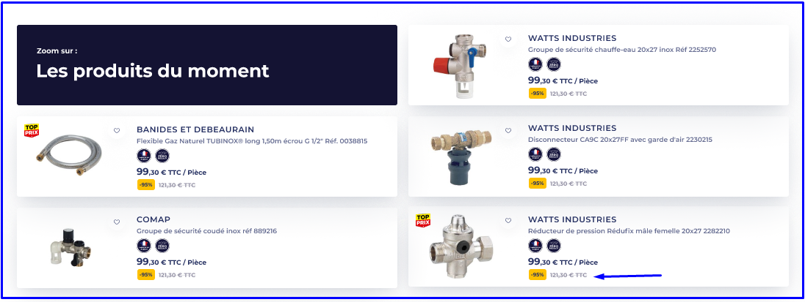  
*Wireframes*

`13.`  **Pagination** : current page is highlighted. See behavior in
      [*corresponding section*](#pagination)  
For paginated PLP pages :

-   Remove &lt;meta name="robots" content="noindex, follow"  
 For ex :
 https://rec.pointp.fr/c/blocs-parpaings-briques-beton-cellulaire/x3snv3\_dig\_2002742/page-2

-   Add a canonical tag on itself for each paginated pages.  
 For ex : &lt;link rel="canonical"
 href="https://rec.pointp.fr/c/blocs-parpaings-briques-beton-cellulaire/x3snv3\_dig\_2002742/page-2"
 /&gt;

-   Add tag rel=« next/ prev» on each paginated pages.

	-   The first page contains only rel="next" (not rel="prev").

	-   From page 2 to penultimate contain rel="next" and rel="prev".

	-   The lase page contains only rel="prev" (not rel="next").

	-   If there is only 1 page there is neither.

	-   If there are only two pages we have only rel="next" for the
         first and rel="prev" for the second.

**NEW : Meta tag** :

token \[sg-common:category:page-number\] can be used in PLP category
pages meta data title. [*See display rules in related
section.*](#meta-tags)

`14.`  **Catalog filter**

A catalog filter shall be available for PLP pages for VAR, VI profiles.  
Contributor shall be able to enable/disable this filter in BO, :  
in /admin/config/sgdbf/config\_overrides - Recherche

-   If enabled : catalog filter is displayed AND full catalog is enabled
     by default so the user has access to the catalog of his agency AND
     to the national catalog

-   If disabled (by default) : catalogue filter is NOT displayed. The
     user only has access to the catalog of his agency (old
     implementation)

In this BO page, Contributor can also edit the ID of the availability
facets to be displayed as toggle switcher.

If enabled, a catalog filter will be displayed ON TOP of the filters
column :


**NEW** : For SEO reasons, all filters from facets shall have the
"data-white-navigation" attribute available in a HREF attribute.

1.  **Title**  
Translatable string  
  ```
  Catalogue produits
  ```    
Contexte : Listing Produits

`2.`  **Full catalog filter**  
Translatable string.  
When selected, the user will have access to the full catalog of products
of the brand, not only to the one of the user’s agency.  

  ```
  Tout le catalogue @site-name
  ```  
Contexte : Listing Produits

Call to /api/v1/search/articles with agencyId, website Id and new param
=&gt; nationalPlan = true

**Design :** the number of products available (xx) can not be displayed
if not provided by webservice.  
**Note** : for NotInAgencyProducts a hardcoded CTa is displayed, [*see
pt 12. Products &gt; CTA*](#products-listing-page).

`3.`  **Agency catalog filter**  
Translatable string.  
When selected, the user will have access to the catalog of products of
his agency ONLY (old implementation).

  ```
  Catalogue de mon agence
  ```  
Contexte : Listing Produits

Call to /api/v1/search/articles with agencyId, website Id and new param
=&gt; nationalPlan = false  
**Note** : the user should be able to switch from one filter to the
other.

`4.`  **Agency name**  
Display the agency name of the user  
Display a [*“change agency” CTA*](#change-agency-logic). On click, the
“change agency” pop-up will open.  
Label is translatable : Changer d’agence  
**Note** : For products that are not in the agency of the user, please
reuse the existing display for product box


#### Categories filter 

Categories filter always shows the full branch of a category. For
example, if page is category level 3, then its corresponding level 2 and
level 1 will be shown. Children levels are also shown (if exist).\
\
Let’s consider the Sanitaire category for example :

Sanitaire

-   Bain

	-   Baignoires

		-   Baignoires acier

		-   Baignoires acrylique et tabliers

		-   Baignoires fonte

	-   Habillages de Baignoires

	-   Pare-bains

If user is on category Bain, he will then see :


Symbol “-” is displayed next to category if already expanded (for
parents + current category if current category is not the last level)

Symbol “+” for children categories if they are not on last level)

Symbol “&gt;” for categories with no children

Please refer to [*https://www.cedeo.fr/*](https://www.cedeo.fr/) for
additional examples.

**Note** : on click, the user is redirected to each category page
(node).

#### Facets management by type

To be applied to all Pages using facets :

-   PLP

-   PLP category + brand

-   PLP brand

-   Search

-   agency promotion

**Note** : for mini catalogue advance, [*please see the concerned
section*](#page-content-and-facets).

Facet’s display and facet’s label is managed by data sent by the
SearchResultsDto:

-   Key “name” : data for the label to be displayed in FE

-   Key “Display type” : data for the type of display to be implemented  
 There are several types of display possible (see list below)

Facet’s existing behaviour remains, see [*concerned section PLP pt 11.
facets.*](#products-listing-page)
```
"filters": \[

{

"id": "Top/classproperties/catalogue\_xml/dispo\_jx",

"name": "Disponibilité",

"displayType": "toggle",

"count": 0,

"refinementPolicy": "exclusive",

"values": \[\]
```

**NOTE** :

-   SG is responsible for the consistency between the choice of display
     and the data provided for the facets.

-   [*full catalogue filter*](#products-listing-page) is not concerned
     by this behaviour.

-   There is no data preservation


-   **List**  
 It is the by-default value.  
 If displaytype is null or empty then display a list of checkboxes.  
 The user can check one or several checkboxes. After the user has  
 checked a checkbox, the page is reloaded and filtered.  


-   **Radio button**  
 If displaytype is =radio then display radio buttons.  
 The user can ONLY choose one. After the user has chosen a radio
 button, the page is reloaded and filtered.  
 The user can uncheck the radio buttons’ facets by removing selected
 facets from the selected facet’s block.  
 **@design** : reuse existing design

-   **Toggle**  
 If displaytype is toggle then display a list of toggle switchers.  
 The user can enable several switchers. After the user has enabled a
 switcher, the page is reloaded and filtered.


-   **Search**  
 If displaytype is search then display a search widget underneath the
 facet label. All available facets are displayed in checkboxes.  
 Placeholder is translatable : Recherche


When the user starts typing, after 1 char, apply the search and only
display facets that match the search.


 Once the user has checked the checkbox of a facet, reload the page and
 filter it accordingly. As the page is reload, search data is not
 preserved and all available facets are displayed.

**@design** : add a “x” so the user can delete the search

**In MOBILE**, search field will be displayed in the facets layer


-   **Range**  
 If displaytype is range then display a range widget underneath the
 facet label.  
 Placeholders are translatable :

	-   Min

	-   Max
  
 By default range is empty (**error in design** : do not display min=0
 Max=0) and all facets are displayed with unchecked checkboxes.

 **Note** : WS provide strings and not values, in order for Drupal to
 process them as values and apply the range behaviour, some rules are
 agreed on the format of the strings:

-   Value espace mesure : 10 mm, 102 cm 103,5 cm -&gt; 103.5
     data-search-value=”103.5”

-   Numeric values shall be not separated by a espace : ex : 1023

-   “.” : if “,” is used then drupal will convert it into a “.”

-   Drupal does not process the units of measure

 Once the user enters a min or a max value, apply the range behaviour
 (with min or max values included in the range) and filter available
 facets, so only the ones compliant with the range are displayed.

 If the user enters a min AND a max value, apply some FE validation to
 make sure that the max value is bigger than the min value, if not
 display a red border color on min and max fields.

   
 **Error in design** : do not display 0 and do not display units of
 measure.

 The user will be able to check a checkbox and choose a facet. Page
 will be reloaded and filtered accordingly. Min/max rage will be empty.


**In MOBILE**, range field will be displayed in the facets layer


-   **Category**  
 Do not take into account displaytype=category, apply category facet’s
 existing behaviour for PLP, see [*concerned section Category
 facet*](#categories-filter) and for [*search.*](#search-results)


#### SEO features

From back-office, Contributor can enhance each Product Listing page as
following :

**!!** Note that Category title (retrieved from service and displayed on
front-end) can’t be overridden from back-office.

***Meta Tags :*** [*see also related section*](#meta-tags)

-   **Meta-title** : by default, meta-title pattern is managed from
     ../admin/content/metatag\_settings. It can be overridden on
     Category node level.

-   **Meta-description** : by default, meta-description pattern is
     managed from ../admin/content/metatag\_settings. It can be
     overridden on Category node level.

***Description(s) : ***

-   Category description (displayed on page banner) is retrieved from
     service side. It can be overridden on Category node level.

-   Category SEO text can only be contributed from back-office, on node
     level. It uses the Advanced decorated text CKEditor profile. A
     setting allows to define its display (per node) among 2 positions
     :

	-   On the left, below filters

	-   At the bottom of the page

See screenshots below regarding Category SEO text displaying :

  
*Option 1 : on the left, below filters*

  
*Option 2 : at the bottom, below pagination*

#### Categories SEO entities dashboard

In order to ease administration of those entities, a dedicated dashboard
will present general status of contribution.

Dashboard will look like this (**!!** columns presented on the wireframe
are not accurate, please refer to final columns list below).

It is accessible in BO in /admin/structure/eck &gt; categorie produits


1.  **Add a new item** : on-click, opens next form :
     ../admin/content/categories\_seo/add/categories

2.  **Table columns**, composed of :

	-   ***Identifiant (ID)*** (not sortable)

	-   Title (sortable). Label on front : ***Titre***

	-   Meta-title (not sortable). Label on front : ***Balise title***

	-   Meta-description (not sortable). Label on front : ***Meta
    	 description***

	-   ***Description SEO - gauche*** (not sortable)

	-   ***Description SEO - Pied de page*** (not sortable)

	-   Creation date (sortable). Label on front : ***Date création***.
    	 Format is DD/MM/YYYY

	-   Update date (sortable). Label on front : ***Dernière
    	 modification***. Format is DD/MM/YYYY

3.  **Modify button** : on-click, opens the corresponding Edit form

*Regarding icons :*

-   They apply on next columns only :

	-   Meta-title

	-   Meta-description

	-   Description SEO - gauche

	-   Description SEO - Pied de page

-   If field is not filled in BO, then the Red icon is displayed

-   If field is filled in BO, then the Green icon is displayed

-   <del>Both icons can be configured from back-office</del>

!! Note that dashboard must be ready to have filters, even if for first
implementation, only columns sorting is implemented.

**!!** A search field (with auto-complete) must be added on top of the
dashboard, to be able to search content by Categorie. This search field
must point to the ***Catégorie*** field :


#### Filtered categories SEO entities dashboard

Following the dashboard already implemented [*for category
pages*](#categories-seo-entities-dashboard), in BO, contributor can
override metatags for filtered PLP category pages : /admin/structure/eck
&gt; Catégories produits filtrées

**Note** : to be applied ONLY for PLP pages and not for all the others
PLP.


1.  **Add a new item** : on-click, contributor can add a new filtered
     PLP to be contributed  
In this form, the contributor must be able to contribute the URL of the
filtered PLP that he wants to override. This override shall NOT apply to
the non filtered concerned category page.

2.  **Table columns**, composed of :

	-   ***Identifiant (ID)*** (not sortable)

	-   Title (sortable). Label on front : ***Titre***

	-   Meta-title (not sortable). Label on front : ***Balise title***

	-   H1 (not sortable). Label on front : ***Balise*** ***H1***

	-   Creation date (sortable). Label on front : ***Date création***.
     Format is DD/MM/YYYY

	-   Update date (sortable). Label on front : ***Dernière
    	 modification***. Format is DD/MM/YYYY

3.  **Modify button** : on-click, opens the corresponding Edit form

As in the category dashboard, a category filter shall be implemented.

Apply the same icons logic for the dashboard as in the category
dashboard, for the following columns only :

-   Meta-title

-   H1.

#### Pushes on Product Listing pages

It is possible to configure Push items on :

-   Product Listing pages

-   Promotion pages (../promotions-agence and ../promotions-web)

These pushes are user profile-sensitive. In BO
[*visibility*](#visibility-block) role block is available for the
following roles :

/admin/structure/config\_pages/products\_settings/edit

**!!** **NOTE** : If some ESDB Pushes are already contributed in ESDB
config pages (/admin/structure/config\_pages/esdb\_settings/edit), they
take priority over the regular Pushes described in the current section.

There are 3 types of banners that can be added :

-   Product-box sized banner 1

-   Product-box sized banner 2

-   Horizontal banner

***Product-box sized banner 1 :***


1.  **Banner title :** a dedicated field allows to define the title to
     be displayed on the front-end. If not set, not displayed

2.  **Banner description** : plain text, configured on block level

3.  **Link (optional)** : label and link are configurable (with option
     Open in a new tab). Note that it is possible to define that Link
     Label will not be displayed on the front-end.

4.  **Background image** (Note that layer over the image is added via
     CSS (Brand color 1 is used))

**!!** A checkbox allows to enable / disable the layer over the image

**!!** A color picker allows to define the overlay color. If not set,
brand color 1 is used.

***Product-box sized banner 2 :***


1.  **Banner title :** a dedicated field allows to define the title to
     be displayed on the front-end. If not set, not displayed

2.  **Block description** : plain text, configured on block level

3.  **Link** (optional) : label and link are configurable (with option
     Open in a new tab). Note that it is possible to define that Link
     Label will not be displayed on the front-end.

4.  **Image** : configured on block level

***Horizontal banner :***


1.  **Banner title :** a dedicated field allows to define the title to
     be displayed on the front-end. If not set, not displayed

2.  **Block description** : plain text, configured on block level

3.  **Link** (optional) : label and link are configurable (with option
     Open in a new tab). Note that it is possible to define that Link
     Label will not be displayed on the front-end.

4.  **Image** : configured on block level

In terms of configuration :

-   Contributor can add as many banners as he wants on a Product List
     Page

-   Contributor can define the position of each banner. For example :

	-   If Product-box sized banner is used, and Contributor defines its
         position as **4**, then Banner will be inserted after the 3rd
         Product Box (ignoring any potential banner placed before it)

	-   If Horizontal banner is used, and Contributor defines its
         position as **4**, then Banner will be inserted as row below
         the row that contains the 4th item

	-   **!!** As a result, it will shift alignment of Product boxes,
         and it is possible that last row of the page will not be
         complete

	-   **!!** If Early Birds block is used on the page, then its items
         are excluded from the position logic (position logic applies
         only to products retrieved from /search)

	-   **!!** Contributor can define a position between 1 and 24 (since
         24 is the minimum amount of items to be shown on the page).

	-   Banners are shown ONLY on the first page of the category

If some banner(s) are set for a category, then all its children
categories will inherit those banners (except if some specific banners
are configured for a child, in such case banners defined on Child
category level are displayed)

**New** : contributor can display a product push in more than one
category at the same time


### Category + Brand Listing page

**Settings **

| URL alias                    | ../c/[category:name]/[category:id]/[brand:name]                          |
|------------------------------|--------------------------------------------------------------------------|
| Breadcrumbs                  | [site:name] > [category level 1] > [category level 2] >… > [node:title]  |
| Meta-title                   | Configurable from back-office                                            |
| Meta-description             | Configurable from back-office                                            |
| Translate Interface Context  | Listing Produits                                                         |


This template allows to create a page that links a category with a
brand, and displays corresponding products. Template to be used is the
same as the Product Listing page. It is used to enhance SEO performance,
by creating internal linking leading to nodes of this dedicated Content
Type.

Note that a dedicated field will be used to enter Brand filter (in
addition to entityreference to Brand detail page) - it will be used for
Search service request purposes.

Note that Meta-title / Meta-description default patterns can be
overridden on node level.

<del>Also, URLs of these nodes must be indexed in a dedicated
***category-brands.xml*** sitemap. </del>

Category + Brand node URLs are added to default Drupal sitemap.

Sitemap XML specs are available in [*next*
*section*](https://docs.google.com/document/d/1R15VbDGLowWOT-O_SF3fs00EFGjNr2ZnNNYS2mzb-Xk/edit#heading=h.maayprw7hiv).

**!!** It should also be possible to define Early Birds carousel on the
node level. See [*related section*](#category-page-product-listing-page)
for details.

#### Front-end displaying 

  
*Old implementation*

 **Important! :** For new general behaviours/style, see [*PLP
 section*](#products-listing-page)

1.  **Breadcrumbs**

2.  <del>**Color code** : displayed if a color was configured for related
     level 1 category (if so, then re-use color configured for level 1
     category) - else do not display</del>  
  To be deleted as not used anymore

3.  <del>**Background image** : retrieved from service. A semi-transparent
     layer is applied on top of the image. Layer color can be
     configured from back-office (using color picker). If service does
     not return any image for current category, then default image is
     used (default image is configurable from back-office, same image
     as for Product Listing pages).</del>  
 For new general behaviour, see [*PLP section*](#products-listing-page)

4.  **Page title** : configured on node level  
 For new style, see [*PLP section*](#products-listing-page)

5.  **Product count** : not available

6.  **Page description** : configured on node level (decorated text)  
 For new general behaviour, see [*PLP section*](#products-listing-page)


`7.`  **Amount of results displaying** : by default, 24 results are
     displayed per page. Other available options : 48 / 96. Selecting a
     value reloads page, with corresponding results displayed.  
 For new style, see [*PLP section*](#products-listing-page)

`8.`  **Sorting** : by default, products are shown as retrieved via the
     web service. Default item is Pertinence (translatable via
     Translate Interface). Other available options : Du moins cher au
     plus cher (“from less expensive to most expensive”), Du plus cher
     au moins cher (“From most expensive to less expensive”)  
Labels are translatable from Translate Interface.  
For new style, see [*PLP section*](#products-listing-page)  
Service used is /search/articles, where we pass as parameters :

-   Pertinence : /search/articles as used to generate the Listing page
     (no specific parameter)

-   Du moins cher au plus cher : *publicPrice,asc*

-   Du plus cher au moins cher : *publicPrice,desc*

`9.`  **Categories filter** : see details in the [*corresponding
     section*](#categories-filter)

`10.`  **Selected facets** : <del>when a facet is selected, then it is added
     to this block. Clicking on Cross icon removes the facet (page
     reloads to show corresponding results). Clicking on “Tout effacer”
     (“clear all”) unselects all facets at once.</del> Label is
     translatable from Translate Interface  
For new style and behaviour, see [*PLP section*](#products-listing-page)

`11.`  **Brand facets** : Current Brand value is selected. Since Brand
     facets are multi-value, selecting an additional Brand will
     redirect User to the default Products Listing Page, with already
     selected filters as pre-defined (same as deselecting current Brand
     facet).  
For new behaviour, see [*PLP section*](#products-listing-page)

By default, for filtered pages :

-   Add a &lt;meta name="robots" content="noindex, nofollow"&gt; so they
     can not be crawled. In BO, filters can be managed to be open to
     [*crawls, see concerned section*](#filters-seo-management).

-   delete this meta : &lt;link rel=”canonical” href=”CURRENT\_URL”
     /&gt;

<del>**NEW** : For SEO reasons, all filters from facets shall have the
"data-white-navigation" attribute available in a HREF attribute.</del>

**NEW** : when a facet/filter is selected add the facet label to the H1
title. If more than one filters are chosen, add them all.

`12.`  **Facets** : retrieved from service. Selecting a facet reloads page
     and shows corresponding results  
For new behaviours, see [*PLP section*](#products-listing-page)

By default, filtered pages will have &lt;meta name="robots"
content="noindex, nofollow"&gt; so they can not be crawled. In BO,
filters can be managed to be open to [*crawls, see concerned
section*](#filters-seo-management).

<del>**NEW** : For SEO reasons, all filters from facets shall have the
"data-white-navigation" attribute available in a HREF attribute.</del>

**NEW** : when a facet/filter is selected add the facet label to the H1
title. If more than one filters are chosen, add them all.

**NEW** : update design of availability facet. Display it underneath the
catalog filter (see pt 14) on top of the page (thus do not display it
with other facets with a checkbox), ONLY as a toggle switcher

**! Note** : Please note there might be more than one value available,
so more than one toggle switcher shall be displayed.

  
*Existing availability facet.*

  
*New design “toggle” mode*

**@design : error :** display the amount of products in (xx)- it is
missing in designs

`13.`  **Product boxes**

`14.`  **Pagination** : current page is highlighted. See behavior in
     [*corresponding section*](#pagination).

`15.`  **SEO fields** : SEO texts can be contributed from back-office, on
     node level. It uses the Advanced decorated text CKEditor profile :

-   ***Field 1*** : On the left, below filters

-   ***Field 2*** : At the bottom of the page

See screenshots below regarding Category SEO text displaying :

  
*Option 1 : on the left, below filters*


*Option 2 : at the bottom, below pagination*

`16.`  **Catalogue filter**

See concerned section on PLP, [*catalogue filter (pt
14)*](#products-listing-page)


<del>**NEW** : For SEO reasons, all filters from facets shall have the
"data-white-navigation" attribute available in a HREF attribute.</del>

#### Internal linking - Product detail page

If a Category + Brand node exists for a Product detail page (meaning
that Products’s category / brand couple has a corresponding Category +
Brand node), then display next :


1.  Static label is translatable from Translate Interface. Base string :
     Catégorie  
 Link is automatically generated as following :

	-   Link label : use “Category + Brand” node title

	-   On-click, redirects to the corresponding node

#### Internal linking - Brand detail page

All Category + Brand nodes matching with current Brand are automatically
displayed the Brand detail page as following :


1.  **Block title** : translatable from Translate Interface. Base string
     : Top recherches

2.  **Category + Brand items** : added automatically (no specific
     sorting is required). Item label corresponds to node title.
     On-click, redirects User to corresponding node. On-mouse-over,
     Brand color 2 is used.

#### Filters’ SEO management

By default, filtered pages will have &lt;meta name="robots"
content="noindex, nofollow"&gt; so they can not be crawled.

In BO, in /admin/structure/config\_pages/site\_settings/edit &gt; SEO
settings

site admins can contribute which URLs used in PLP, PLP category+ brands
and search pages can be crawled by bots.

**Contrib Note** : use comma for separation. Be careful when
contributing URL as only contributed URl will be crawlable.

Whenever a URL is contributed in BO, ONLY this URL will be open to
crawls.

### Product detail page

**Settings **

| URL alias                    | Provided by service                                                         |
|------------------------------|-----------------------------------------------------------------------------|
| Breadcrumbs                  | [site:name] > [category N1 name] > [category N2 name] > … > [Product:name]  |
| Meta-title                   | Configurable from back-office                                               |
| Meta-description             | Configurable from back-office                                               |
| Translate Interface Context  | Produit detail                                                              |


#### Product page main part


1.  **Breadcrumbs**

2.  **Brand title** : not clickable

3.  **Product title**

4.  **Brand logo** : not clickable. Grey outline is added via CSS. Logo
     is retrieved from Drupal side.

5.  **Product references**. Display :

	-   Site reference. Label *Code \[site:name\]* is translatable.

	-   EAN code. Label *EAN* is translatable

In BO config page : /admin/config/sgdbf/config\_overrides in “paramètres
généraux” tab,

webmaster can choose to display or to hide the EAN code of a product.

Add a new tab. Label : Affichage du EAN

-   If true (by default) : display EAN

-   If false : hode EAN


-   Brand reference. Label *Ref. \[brand:name\]* is translatable

`6.`  Category link :  

 **!!** Below the *Category link*, if product has some Machines
 (Dispart case), then an anchor to the Machines block is displayed as
 following :


 Label *Voir les machines compatibles* is translatable. Amount of
 available machines is displayed between brackets ().

`7.`  **Variants Call to Action** : see [*related
     section*](#product-page-table) for details.

`8.`  **Legal logos** : clickable. Icons are retrieved via service from
     the ***mediaPictos*** field, ***code": "REF\_PICTO\_NF"***.

Note : only icons retrieved from webservice shall be clickable and
redirect towards a link that can be configurable in BO in
admin/structure/config\_pages/products\_settings/edit.

On click on the link, new page shall be open in a new tab.

Note that the ESDB logo can be displayed as the last position if the
product matches the condition (see [*related
section*](https://docs.google.com/document/d/1NE2eRXNbU4BfTyHM_3yglWRJYYytdvw6UFqmBmCxSGU/edit#heading=h.nh7mg2u5k9xk)).

`9.`  **Description section** : clicking on ***Voir plus*** is an anchor
     to the related section below on the page

`10.`  **Assets carousel** : see [*related section*](#_lzpullo1a7o2) for
     details

`11.`  **Sharing tool** : on-click, following layer opens. It then triggers
     the sharing on Pinterest / Facebook / Twitter / :mailto / Direct
     Link

  
See details in the [*corresponding section*](#social-medias-sharing).

`12.`  **Anchor to Documents section** : on-click, anchor to the
     [*Documents Download section*](#download-documents-block). Label
     *Télécharger les documents techniques* is translatable

`13.`  **F-Gaz block** : see [*related section*](#product-page) for details

`14.`  **Delivery options block** : see [*related
     section*](#deliveries-options-block) for details.

`15.`  **Right sidebar** : see [*related section*](#section-24) for details


`16.`  **Static string** : always displayed if current product has a
     stockSource = AGENCY. Translatable, base string :

  ```
  Contactez votre agence pour en savoir plus sur les modalités de commande
  ```

`17.`  **agencyAvailability string** : value is retrieved from
     /online-availability. String is displayed if :

-   stockSource AGENCY exists for current product **AND** stockSource
     AGENCY maxQuantity &gt; 0 **OR** stockSource AGENCY checkStock =
     FALSE

**!!** Note that this string can be replaced by the Stock email alert if
corresponding conditions are\
matched. See [*related section*](#stock-email-alert-on-product-page) for
details.

`18.`  **Product locator link** : on-click, opens the Product Locator
     feature. See [*corresponding section*](#section-26) for details.

`19.`  **ESDB Toolbox**, rendering with 1 item see [*related
     section*](https://docs.google.com/document/d/1NE2eRXNbU4BfTyHM_3yglWRJYYytdvw6UFqmBmCxSGU/edit#heading=h.8kmmhwru818)
     for details

`20.`  **ESDB Toolbox**, rendering with more than 1 item : see [*related
     section*](https://docs.google.com/document/d/1NE2eRXNbU4BfTyHM_3yglWRJYYytdvw6UFqmBmCxSGU/edit#heading=h.8kmmhwru818)
     for details

`21.`  **Marketing block**  
To be displayed underneath the “Add to cart” CTA.


 In BO, in /admin/structure/config\_pages/products\_settings/edit &gt;
 Opération marketing, contributor can edit a marketing block to be
 displayed in chosen PDP pages.


For each marketing block, the contributor can edit :

-   **Title** : optional text field. NOT displayed in FE

-   **Image** : mandatory

-   **Category list**. Optional.  
 The contributor can add as many product categories as wanted.

-   **Product list**. Optional  
 The contributor can add a csv file with a list of products in which
 the marketing block shall be displayed.  
 BE tell me the needed csv structure

**NOTE** :

-   IF category list AND product list is empty THEN the marketing block
     is displayed in ALL products.

-   IF category list OR product list is filled THEN the marketing block
     is displayed in concerned products

-   IF category list AND product list is filled THEN the marketing block
     is displayed in products from the chosen categories OR in products
     from the csv.


-   **URL field**. optional  
 If contributed, on click on the marketing block, the user will be
 redirected to the concerned page.  
 Contributor can choose to open this URL in same or new tab (checkbox).

-   **Visibility block**.  
 [*Add a visibility block so the*](#visibility-block) contributor can
 choose to which roles this block will be visible to.

-   **Scheduler**  
 The contributor can choose publication dates and time for this
 content, [*see concerned section.*](#content-scheduling)

**NOTE** : in BO, display this marketing block as PLP Pushes

In the case 2 marketing campaigns affect the same product, the marketing
block displayed on top of the list will be **priority** over the one
underneath it.


#### Product page second part


1.  **Sticky bar** : see details in the [*corresponding
     section*](#section-25)

2.  **Plus produit** : label is translatable from Translate Interface.
     Content is retrieved via service (/nation-wide)

3.  **Description** : label is translatable from Translate Interface.
     Content is retrieved via service (/nation-wide)\  
     **!!** *Plus produit* and *Description* blocks must be inverted !


`4.`  **Technical characteristics** : label is translatable from Translate
     Interface. Content is retrieved via service (/nation-wide)

`5.`  **Danger logos** : icons are retrieved via service. Icons are
     retrieved from the ***mediaPictos*** field, ***code":
     "REF\_PICTO\_DANGER"***

-   Logos URLs are generated same way as for Product images, see
     [*related section*](#_lzpullo1a7o2) for details. Size to be passed
     is “S” (example :
     [*https://www.cedeo.fr/asset/00/23/AST3000023-S.jpg*](https://www.cedeo.fr/asset/00/23/AST3000023-S.jpg))

-   **!!** Note that Picto label and tooltip should not be displayed,
     since they are not retrieved via the service

`6.`  **Usage advices** : not implemented, field does not exist on service
     side.


`7.`  **Documents block** : see [*related
     section*](#download-documents-block) for details


`8.`  **Content block title** : translatable via Translate Interface

`9.`  **Highlighted content** : see [*related
     section*](#edito-content-on-product-detail-page) for details

`10.`  **Content block** : see [*related
     section*](#edito-content-on-product-detail-page) for details


**!!** For products carousels on Product detail page, please refer to
the [*corresponding section*](#products-carousels-carousels-management).


1.  **Breadcrumbs**

2.  **Brand title** : not clickable

3.  **Product title**

4.  **Brand logo** : not clickable. Grey outline is added via CSS. Logo
     is retrieved from Drupal side.

5.  **New product flag** : displayed if product ‘createdOn’ date is less
     than 3 months, from current date. Label is translatable from
     Translate Interface.

6.  **Price label**. 2 displaying styles :

	-   ***With promotion*** :

		-   Text color uses Primary Brand color

		-   See [*related section*](#price-availability-per-profile) for
         Agency / Web promotions color management  


	-   ***Without promotion*** :

		-   Text color uses Primary Brand color


**!!** Note that Price label itself depends on User Role (see
[*corresponding section*](#labels-tax-information-management) for
details)

`7.`  **Product price**, composed of :

-   Price (decimals have a smaller font)

-   Tax info (HT / TTC depending on User role, see [*corresponding
     section*](#labels-tax-information-management) for details)

-   Unit (“Palette (variante de palettisation)”)

-   Legal Unit : display only if exists. String is built as following :

	-   Prix public par unité légale : \[ulPublicPrice\] € \[tax:type\]

	-   Static string is translatable from Translate Interface

	-   ulPublicPrice is taken either from ***htPrices*** or *ttPrices*
         depending on current User settings, and \[tax:type\] adjusts
         accordingly

	-   **!!** Note that Legal unit is displayed below ecotax string

-   Ecotax. A tooltip is displayed next to ecotax. On-mouse over,
     display :

   
 Note : “d’éco-part. DEEE” is translatable from Translate Interface.

`8.`  **Progressive prices block** : see [*corresponding
     section*](#progressive-prices) for details

`9.`  **Product references. Display** :

-   Site reference <del>- EAN code</del>

-   Brand reference

Note that labels are translatable from Translate Interface.

`10.`  **Legal logos** : not clickable. Icons are retrieved via service.
     Icons are retrieved from the ***mediaPictos*** field, ***code":
     "REF\_PICTO\_NF"***

-   Logos URLs are generated same way as for Product images, see
     [*related section*](#_lzpullo1a7o2) for details. Size to be passed
     is “S” (example :
     [*https://www.cedeo.fr/asset/00/01/AST3000001-S.jpg*](https://www.cedeo.fr/asset/00/01/AST3000001-S.jpg))

`11.`  **Promotion flag** : displayed if product is flagged as Promotion

`12.`  **Products current image** : see [*related section*](#_lzpullo1a7o2)
     for details. Note that if there is no image for the Product, then
     default image is used instead. Default image can be set from
     back-office.

`13.  **Assets carousel** : see [*related section*](#_lzpullo1a7o2) for
     details

`14.`  **Plus Produit section** : clicking on ***Voir plus*** is an anchor
     to the related section below on the page

`15.`  **Sub-section 1 title** : translatable from Translate Interface\
     **!!** Below the sub-section 1 title, next string is displayed :

-   ***\[stacQuantity\] \[ufUnit\]*** disponible(s) pour une commande en
     ligne

-   String must be displayed in green (green color is not configurable
     from BO)

-   Static string is translatable from Translate Interface

-   **!!** a setting in ***settings.inc*** allows to define if this
     string will be displayed or not (set to false by default) for VA /
     VAR profiles

-   **!!** another setting in ***settings.inc*** allows to define if
     this string will be displayed or not (set to false by default) for
     VI PRO / VI PART / VI CLI profiles

-   If ***stacQuantity*** = 0, NULL or negative, then the string is not
     displayed, even if the setting is set to true

`16.`  **Agreements to sell** : retrieved by service. See details in
     [*related section*](#_gx4fa2m3uejc)

`17.`  **Quantity input field** : There are 2 different states for the
     Quantity input field - it can be either simple Quantity input
     field, or [*Calculation tool*](#quantity-widget-calculation-tool).

`18.`  **Call to Action** : Label and Call to Action to display (active /
     disabled states) are retrieved via Service. See [*related
     section*](#_gx4fa2m3uejc) for details.

`19.`  **Variants Call to Action** : There are 2 different states for the
     Variants Call to Action. See [*corresponding
     section*](#pallets-management) for details.

`20.`  **Sharing tool** : on-click, following layer opens. It then triggers
     the sharing on Pinterest / Facebook / Twitter / :mailto / Direct
     Link


See details in the [*corresponding section*](#social-medias-sharing).

`21.`  **Add to wishlist** : on-click, opens the Add to Whishlist pop-up.
     See details in the [*corresponding section*](#section-26).

`22.`  **Anchor to Documents section** : on-click, anchor to the
     [*Documents Download section*](#download-documents-block).

`23.`  **F-Gaz block** : Displayed if Product is flagged as F-Gaz. F-Gaz
     text and logo are configurable from back-office. Please refer to
     the [*corresponding
     section*](#stock-availability-quantities-management) for
     additional details. Note that F-Gaz block is not displayed on
     current screenshot.

`24.`  **Sub-section 2 title** : translatable from Translate Interface.\
     Note that this string should NOT be displayed if the 2 next
     conditions are matched :

-   ***agencyAvailability*** from ***/online-availability*** service is
     empty

-   Email alert string is not displayed (see [*related
     specs*](#stock-email-alert-on-product-page) regarding conditions
     of this string displaying)

 if service /***online-availability*** &gt; ***agencyAvailability*** is
 filled, then display its value below the Sub-section 2 title. Use
 Brand Color 1 for this string on front-end. Loaded dynamically.

`25.`  **Stock availability** **/ Product locator link** :

-   Stock availability retrieved via service. See [*related
     section*](#_ciqhjrdgby9z) for details.

-   Products Locator link : on-click, opens the Product Locator feature.
     See [*corresponding section*](#section-26) for details.


`26.`  **Back to top button** : on-click, anchors to the top of the page
     (not displayed on current screenshot)

`27.`  **Sticky bar** : see details in the [*corresponding
     section*](#section-25)

`28.`  **Plus produit** : label is translatable from Translate Interface.
     Content is retrieved via service

`29.`  **Description** : label is translatable from Translate Interface.
     Content is retrieved via service


`30.`  **Technical characteristics** : label is translatable from Translate
     Interface. Content is retrieved via service

`31.`  **Danger logos** : icons are retrieved via service. Icons are
     retrieved from the ***mediaPictos*** field, ***code":
     "REF\_PICTO\_DANGER"***

-   Logos URLs are generated same way as for Product images, see
     [*related section*](#_lzpullo1a7o2) for details. Size to be passed
     is “S” (example :
     [*https://www.cedeo.fr/asset/00/23/AST3000023-S.jpg*](https://www.cedeo.fr/asset/00/23/AST3000023-S.jpg))

-   **!!** Note that Picto label and tooltip should not be displayed,
     since they are not retrieved via the service

`32.`  Usage advices : label is translatable from Translate Interface.
     Content is retrieved via service


`33.`  **Documents block** : see [*related
     section*](#download-documents-block) for details


`34.`  **Content block title** : translatable via Translate Interface

`35.`  **Highlighted content** : see [*related
     section*](#edito-content-on-product-detail-page) for details

`36.`  **Content block** : see [*related
     section*](#edito-content-on-product-detail-page) for details

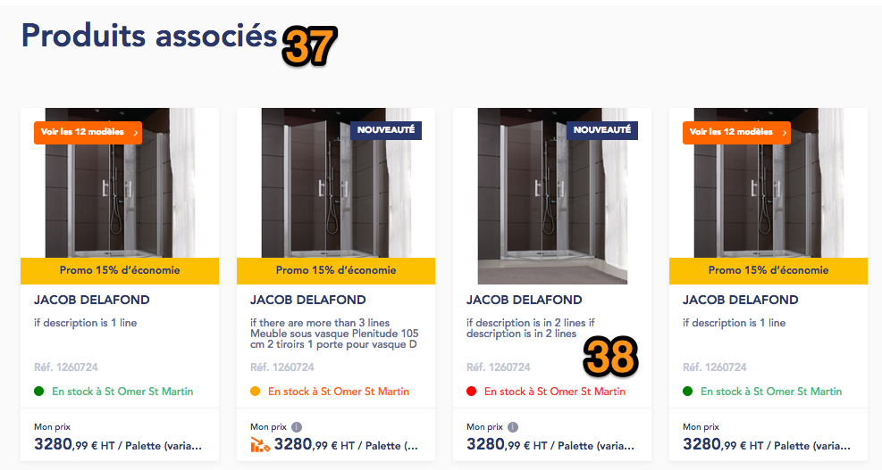

`37.`  <del>**Related products block title** : translatable from Translate
     Interface. Not displayed if no related products for current
     product. </del>

`38.`  <del>**Related products** : display COMPLEMENTARY products. Prices /
     tax labels are specific to Users. There can be up to 4 products
     displayed maximum. If service returns more than 4 products, only
     the 4 first are displayed. </del>

**!!** For products carousels on Product detail page, please refer to
the [*corresponding section*](#products-carousels-carousels-management).

#### Deliveries options block


1.  **Click & Collect block title**, composed of :

	-   Icon (SVG, configurable from back-office)

	-   *RETRAIT GRATUIT* static string, translatable

	-   *En agence* static string, translatable

2.  **Click & Collect data**, composed of 2 parts :

	-   Cut off data (*Dans 2h, J+1*)

	-   Descriptions (*Retrait gratuit en agence, Retrait gratuit dès le
     lendemain…*)

3.  **Click & Delivery block title**, composed of :

	-   Icon (SVG, configurable from back-office)

	-   *LIVRAISON* static string, translatable

	-   *à l’adresse de votre choix* static string, translatable

4.  **Click & Delivery data**, composed of 2 parts :

	-   Cut off data (*Dans 2h, J+1*)

	-   Descriptions (*Retrait gratuit en agence, Retrait gratuit dès le
     lendemain…*)

Rule to to retrieve Cut off and Description data is next (applies for
both C&C and C&D) :

-   For each stockSource, check deliveries object with type “E” for
     Click & Collect, and with type “L” for Click & Delivery

1.  Get cutoffs info. There can be several objects in the cutoffs array,
     only use the 1st one.

2.  Cutoffs can be expressed in Days or Hours. There are different
     front-end descriptions depending on the type :

	-   If 1st available cutoff = ***availableInDays***, then string is
     built as *J + \[availableInDays\]* (translatable)

	-   If 1st available cutoff = ***availableInHour***, then string is
     built as *Dans \[availableInHour:value\]h* (translatable), with a
     yellow background

		-   !! Special rule : if ***availableInHour*** value is NOT an
         integer, then :

			-   Replace cutoff string by a static string (translatable).
             Base string : *Disponible*

			-   Keep the yellow background

3.  On the front-end, display first the cutoffs = ***availableInHour***
     (sorting is done on Drupal side) (Business-wise it will correspond
     to the AGENCY stockSource only).

4.  Then, display next to each cutoff the corresponding
     ***checkoutDescription***

<del>As a result, sorting is next :</del>

-   <del>Cutoffs = availableInHour in first position. If several, order
     them using logisticsSettings.order (from lowest to highest
     value)</del>

-   <del>Cutoffs = availableInDays below. If several, order them using
     logisticsSettings.order (from lowest to highest value)</del>

**!!** Except for AGENCY stockSource, use only the highest priority
agreement per delivery type (E/L). As a result, there can be only 2
items maximum per delivery type displayed on front :

-   Find the *stockSource* with the highest priority order then get the
     first *checkoutDescription* using the *operator* with the highest
     priority order.

-   If no *checkoutDescription* is found in any of the *operators*, then
    > move to the next *stockSource*

***Example :***

Based on next JSON, please see below the front-end rendering :


1.  **Click & Collect Cut-off 1**, taken from AGENCY stockSource.
     Displayed as first position since cutoff is expressed in
     availableInHour

2.  **Click & Collect checkoutDescription 1**, corresponding to the
     AGENCY stockSource cut-off

3.  **Click & Collect Cut-off 2**, taken from STAC stockSource.
     Displayed as 2nd position since cutoff is expressed in
     availableInDays

4.  **Click & Collect checkoutDescription 2**, corresponding to the STAC
     stockSource cut-off

5.  **Click & Delivery Cut-off 1**, taken from STAC stockSource.

6.  **Click & Delivery checkoutDescription 1**, corresponding to the
     AGENCY stockSource cut-off

***Specific cases :***

If for a deliveryType (“E” or “L”), there is no checkoutDescription /
cutoff, then there is a fallback that displays the ***salesAgreement***
string for the corresponding deliveryType.

**!!** Note that if we have for example next case :

-   We detect 2 lines to be displayed on C&C, 1st one has a cutoff and a
     checkoutDescription, but 2nd one has missing cutoff or missing
     checkoutDescription

-   THEN display only the 1st line

For example :

-   For Click & Delivery (type = “L”), there is no checkoutDescription
     among all the stockSources, then display
     ***salesAgreement.delivery*** string

-   For Click & Collect (type = “E”), there is no checkoutDescription
     among all the stockSources, then display
     ***salesAgreement.collect*** string

```
  "salesAgreement": {
  
  "collect": "Retrait - délai à confirmer par votre agence.",
  
  "delivery": "Livraison - délai à confirmer par votre agence."
```


**!!** Note that potentially, you can have one of the blocks filled with
Cutoffs + checkoutDescriptions, and the other one with salesAgreement
string.

**!!** Special additional rule : if **/online-availability** sends back
1 single stockSource = AGENCY OR (stockSource = STAC AND
stacAvailability = V || null) , and its corresponding maxQuantity =
999999, THEN :

-   Display salesAgreement string (for both collect and delivery)
     instead of the cutoff + checkoutDescription combination

Finally, if logisticsSettings is empty or if there is no delivery method
(for example, no Click and Collect object in any of the stockSources),
**AND User is != VA**, then fallback is next :

  
*This screenshot shows when there is no delivery method type = L in any
of the stockSources*

-   Block background is greyed

-   Top bar is greyed

-   Static string is displayed (translatable) :

	-   For Click & Collect : *Merci de contacter votre agence pour
         connaître les modalités de retrait*

	-   For Click & Delivery : *Merci de contacter votre agence pour
         connaître les modalités de livraison*

If logisticsSettings is empty or if there is no delivery method (for
example, no Click and Collect object in any of the stockSources), **AND
User is VA**, then fallback is next :

-   Block background is NOT greyed

-   Top bar is displayed in Green

-   Static string is displayed (translatable) :

Note : 2 independent static strings shall be implemented, one for C&C
and another one for C&D

-   For Click & Collect : *Merci de vous rattacher à une agence pour
     connaître la disponibilité de ce produit*

-   For Click & Delivery : *Merci de vous rattacher à une agence pour
     connaître la disponibilité de ce produit*

#### Product page - Right sidebar


**!!** From back-office, it is possible to configure background colors
of next parts :

-   Regular Add to Cart part (in grey on screenshot)

-   Extra stockSource part (in yellow on screenshot)

If not configured from BO, then default colors from HTML are applied.

1.  **Product price**, composed of :

	-   Price (decimals have smaller font)

	-   Tax info (HT / TTC depending on User role, see [*corresponding
     section*](#labels-tax-information-management) for details)

	-   Unit (“Palette (variante de palettisation)”)

**!!** Missing on screenshot :

If product is flagged as *Promotion*, then crossed price is displayed,
as well as the discount rate :


a.  **Crossed price** : use *promotion.htCrossedPrice*

b.  **Discount rate** : calculated on Drupal side as following : 100 -
     (*htPrices.unitPrice* \* 100 / *promotion.htCrossedPrice*).
     Regarding background color, use the same as the one set for the
     *Promotion* label. Value is then rounded to the closest integer
     (i.e., if calculation = 65,9, display 66%. If calculation = 65,4,
     then display 65%).

**Note** : Crossed prices are also [*displayed in product boxes, see
concerned section.*](#crossed-prices-for-product-boxes)

`2.`  **Price label** : 2 displaying styles :

-   ***With promotion*** :

	-   Text color uses Primary Brand color

	-   See [*related section*](#price-availability-per-profile) for
         Agency / Web promotions color management


-   ***Without promotion*** :

	-   Text color uses Primary Brand color


**!!** Note that Price label itself depends on User Role (see
[*corresponding section*](#labels-tax-information-management) for
details)

`3.`  **Ecotax**. A tooltip is displayed next to ecotax. On-mouse over,
     display :

 

 Eco-tax management is described in the [*corresponding
 section*](#eco-tax-management).

`4.`  **Public price** : displayed for CLI only, if different from main
     price

`5.`  PALLET TO COMPLETE

`6.`  See [*related section*](#supplyminquantity-rule) for details.

`7.`  **Quantity input field** : There are 2 different states for the
     Quantity input field - it can be either a simple Quantity input
     field, or [*Calculation*
     *tool*](#quantity-widget-calculation-tool).

`8.`  **Progressive prices CTA** : do not implement

`9.`  See [*related section*](#supplyminquantity-rule) for details.

`10.`  **Progressive prices block** : see [*corresponding
     section*](#progressive-prices) for details

`11.`  **Call to Action** : Label and Call to Action to display (active /
     disabled states) are retrieved via Service. See [*related
     section*](#_gx4fa2m3uejc) for details.

`12.`  **Extra stockSource string** : translatable from Translate
     Interface. Base string is composed of a variable : extra
     stockSource ***checkoutDescription*** of type ==’E’. If value is
     empty, do not display anything on FE

`13.` **Extra stockSource CTA** : see [*related
     section*](https://docs.google.com/document/d/1bGMLTLxbyCVW6XJ_HXqVtPKWevYrwtlzw5mcxUDcGr0/edit#heading=h.3aqmeg3ehwws)
     for details

`14.` **Pallets block** :

`15.` 

#### Assets carousel 


There can be several images and videos related to the product. In case
of several images / videos, they are displayed as thumbnails below the
current image. There are 4 thumbnails visible, and User can go left /
right using the arrows.

First asset displayed is the one from the ***mainImage*** object
(/nation-wide).

Then, items from the ***images*** object with description = *Etiquette
Energetique, Etiquette énergie, Etiquette énergétique* (sorted in the
order retrieved from service side). Finally other items are displayed
(sorted in the order retrieved from service side).

On desktop, mousing-over the image displays the Zoom feature as
following :


Note that this feature is not available on mobile.

Clicking on the image opens the Media pop-in :


Note that on pop-in, image is fully displayed (there is no Zoom feature
within the pop-in). It is then possible to switch to left / right using
either arrows or carousel dots. Pop-in size auto-adjusts based on Image
size.

Rule to retrieve images is the following :

-   Based on data received from service, image path is built on Drupal
     side

-   Each image placeholder on Drupal has an assigned size (S, M, L or
     XL). Goal is to retrieve only image with the correct format
     depending on image placeholder, instead of receiving images of all
     formats, and then choose the right one among them.

-   Image path is composed of base URL, parsed chars from mediaId,
     mediaId, placeholder size, and file extension.


-   Example :
     [*http://www.climplus.com/asset/02/07/AST990207-M.jpg*](http://www.climplus.com/asset/02/07/AST990207-M.jpg),
     where :

	-   [*http://www.climplus.com/asset/*](http://www.climplus.com/asset/)
         is base URL. Base URL is configurable from [*Site
         Settings*](https://docs.google.com/document/d/1h_MoWgOplD_t1-IRr5QRmr204zxuhdbq23KGJ4ZA5sg/edit#heading=h.vnnbt569nr4c)

	-   **02** are the 3rd and 4th chars starting from the end of
         mediaId

	-   **07** are the 1st and 2nd chars starting from the end mediaId

	-   **AST990207** is mediaId (retrieved from mediaId field)

	-   **M** is the placeholder size

	-   **.jpg** is the extension (correspondence of ***image/jpeg***
         value retrieved from mimeType field)


-   Regarding placeholders on the product page :

	-   Main Image : XL

	-   Images : S

	-   Zoomed image : XL


-   Finally, product name is used to generate image ALT text

Regarding videos, it is handled as following :

-   From *article.technicalCharacteristics*, check if some items have a
     ***URL\_VIDEO*** id.

	-   In such case, display video(s) in the thumbnails placed to the
         left of current image

-   Only YouTube links are supported

-   Regarding order, videos are placed below Product images in the
     thumbnails carousel

-   **!! *URL\_VIDEO*** item should NOT be displayed in the
     *technicalCharacteristics* block.

-   A “Play” icon is displayed over the thumbnails as on screenshot
     below.

-   On-click on the image, YouTube embed video player opens in the Media
     pop-in, and User can launch the video   

#### Sticky bar management 


Sticky bar is composed of 4 anchors maximum :

-   Infos produits : always displayed. Label is translatable from
     Translate Interface

-   Docs techniques : always displayed. Label is translatable from
     Translate Interface

-   Conseils : displaying is configurable from Back-office. Label is
     configurable from Back-office. disabled by default.

-   Autres produits : always displayed. Label is translatable from
     Translate Interface

If for one of the sections, there is no content, then the anchor is
greyed and not clickable.

On the right, price is shown as \[price\] € \[tax:type\] \[unit\].\
Price and tax type depend on User pricing configuration.

#### Download documents block


***Note that block outline uses the Brand secondary color. ***

1.  **Block title** : translatable from Translate Interface

2.  **Tout télécharger CTA (download all)** : on-click, generates a ZIP
     archive, containing all documents from the Download section.
     Archive must have sub-folders as following :

	-   Fiche produit : contains PDFs from point 3.

	-   Documents techniques : contains PDFs from point 4.

	-   : contains FDS / DOP / DOC documents (if exists).  
Note that if there is no documents for one of the sections, then
corresponding sub-folder is not created\
in the archive.  
Note that this button is not displayed on mobile responsive.  
Button label is translatable from Translate Interface.\
Note that when Drupal is not able to download some of the documents for
any reason, then a text file is
Added to archive instead of the document - and text file contains link
to target file.

3.  **Product page download** : on-click on an item, it gets downloaded
     (or opens in a new tab depending on browser). Those PDFs are
     generated on Drupal side. Variants are displayed depending on next
     rules :

	-   ***Without price*** is always available

	-   ***Public price*** is available if User’s price selection (in My
     account) is different from ***Hide prices***

	-   ***Customer price (“Mon prix”)*** is available if price selection =
     ***Customer price*** AND is different from ***Public price***

	-   Tax always matches User selection

Section title is translatable from Translate Interface. Links labels are
also translatable. See [*related\
section*](#labels-tax-information-management) for more details.

4.  **Technical documents download** : on-click on an item, it gets
     downloaded (or opens in a new tab depending on browser). Those
     PDFs are retrieved from Product service. path is built on Drupal
     side based on ***documentId*** as following :

	a.  File path is composed of base URL, parsed chars from documentId,
         documentId, and file extension.  
	Example :
[*https://www.cedeo.fr/asset/75/71/AST2157571.pdf*](https://www.cedeo.fr/asset/75/71/AST2157571.pdf),
where :

	b.  [*https://www.cedeo.fr/asset/*](https://www.cedeo.fr/asset/) is base
     URL. Base URL is configurable from Site Settings

	c.  **75** are the 3rd and 4th chars starting from the end of
     ***mediaId***

	d.  **71** are the 1st and 2nd chars starting from the end ***mediaId***

	e.  **AST2157571** is mediaId (retrieved from mediaId field)

	f.  **.pdf** is the extension (retrieved from mimeType field)

 Section title is translatable from Translate Interface. Section is not
 displayed if service returns no documents for current product.

5.  **DOP block title :** translatable from Translate Interface. Base
     string :

  ```
  D.O.P. (Déclaration of Performance)
  ```

6.  **DOP document** : retrieved from ***regulations*** object, if
     ***regulations.id*** = DOP

7.  **DOP description text** : displayed if there is a DOP document for
     current product. Description is configurable from Products
     Configuration Page (note that click on the link should open page
     in a new tab).

8.  **DOP technical characteristics** : composed of next elements :

-   DOP DOC № document chez fabricant:
     \[regulations.supplierDocumentNumber\]

-   DOP DOC ref de la norme et date: \[regulations.regulationReference\]

=&gt; Static strings are translatable from Translate Interface

=&gt; Strings are displayed only if there are values for
\[regulations.supplierDocumentNumber\] /

\[regulations.regulationReference\]

**!!** Note that points 5 / 6 / 7 / 8 are displayed ONLY if there is a
DOP document for current product.

9.  **DOC block title :** translatable from Translate Interface. Base
     string :

  ```
  D.O.C. (Déclaration of Conformity)
  ```

10.  **DOC document :** retrieved from retrieved from ***regulations***
     object, if ***regulations.id*** = DOC

11.  **DOC description text** : displayed if there is a DOC document for
     current product. Description is configurable from Products
     Configuration Page (note that click on the link should open page
     in a new tab).

**!!** Missing on screenshot :

**DOC technical characteristics** : composed of next elements :

-   DOC № document chez fabricant:
     \[regulations.supplierDocumentNumber\]

-   DOC ref de la norme et date: \[regulations.regulationReference\]

=&gt; Static strings are translatable from Translate Interface

=&gt; Strings are displayed only if there are values for
\[regulations.supplierDocumentNumber\] /

\[regulations.regulationReference\]

**!!** Note that points ***9 / 10 /11 / DOC technical characteristics***
are displayed ONLY if there is a DOC document for current product.

12.  **FDS block title :** translatable from Translate Interface. Base
     string :

  ```
  Fiche de Données de Sécurité (FDS)
  ```

13.  **FDS document** : retrieved from retrieved from ***regulations***
     object, if ***regulations.id*** = FDS. Label on front-end is “FDS”
     (translatable from Translate Interface)

14.  **FDS description text** : displayed if there is an FDS document for
     current product. Description is configurable from Products
     Configuration Page (note that click on the link should open page
     in a new tab).

**!!** Missing on screenshot :

**FDS technical characteristics** : composed of next elements :

-   FDS № document chez fabricant:
     \[regulations.supplierDocumentNumber\]

-   FDS ref de la norme et date: \[regulations.regulationReference\]

=&gt; Static strings are translatable from Translate Interface

=&gt; Strings are displayed only if there are values for
\[regulations.supplierDocumentNumber\] /

\[regulations.regulationReference\]

**!!** Note that points ***12 / 13 / 14 / FDS technical
characteristics*** are displayed ONLY if there is an FDS document for
current product.

#### Product page PDF generation

From product page, it is possible to download page as a PDF, with or
without prices. Those PDFs are generated on Drupal side. Variants are
displayed depending on next rules :

-   ***Without price*** is always available

-   ***Public price*** is available if User’s price selection (in My
     account) is different from ***Hide prices***

-   ***Customer price (“Mon prix”)*** is available if price selection =
     ***Customer price*** AND is different from ***Public price***

-   Tax always matches User selection


1.  **Site logo**

2.  **Current agency info**, composed of :

	-   Agency name

	-   Tél: \[agency:phonenumber\]

3.  **Current date** : format is DD/MM/YYYY

4.  **Product title**

5.  **Product Brand**

6.  **Product main image**

7.  **Product references**, composed of :

	-   Code Produit. Value is product ID (!! Use “Code produit” as a label
     instead of “Code CEDEO”)

	-   Brand reference : Réf. \[brand:name\] : \[product:brand:reference\]

	-   EAN code

8.  **Price info,** composed of :

	-   Price label (specific to User, see [*related
     section*](#labels-tax-information-management) for details)


	-   Price (specific to User)

	-   Tax label (specific to User)  

=&gt; Price info is not displayed if User chooses to download “Product
page without price”

`9.`  **Eco-tax(es) info**, composed of :

	-   Eco-tax label retrieved from service

	-   Eco-tax price retrieved from service  

=&gt; Eco-tax info is not displayed if User chooses to download “Product
page without price”

=&gt; If several eco-taxes for a product, display them all following the
same pattern

=&gt; Tax label (“HT”) is NOT specific to User

`10.`  **Product description** : label is translatable from Translate
     Interface

`11.`  **Technical characteristics** : displayed as a table


`12.`  **DOP block**, composed of :

-   Block title

-   DOP description (retrieved from Products Settings page)

-   DOP pdf-specific text : “Elle est disponible sur le site \[site
     domain\] ou en suivant le code QR ci-contre avec votre téléphone
     portable”, where \[site domain\]
     (“[*http://www.cedeo.fr*](http://www.cedeo.fr)” for Cedeo) is
     clickable and a direct link to DOP PDF. Note that this text is not
     displayed on the Product page.

`13.`  **DOP QR code** : generated on Drupal side, URL is the one of the
     DOP PDF

`14.`  **DOP technical characteristics**

**14.Bis** : **!!** Missing on design : replicate Points 12 / 13 / 14
but for DOC document :

-   Block title (D.O.C. (Déclaration of Conformity))

-   DOC description (retrieved from Products settings page)

-   DOC pdf-specific text : “Elle est disponible sur le site \[site
     domain\] ou en suivant le code QR ci-contre avec votre téléphone
     portable”, where \[site domain\]
     (“[*http://www.cedeo.fr*](http://www.cedeo.fr)” for Cedeo) is
     clickable and a direct link to DOC PDF. Note that this text is not
     displayed on the Product page.

-   DOC QR code : generated on Drupal side, URL is the one of the DOC
     PDF

`15.`  **FDS block**, composed of :

-   Block title

-   FDS description (retrieved from Products Settings page)

-   FDS pdf-specific text : “Elle est disponible sur le site \[site
     domain\] ou en suivant le code QR ci-contre avec votre téléphone
     portable”, where \[site domain\]
     (“[*http://www.cedeo.fr*](http://www.cedeo.fr)” for Cedeo) is
     clickable and a direct link to FDS PDF. Note that this text is not
     displayed on the Product page.

`16.`  **FDS QR code** : generated on Drupal side, URL is the one of the
     FDS PDF


`17.`  **Other product image(s)**

`18.`  **Avantages produit block**, composed of :

-   Block title (same as the one displayed on product page)

-   Value : \[product:productAdvantage\]

`19`.  **Conseils d’utilisation block**, composed of :

-   Block title (same as the one displayed on product page)

-   Value : \[product:usage advices\]

#### Edito content on Product detail page

It is possible to link Edito content to Product detail pages. Adding
content to a Product page is made based on Products category. This means
that all products of the same category will have the same Edito content
displayed.\
As an example :

-   **Category Level 1** =&gt; Edito content is defined. It will also be
     displayed for all its children, except if some specific content
     added for one of the children

	-   **Category Level 2** =&gt; no specific content defined, so
         content from parent Level 1 is displayed

	-   **Category Level 2** =&gt; Specific content is defined, so it
         displays instead of Content from parent Level 1

		-   **Category Level 3** : no specific content is defined, so
             content from parent Level 2 is displayed

	-   **Category Level 2** : =&gt; no specific content defined, so
         content from parent Level 1 is displayed


1.  **Block title** : translatable from Translate Interface. Not
     displayed if no Edito content available for current product

2.  **Highlighted Edito content** : not displayed if not filled in
     back-office. Composed of :

	-   Image

	-   Category : optional, free text (corresponds to “Contrat pro” on
     screenshot)

		-   **!!** Background color of the category can be managed as
         following : if not set, Brand color 1 applies. It is possible
         to override on block level.

	-   Description : plain text, contributed

	-   Link : URL and label are configurable (with option “open in a new
     tab”)

	-   Background color : if not set, Brand color 1 applies. It is possible
     to override on block level.

3.  **Secondary Edito conten**t : amount of items is not limited. Items
     are displayed in next order :  
1 - 2 - 3  
4 - 5 - 6  
Etc  
Each is composed of :

	-   Thumbnail

	-   Category : optional, free text (corresponds to “Conseils” on
     screenshot)

		-   **!!** Background color of the category can be managed as
         following : if not set, Brand color 1 applies. It is possible
         to override on block level.

	-   Title : text field, contributed

	-   Link : URL are configurable (with option “open in a new tab”)

**!!** Note that Video icon on thumbnail is a design mistake, there is
no ability to launch videos from here.

 

#### Products carousels carousels management

On product detail page, 2 areas are defined to display Products
Carousels :

-   Above sticky bar

-   Below Conseils & Services block

For each of those 2 areas, contributor should be able to add as many
carousels as he wants, and order them as he wants, among :

-   Early Birds (widget ID must then be specified in dedicated field)

-   **GET articles/{id}/related**, filtered on type = COMPLEMENTARY

-   **GET articles/{id}/related**, filtered on type = SIMILAR

-   **GET articles/{id}/related**, filtered on type = ASSOCIATED

-   **ESDB Related Ensembles :** see [*corresponding
     section*](https://docs.google.com/document/d/1NE2eRXNbU4BfTyHM_3yglWRJYYytdvw6UFqmBmCxSGU/edit#heading=h.sqfxulu6e4za)

If both Early Birds widget field and **GET articles/{id}/related** type
are set for a Carousel, then Early Birds gets the priority.

**!!** Notes :

-   If Early Birds widget ID is filled, and **GET
     articles/{id}/related** option is not selected from BO, then if
     Early Birds does not retrieve any products, corresponding carousel
     should be completely hidden on front-end.

-   If Early Birds widget ID is filled, and a **GET
     articles/{id}/related** option is also selected, then if Early
     Birds does not retrieve any product, a fallback is then triggered
     : articles from **GET articles/{id}/related** are displayed (in
     accordance to selected option - SIMILAR / COMPLEMENTARY /
     ASSOCIATED)

A title (optional) can be defined for each carousel.

Contributor can add as many Carousels as he wants, and configure each as
he wants, for each area.

Note that Carousels are not limited in amount of products to display,
all available matching products are shown.

Configuration set applies to all Product detail pages (it is not
possible to set different sets of Carousels per each product).

### Add product to Wishlist

From both Product List Page / Search results / Product carousels and
Product Detail Page / Cart page, users will add articles to their
wishlists hitting the icon placed at the upper-right corner of the
product image.

This icon has two states, highlighted or not depending on the presence /
absence of the article within at least one of the users’ wishlist(s).

-   If product is present in at least 1 of the User’s wishlists, heart
     icon is set as filled in.

-   If product is not present in any of the User’s wishlists, heart icon
     is set as not filled in (with borders only).

Note that Icon is configurable from back office (SVG) - ~~and filled in
color is not configurable from back-office~~.

In here : admin/structure/config\_pages/icons\_settings/edit (Icône
Favoris)

Custom colors for this icon can be contributed in
/admin/structure/config\_pages/products\_settings/edit in pictogram tab

-   Filled in color (1)  
 Label : Couleur de l’icône lorsqu’elle est active

-   Background color (2)  
 Label : Couleur de background

  
*Add to wishlist icon from Product detail page*

  
*Add to wishlist icon from product slider*

  
*Add to wishlist from Product Listing page / search results / carousels
/ cart*

Hitting the Heart icon while being logged-in will open a pop-in where
article information and users’ wishlists will be displayed. Users will
have the ability to create a new wishlist or to choose from existing
ones to add the article to ; they can also delete the article from a
wishlist on which it was added previously (if applicable).

VA or VAR users clicking the CTA will be redirected to the login page.
Once authenticated, they’ll get the product page back with the “Add to
wishlist” pop-in opened.

When opening pop-in, it looks like this :

#### Add to wishlist pop-up

  
 *Current pop-up*

  
*Client’s updated wireframes*

1.  **Pop-in title** : translatable from Translate Interface

2.  **Closing cross** : on-click, closes pop-in (same as clicking
     outside of the pop-in)

3.  **Product information**, composed of :

	-   Image (‘media’ field)

	-   Brand (‘brandName’ field)

	-   Title (‘name’)

	-   Reference (‘id’)

	-   <del>“Tarif par palette….” string : to NOT implement</del>

4.  **Create a new wishlist link** : see [*related
     section*](#create-a-new-wishlist) for details. Creating a new
     wishlist automatically adds the Product to this wishlist.

5.  **Existing wishlists names** : retrieved from GET /wishlists

6.  **Choose wishlist** : there are 2 cases :

	-   Product is not added to wishlist yet : show CTA with style 1, and
     label “Choisir”. On-click product is added to the corresponding
     wishlist. Wishlists unique identifier will be sent to service when
     users select one wishlist to link the article with. Service to be
     used : POST /wishlists/{id}/articles

	-   Product is already added to wishlist : show CTA with style 2, and
     label “Supprimer”. On-click product gets deleted from Wishlist

**!!** User can add / remove to / from several wishlists without having
to re-open pop-in each time.

 New elements to be added to the pop-up.  
 !! Design : reuse existing design and adapt new features.

`7.`  **Display Price :** same behaviour as in the “add to cart” feature.  
 *\[price\] par pièce.* Static string translatable via Translate
 Interface.

`8.`  **Quantity** : user can add more or less products  
 Same behaviour as in the “add to cart” feature.  
 *Quantité*. Static string translatable via Translate Interface.

`9.`  **Creation date :** display the date of creation of the wishlist  
*Créé le \[date\].* Static string translatable via Translate Interface.

`10.`  on-click product is added to the corresponding wishlist. Wishlists
     unique identifier will be sent to service when users select one
     wishlist to link the article with.  
Service to be used : POST /wishlists/{id}/articles

*Sample Call for Add to Wishlist* :

[*http://ingress.ibm.ppr.docker4sg.saint-gobain.net:12090/impulse-store-command/api/v1/wishlists/VI\_10013-1/articles?websiteId=cedeo&agencyId=1002&articlesId=3086681*](http://ingress.ibm.ppr.docker4sg.saint-gobain.net:12090/impulse-store-command/api/v1/wishlists/VI_10013-1/articles?websiteId=cedeo&agencyId=1002&articlesId=3086681)

Body parameters:

```
[
  {
    "articleId": "3846753",
    "articleQuantity": 1
  }
 ] 

```

Note that ‘articleQuantity” will always be set to ‘1”.

In case of success service will respond 200 “OK” and will include the
whole wishlist information.

If the service respond with a different status code than 200, an alert
will be displayed at the top of the pop-in : “Une erreur s’est produite
lors de l’ajout à votre liste. Merci de réessayer ultérieurement.”
(message is configurable from the back-office &gt; Errors management).


#### Create a new wishlist 

On-click on “Créer une nouvelle liste” (create a new list) link, pop-in
dynamically updates to the next state :


1.  **Label** : translatable from Translate Interface

2.  **Placeholder** : translatable from Translate Interface.  
 Default value : “Panier du @current\_date”

3.  **OK button** : on-click, triggers service POST /wishlists

*Sample Call*:

[*http://ingress.ibm.ppr.docker4sg.saint-gobain.net:42090/impulse-store-command/api/v1/wishlists?websiteId=cedeo*](http://ingress.ibm.ppr.docker4sg.saint-gobain.net:42090/impulse-store-command/api/v1/wishlists?websiteId=cedeo)

Body parameters:

```
{
  "agencyId": "1002",
  "name": "1_test_2_wishlist_3"
}

```

*Sample Response*:

```
{
 
   "id": "144d9207-1b2d-4681-a9d1-9ffbb834eacd",
 
   "accountId": "VI_3",
 
   "type": "CUSTOMER",
 
   "name": "1_test_2_wishlist_3",
 
   "items": null,
 
   "creationDate": "2018-08-29T14:48:28Z",
 
   "updateDate": "2018-08-29T14:48:28Z"
```

Once new wishlist is created, a second call is performed to add the
article to the wishlist : POST /wishlists/{id}/articles. The
confirmation pop-in is then shown.

### Social medias sharing

User can share Product detail page using various means :

-   Social medias (Pinterest, Facebook, Twitter)

-   Direct link copy

-   Share by email (mail:to)

Direct link and Share by email methods are always present. Social medias
(Pinterest / Facebook / Twitter) can be configured per site.

By default, sharing options are collapsed as following :


Icon is configurable from back-office (SVG), and label “Partager” is
translatable from Translate Interface.

Clicking on icon / label expands the sharing bar as following :

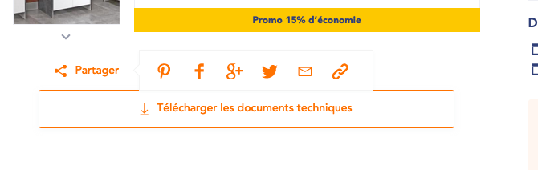

It contains next items :

-   Pinterest (if enabled in BO)

-   Facebook (if enabled in BO)

-   Google+ : out of scope

-   Twitter (if enabled in BO)

-   Email sharing : always present. Mailto: feature, on-click opens the
    > User mail client. Email topic and body are prefilled (see below)

 **NEW** : if the body of the page to be shared is longer than 1900
 caract, cut the body at 1900 caract, otherwise the sharing will not
 work.

 **Note :** webmaster can contribute the information to be shared and
 thus can add the URL of the page to be shared. He shall go to the
 config\_page of the concerned page

 For ex : for ESDB advice detail page :
 /admin/structure/config\_pages/section\_conseils\_esdb/edit

 For conseil detail page :
 /admin/structure/config\_pages/advice\_settings/edit

 For PDP : /admin/structure/config\_pages/products\_settings/edit

 

-   Copy direct link : always present. On-click, product page URL is
     copied to clipboard, and a message (translatable from Translate
     Interface) displays :

  ```
  Le lien de la page produit a été copié dans votre presse-papier.
  ```

Note that all icons (SVG) can be configured from back-office.

#### Email sharing

Clicking on email sharing icon opens User mail client (thanks to mailto:
feature). Email subject and body are pre-filled as following :

**Subject :**

  ```
  \[site:name\] -
  ```

**Body :**

  --
  --

Both are translatable from Translate Interface.

#### Social sharing integration

Clicking on Facebook / Pinterest / Twitter items (if enabled) opens
corresponding pop-in where user can login / submit post on his networks.

t is shared      | og:title      | Og:description      | Og:image      | og:url              | og:type |
|---------------------|---------------|---------------------|---------------|---------------------|---------|
| Product detail page | twitter:title | Twitter:description | twitter:image | Product detail page | article |


## **Product Locator**

**Translate Interface Context** : Disponibilite a proximite

Product Locator feature allows user to find a specific product in
agencies nearby, in case (for example) it is not available in his
current agency. It also allows to find similar products to the one he is
reviewing :

Depending on User role, Product Locator behavior differs.

A dedicated web service is used to retrieve data.


***First part of the pop-in shows agencies nearby that sell current
product :***

1.  **Product Locator pop-in title** : translatable from Translate
     Interface

2.  **Closing cross** : on-click, closes the pop-in. Clicking outside of
     the pop-in also closes it

3.  **Current product from which Product Locator is triggered**. Display
     :

	-   Product thumbnail

	-   Product Brand

	-   Product title (displayed on 1 line, trimmed if more than 1 line)

	-   Product ID (not present on screenshot)

4.  **Search bar label** : translatable from Translate Interface

5.  **Search bar** : Google Places (suggestions) and Google Places
     Search Box widgets are used. Behavior depends on User profile. See
     [*related sub-section*](#behaviors-depending-on-user-role) for
     details

6.  **Results label** : translatable from Translate Interface

7.  **Result**. For each, display :

	-   Agency Zip code

	-   Agency name

	-   Distance from searched location

	-   Opening hour (same logic on [*My agency
     pop-in*](#select-an-agency-pop-up-va-va-rattachement-to-an-agency))

8.  **Product info in result agency**. For each, display :

	-   Price and tax label (!! those are specific to User profile)

	-   Product unit

	-   Agreement to sell

9.  **Select button** : on-click, there are 2 behaviors :

	-   1\) **IF** User does not have products yet in his cart, or if all
     products from cart are available in agency User wants to select,
     **THEN** : Agency Switch confirmation message is shown, and
     “Sélectionner” button is dynamically switched to “Confirmer” button. If
     User clicks on “Confirmer”, current agency is switched to the selected
     one, and User is redirected to the Product page. Then, User can add the
     product to his cart.  
**!!** Product Locator service also sends back agency to which User is
currently linked to, so for that\
agency button “Sélectionner” must be hidden.  
Agency Switch confirmation message : “En sélectionnant cette agence,
l'offre catalogue, les
disponibilités, promesses et prix associés sont susceptibles d'être
modifiés” (translatable from
Translate Interface).


-   2\) **IF** User does have products in his cart, and at least one of the
     products is NOT available in agency User wants to select, **THEN** :
     “Sélectionner” button is dynamically switched to “Confirmer” button (see
     points 10 and 11).

Note that button label is translatable from Translate Interface.

`10.`  **Confirm button** : dynamically displayed if case 2) from point 9
     is triggered. If User clicks on it, then User current agency is
     switched to the the selected one, , and User is redirected to the
     Product page. Then, User can add the product to his cart. Button
     label is translatable from Translate Interface

`11.`  **Warning message** : dynamically displayed if case 2) from point 9
     is triggered. It is composed of :

-   ***Description string*** :

	-   If only 1 product : *En sélectionnant cette agence, 1 produit de
         votre panier ne sera plus disponible*

	-   Starting from 2 products : *En sélectionnant cette agence, \[n\]
         produits de votre panier ne seront plus disponibles*

	-   =&gt; Static strings are translatable from Translate Interface,
         and \[n\] is the amount of unavailable products

-   ***List of unavailable products***. For each, display :

	-   Product title

	-   Product site reference (where “Réf.” is static string, and
         translatable)

`12.`  **Display more agencies** : by default, 3 results are displayed.
     Clicking on “Display more results” will display 3 next results.
     String is translatable from Translate Interface

***Second part of the pop-in shows similar products in current agency :
***


`13.`  **Results label** : translatable from Translate Interface

`14`.  **Similar products**. For each, display :

-   Product thumbnail

-   Product Brand

-   Product title (displayed on 1 line, trimmed if more than 1 line)

`15`.  **Agencies where similar product is sold**. For each, display :

-   Agency Zip code

-   Agency name

-   Distance from searched location

-   Opening hour (same logic on [*My agency
     pop-in*](#select-an-agency-pop-up-va-va-rattachement-to-an-agency))

`16.`  **Product info in result agency**. For each, display :

-   Price and tax label (!! those are specific to User profile)

-   Product unit

-   Agreement to sell

`17.`  **Select button** : same behavior as point 9. If case 2) from point
     9 is triggered, then apply same logic (see points 10 and 11)

`18.`  **Display more agencies** : by default, 3 results are displayed.
     Clicking on “Display more results” will display 3 next results.
     String is translatable from Translate Interface

### Behaviors depending on User role 

Product Locator behavior (Search) depends on User role.

#### Anonymous Users (VA)

When Anonymous User (VA) triggers the Product Locator pop-in, there is
no address pre-filled in the Search bar :


Clicking on Search bar then displays :


First element “Ma position actuelle” is the Geolocation feature.
On-click, request for “Geolocation” from\
browser is triggered. If user accepts, then his current location is
added to the Search input field.\
Elements below are history of the previous searches. Display the 5 last
requests (if exist).

On-click on Search icon (or on-press on Enter key), results are
dynamically shown.

#### VAR / VI Pro / VI Part / VI CLI

For such users, when triggering the Product Locator pop-in, Search field
is pre-filled with current agency address, and results are displayed
(without User having to press Enter / click on Search icon). User can
then change location in Search field.


### No results states

#### No agencies nearby found

It is possible that Product Locator will not return any agencies nearby
for current product - but only Similar products. In this case,
displaying is the following :


1.  **No results string** : Nous n’avons pas trouvé le produit que vous
     recherchiez dans un rayon de \[n\] km.

Static string is translatable from Translate Interface, \[n\] is set in
config (it corresponds to search\
radius).

**!!** If no agencies found, then a CTA *Contacter mon agence* (label is
translatable) must be displayed below the no results\
string :


On-click on the CTA, the [*Request information
pop-in*](#request-information-form) opens (and Product locator pop-in
closes).

#### No results found

It is possible that Product Locator will not return any agencies nearby
for current product - and no Similar products. In this case, displaying
is the following :


1.  **No results string** : Nous n’avons pas trouvé le produit que vous
     recherchiez dans un rayon de \[n\] km.

Static string is translatable from Translate Interface, \[n\] is set in
config (it corresponds to search
radius).

**!!** If no agencies found, then a CTA *Contacter mon agence* (label is
translatable) must be displayed below the no results\
string :


On-click on the CTA, the [*Request information
pop-in*](#request-information-form) opens (and Product locator pop-in
closes).

`2.`  **Redirect message** : Vous pouvez prendre contact avec votre agence
     via notre formulaire de contact.  
 Static string is translatable from Translate Interface, link is set
 from back-office. On-click, user is redirected to the defined page.

### Product Locator on Product boxes

An option in back-office allows to enable the Product Locator access on
Product boxes. If enabled, then :

-   A product Locator link is displayed below the Product boxes CTAs
     (its label is translatable from Translate Interface)

-   Product Locator icon is displayed on the left of the link

-   On-click, behavior is exactly the same as described in [*Product
     Locator section*](#social-medias-sharing)

Note that Home Page carousel product boxes must also have the Product
Locator link, if enabled.


### Product locator - Agency stock switch

***Update November 2019***

A setting from Settings.inc allows to enable the display of the *Agency
stock switch* on the Product locator pop-in.\
If enabled, next switch is displayed on front-end :


1.  **Agency stock switch** : label *Stock en agence uniquement* is
     translatable from Translate Interface

By default, switch is disabled.

Regarding service, implementation is next :

-   If switch is ON (enabled), then trigger ***GET
     /api/v1/articles/{id}/locate*** with parameter *inStocksOnly* =
     True

-   If switch is OFF (disabled), then trigger ***GET
     /api/v1/articles/{id}/locate*** with parameter *inStocksOnly* =
     False

List of results must be dynamically updated when User uses the Switch (a
throbbing loader might be displayed while content is loading).

**!! Note** that if setting from settings.inc is disabled, then **GET /api/v1/articles/{id}/locate** is always with parameter inStocksOnly = False\

### Product locator - enable/disable prices

In the product locator, Webmaster shall be able to choose whether
display prices :

-   For the same product available in OTHER agencies (not the current
     agency of the user) or not

-   For similar products available in OTHER agencies.

For VA, VAR and VI users.

He can do it here : /admin/config/sgdbf/config\_overrides

Label : Afficher les prix dans le product locator

Description : Permet d’afficher le prix des produits des autres agences
dans le product locator

By default, the feature is enabled (Yes : true), thus prices of same and
similar products in other agencies are displayed.

If disabled, prices of same and similar products in OTHER agencies will
not be displayed.


For VA user, if the feature is disabled, product locator pop-up will
look like this :

  
*Same product in other agencies*

  
*Similar products in other agencies*

For VAR, if the feature is disabled, the product locator pop-up, will
look like this :

-   Price of the product and similar products for the user’s current
     agency is displayed

-   Price of the product and similar products in other agency is
     disabled

-   If the user clicks on “see more results”, prices of products
     displayed will also be hidden.

  
*Same product in other agencies*

  
*Similar products in other agencies*

## **Search Results**


**Settings **

| URL alias                   | ../search?[parameters]             |
|-----------------------------|------------------------------------|
| Breadcrumbs                 | [site:name] > Rechercher [keyword] |
| Meta-title                  | Configurable from back-office      |
| Meta-description            | Configurable from back-office      |
| Translate Interface Context | Resultats de Recherche             |


**!!** Note that Reinsurance block and CTA block are NOT displayed on
the Products Listing page.

**Important** for [*new general behaviours/ style see PLP
section*](#products-listing-page)

A new param (nationalPlan) is available on the search webservice. It
provides info on the availability of requested products on full catalog,
so if WS answers :

-   nationalPlan= true =&gt; products are available in full catalog

-   nationalPlan=false =&gt; no products are available in full catalog,
     products are available in agency catalogue

In BO, in /admin/config/sgdbf/config\_overrides &gt; recherche tab, the
contributor should be able to enable/disable the search on full
catalogue.

Label : Activer Catalogue national par défaut pour la recherche et les
PLP

by default setting is NOT enabled : setting=non/false

**Note** : this setting is ONLY to be applied to :

-   search,

-   <del>not to PLP behaviour. </del>

-   PLP category

-   PLP brand

-   PLP category + brand

Whenever doing a request, AND if feature is enabled,

-   IF Drupal request nationalparam=true (user wants to see full
     catalogue)

	-   And IF DSL answer is true THEN drupal is receiving the list of
         full catalogue products.  
 	Full catalogue toggle should be enabled. The user should be able to
 switch from full to agency catalogue.

	-   IF DSL answer is nationalparam=falseTHEN full catalogue block is NOT
     displayed to the user and list of by default agency products is
     displayed.  
 **Note** : it can not happen for VAR, VI but CAN happen for VA user.

-   IF drupal request nationalparam=false (user wants to see agency
     catalogue)

	-   And IF DSL answer is nationalparam=true THEN drupal is receiving
         full catalogue products.  
	 Full catalogue toggle should be enabled. The user can NOT click on
 agency radio button as there are no agency products available.  
	 Agency catalog filter should be disabled and not clickable
	 (**@design** : should be greyed)

	-   IF DSL answers nationalparam=false THEN drupal is receiving agency
     catalogue products.  
 	Agency catalogue toggle should be enabled. The user should be able to
	 switch from agency to full catalogue.

**Reminder** : a setting is also available for displaying or not full
catalogue to VAR, VI profiles, [*see PLP pt 14 catalog
filter.*](#products-listing-page)

<del>if there are no products available in agency catalog, webservice will
return nationalPlan=true with a list of products. In this case : </del>

-   <del>Display the available products</del>

-   <del>Full catalogue toggle should be enabled</del>

-   <del>Agency catalog should be disabled and not clickable (**@design** :
     should be greyed)</del>

In BO, in admin/structure/config\_pages/search\_settings/edit &gt;
Principal tab, site admin shall be able to contribute an information
message for the user (not mandatory). If the message is contributed, it
shall be displayed in FE. If not, do not display anything.


  
*Old implementation*

  
*New implementation*

1.  **Breadcrumbs**  
 @display the by default breadcrumb  
 @design : error : no breadcrumb to be displayed in mobile screens

2.  **Page title** : Résultats pour \[keyword\]. Static string is
     translatable from Translate Interface  
  @design : adjust place of display

3.  **Suggestions string** : see [*related section for
     details*](#search-results---suggestions-string-no-results)  
 @design : adjust place of display  
 **3bis. Results count**  
 Display the number of results found  
 Translatable string  

  ```
  @Results Résultats
  ```  
  
 Context : Recherche

`4.`  **Products tab** : \[amount of results\] produits. Selected by
     default  
 Static string is translatable from Translate Interface.

  ```
  Découvrir nos produits (@results)
  ```
  
 Contexte : recherche  
 @design : adjust place of display + apply new style

`5.`  **(5a + 5b) Drupal content tab** : See [*related section for
     details*](#drupal-search)  
 In BO, in /admin/config/sgdbf/config\_overrides &gt; recherche, the
 contributor can enable/disable the display of drupal content tabs.  
 Label : Afficher les onglets de contenu Drupal  
 By default value : enable

  ```
  Découvrir nos conseils (@results)
  ```  
  
 Contexte : recherche

  ```
  Découvrir nos machines (@results)
  ```  
  
 Contexte : recherche  
 **@design** : adjust place of display + apply new style

 For 4, 5a, 5b, apply the following rules :

-   Display tabs + (number of available content) on top of facettes

-   Do not display the active tab on top of facettes

-   <del>For product tabs : font color is the primary color</del>

-   For ALL tabs : add a field for font color (color picker) of the tab.
     The same font color will be applied to all tabs.

-   For each one of them : add a field for background color of the tab.  
 Contributor can edit these colors in BO in here :
 /admin/config/sgdbf/config\_overrides &gt; recherche  
 Label for font color : Couleur de la police  
 By default color : \#000000  
 Label for drupal content tab: Couleur du background de l’onglet
 Contenu  
 By default color : \#e74018  
 Label for machines tab : Couleur du background de l’onglet Machines  
 By default color : \#0096ae  
 Label for products tab : Couleur du background de l’onglet Produit  
 By default color : \#e74018  
 Label for products tab : Couleur du background de l’onglet Promotions
 web  
 By default color : \#fdc000  
 Label for products tab : Couleur du background de l’onglet Promotions
 agence  
 By default color : \#fdc000

`6.`  **Amount of results displaying** : by default, 24 results are
     displayed per page. Other available options : 48 / 96. Selecting a
     value reloads page, with corresponding results displayed.  
 @design : adjust place of display + apply new style

`7.`  **Sorting** : by default, products are shown as retrieved via the
     web service. Default item is Pertinence (translatable via
     Translate Interface). Other available options : Du moins cher au
     plus cher (“from less expensive to most expensive”), Du plus cher
     au moins cher (“From most expensive to less expensive”)  
Labels are translatable from Translate Interface.  
 @design : adjust place of display + apply new style  
Service used is /search/articles, where we pass as parameters :

-   Pertinence : /search/articles as used to generate the Listing page
     (no specific parameter)

-   Du moins cher au plus cher : *publicPrice,asc*

-   Du plus cher au moins cher : *publicPrice,desc*

*Sample Call*:
[*http://ingress.ibm.ppr.docker4sg.saint-gobain.net:42090/impulse-search-query/api/v1/search?websiteId=cedeo&agencyId=1002&query=sanitaire&page=0&size=20&sort=publicPrice%2Cdesc*](http://ingress.ibm.ppr.docker4sg.saint-gobain.net:12090/impulse-search-query/api/v1/search?websiteId=cedeo&agencyId=1002&query=sanitaire&page=0&size=20&sort=publicPrice%2Cdesc)

`8.`  **Products**. For each display :

-   Image

-   Brand

-   Title

-   Reference / “Existe en plusieurs déclinaisons” if product has
     variants. See [*related section*](#pallets-management) for
     details.

-   Agreement to sell (retrieved via service)

-   Price label : depending on role, Price label is different. Please
     refer to the [*corresponding section*](#_mnok9dehgd01) for
     details.

-   Price / tax info / unit. Regarding tax info, it is specific
     depending on role. Please refer to the [*corresponding
     section*](#_mnok9dehgd01) for details.

-   “Nouveauté” tag : displayed if product ‘createdOn’ date is less than
     3 months, from current date. Label is translatable from Translate
     Interface.

-   Promo tag if product is flagged as promo

`9.`  **Categories filter** : clicking on a filter reloads the page, and
     filter is added to the Selected Facets area (see point 10)  
 **Note** : filter is passed in the URL.

`10.`  **Selected facets** :  
For new style and behaviour, see [*PLP section*](#products-listing-page)  
 <del>when a facet is selected, then it is added to this block. Clicking
 on Cross icon removes the facet (page reloads to show corresponding
 results). Clicking on “Tout effacer” (“clear all”) unselects all
 facets at once. Label is translatable from Translate Interface  
 **!!** Design update : facet label must be displayed (in bold) before
 value, for example :</del>

-   <del>**Couleur :** Gris acier</del>

`11.`  **Facets** : retrieved from service. Selecting a facet reloads page
     and shows corresponding results

For new style and behaviour, see [*PLP section*](#products-listing-page)

By default, for filtered pages :

-   Add a &lt;meta name="robots" content="noindex, nofollow"&gt; so they
     can not be crawled. In BO, filters can be managed to be open to
     [*crawls, see concerned section*](#filters-seo-management).

-   delete this meta : &lt;link rel=”canonical” href=”CURRENT\_URL”
     /&gt;

<del>**NEW** : For SEO reasons, all filters from facets shall have the
"data-white-navigation" attribute available in a HREF attribute.</del>

**NEW** : when a facet/filter is selected add the facet label to the H1
title. If more than one filters are chosen, add them all.

**NEW** : update design of availability facet. Display it ONLY as a
toggle switcher underneath the catalog filter (see pt 14) on top of the
page. (thus do not display it with other facets with a checkbox)

**! Note** : Please note there might be more than one value available,
so more than one toggle switcher to display.

  
*Existing availability facet.*

  
*New design “toggle” mode*

**@design : error :** display the amount of products in (xx)- it is
missing in designs

`12.`  **Pagination** : current page is highlighted. See behavior in
     [*corresponding section*](#pagination)

`13.`  **Catalog filter**

See implementationn on PLP, [*catalog filter (pt
14).*](#products-listing-page)


### Search results and suggestions

In BO, in /admin/config/sgdbf/config\_overrides &gt; Recherche, the
contributor can enable/disable the search results and the display of
suggestions for Drupal content.

If settings is enabled then drupal content will be display in the

### Search Results - suggestions string / no results

There are 3 cases to be taken into account regarding Suggestions string
/ no results.

1.  If there is at least one article retrieved from GET /search/articles
     then we will not take into consideration "suggestion" array from
     service response, thus the label above the two tabs won't be
     displayed at all :


`2.`  If there isn't any result but "suggestion" array got at least one
     value, then we will display "Aucun résultat ne correspond à votre
     recherche : "query". Vouliez-vous dire \[suggested keyword\]?” :


Note that string is translatable from Translate Interface.

`3.`  If there isn't any result nor any suggestion, then we'll display:
     "Aucun résultat ne correspond votre recherche : "query".  
 Veuillez effectuer une nouvelle recherche, ou découvrez notre
 catalogue via l'onglet "Produit" du menu de navigation."


Note that string is translatable from Translate Interface.

### Search Results - enhanced no results page

Webmaster shall be able to display in the “no result page”, some
new/reused blocks :

-   WYSIWYG

-   Search bar (1)

-   Product category banner (2)

-   Brand slide (3)

-   EB block (4)

He should be able to add as many blocks as he wants.

He needs to be able to enable/disable the search bar

He shall also be able to choose the order of display of each one of the
new blocks.


Note :

-   If there are no results on “product tab” and no results in “content
     tab” =&gt; DO NOT display the tabs.


-   If there is results for “content tab” only =&gt; display the tabs
     AND new blocks below the product tab


In BO, in the configuration page
admin/structure/config\_pages/search\_settings/edit

Webmaster will be able to contribute this feature and add as many lines
/blocks as wished.

All lines added to the page will be displayed.

ADD SCREENSHOT

-   **0. WYSIWYG block**  
 Webmaster shall be able to add as many wysiwyg blocks as desired  
 Note design : not in the wireframes. Reuse existing design for SEO
 WYSIWYG blocks

-   **1.search bar block**  
Title of this block is not mandatory. It can be contributed in BO.  
If filled, search bar is displayed.  
[*same behaviour than the search widget*](#search-widget)

  ```
  Relancer votre recherche
  ```


-   **2. Product category banner**  
Title of this block is mandatory. Label is configurable in BO  
Same behaviour as the HP block ([*see category
line)*](#categories-line). Reuse HP block and apply the same rules for
display.

-   **3. Brand slider**  
Title of this block is mandatory. Label is translatable  
Same behaviour as in HP ([*see brand list line*](#brands-list-line))
with CTA “see all brands”. Reuse HP block and apply the same rules for
display.

  ```
  Découvrez nos marques partenaires
  ```

-   **4. Early bird block**  
Creation of a new block with the same behaviour as the old one “[*EB
carrousel products” block*](#home-page-1).  
Webmaster will contribute the ID widget for EB block and it will be
displayed to all users.


## **Exalead scoring block**


Exalead is the Search tool used on SGDBF side, used to retrieve products
following a search. Its data is then passed to Drupal using the ***GET
/search/articles*** endpoint.

On the Drupal side, an option in the back-office allows to enable the
display of a block on each product returned by the Search service. It is
applicable on next pages :

-   Product Listing pages

-   Search Results page

-   Promotion pages

=&gt; if the feature is enabled, the “i” block will be enabled in the 3
pages (product listing pages, search results page, promotion pages).

=&gt; if the feature is disabled, it will be disabled in the 3 pages.

Note that this feature will not be enabled on PROD, it will be used by
SGDBF to do some testing on the non-production environments.

In BO, the enabling of this feature will be done in the settings
override configuration page */config/sgdbf/config\_overrides*. A new tab
“Recherche” (search) shall be created.

-   Label : Afficher le scoring Exalead

If enabled, an icon is displayed on the top right of each product box,
underneath the Add to Wishlist icon :

!! design hereafter is not the correct one.

For mobile devices, this feature shall not be available (icon not
displayed).


On hover, it opens an overlay as following :


Note that color is not configurable.

Content to display in the overlay is taken from the ***GET
search/articles*** &gt; ***SearchScoringDto*** object.

**Fields mapping** (labels are translatable from the Translate
Interface) :

| Label              | Field                              |
|--------------------|------------------------------------|
| Total              | totalScoring                       |
| Term Score         | termeScore                         |
| Business Score     |                                    |
| Top Article        |                                    |
| Boost              | topArticleScore * topArticleMultip |
| Nombre Prélèvement | boost                              |
| CA sur la période  | nb_prelev * nbPrelevMultip         |


## **Drupal search**


**Settings **

| URL alias                   | ../content-search?[parameters]     |
|-----------------------------|------------------------------------|
| Breadcrumbs                 | [site:name] > Rechercher [keyword] |
| Meta-title                  | Configurable from back-office      |
| Meta-description            | Configurable from back-office      |
| Translate Interface Context | Resultats de Recherche - Drupal    |


**!!** When User performs a Drupal content search, only results
(content) for which User has visibility are retrieved. For example, as a
VA User, i can’t see in results a content which is set to be visible per
VI CLI only. Also, unpublished pages are not retrieved in Search
Results.

**!!** Screenshot below is not accurate, please refer to specifications
below for right information.

**Important! :** For new general behaviours/style, see [*PLP
section*](#products-listing-page)


1.  **Breadcrumbs**

2.  **Page title** : Résultats pour \[keyword\]. Static string is
     translatable from Translate Interface  
 For new style, see [*PLP section*](#products-listing-page)

3.  **Suggestions string** : do not display on the Drupal Search page

4.  **Tabs** : <del>!! design mistake. It must look like this :</del>  
 For new style, see [*PLP section*](#products-listing-page)  
 For tab’s behaviour, [*please check concerned section pt
 5.*](#search-results)


a.  ***Products tab*** : please refer to [*corresponding
     section*](#product-locator---agency-stock-switch) for details

  ```
  Découvrir nos produits (@amount of results)
  ```

`b.`  ***Drupal content tab*** : selected by default. <del>Label : \[amount
     of results\] résultats</del>. Static string is translatable from
     Translate Interface

  ```
  Découvrir nos conseils (@amount of results)
  ```

**NOTE**: please check tabs behaviour in [*concerned section (pt 5a +
5b)*](#search-results)

`5.`  **Facets block title** : default string is “Catégories”.
     Translatable from Translate Interface
 For new style, see [*PLP section*](#products-listing-page)

`6.`  **Facet items** : see [*related section*](#facets-management) for
     details
 For new style, see [*PLP section*](#products-listing-page)

`7`.  **Results**, composed of :

-   Date

-   Title

-   Description

-   Thumbnail if exists, else default thumbnail. Note that thumbnails
     can be cropped to fit into Thumbnail placeholders.

-   **!!** please refer to [*corresponding
     section*](#front-end-fields-mapping) for details about each
     Content Type fields mapping !

`8`.  **“PMR” tag** : do not display

`9.`  **Pagination** : 10 results are displayed per page. For pagination
     management, please refer to the [*corresponding
     section*](#pagination)

### Indexed Content Types

This section describes indexed Content Types. For each, it describes
each field to be indexed.

| Content Type                                    | Indexed fields                                                                                                                                                                                                                                                                                                                                |
| ----------------------------------------------- | --------------------------------------------------------------------------------------------------------------------------------------------------------------------------------------------------------------------------------------------------------------------------------------------------------------------------------------------- |
| Service detail Point P (service\_detail)        | Title<br><del>Description (field\_sdp\_description)</del>                                                                                                                                                                                                                                                                                                |
|  |
| Service detail (service)                        | Title<br><del>Description (field\_srv\_descr)</del><br><del>Service\_line\_pr::field\_sl\_pr\_descr</del><br><del>Service\_line\_rich\_off::field\_sl\_rich\_off\_descr</del><br><del>Service\_line\_st\_off::field\_sl\_st\_off\_descr</del><br><del>service\_line\_sm\_off::field\_sl\_sm\_off\_descr</del>                                                                                        |
|  |
|  |
|  |
|  |
|  |
| Conseil detail (advice)                         | Title<br><del>Description Listings (field\_advice\_short\_descr)</del><br><del>Description (field\_advice\_description)</del><br><del>Corps (field\_advice\_content)</del><br><del>Tags (field\_advice\_tags)</del><br>                                                                                                                                                                   |
|  |
|  |
|  |
|  |
| Conseil d’Expert (conseils)                     | Title<br><del>Texte d’introduction (field\_conseils\_text)</del><br><del>Description Liste (field\_conseils\_lp\_text)</del><br><del>Contenu (field\_conseils\_seo\_content)</del><br><del>Conseils\_text\_presentation::field\_cl\_ctp\_text</del><br>                                                                                                                                   |
|  |
|  |
|  |
|  |
| Mini-catalogue (mini\_catalog)                  | Title<br><del>Description (field\_minic\_description)</del><br><del>Service\_line\_wysiwyg::field\_sp\_wb\_title</del><br><del>service\_line\_wysiwyg::field\_sp\_wb\_text</del><br>                                                                                                                                                                                           |
|  |
|  |
|  |
| Catalogue détail (catalog)                      | Title<br><del>Texte d’introduction (field\_catalog\_introduction)</del><br><del>Catalog\_text\_image::field\_cti\_text</del><br><del>Catalog\_text\_image::field\_cti\_title</del><br><del>catalog\_video::field\_cv\_text</del><br>                                                                                                                                                      |
|  |
|  |
|  |
|  |
| Brand detail page (brand)                       | Title<br><del>Description courte (field\_brand\_description\_short)</del><br><del>Seo (field\_brand\_seo)</del><br>                                                                                                                                                                                                                                                 |
|  |
|  |
| FAQ Category (faq\_category)                    | Title<br><del>Field\_csearch\_descr<br>Related questions title and answer</del> <br>                                                                                                                                                                                                                                                                     |
|  |
|  |
| ABCDaire detail page (abcdaire)                 | Title<br><del>Description (field\_abcdaire\_description)</del><br><del>Description courte (field\_abcdaire\_lp\_description)</del><br>                                                                                                                                                                                                                              |
|  |
|  |
| W2S detail page (w2s\_detail)                   | Title<br><del>Description (field\_w2s\_head\_description)</del><br><del>Description (field\_w2s\_hlprods\_descr)</del><br><del>Description (field\_w2s\_ea\_descr)</del><br><del>Description (field\_w2s\_sb\_descr)</del><br><del>Description (field\_w2s\_seo\_descr)</del><br>                                                                                                                    |
|  |
|  |
|  |
|  |
|  |
| Intermediation category page (intermediation)   | Title<br><del>Sous-titre (field\_intermediation\_subtitle)</del><br><del>Chapô (field\_intermediation\_seo\_intro)</del><br><del>Contenu (field\_intermediation\_seo\_content)</del><br>                                                                                                                                                                                       |
|  |
|  |
|  |
| Simple page (page)                              | Title<br><del>Contenu (field\_page\_content)</del><br><del>Contenu HTML libre (field\_page\_freehtml)</del><br>                                                                                                                                                                                                                                                     |
|  |
|  |
| SEO page (seo)                                  | Title<br><del>Description (field\_seo\_description)<br>Description (field\_seo\_seo\_description)</del><br><del>service\_line\_wysiwyg::field\_sp\_wb\_title</del><br><del>Service\_line\_wysiwyg::field\_sp\_wb\_text</del><br>                                                                                                                                               |
|  |
|  |
|  |
|  |
| Page conseil ESDB (advice\_esdb)                | Title<br><del>Description Listings (field\_advice\_esdb\_short\_descr)</del><br><del>Description (field\_advice\_esdb\_description)</del><br><del>Corps (field\_advice\_esdb\_content)</del><br><del>Tags (field\_advice\_esdb\_tags)</del><br>                                                                                                                                           |
|  |
|  |
|  |
|  |
| Page Solution ESDB (esdb\_solution)             | Title <br><del>Description Listings (field\_esol\_short\_d escription)</del><br><del>Pensée pour field\_esol\_for)</del><br><del>Pensée pour - informations complémentaires (field\_esol\_for\_descr)</del><br><del>Equipements (field\_esol\_eq)</del><br><del>Equipements - informations complémentaires (field\_esol\_eq\_descr)</del><br><del>Esdb\_solution\_benefit\_item::field\_esbli\_points</del><br> |
|  |
|  |
|  |
|  |
|  |
|  |
| Page Style ESDB (esdb\_style)                   | Title<br><del>Description (field\_e\_s\_description)</del><br><del>Témoignage (field\_e\_s\_sp\_descr)</del><br><del>Esdb\_carousel\_inspirations\_style::field\_e\_cis\_description</del><br><del>esdb\_slide\_highlights\_style::field\_e\_shs\_description</del><br>                                                                                                                   |
|  |
|  |
|  |
|  |
| Ensemble Product page (esdb\_product\_ensemble) | Title<br><del>Catégorie</del><br><del>Description (field\_epe\_description)</del><br><del>Description recherche (field\_epe\_short\_desc)</del><br>                                                                                                                                                                                                                            |
|  |
|  |
|  |


### Facets management

This section describes the Content Types grouping into Facets items.
Clicking on a Facet reloads the page and shows results accordingly.
Facets can be combined. Order of facets is the one from table below.

| Facet name              | Content Types (technical CT name)                                                                            |
| ----------------------- | ------------------------------------------------------------------------------------------------------------ |
| Services                | Service detail Point P (service\_detail)<br>Service detail (service)<br>                                     |
|  |
| Conseils                | Conseil detail (advice)<br>Conseil d’Expert (conseils)<br>                                                   |
|  |
| Catalogues              | Mini-catalogue (mini\_catalog)<br>Catalogue détail (catalog)<br>                                             |
|  |
| Marques                 | Brand detail page (brand)                                                                                    |
| FAQ                     | FAQ Category (faq\_category)                                                                                 |
| Videos                  | ABCDaire detail page (abcdaire)                                                                              |
| Inspiration             | W2S detail page (w2s\_detail)<br>Intermediation category page (intermediation)<br>                           |
|  |
| Divers                  | Simple page (page)<br>SEO page (seo)<br>                                                                     |
|  |
| Envie de Salle de Bain  | Page conseil ESDB (advice\_esdb)<br>Page Solution ESDB (esdb\_solution)<br>Page Style ESDB (esdb\_style)<br> |
|  |
|  |
| Compositions de meubles | Ensemble Product page (esdb\_product\_ensemble)                                                              |


### Front-end fields mapping

This section describes the front-end fields mapping (what to output),
for each indexed Content Type.

Regarding images, for CTs which use default thumbnails, they are
configured in **Content Site Settings &gt; Tab Recherche.**

| Content Type                                  | Date        | Title | Description                   | Thumbnail                                                                 |
|-----------------------------------------------|-------------|-------|-------------------------------|---------------------------------------------------------------------------|
| Service detail Point P (service_detail)       | Update date | Title | field_sdp_description         | Service detail Point P default thumbnail*                                 |
| Service detail (service)                      | Update date | Title | field_srv_descr               | field_srv_logo                                                            |
| Conseil detail (advice)                       | Update date | Title | field_advice_short_descr      | field_advice_thumbnail                                                    |
| Conseil d’Expert (conseils)                   | Update date | Title | field_conseils_lp_text        | Field_conseils_lp_image, or Conseils d’Expert default thumbnail if empty* |
| Mini-catalogue (mini_catalog)                 | Update date | Title | field_minic_description       | Mini-catalogue default thumbnail*                                         |
| Catalogue détail (catalog)                    | Update date | Title | field_catalog_introduction    | field_catalog_lp_image, or Catalogue default thumbnail if empty*          |
| Brand detail page (brand)                     | Update date | Title | field_brand_description_short | field_brand_logo                                                          |
| FAQ Category (faq_category)                   | Update date | Title | field_csearch_descr           | FAQ Category default thumbnail*                                           |
| ABCDaire detail page (abcdaire)               | Update date | Title | field_abcdaire_lp_description | field_abcdaire_image                                                      |
| W2S detail page (w2s_detail)                  | Update date | Title | field_w2s_head_description    | W2S detail default thumbnail*                                             |
| Intermediation category page (intermediation) | Update date | Title | field_csearch_descr           | field_intermediation_image                                                |
| Simple page (page)                            | Update date | Title | field_csearch_descr           | Simple page default thumbnail*                                            |
| SEO page (seo)                                | Update date | Title | field_seo_description         | SEO default thumbnail*                                                    |
| Page conseil ESDB (advice_esdb)               | Update date | Title | field_advice_esdb_short_descr | field_advice_esdb_thumbnail                                               |
| Page Solution ESDB (esdb_solution)            | Update date | Title | field_esol_short_description  | field_esol_thumbnail                                                      |
| Page Style ESDB (esdb_style)                  | Update date | Title | field_e_s_description         | field_e_s_thumbnail                                                       |
| Ensemble Product page (esdb_product_ensemble) | Update date | Title | field_epe_short_desc          | field_epe_thumbnail                                                       |

\*Default thumbnails : 1 field per Content Type, only for Content Types
listed as so in table above (in green).

### Results ordering

Results must be ordered as presented in the table below. Within each
content type, nodes must be ordered alphabetically.

-   Conseil detail (advice)

-   Service detail (service)

-   Service detail Point P (service\_detail)

-   Brand detail page (brand)

-   FAQ Category (faq\_category)

-   W2S detail page (w2s\_detail)

-   Intermediation category page (intermediation)

-   Catalogue détail (catalog)

-   Simple page (page)

-   Mini-catalogue (mini\_catalog)

-   ABCDaire detail page (abcdaire)

-   SEO page (seo)

-   Ensemble Product page (esdb\_product\_ensemble)

-   Page Style ESDB (esdb\_style)

-   Page Solution ESDB (esdb\_solution)

-   Page conseil ESDB (advice\_esdb)

**!!** Note that it is possible to define order of the Content Types
from settings.inc.

Example :

1.  Conseil detail nodes

	-   A…..

	-   B…..

	-   C…..

2.  Service detail nodes

	-   A…..

	-   B…..

	-   C…..

Etc.

### No results state

If no results are found on Drupal content search, then the following
displays :


Base string (translatable from Translate Interface) :

```
Aucun résultat ne correspond votre recherche « testcgdfgd ». 
Veuillez effectuer une nouvelle recherche, ou découvrez notre catalogue via l'onglet "Produit" du menu de navigation.
```

« testcgdfgd » is input keyword.  
Note that this string is different from “No results” string on the
Products search.

## **Advanced mini-catalog page**


**Settings **

| URL alias                   | ../[node:title]               |
|-----------------------------|-------------------------------|
| Breadcrumbs                 | no breadcrumbs on this page   |
| Meta-title                  | Configurable from back-office |
| Meta-description            | Configurable from back-office |
| Translate Interface Context | Mini catalogue avancé         |


uch a page allows to manually create a Products Listing page, which has
no direct relation to the Products Search.  
Everything on this page is manually contributed (some items using Drupal
BO fields, some others using a CSV import file) in here :
/node/add/mini\_catalog\_advanced

Goal for contributors is to build “mini-catalogs”, which corresponds to
a set of products with dedicated filters.

It is also possible to define a Publish date and an Unpublish date - so
content will be published / unpublished automatically based on those
values.

It is also possible to define visibility of the node per profile.

Regarding the products list, there is a default pagination of 24
products per page. Contributors can choose to define pagination among
next values :

-   24

-   48

-   96

**General contribution logic : **

-   Using a CSV file, contributors can add a list of products, using
     their Product ID

-   For each product, contributors can set up to 7 filters values

-   Filters are organised as following :

	-   Filter 1 is considered as an highlighted filter, which has a
         specific rendering on front-end

	-   Filters 2 to 7 are considered as regular filters, displayed in
         the Facets sidebar

**!!** Note that a field on node/edit allows contributors to download
the template of the CSV file. This CSV template is configurable from
back-office.

The page is composed of 3 parts :

-   Page Header (filters highlight)

-   Page content (products list)

-   Page sidebar (filters and / or marketing banner)

### Page header

**Important! :** For new general behaviours/style, see [*PLP
section*](#products-listing-page)

**@design :** The page header will be displayed on top of the PLP new
page title block (see screenshot underneath)

1.  **Banner title** : configurable from Back-office. optional

2.  **Banner description** : configurable from Back-office. Optional see
     the header


3.  **Page sub-title** : configurable from Back-office

4.  **Highlighted filters** : up to 4 values can be contributed. For
     each, title and image can be contributed. Image is mandatory.
     On-click, page reloads to show the Products list to show
     corresponding
     filters


`5.`  **Background image** : optional.
 **@design** : if banner title and banner description are not filled,
 the background image shall be visible.
 N[]{#kix.5xusjntu1fud .anchor}ote : A color layer (using Brand color
 1) can be applied by checking the opacity checkbox, ~~no matter if
 Background image is contributed or not.~~ If checked, it will be
 applied whether the background image is contributed or not, so
 contributed wording (in white font color) is visible.

`6.`  **Back link** : from back-office, it is possible to configure
     manually a *Back* link. If contributed, it is displayed as
     following (using Brand color 2) - else it is not displayed
     (‘Retour’ Static string is translatable from Translate Interface)

`7.`  **WYSIWYG Block** : optional, not displayed if not contributed.
     Filtered HTML


`8.`  **Page title** : configurable from Back-office. Mandatory
 A checkbox is available in order to hide the title in FE.
 Label : Ne pas afficher le titre
 If checked, the page title is NOT displayed in FE.
 For new style, see [*PLP section*](#products-listing-page)


`9.`  **Page description** : decorated text, optional
 For new general behaviour, see [*PLP section*](#products-listing-page)

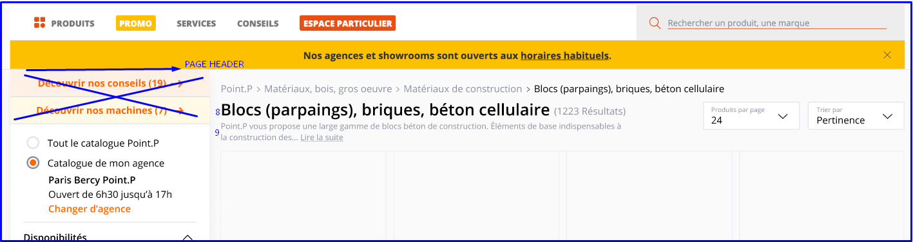  
*New PLP design. *  
***Error** : No breadcrumb to be displayed for mini catalog advanced*

### Page content and facets


**!!** From node /edit, contributors can configure Early Birds products
by adding Early Birds widget and Early Birds category (both optional).
If Early Birds ID is set, then products retrieved from the Early Birds
service are displayed at the top of the list (with the same styles as
regular product boxes). Note that Early Birds products are not counted
in the Pagination, and are loaded via AJAX.

1.  **Facets** : there can be up to 6 different filters configured.
     Clicking on a filter value reloads the page to show corresponding
     results. Not displayed if no facets were contributed  
For new style and behaviour, see [*PLP section*](#products-listing-page)

2.  **Marketing banner** : optional

3.  **Products list **

**!!** In addition, it is possible to configure 2 optional WYSIWYG
blocks on the page (advanced decorated text format).

-   1 is displayed on the left sidebar, below the Marketing banner

-   1 is displayed at the bottom of the page, below the pagination

 **NOTE** : It is also possible to add a “Bloc HTML libre bas de page”
 that will be displayed at the bottom of the page.

**CSV Prototype**


| ProductId | Filter name 1| display type | Filter name 2| display type | Filter name N| display type |
| --------- | ---------------------------------- | --------------------------- | --------------------------- |
|           |                                    |                             |                             |
|           |                                    |                             |                             |

|Productid|Marque   |Disponible|Height&#124;radio|Diameter&#124;toggle|
|---------|---------|----------|------------|---------------|
|123      |Bosh     |Y         |50          |52             |
|3213     |Mitsubish|N         |60          |63             |
|123      |         |          |            |               |


For the display type of the facets, the available values are :

-   List (display like checkboxes)

-   Search

-   Range

-   Radio (display like a radio button)

-   Toggle (display like a toggle switcher)

**NOTE** : if no type is contributed in the csv, then the by default
checkbox is displayed in the page.

## **Agencies section**


Agencies section is a Store Locator feature. It allows to search for :

-   Agencies

-   Showrooms (can’t be used as Agency by users)

-   Agencies which also have a Showroom

### Agencies Landing page 

**Settings **

| URL alias                   | ../nos-agences/                  |
|-----------------------------|----------------------------------|
| Breadcrumbs                 | [site:name] > Trouver mon agence |
| Meta-title                  | [to check]                       |
| Meta-description            | [to check]                       |
| Translate Interface Context | Landing Agences                  |


1.  **Breadcrumbs** : \[site:name\] &gt; \[page:title\]

2.  **Page title** : translatable from Translate Interface

3.  **Page description** : configurable from back-office (simple HTML)

4.  **Search bar and filters** : see behavior below

5.  **Background image** : configurable from Back-office. <del>A checkbox
     allows to display the semi-transparent layer on top of the image
     (checked by default)</del>. A setting (color picker) allows to define
     the Layer color.

6.  **Section title** : translatable from Translate Interface

7.  **Section subtitle** : ctranslatable from Translate Interface

8.  **Content boxes** : for each, following elements are configurable
     from back-office :

	-   Title : optional - not displayed if left empty. If filled, then
     background color is generated using the Brand Primary color.

	-   Background image

	-   Description

	-   URL (with option “open in a new tab”) - link will be implemented in
     V2

Amount of boxes is not limited.

#### Search bar 


1.  **Search icon** : configurable from Back-office. Color used is the
     Brand Secondary color

2.  **Search input field** : placeholder is translatable from Translate
     Interface. Search includes the Google Places auto-complete
     (configured so it can only retrieve results from France, using
     Cities and Zipcode only - no exact addresses)). Clicking on it
     displays the following :


First element “Ma position actuelle” is the Geolocation feature.
On-click, request for “Geolocation” from\
browser is triggered. If user accepts, then his current location is
added to the Search input field.\
Elements below are history of the previous searches. Display the 5 last
requests.

`3.`  **Filters** : checkbox is checked by default. There are 2 different
     states, depending if there is one or several filters configured on
     the site. See details below.

`4.`  **Find my agency button** : label is translatable from Translate
     Interface. On-click, redirects to the [*Agency Results
     page*](#agency-results---map-page)

Note that if there is no results retrieved, Landing page reloads, and a
pop-in is displayed.

**Pop-in title** : Pas de résultats

**Pop-in content** : Aucun résultat ne correspond à votre recherche.
Merci d’effectuer une nouvelle recherche.

=&gt; Both are translatable from Translate Interface.

Same behavior applies when searching from Maps results page (redirect to
landing page and show pop-in).

#### Filters

The Services filter is always displayed. From back-office, it is
possible to configure which additional filters will be used, among the
following :

-   Agences / Showroom

-   TO BE COMPLETED

Displaying is different depending the amount of filters :

-   If only Services filter is used

-   If 2 or more filters are used

***If only Services filter is used :***


By default, all Services filter items are checked. Label of the checkbox
is “Tous les services” (translatable from Translate Interface).


Screen above shows Services filter block expanded.

1.  **\[amount\] services**, where \[amount\] stands for amount of
     selected services. If only a few services among the list are
     selected, checkbox shows a “-”. Note that if no services selected,
     then display “0 services”.

2.  **List of available services items**

On mobile, filter items are displayed as following :


3\. **Title** : **!!** should be “Services” instead of “Filtres”. Amount
of selected items is displayed between Brackets ()

4\. **Clear all** : on-click, unchecks all items. Label is translatable
from translate Interface

5\. **List of available services items**

***If 2 or more filters are used :***


By default, all Filter items are checked. Label of the checkbox is
“Filtres” (translatable from Translate Interface).

  
Screen above shows Filters block expanded.

1.  **Filters label** : translatable from Translate Interface. If only a
     few Filter items among the list are selected, checkbox shows a
     “-”.

2.  **Filter type title**

3.  **List of available Filter items**


4\.  **Title** : translatable from Translate Interface. Amount of
     selected filter items is displayed between brackets ()

5\.  **Clear all** : on-click, unchecks all items. Label is translatable
     from translate Interface

6\.  **First filter block** : expanded by default. Amount of selected
     filter items is displayed between brackets ()

7\.  **Second filter block** : collapsed by default. Amount of selected
     filter items is displayed between brackets ()

### Agency Results - Map page

**Settings **

| URL alias                   | /nos-agences?[parameters]     |
|-----------------------------|-------------------------------|
| Breadcrumbs                 |                               |
| Meta-title                  | Configurable from back-office |
| Meta-description            | Configurable from back-office |
| Translate Interface Context | Carte Agences                 |


#### Desktop


1.  **Map** : powered by Google Maps

2.  **POIs**, based on coordinates sent back by
     ***/api/v1/agencies/agencies-by-gps*** service. All retrieved
     results must be visible on the map (map zoom auto-adjusts). Icons
     are configurable from back-office (FileField upload). It is
     possible, for each type (Agency / Showroom / Agency+Showroom), to
     define :

	-   Selected state icon

	-   Not selected state icon

On-click on a POI, an anchor is triggered to the corresponding result in
the list.

3\.  **Page title** : translatable from Translate Interface

4\.  **Search input field** : same behavior as for the [*Agencies Landing
     page*](#agencies-landing-page)

5\.  **Filters** : same behavior as for the [*Agencies Landing
     page*](#agencies-landing-page)

6\.  **Amount of results** : \[n\] agences Cedeo à proximité, with \[n\]
     = amount of results. Static string is translatable from Translate
     Interface. Single form : *1 agence Cedeo à proximité*

7\.  Add Agency to favorites

8\.  **Agency details**, composed of :

-   ***Agency title*** : on-click, redirects to agency detail page.
     Title is underlined (not present on screenshot).

-   ***Showroom information*** :

	-   If agency has a showroom, display : *Cette agence dispose d’une
         salle d’exposition*

	-   <del>If agency does not have any showroom, display : *Cette agence
         ne dispose pas de salle d’exposition*</del>

		-   Note that string is translatable from Translate Interface

-   ***Opening hours***

-   ***Address, Zipcode City - \[distance\]***

-   ***Phone number***. Label is translatable from Translate Interface

-   ***Itinerary link*** : on-click, redirects User to Google Maps, with
     Agency address pre-filled. Opens in a new tab. Icon is
     configurable from back-office

-   ***Email address*** : on-click, opens User mail client, with email
     address pre-filled. Icon is configurable from Back-office

9\.  **Call to Action** : can have 2 states :

-   If agency is user’s current agency, display CTA as disabled, with
     label “Mon agence”. Label is translatable from Translate Interface

-   If agency is not user’s current agency, display CTA as active, with
     label “Choisir cette agence”. Label is translatable from Translate
     Interface. On-click, [*Agency switch confirmation
     pop-in*](#agency-showroom-elements-contributed-on-drupal-side)
     displays. If User confirms on pop-in, then :

	-   Page reloads, and selected agency becomes User’s current agency

	-   CTA state is switched to disabled, with label “Mon agence”.

To detail : state for Showroom only

#### Mobile 


1.  **Map** : fixed position. Scrolling up covers the map with results.
     Clicking on the map opens the map layer (see below).

2.  **POIs**, based on coordinates sent back by
     ***/api/v1/agencies/agencies-by-gps*** service. All retrieved
     results must be visible on the map (map zoom auto-adjusts).

3.  **Page title**

4.  **Filters** : same behavior as the [*Agencies Landing
     page*](#agencies-landing-page)

5.  **Amount of results**


6\.  **Call item** : icon is configurable from back-office, label is
     translatable from Translate Interface. On-tap, triggers the Phone
     application, with phone number pre-filled

7\.  **Email item** : icon is configurable from back-office, label is
     translatable from Translate Interface. On-tap, triggers the native
     mobile behavior

8\.  **Itinerary item** : icon is configurable from back-office, label is
     translatable from Translate Interface. On-tap, triggers the native
     mobile behavior (maps application)

##### Map layer - mobile

When clicking on the map, the following opens (full screen). Note that
if user directly clicks on a POI from agency Results - Map page, he goes
to the second screen below.


Clicking on the Cross icon closes the layer. Clicking on a POI then
opens the corresponding card as following :


Swiping left / right then shows the next card. Icon on the map gets
highlighted accordingly.

### Agency detail page

**Settings **

| URL alias                   | Provided by service                              |
|-----------------------------|--------------------------------------------------|
| Breadcrumbs                 | [site:name] > Trouver mon agence > [agency:name] |
| Meta-title                  | Configurable from back-office                    |
| Meta-description            | Configurable from back-office                    |
| Translate Interface Context | Agence detail                                    |

All the Agency detail info is retrieved from ***/api/v1/agencies/{id}***
service.


1.  **Breadcrumbs**

2.  **Agency title **

3.  “This agency also has a showroom” info : not displayed on Agency
     detail page

4.  **Opening hours** : Retrieved from ***/api/v1/agencies/{id}***
     service. Label is translatable from Translate Interface “HORAIRES
     D’OUVERTURE…”. Opening hours management is described in
     [*corresponding section*](#opening-hours-management).

5.  **Exceptional closing days** : retrieved from /api/v1/agencies/{id}
     service. Note that there can be several closing days -&gt; if so,
     display 1 per line\
     **!!** Design update : block must look like this :


a.  Block title : *Votre magasin sera exceptionnellement fermé aux dates
     suivantes :* (translatable)

b.  Exceptional closing days (1 per line)


6\.  **Agency description**

7\.  **Agency image** : <del>retrieved from ***/api/v1/agencies/{id}.***</del>
     Can be configured from Drupal side, for each agency independently.
     If no image set for an agency, then display default agency image
     (which can be configured from Back-office)

8\.  **Agency contact information**, composed of :

-   Label (translatable from Translate Interface)

-   Street

-   Zip code City

-   Phone number : allow user to click on telephone to launch the call
     directly.

-   Fax number if exists

9\.  **Add to My Favorite Agencies** (to be done in V2)

10\.  **Agency email** : icon is configurable from back-office. Label
     “Courriel” is translatable from Translate Interface. On-click,
     opens user mail client (mailto:)

11\.  **Itinerary** : icon is configurable from back-office. Label is
     translatable from Translate Interface. On-click, opens Google Maps
     in a new tab, with Agency address pre-defined

12\.  **Choose this agency button** : on-click, opens the [*Agency switch
     confirmation
     pop-in*](#agency-showroom-elements-contributed-on-drupal-side). If
     User validates on Confirmation pop-in, button state is then
     switched to “Mon agence” as following (button is then not
     clickable anymore) :


Note that if user accesses the page of his own agency, button state will
be “Mon agence” too.


13\.  **Marketing block** : to be done in V2, fields to be detailed

14\.  **Expertises block** : displayed if ***/api/v1/agencies/{id}***
     service returns corresponding data. Block label is translatable
     from Translate Interface. For each item, display :

-   Icon

-   Title

-   Description

15\.  **Services block** : displayed if Agency has related Services. Block
     label is translatable from Translate Interface. For each item,
     display :

-   Icon ; managed on Drupal side. See [*related
     section*](#opening-hours-management) for details.

-   Title

-   Description

#### Opening hours management

Agency / Showroom opening hours may vary depending on “season” of the
year. Service sends back all values for different “seasons”, and Drupal
manages display of opening hours corresponding season.

There are 3 possible “season” values :

-   SUMMER

-   WINTER

-   ALLTIME

For each Agency / showroom, object “periods” allows to determine exact
dates for each Season :

```
"periods" => array:2 [▼
      0 => array:3 [▼
        "name" => "SUMMER"
        "startDate" => "801"
        "endDate" => "901"
      ]
      1 => array:3 [▼
        "name" => "WINTER"
        "startDate" => "1218"
        "endDate" => "1231"
      ]
    ]
```

In this example, SUMMER goes from 01/08 (August 1st) to 01/09 (September
1st).  
WINTER goes from 18/12 (December 12th) to 31/12 (December 31st).

So, based on this example, behavior is next :

-   Between 01/08 and 01/09, display opening hours which have season =
     SUMMER

-   Between 18/12 and 31/12, display opening hours which have season =
     WINTER

-   For all other days of the year, display opening hours which have
     season = ALLTIME

Notes :

-   Some agencies / showroom only have ***season*** = ALLTIME, in this
     case ***periods*** check is not required

-   If Agency / showroom has different ***seasons*** in ***openings***,
     but ***periods*** is empty, then display “ALLTIME” values only

-   If agency / Showroom has ***periods*** data, but there is only
     ***season*** = ALLTIME in ***openings,*** then display ALLTIME
     data.

##### Lunch time management

Opening hours are presented in 2 arrays : 1st one shows opening hours
for the morning, second one shows opening hours for the afternoon.

```
"hours" => array:2 [▼
          0 => array:2 [▼
            "openingHour" => "730"
            "closingHour" => "1200"
          ]
          1 => array:2 [▼
            "openingHour" => "1330"
            "closingHour" => "1800"
          ]
```

On front-end, the are presented this way :


1.  **Morning opening hours** (taken from 1st array)

2.  **Afternoon opening hours** (taken from 2nd array)

Note that some agencies / showrooms are not closed on lunch time : they
are opened all day long. In such case, opening hours are presented in
the left column on front-end only (point 1 from previous screenshot).

Service handles “no closing during lunch time” by 2 ways :

1.  Second array contains ***openingHour*** and ***closingHour*** = 0

```
"season" => "ALLTIME"
    	"weekDay" => "TUESDAY"
    	"hours" => array:2 [▼
      	0 => array:2 [▼
        	   "openingHour" => "630"
        	   "closingHour" => "1900"
      	]
      	1 => array:2 [▼
        	   "openingHour" => "0"
        	   "closingHour" => "0" 
```

2\.  First array contains ***closingHour*** = 0, and second array
     contains ***openingHour*** = 0

```
"season" => "SUMMER"
        "weekDay" => "MONDAY"
        "hours" => array:2 [▼
          0 => array:2 [▼
            "openingHour" => "700"
            "closingHour" => "0"
          ]
          1 => array:2 [▼
            "openingHour" => "0"
            "closingHour" => "1700" 
```

##### Front-end displaying :

Note that the 1st item to be shown corresponds to current day. We then
display the next 6 days, so we have 7 days displayed at all. Users can
then choose to display the next 7 days by clicking on the See more link.

**!!** This rendering must be applied on :

-   Agency detail page

-   Agency + Showroom detail page **if ESDB Showroom feature is not
     enabled**

-   Showroom detail page **if ESDB Showroom feature is not enabled **


1.  **Block title** : translatable. Base string : Horaires d’ouverture
     de votre magasin

2.  **Regular opened days** : Display day label + DD + Month. Displayed
     with an “Open” color bullet :

	-   Color field for Open Agency already exists in BO (Agencies
     Configuration page)

	-   Color field for Open Showroom already exists in BO (Agencies
     Configuration page)

3.  **Regular closed days** : Display day label + DD + Month. For such
     case, display string *Magasin fermé* (translatable). Displayed
     with a “Closed” color bullet :

	-   Color field for Closed Agency already exists in BO (Agencies
     Configuration page)

	-   Color field for Closed Showroom already exists in BO (Agencies
     Configuration page)

4.  **Exceptional closed days** : Display day label + DD + Month.
     Descriptions are taken from ***closingDays.description.***
     displayed with a “Closed” color bullet :

	-   Color field for Closed Agency already exists in BO (Agencies
     Configuration page)

	-   Color field for Closed Showroom already exists in BO (Agencies
     Configuration page)

5.  **See more link** : translatable. Base string : *Voir plus*\
     On-click, displays the next 7 days under the 7 initial ones
     presented (so it shows 14 days in total). Users can click only
     once on this link.


#### Icons management

Expertises / Services icons are managed on Drupal side (even if titles /
descriptions are managed on Service side).

For each service, it is possible to upload a corresponding icon (SVG
format OR PNG). There is also a default icon (configurable from
Back-office) displayed for Services which don’t have any icon set in
back-office (also, it can be either SVG or PNG).

**!!** If both SVG and PNG are added for a same item, then PNG icon
takes the priority on front-end over the SVG.

#### Microdata

Reference :
[*https://schema.org/HomeAndConstructionBusiness*](https://schema.org/HomeAndConstructionBusiness)

**Fields**

| Value                     | Description             		  |
|---------------------------|-------------------------------------|
| Informations sur l’agence | H2 (agency information)		  |
| image                     |                        		  |
| description               |                        		  |
| streetAddress             |                        		  |
| postalCode                |                        		  |
| addressLocality           |                        		  |
| telephone                 |                         		  |
| faxNumber                 |                         		  |
| email                     |                         		  |
| Horaires d’ouverture      | H2 (opening hours). One div per day |
| openingHours              |                         		  |
| Plan d’accès              | H2 (itinerary)                      |
| latitude                  |                         		  |
| longitude                 |                         		  |
| hasMap                    |                         		  |


### Agency + Showroom detail page

**Note** : see new implementation for [*this template in ESDB
spec.*](https://docs.google.com/document/d/1NE2eRXNbU4BfTyHM_3yglWRJYYytdvw6UFqmBmCxSGU/edit#heading=h.7o95yykl6ypg)

**Settings **

| URL alias                   | Provided by service                              |
|-----------------------------|--------------------------------------------------|
| Breadcrumbs                 | [site:name] > Trouver mon agence > [agency:name] |
| Meta-title                  | Configurable from back-office                    |
| Meta-description            | Configurable from back-office                    |
| Translate Interface Context | Agence detail                                    |


In BO content page, webmaster shall be able to contribute meta tags
module and edit different metatags for agency page and showroom page :

-   For agency pages - use agency tags :

	-   Titre agence

	-   Description agence

-   For showroom pages - use basic tags :

	-   Titre de page

	-   Description


All the Agency + Showroom detail info is retrieved from
***/api/v1/agencies/{id}*** service. Template Agency + Showroom detail
is used if current agency has data within the *showroom* object.

The Agency part of the page is managed the exact same way as the Agency
detail page - see [*related section*](#agency-detail-page) for details.

**!!** Note that Agency Expertises / Services blocks are displayed below
the Showroom information.

**!!** Note that this template must use microdata as on Agency detail
page. See [*related section*](#microdata) for details.


1.  **“This agency also has a Showroom” text and link** :

	-   Text is translatable from Translate Interface

	-   Link is an anchor to the Showroom section on the page


2\.  **Images carousel** : images can be configured independently for
     each Showroom. Amount of images per Showroom is not limited. If no
     images configured for a Showroom, then Showroom default image is
     displayed. Showroom default image is configurable from
     back-office.

3\.  **Title label (Salle expo)** : translatable from Translate Interface

4\.  **Agency title**

In BO, webmaster shall be able to contribute different titles depending
if the page is a page for an agency or for a showroom.

In each Agency/showroom detail page, there will be two fields available
:

-   titre page agence H1

-   titre page showroom H1

Whenever these fields are filled, this title will be displayed in the
page overriding the template’s title WITHOUT modifying the URL of the
page.


5\.  **Carousel dots** : displayed if there are several images for the
     Showroom. Current image slide =&gt; dot is highlighted.

6\.  **Showroom description** (*showroom:description*)

7\.  **Showroom contact information**, composed of :

-   Label (translatable from Translate Interface)

-   Street

-   Zip code City

-   Phone number

-   Fax number if exists

8\.  **Showroom opening hours** : Retrieved from
     ***/api/v1/agencies/{id}*** service (*showroom* object). Label is
     translatable from Translate Interface “HORAIRES D’OUVERTURE…”.
     Opening hours management is described in [*corresponding
     section*](#front-end-displaying-2).

9\.  **Agency email** : icon is configurable from back-office. Label
     “Courriel” is translatable from Translate Interface (**!!** do not
     output email value on front-end). On-click, opens user mail client
     (mailto:)

10\.  **Itinerary** : icon is configurable from back-office. Label is
     translatable from Translate Interface. On-click, opens Google Maps
     in a new tab, with Agency address pre-defined

11\.  **Exceptional closing days** : retrieved from
     ***/api/v1/agencies/{id}*** service. Note that there can be
     several closing days -&gt; if so, display 1 per line. Use setting
     on Agencies Configuration Page to determine within how many next
     days Exceptional closing days should be displayed (i.e. display
     closing days for the next 30 days).  
     **!!** Design update : block must look like this :


c\.  Block title : *Votre magasin sera exceptionnellement fermé aux dates
     suivantes :* (translatable)

d\.  Exceptional closing days (1 per line)


### Agency / showroom elements contributed on Drupal side

Even though Agency / showroom data is retrieved from services-side, some
elements displayed on the pages can be configured from Drupal side :

-   Agency image

-   Showroom images

-   Description blocks 1 and 2

For each agency, it is possible to configure its image from Drupal side.
If, for an agency, image is not configured, then default agency image is
used.

For each showroom, it is possible to configure its carousel images from
Drupal side. Amount of images in carousel is not limited. If, for a
showroom, carousel is not defined, then default showroom image is used.

Finally, it is possible to define 2 descriptions blocks, using Filtered
HTML (full WYSIWYG). First block is displayed below ***description***
field retrieved from service-side :

  
Its max width is 859 px.

Second description block is displayed below Services block. Its max
width is 980 px.


### Agency switch confirmation pop-in 

From Agency detail page / Agency + Showroom detail page / Agencies Map
page, User can select an agency as his current agency, via the “Choisir
cette agence” button :


After clicking on the button, the Agency switch confirmation pop-in
appears, to inform User that Products prices and availabilities may vary
in the new-selected agency :


1.  **Pop-in title** : translatable from Translate Interface

2.  **Closing cross** : on-click, closes the pop-in (same as clicking
     outside of the pop-in).

3.  **Icon** : configurable from back-office (png, not SVG). If not
     configured in back-office, fallback is icon from template (as
     shown on screenshot).

4.  **Information text** : translatable from Translate Interface

5.  **Cancel button** : on-click, closes the pop-in

6.  **Continue button** : on-click, changes the User’s current agency by
     the selected one (and pop-in gets closed).

### Agency / Showroom Structured data

[*See ESDB
specifications.*](https://docs.google.com/document/d/1NE2eRXNbU4BfTyHM_3yglWRJYYytdvw6UFqmBmCxSGU/edit#heading=h.lkqke2hoor9z)

## <del>**User login**</del>


### <del>User login page</del>

<del>**Settings** </del>

| <del>URL alias</del>                    | <del>../connexion</del>                             |
|------------------------------|------------------------------------------|
| <del>Breadcrumbs</del>                  | <del>[site:name] > Se connecter et s’inscrire</del> |
| <del>Meta-title</del>                   | <del>[to check]</del>                               |
| <del>Meta-description</del>             | <del>[to check]</del>                               |
| <del>Translate Interface Context</del>  | <del>Page Login</del>                               |


<del>Display desktop</del>

1.  <del>**Login block title** : translatable from Translate Interface</del>

2.  <del>**Login block subtitle 1** : translatable from Translate
     Interface</del>

3.  <del>**Login block subtitle 2** : translatable from Translate
     Interface</del>

4.  <del>**Email field** : placeholder is translatable from Translate
     interface. With Front-end validation</del>

5.  <del>**Password field** : placeholder is translatable from Translate
     interface. With Front-end validation</del>

6.  <del>**Remember me checkbox** : \[behavior to be checked\]. Label is
     translatable from Translate Interface</del>

7.  <del>**Forgotten password link** : on-click, redirects to the
     [*Forgotten password page*](#forgotten-password). Label is
     translatable from Translate Interface</del>

8.  <del>**Login button** : on-click, /login service is triggered. If
     services returns OK status, user gets logged in, else an error
     message is displayed on top of the page (page reloads).</del>

9.  <del>**Registration block title** : translatable from Translate
     Interface</del>

10. <del>**Registration subtitle 1** : translatable from Translate
     Interface</del>

11. <del>**Registration subtitle 2** : translatable from Translate
     Interface</del>

12. <del>**Reinsurance blocks** : there can be up to 4 items added. For
     each, Icon (!! managed via dedicated upload field) and title are
     configurable. </del>

13. <del>**Register button** : on-click, opens the [*Registration
     pop-up*](#_gpi23cs6f2t0) only if both VI CLI users and VI users
     registration is enabled. If VI users registration is disabled,
     then on-click on button, it redirects to the</del> <del>VI CLI
     Registration section. Label is translatable from Translate
     Interface</del>

### <del>Mobile version</del>

<del>A lighter mobile connexion page shall be displayed</del>

  
<del>*Old implementation*</del>

  
<del>*New implementation*</del>

<del>The purpose of this optimisations is to display the registration CTA
higher in the screen so it will be ore clicked : </del>

-   <del>Remove banners countdown & geoloc if exist</del>

-   <del>Remove search bar</del>

-   <del>Reduce padding between items</del>

-   <del>Remove some labels (Ex : Connectez vous à votre espace)</del>

-   <del>Display differently some items (Ex : Mot de passe oublié)</del>

### <del>Registration pop-up </del>

<del>This pop-up is enabled only if both VI CLI users and VI users
registration is enabled. It is disabled if VI users registration is
disabled. </del>


1.  <del>**Pop-up title** : translatable from Translate Interface</del>

2.  <del>**Pop-up description** : translatable from Translate Interface</del>

3.  <del>**Cross icon** : on-click, closes the pop-up. Please note that
     clicking anywhere outside the pop-up also closes it. </del>

4.  <del>**Yes / No radio-buttons** : “No” is selected by default. Labels
     are translatable from Translate Interface. </del>

5.  <del>**Valider button** : if radio-button “Yes” (oui) was selected,
     then redirect to the VI CLI Registration section. If radio-button
     “No” (non) was selected, then redirect to the VI Registration
     page. </del>

6.  <del>**“I already have credentials” link** : remove this link, should
     not be implemented</del>

## <del>**Forgotten password**</del>


### <del>Forgotten password - Email input page</del>

<del>**Settings**</del>

|<del>URL alias</del>                    | <del>../mot-de-passe-oublie</del>                                         |
|------------------------------|----------------------------------------------------------------|
|<del>Breadcrumbs</del>                  |<del>[site:name] > Se connecter et s’inscrire > Mot de passe oublié</del> |
|<del>Meta-title</del>                   | <del>Mot de passe oublié - Réinitialiser son mot de passe</del>           |
|<del>Meta-description</del>             | <del>[to check]</del>                                                     |
|<del>Translate Interface Context</del>  | <del>Mot de passe oublie</del>                                            |


1.  <del>**Breadcrumbs**</del>

2.  <del>**Page title** : translatable from Translate Interface</del>

3.  <del>**Page description** : translatable from Translate Interface</del>

4.  <del>**Email address input field** : label is translatable from
     Translate Interface. Front-end validation applies on the field
     (email format)</del>

5.  <del>**Validate button** : On-click, service
     ***/forget-password-request*** is triggered, in order to verify if
     email address does exist :</del>

	-   <del>If service returns an error : reload page, and display an error
     message : ***Une erreur est survenue, merci de réessayer.***</del>

	-   <del>If service returns an OK status : load [*Valid
     email*](#_sgzfjz19axij)~~ [~~*page*~~](#_sgzfjz19axij)</del>

<del>Note that label of the button is translatable via Translate
Interface</del>

6\.  <del>**Cancel button** : on-click, redirects to the [*Login
     page*](#user-login-page). Label is translatable from Translate
     Interface. </del>

### <del>Forgotten password - Valid email page</del>

<del>This page is displayed if email address input on the Forgotten
Password page is valid (service returns a 200 code for it). </del>

<del>**Settings**</del>

| <del>URL alias</del>                    | <del>[to check]</del>                                                     |
|------------------------------|----------------------------------------------------------------|
| <del>Breadcrumbs</del>                  | <del>[site:name] > Se connecter et s’inscrire > Mot de passe oublié</del> |
| <del>Meta-title</del>                   | <del>Mot de passe oublié - Réinitialiser son mot de passe</del>           |
| <del>Meta-description</del>             | <del>[to check]</del>                                                     |
| <del>Translate Interface Context</del>  | <del>Mot de passe oublie</del>                                            |


1.  <del>**Breadcrumbs**</del>

2.  <del>**Page title** : translatable from Translate Interface</del>

3.  <del>**Page description** :~~ ~~translatable from Translate Interface.
     Email address displayed is the one input by user on the previous
     step.</del>

### <del>Forgotten password - update password page</del>

<del>**Settings**</del>

| <del>URL alias</del>                    | <del>[to check]</del>                                           |
|------------------------------|------------------------------------------------------|
| <del>Breadcrumbs</del>                  | <del>[to check]</del>                                           |
| <del>Meta-title</del>                   | <del>Mot de passe oublié - Réinitialiser son mot de passe</del> |
| <del>Meta-description</del>             | <del>[to check]</del>                                           |
| <del>Translate Interface Context</del>  | <del>Mot de passe oublie</del>                                  |


1.  <del>**Breadcrumbs**</del>

2.  <del>**Page title** : translatable from Translate Interface</del>

3.  <del>**Page description** : translatable from Translate Interface</del>

4.  <del>**Password input field** : must contain at least 8 chars, with 1
     digit, 1 letter and 1 special char minimum. With front-end
     validation </del>

5.  <del>**Confirm password input field** : must match Password input
     field. Validation is done on Drupal side</del>

6.  <del>**Validate button** : on-click, service
     ***/forget-password-update*** is triggered. </del>

	-   <del>If service returns an error status, then reload page and display
     an error message. </del>

	-   <del>If service returns an OK status, then redirect user to Login page,
     with a confirmation message saying that his password has well been
     updated. Also, send a confirmation email to user. </del>

## **Cart page**


Cart page has different states depending on User profile. Note that
there can be 2 Line Items lists on the Cart page : 1st one shows
Products which are available in User’s current agency (such products can
be ordered). Second one shows Products which are not available in User’s
current agency (such products can’t be ordered). For second one, it
should display products from “notInAgencyPortfolio” and
“notAvailableOnline”.

**Settings**

| URL alias                    | /panier                                   |
|------------------------------|-------------------------------------------|
| Breadcrumbs                  | [site:name] > Mon panier                  |
| Meta-title                   | Récapitulatif de mon panier - [site:name] |
| Meta-description             | Récapitulatif de mon panier - [site:name] |
| Translate Interface Context  | Page Panier                               |


### ProCart page design - V2 implementation

The V2 implementation mainly focuses on a design update of existing
features. It impacts :

-   The cart page (see below)

-   The mini cart feature ([*see updated specifications on concerned
     section*](#mini-cart-v2-implementation))

Also, check specs on how to [*enable/disable the mini-cart fetaure
here*](https://docs.google.com/document/d/1t0bkvezTQX3Nzp3JopsZLFKEicaWK2yB39lCmv0N0nI/edit#heading=h.axqsu4smhcc)

Only new implementations are specified in this section.

**Note** : for VI users, an agency alert information message might be
displayed in some conditions, [*see concerned section here*](#in-cart),
informing the user he is not rattached to his by default agency.

  
*Current implementation*

  
*Client’s wireframes*

1.  **Price column**  
 Display prices in HT/TTC according to user’s profile

2.  **Display “remove” and “save”** **icons**  
!! @design : “remove” and “save” links are displayed underneath the
product reference.

3.  **Cart sidebar**  
[*See v1 implementation on cart
sidebar*](https://docs.google.com/document/d/1yVb5CW7FBinU3MYea7s7UHUX-8-QGAIQ-9-UV51WWdk/edit#)  
Current sticky implementation on desktop remains - to be confirmed by
client


-   3.1 Promotion code  
 [*See v1 implementation of promotion  
 code*](#promotion-code-coupon-management)  
 !! @design : no check box. No “i” tooltip icon. Input for promo code  
 is always visible.

-   3.2 Information string  
 Static string translatable via Translate Interface.

```
Retrait gratuit dans votre agence
```

-   3.3 Information string  
 Static string translatable via Translate Interface

```
Frais de livraison à voir à l’étape suivante
```

4\.  **Outstanding block**
[*See v1 implementation of outstanding
rules*](#users-outstanding-amount-exceeds-cart-amount). Keep the same
behaviour.  
The existing rule of display remains : only users that are allowed to
see the outstanding amount will see this block.

**Note** : value to be displayed in this block for outstanding amount
has changed.

A new value has been implemented on webservices side - Outstandings-
which is different from outstandinglimit

-   Outstanding limit = outstandings + some extra amount

=&gt; Display outstandings value in outstanding block[]{#4fys9kvuo3j7
.anchor} (and NOT outstanding limit)


  
*Current implementation*

  
*Client’s wireframes*

 **Outstanding amount icon**\
 Icon can be contributed from the back-office in the icon configuration
 page /structure/config\_pages/icons\_settings/edit  
 Label : Icône du bloc Encours du panier  
 Helptext : Renseignez l’icône qui est affiché sur le bloc Encours du
 panier.

2 options :

-   A. If outstanding limit amount &gt; cart sub-total =&gt; static
     string translatable via Translate Interface

```
Votre encours est de : @outstanding\_limit €. 
Pour aller plus vite, utilisez votre encours pour régler votre commande.
```

!! devs : If outstanding limit is illimited
(***pricing.outstandingsLimit*** sends back value “-1.00”), then display
=&gt; static string translatable via Translate Interface - to be
confirmed

```
Votre pouvez utiliser votre encours pour régler cette commande.
```


-   B. If outstanding limit &lt; cart sub-total AND user can pay with
     other payment methods like its CB =&gt; static string translatable
     via Translate Interface

```
Votre encours est insuffisant.
Ce n’est pas grave, vous pouvez régler votre commande par CB.
```

 **Note** : if user does NOT have other payment method available =&gt;
 static string translatable via Translate interface

```
Le montant disponible de votre encours ne vous permet pas de finaliser la commande.  
Merci de contacter votre agence .
```

5\.  **Credit card security block**

This block can be enable/disable in BO, in the configuration pages
library (in the panier tab)
[*https://cedeo.test.white.adyax-dev.com/admin/structure/config\_pages/checkout\_settings/edit*](https://cedeo.test.white.adyax-dev.com/admin/structure/config_pages/checkout_settings/edit)  
Label : Bloc de sécurité carte bleue

Display an image that can be uploaded in BO, in the same page

Helptext : Ajoutez l’image qui sera affichée dans le bloc de sécurité
carte bleu du panier.

The existing rule of display remains : only users that are allowed to
pay with CB will see this block.

6\.  **Informations block**

Two information blocks shall be created.

Each block can be enable/disable in BO, in the configuration pages
library (in the panier tab)
[*https://cedeo.test.white.adyax-dev.com/admin/structure/config\_pages/checkout\_settings/edit*](https://cedeo.test.white.adyax-dev.com/admin/structure/config_pages/checkout_settings/edit)

Label : Bloc d’information du récapitulatif

Each block shall have two editable fields :

-   Title  
     Label : Titre du bloc d’information du panier  
     Helptext : Renseignez le titre du bloc qui est affiché en dessous
     du récapitulatif du panier.

-   Text  
 Label : Description du bloc d’information du panier  
 Helptext : Renseignez la description du bloc qui est affiché en
 dessous du récapitulatif du panier.

7\.  **CTA line**  
!! @design : replace the existing features. Same behaviour as currently.

-  **7.1. Delete cart items**  
 To be displayed at the bottom of the cart page, in the CTA line.

-  **7.2 Save cart**

-  **7.3. Quick add to cart**  
 To be displayed at the bottom of the cart page, in the CTA line.

!! @design : 7.4. “Continue shopping” CTA to be replaced at the bottom
of the page, underneath the “similar products” block.

8\.  **Similar products for not available products\
     **Keep current behaviour. [*See v1 implementation of this
     block.*](#similar-products-for-not-available-products)\
     !! @design : Folded by
     default.

  
*Current implementation*

  
*Client’s wireframe*

 **8.1. Delete and save CTA**  
 Same display as for products in the cart.  
 Add icon to “delete” CTA and replace it.  
 !! devs : do not implement the “save in wishlist” CTA as only products
 from the current agency can be added.

**8.2. Helptext**  
 Static string translatable via Translate Interface

```
Consulter les @number\_articles produits similaires dans votre agence.
```

@number\_articles = number of similar products available

#### Pallet case

Keep current behaviour, [*see pallets management
section*](#pallets-management)

!! @design : update and adjust.

  
*Current implementation*

  
*Client’s wireframes*

1.  **Pallet block title** (translatable) + **pallet svg icon** shall be
     displayed underneath the calculation tool.

2.  **Pallet label + Pallet ID  
     **Pallet label (consigne Pal.Edilians) is to be replaced by a
     static string translatable.  
     Label : *Avec palette*

3.  **(unit:price)/palette.** Same behaviour.  
     Update existing “*consigne*” static string. Label : *Palette*

4.  **(number units/palette)**  
 Display a static string translatable.

```
(@number @unit / palette)
```

 @Number : quantity  
 @Unit : type (pieces, cent, milles, etc.)

#### Progressive prices

Keep current behaviour, [*see concerned section
here.*](#progressive-prices)

  
*Client’s wireframe on 1st threshold quantity (step 1)*

  
*Client’s wireframe on 2nd threshold quantity (step 2)*

**Step 1** : Display the first threshold price and string

1.  **Minimal quantity to be ordered**  
 Display a static string translatable.

```
Quant. min. @number @unit
```

 @number = minimal quantity to benefit from progressive prices  
 @Unit : type (pieces, rouleau, cent, milles, etc.)

2\.  **Progressive price string**  
Display a static string translatable.

```
@price € / @unit dès @number achetés 
Profitez des prix dégressifs
```

 @price : progressive price  
 @Unit : type (pieces, rouleau, cent, milles, etc.)  
 @number = minimal quantity to benefit from progressive prices

**Step 2** : after an user has chosen a quantity allowing him to benefit
from a first progressive price =&gt; display the second threshold price
and string.

3\.  **Progressive price string**  
Static string is updated with the new data

4\.  **Progressive price helptext**  
 Display a static string translatable.

```
Tarif dégressif appliqué
```

#### Promotion

 Keep the current behaviour, see the [*concerned section on promotion
 code management*](#promotion-code-coupon-management)

  
  
*Current behaviour for a promotion on cart subtotal.*

  
*Client’s wireframe*

!! @design : error in wireframes, sub-total HT price is missing.

In order to have the information on wich promotion code to be used,
please use the following values from webservices :  
"applyOn" =&gt; "SHIPPING"

"applyOn" =&gt; "HTTOTALCART"

After inputting a valid code =&gt;

1.  Display a green border and green CTA with a checkmark and a
     Translatable label inside the CTA (existing).  
     !! @design : current design needs to be changed (a)

-   **Promo code on cart sub-total**

	-  2\.  Underneath the promotion block, display in green : static string
     translatable + promotion amount (existing see (b) )

-   **Promo code on shipping fees**

	-  3\.  Above the promotion block, display in green : static string
     translatable + promotion amount

  ```
  Ce code s'appliquera à vos frais de livraison
  ```

### Business operations 

his block informs the user that a business/promotion operation is
ongoing (ex : if you spend more than 100€ your cart items could be
reimbursed)

Create a new business operations block.  
Can be enabled/disable in BO. In BO, the enabling of this feature is
available in the configuration pages library (in the panier tab)
[*https://cedeo.test.white.adyax-dev.com/admin/structure/config\_pages/checkout\_settings/edit*](https://cedeo.test.white.adyax-dev.com/admin/structure/config_pages/checkout_settings/edit)  
Label : Activation bloc Business operations


1.  **Business operations icon**  
     Icon can be contributed from the back-office in the icon
     configuration page /structure/config\_pages/icons\_settings/edit  
     Label : Icône du bloc Business operations  
     Helptext : Renseignez l’icône qui est affiché sur le bloc
     récapitulatif du panier.

2.  **Business operations description**  
    Display a static string translatable.

  ```
  Opération paniers remboursés.
  Plus que 107 € pour tenter votre chance.
  Gain: 360 € TTC sous forme de codes promo web
  ```

### Stamp on C&C Express

This icon informs the user that the click and collect express delivery
has been chosen for this product. It is displayed for products which
have been added to cart using the **extraStockSource.**

It is displayed in the product box whenever the user adds the product to
cart by using the “it’s a victory” button (thus it is NOT displayed if
the user adds the product through the regular “add to cart” button).


The icon is displayed in the cart pages and in the mini-cart.

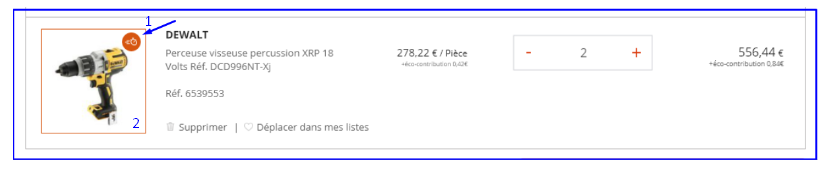

1.  **C&C express icon**  
     Icon can be contributed from the back-office in the icon
     configuration page /structure/config\_pages/icons\_settings/edit  
     Label : Icône C&C express  
     Helptext : Renseignez l’icône informant sur la disponibilité du
     click & collect express

No by default icon shall be implemented. So if no icon is uploaded in BE
=&gt; there shall be no display of the feature in FE (=feature is
disabled).

On hover, it opens a pop-up :


Static string translatable

  ```
  Venez retirer ce produit dans votre agence dans 2 heures.
  ```

Contexte : C&C express

In BO, webmaster can personalise the colours of this feature in
/admin/structure/config\_pages/checkout\_settings/edit


2\.  **Product image border**

Webmaster can choose to have no border or a personalized color for the
border of the image.

4\.  **Icon background color**

Webmaster can choose to have no background color or a personalized color
for the icone background

5\.  **Tooltip text background color**

Webmaster can choose to have a personalized color for the background of
the tooltip text

### Cart page - mobile design

*Current mobile behaviour*


*Client’s wireframes on mobile behaviour + “validate” CTA sticky*


**!! @desig**n : adapt and adjust mobile display to new v2
implementations :

-   HT/TTC prices

-   Cart sidebar updates + blocks (outstanding amount, CB security,
     information blocks, business operations)

-   Progressive prices

-   Palettes

-   Similar products

-   C&C express icon

1.  **Sticky Total TTC + “validate” CTA**  
  Total TTC price and “validate” CTA shall be sticky on scroll.

2.  **End of sticky behaviour**  
Whenever the sticky elements join the main summary block, the sticky
effect ends and “validate” CTA reintegrates the block.

3.  **Display new CTA “delete” and “save” with
     icons**


  
 *Current implementation*

4\.  **New display for “save cart”, “delete cart”, “quick add to cart”**  
 !!@design : no standard responsive behaviour  
!!@design : similar product for non available items shall be by default
collapsed.

### Cart page - V1 implementation


1.  **Breadcrumbs**

2.  **Page title** : translatable from Translate Interface

3.  **Products Quick entry** : see [*related section*](#section-32) for
     details

4.  **Cart sidebar** : see [*related section*](#_lstllfmgye77) for
     details

5.  **Validate my Cart button** : label is translatable from Translate
     Interface. On-click, user enters checkout if he has rights to
     order (some users don’t have rights to order, see [*related
     section*](#section-34) for details)

6.  **Line items details column** : column label (“Produits ajoutés à ma
     commande”) is translatable from Translate Interface. Next to
     label, amount of line items is added into brackets () (**!!** do
     not multiply by quantity on this field). For each item, display :

	-   Main image (if exists, else display default Product image)

	-   Promotion label if exists

	-   Brand (“JACOB DELAFOND”)

	-   Product title

	-   Site reference

	-   Stock availability

7.  **Unit price column** : label (“Prix”) is translatable from
     Translate Interface. Tax label (“HT”, “TTC”) depends on user
     profile, see [*related section*](#prices-displaying) for details.  
For each item, display :

	-   Unit price

	-   Unit (“palette (variante de palettisation)”). Price and unit are
     separated by a slash “/”

	-   Progressive Prices icons in case Product has progressive prices.
     Clicking on the icon opens the [*Progressive Prices
     pop-in*](#progressive-prices).

8.  **Quantity column** : label is translatable from Translate
     Interface. Depending on product, show either Quantity Input field
     or Calculation Tool. If for a product, User increases quantity
     over the available quantity, a message is shown below Quantity
     input field. Maximum available quantity is then set in the Input
     field.

9.  **Sub-total column** : label (“Sous-total”) is translatable from
     Translate Interface. Tax label (“HT”, “TTC”) depends on user
     profile, see related section for details. Price displayed is Unit
     Price \* Quantity.

10.  **Mettre de côté (Save for later) link** : see [*related
     section*](#section-35) for details

11.  **Supprimer (delete) link** : label is translatable from Translate
     Interface. Clicking on the link dynamically removes the Product
     from the Cart.

Screenshot below shows the Cart Line Items (products) which are not
available in User’s current agency (in case User has such products in
his cart). Note that for each of those products, a CTA allows to open a
pop-in showing SIMILAR products that can be ordered. See [*related
section*](#similar-products-for-not-available-products) for details.


12\.  **F-Gaz block** : displayed if at least 1 of the Products from the
     Cart is flagged as F-Gaz. See [*related section*](#cart-page) for
     details. **!!** This does not apply for Products which are not in
     User’s current agency.

**!!** Design update : F-Gaz block must be placed above Line items
table.

13\.  **Line items details column** : column label (“Produits non
     commandables”) is translatable from Translate Interface. Next to
     label, amount of line items is added into brackets () (**!!** do
     not multiply by quantity on this field).

14\.  **Tout mettre de côté (“Save all for later”) link** : see [*related
     section*](#section-35) for details

15\.  **Tout supprimer (delete all”) link** : on-click, it dynamically
     removes all Products that can’t be ordered from Cart (**!!** it
     does not remove products that can be ordered). It also dynamically
     removes the whole table of Products that can’t be ordered (layout
     included).

16\.  **Accordion** : open by default if Cart contains products that can’t
     be ordered.

17\.  **Information message** : static string is translatable from
     Translate Interface. Agency is dynamically added (uppercase to be
     applied only on first letters of each word of the agency string
     returned by service).

“Les produits ci-dessous ne sont pas disponibles actuellement dans
l’agence \[agency:name\].

Vous pouvez mettre de côté afin de les commander ultérieurement ou dans
une autre agence.”

18\.  **Line items** : For each item, display :

-   Main image (if exists, else display default Product image)

-   Promotion label if exists

-   Brand (“JACOB DELAFOND”)

-   Product title

-   Site reference

19\.  **Mettre de côté (Save for later) link** : see [*related
     section*](#section-35) for details

20\.  **Supprimer (delete) link** : label is translatable from Translate
     Interface. Clicking on the link dynamically removes the Product
     from the Cart.

21\.  **Download documents block** : description and button label are
     translatable from Translate Interface. See related section for
     details about behavior.

22\.  **Continuer mes achats (“continue shopping”)** : label is
     translatable from Translate Interface. Clicking on the button
     redirects user to Home Page.

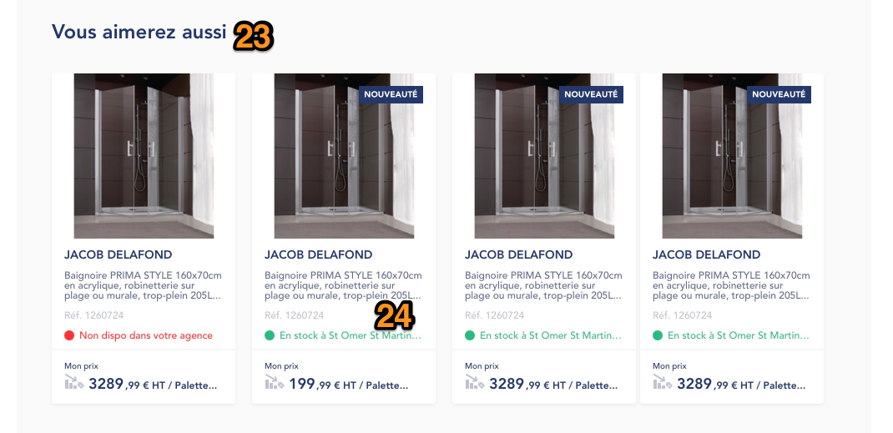

23\.  **You might also like block title** : translatable from Translate
     Interface

24\.  **You might also like products** : for each, display :

-   Main image (if exists, else display default Product image)

-   Promotion label if exists

-   “New product” label if exists

-   Brand (“JACOB DELAFOND”)
-   Product title

-   Site reference

-   Stock availability

-   Price (**!!** Price value, label (i.e. “Mon prix”) and tax info
     (“HT” / “TTC”) depend on user profile. See [*related
     section*](#prices-displaying) for details.

-   Unit (“par palette (variante de palettisation))

-   Progressive Prices icons in case Product has progressive prices.
     Clicking on the icon opens the Progressive Prices pop-in.

### Similar products for not available Products

Products which are not available in User’s current agency (such products
can’t be ordered) are displayed in a dedicated table on Cart page. For
each of those products, a CTA “Produits similaires” is displayed.
On-click, it opens a pop-in showing Similar products.


1.  **See Similar products CTA** : label is translatable from Translate
     Interface (base string : “Produits similaires”. CTA uses the
     Primary CTA style. Note that on mobile, A link is displayed
     instead of a CTA (link is accessible when clicking on this icon) :

On-click, next pop-in displays :


1.  **Pop-in title** : “Produits similaires”, translatable from
     Translate Interface

2.  **Closing cross** : on-click, closes the pop-in (same as clicking
     outside of pop-in).

3.  Current product info (retrieved from Cart page) :

	-   Image (if it does not exist, then display default product image)

	-   Brand

	-   Title

	-   Reference

4.  **Pop-in description :** translatable from Translate Interface. Base
     string :  
  ```
  Retrouvez ci-dessous la liste des produits similaires, que vous pouvez commander dès à présent :
  ```
  
5.  **Product information** :

	-   Image

	-   Brand

	-   Title

	-   Product reference

6.  **Product price **

7.  **Add to cart button** : on-click, product is added to Cart

Service **GET /api/v1/articles/{id}/related** is triggered to retrieve
products to display. Only products with type = SIMILAR must be shown.
There is no limit of items on Front-end side, all available “SIMILAR”
products are shown. Also, only SIMILAR products that can be added to
Cart are displayed (all the other ones are filtered out).

**!!** Note that once User has added a Product to cart after clicking on
“Add to cart”, then button is automatically switched to “Delete” (label
= Supprimer) in pop-in. If User presses “Delete”, then product is
removed from Cart, and button switched back to “Add to Cart”.

Note that if there are no SIMILAR products retrieved, then an error
message appears :

  ```
  Désolé, il n’y a pas de produits similaires correspondant à cet article pour l’instant.
  ```

Message is translatable from Translate Interface.


### Products quick entry 

\[TO COMPLETE FOR V2\]

### [*Cart sidebar*](#cart-sidebar) 


1.  **Sidebar title** : translatable from Translate Interface

2.  **Promotion code management** : see [*related section*](#section-33)
     for details

3.  **Sub-total, composed of** :

	-   ***Subtotal HT*** : Sum of Line items subtotals, without taxes.
     Label is translatable from Translate Interface.

	-   ***Eco-tax amount*** : sum of Line items eco-taxes. Label is
     translatable from Translate Interface

4.  **Delivery fee** : label is translatable from Translate Interface.
     Value is retrieved from \[??\]. If total cart amount is more than
     Free delivery amount set in back-office, then mention “OFFERT” is
     displayed. (mention is translatable from Translate Interface).

5.  **Free delivery information** : “Les frais de port sont offerts à
     partir de \[free\_delivery:amount\] d’achat”, where
     \[free\_delivery:amount\] is defined from back-office. Static
     string is translatable from Translate Interface. Mousing-over
     Tooltip displays \[??\] 

6.  **Delivery method selection** : see [*related
     section*](#_m480s945o10k) for details

7.  **Total block**, composed of :

	-   Total without taxes

	-   Taxes amount

	-   Total without taxes + taxes amount

8.  **Loyalty program info** : see [*related section*](#_qukgdosab51r)
     for details

9.  **Validate my Cart button** : label is translatable from Translate
     Interface. On-click, user enters checkout if he has rights to
     order (some users don’t have rights to order, see [*related
     section*](#section-34) for details)

### Promotion code (coupon) management

From the Cart page, users will be able to apply vouchers so that they
can benefit from promotional offers applicable either on total cart
price or specifically on shipping fees, be it percentage or fixed
promotional value.

As soon as a valid Promo code is entered, all actions on cart page (i.e.
add / remove quantity on Line Items) will imply Cart service triggering.

**Note** : the user needs to be able to enter a promocode in lower cases
or upper cases, and be able to apply it to the cart, without getting an
error message.


Screenshots from left to right show :

-   When no promotion code has been entered

-   When User checks checkbox “I have a promo code” then it dynamically
     shows the Promo code input field

-   When User clicked on “OK” after inputting a code, and code is valid
     : a confirmation message is shown below the input field

-   When User clicked on “OK” after inputting a code, and code is not
     valid : an error message is shown below the input field

On the order summary right block of the Cart page, users can click the
voucher checkbox to unfold a free-text input field. They can also
mouse-over the tooltip icon to display an information message. Tooltip
message can be set in Back-office.

-   Checkbox label: “J’ai un code promo” - translatable

-   Tooltip text: “Pour bénéficier de nos offres promotionnelles,
     assurez-vous que le code en votre possession est toujours valide
     et cliquez sur “OK”.” - administered from BO

-   Input field label: “Code promo” - translatable

-   CTA label: “OK” - translatable

Success (green) and error (red) messages are displayed right below the
input field according to service response. For now, there will not be
any character length control performed by Drupal. Error messages to
display can be found in the [*related section*](#errors-scenarios).

Once the code has been successfully submitted to the service, the “OK”
CTA turns into cross icon allowing users to delete the voucher from the
cart. Until that click, we’ll prevent users from editing their entry.

When clicking on it, the input field gets back to its initial state.

If users untick the checkbox, the input field is hidden back (and if a
valid promo code was engaged, it gets removed (trigger a service call
to: DELETE /carts/{id}/promocode submitting the code once again)).

#### Services integration

##### Apply Voucher on Cart

Clicking on “OK” button will trigger a service call to: POST
/carts/{id}/promocode submitting user entry as ‘code’ parameter.

*Sample Call*:

[*http://ingress.ibm.ppr.docker4sg.saint-gobain.net:42090/impulse-store-command/api/v1/carts/cartId/promocode?websiteId=cedeo&agencyId=1002&code=VOUCHER*](http://ingress.ibm.ppr.docker4sg.saint-gobain.net:42090/impulse-store-command/api/v1/carts/cartId/promocode?websiteId=cedeo&agencyId=1002&code=VOUCHER)

**!!** PUT /carts must be done right before triggering PUT
/carts/cartId/promocode.

##### Success Scenario

Service will respond 200 ‘OK’ with a comprehensive cartDTO with updated
information on pricing and on voucher. Make sure not to call /carts
service at this time.

**Pricing Object :**

```
"pricing":{  
   "htArticles":"692.55",
   "ttcArticles":"831.06",
   "vatArticles":"138.51",
   "htShipping":"0.00",
   "ttcShipping":"0.00",
   "htEcoTax":"19.82",
   "ttcEcoTax":"23.79",
   "htTotalCart":"712.37",
   "ttcTotalCart":"854.85",
   "vatTotalCart":"142.48",
   "htShippingPromo":null,
   "ttcShippingPromo":null,
   "htTotalCartPromo":"641.13",
   "ttcTotalCartPromo":"769.37",
   "vatTotalCartPromo":"142.48",
   "htPromoValue":"71.24",
   "ttcPromoVaue":"85.48",
   "outstandingsLimit":"2894.00"
}
```

**Promocode Object :**

```
"promoCode": {
   "name": "TESTDRUPAL",
   "description": "Test Drupal",
   "type": "PERCENTAGE",
   "value": 10,
   "applyOn": "HTTOTALCART",
}
```

Shipping Case : Apply when promoCode.applyOn = “HTSHIPPING”.

| JSON field        | Description                                  | Use             |
|-------------------|----------------------------------------------|-----------------|
| htArticles        | Sum of article prices * quantities           | Sous Total HT   |
| htShippingPromo   | Excluded tax shipping cost after discount    | “Frais de port” |
|<del>ttcShippingPromo</del>  | <del>Included tax shipping cost after discount</del>    | <del>Not in use</del>      |
| htTotalCartPromo  | Excluded tax total cart price after discount | TOTAL HT        |
| ttcTotalCartPromo | Included tax total cart price after discount | TOTAL TTC       |
| vatTotalCartPromo | Total cart tax amount after discount         | TVA             |
| htPromoValue      | Excluded tax discount value                  | REMISE          |
| <del>ttcPromoValue</del>     | <del>Included tax discount value</del>                  | <del>Not in use</del>      |


**Total Cart Case** : Apply when promoCode.applyOn = “HTTOTALCART”

| JSON field        | Description                                  | Use           |
|-------------------|----------------------------------------------|---------------|
| htArticles        | Sum of article prices * quantities           | Sous Total HT |
| <del>htShippingPromo</del>   | <del>null</del>                                         | <del>Not in use</del>    |
| <del>ttcShippingPromo</del>  | <del>null</del>                                         | <del>Not in use</del>    |
| htTotalCartPromo  | Excluded tax total cart price after discount | TOTAL HT      |
| ttcTotalCartPromo | Included tax total cart price after discount | TOTAL TTC     |
| vatTotalCartPromo | Total cart tax amount after discount         | TVA           |
| htPromoValue      | Excluded tax discount value                  | REMISE        |
| <del>ttcPromoValue</del>     | <del>Included tax discount value</del>                  | <del>Not in use</del>    |


##### Errors Scenarios

Expected errors are the following:

-   Voucher was not found / doesn’t exist

-   User is not allowed to use the submitted voucher

-   Total cart price is not high enough to use the submitted voucher

-   Voucher isn’t valid at this time, whether it didn’t start yet or is
     already expired

| JSON error key                 | Drupal translatable label                                                                                                            |
|--------------------------------|--------------------------------------------------------------------------------------------------------------------------------------|
| promocode.not.found            | Ce code n’existe pas                                                                                                                 |
| account.not.allowed            | Utilisation du code non autorisée                                                                                                    |
| promotion.minimum.amount       | Montant du panier insuffisant                                                                                                        |
| promocode.not.started          | Promotion à venir !                                                                                                                  |
| promocode.expired              | Promotion passée :(                                                                                                                  |
| promocode.exceeded.cart.amount | Nous ne sommes pas en mesure d'appliquer votre code promotionnel à votre panier. Veuillez-vous rapprocher de notre service Internet. |
| use.limit.exceeded             | Vous avez dépassé le nombre maximum d'utilisation autorisé pour ce code promotionnel                                                 |


All messages are translatable from Translate Interface (translation
context : Panier)

For all other errors, we’ll display the following message at the top of
the Cart page:

```
Une erreur est survenue. Veuillez essayer à nouveau ultérieurement ou contactez notre service Internet.
```

*Sample response*:
```
{  
   "url":"http://10.0.4.214:8092/api/v1/carts/VI_4-0/promocode",
   "code":422,
   "message":"Unprocessable Entity",
   "errors":[  
      {  
         "key":"promotion.minimum.amount",
         "message":"Promocode Minimum Amount"
      }
   ]
}
```


##### Delete Voucher from Cart

Once a voucher has been successfully applied, clicking on the cross icon
will trigger a service call to: DELETE /carts/{id}/promocode submitting
the code once again.

**Sample call**:

[*http://ingress.ibm.ppr.docker4sg.saint-gobain.net:42090/impulse-store-command/api/v1/carts/cartId/promocode?websiteId=cedeo&agencyId=1002&code=VOUCHER*](http://ingress.ibm.ppr.docker4sg.saint-gobain.net:42090/impulse-store-command/api/v1/carts/cartId/promocode?websiteId=cedeo&agencyId=1002&code=VOUCHER)

Service should respond 200 “OK” and Drupal will display a confirmation
message right below the input field :

  ```
  Code promo supprimé
  ```

Prices will be updated according to cartDTO from pricing object - as in
normal cases.

If the service respond otherwise, then display a message at the top of
the Cart page:

  ```
  Une erreur est survenue. Veuillez essayer à nouveau ultérieurement ou contactez notre service Internet.
  ```

=&gt; Both texts are translatable from Translate Interface.

### Rights over ordering

#### User is not allowed to order

Some users don’t have rights to perform an order. Such users are
identified via the canOrder field (canOrder = false) from the User info
service.  
For search users, there is special state of the Cart page :

-   An information message is displayed on top of the page

-   Validate my Cart button is disabled

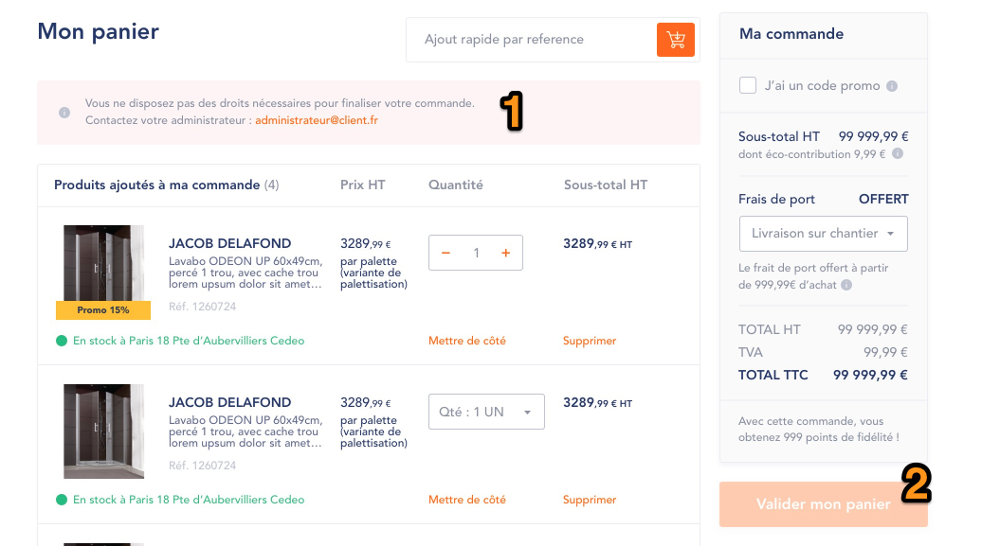

1.  **Information message** : translatable from Translate Interface.  
“Vous ne disposez pas des droits nécessaires pour finaliser votre
commande.  
Merci de contacter votre agence.”  
=&gt; Message is translatable from Translate Interface

2.  **Add to Cart button** : disabled state

#### User’s outstanding amount exceeds Cart amount

If for a VI CLI, ***ttcTotalCart*** amount is more than his Outstanding
amount, then he can’t perform order using Outstanding Amount payment
method. Field to use for comparison with ***ttcTotalCart*** is retrieved
from GET /cart/id (field ***pricing.outstandingsLimit***).

*Case 1 : not enough outstanding amount and no other payment method*

**!!** If only Outstanding amount payment method is configured on site,
THEN :

-   If case is triggered, then it implies displaying of an informative
     message (see above)

Static string is translatable from Translate Interface.

  ```
  Le montant disponible de votre encours ne vous permet pas de finaliser la commande.
  Merci de contacter votre agence .
  ```


-   Validate my Cart button is disabled, so User can’t enter checkout
     (since he will not be able to pay : he can’t pay using Outstanding
     amount because he exceeds Outstanding Amount Limit, and there is
     no other payment method available on site).

In such situation, if User removes products / decreases quantities, so
his ***ttcTotalCart*** will be under ***pricing.outstandingsLimit***,
then Validate my Cart button becomes active again.

*Case 2 : not enough outstanding amount and other payment method, like
CB*

Note that User can still enter checkout **ONLY** if there is other
payment methods enabled on site (in addition to Outstanding amount) (so
User will be restricted from using Outstanding Amount payment method on
Payment step, but will be able to use other method, such as Credit
card).

Static string is translatable from Translate Interface.

  ```
  “Le montant disponible de votre encours ne vous permet pas de finaliser la commande. Vous pourrez cependant utiliser le paiement par carte bancaire.”
  ```

**!!** Note that if ***pricing.outstandingsLimit*** sends back value
“-1.00”, then check should be ignored on Drupal side. In such case, User
is never blocked from using Outstanding amount payment method.


### Save for later 

Save for Later feature allows to save a product added to Cart into a
Wishlist. Once product has been added to a Wishlist, it is then removed
from Cart. Save for Later link is present for both products
inAgencyPortfolio and notInAgencyPortfolio.


1.  Save for Later link : default label “Mettre de côté” is translatable
     from Translate Interface. On-click, it triggers the Wishlist
     pop-in. From Wishlist pop-in, User can :

	-   Create a new wishlist

	-   Add product to a Wishlist

Full process is described in the [*corresponding section*](#section-26).

**!!** Note that quantity of product on cart page must be passed to the
wishlist (so, if i am “saving for later” a product which has quantity =
4, then on wishlist side there must be 4 as a quantity).

**!!** For VA / VAR Users, clicking on “Mettre de côté” link (or “Tout
mettre de côté” link) redirects User to Login page.\
After login, User is redirected to Cart page.


### Clear Cart content

A link allows to clear all Cart content at once. This link is displayed
ONLY if there is at least 1 product in the Cart.


On-click on this link, whole Cart content is cleared, and [*Empty
Cart*](#empty-cart) page state is then shown.

Note that link label can be translated.

Base string : Vider mon panier

### Empty cart

**!!** If cart is empty, then Delivery cost should be set to 0€, even if
service sends back a value for Delivery cost.\
Then, as soon as at least 1 product is added to Cart, “real” delivery
costs apply.

If User accesses the Cart page whereas he didn’t add any products yet,
then the following Cart page state is displayed :


1.  **Information message** : there are 2 states of the message,
     depending on User profile :

	-   ***VA / VAR*** :


-   ***VI Part / VI Pro / VI CLI*** :


Both messages are configurable from Back-office.

2\.  **Poursuivre ma visite (“continue visiting”)** : label is
     translatable from Translate Interface. Clicking on the button
     redirects user to Home Page.

3\.  **Add to Cart button** : disabled state

4\.  **You might also like products block**

### Added to cart pop-in 

As soon as a User clicks on “Add to Cart”, product is added to cart
(with selected quantity), and the Added to Cart pop-in opens. This
pop-in presents the product(s) that just have been added to the Cart
(following click on “Add to cart”), as well as a Products cross-sell
section. Note that in most cases, products are added 1 by 1 to the cart
(from Product List page, Product detail page…) - but in some cases,
several products can be added at once (i.e. “re-order a passed order).

Translation context : Pop-in ajout panier


1.  **Pop-in title** : translatable from Translate Interface

2.  **Cross icon** : on-click, closes the pop-in. Clicking outside of
     the pop-in also closes it

3.  **Line item information**, composed of :

	-   Product thumbnail

	-   Product brand

	-   Product title

	-   Product site reference

	-   “New” flag if product is flagged as so

	-   “Promo” flag if product is flagged as so

4.  **Price** : Price / Tax label (HT) / product unit. Note that price
     and tax label depend on user profile. Please refer to the
     [*corresponding section*](#prices-displaying) for details

5.  **Progressive prices icon** : displayed if Product does have
     progressive prices

6.  **Quantity** : label is translatable from Translate Interface.
     Quantity displayed is the one selected by user on Product page.
     Note that quantity can’t be changed from the pop-in

7.  **Progressive prices information** : **V2**

8.  TO BE CHECKED

9.  TO BE CHECKED

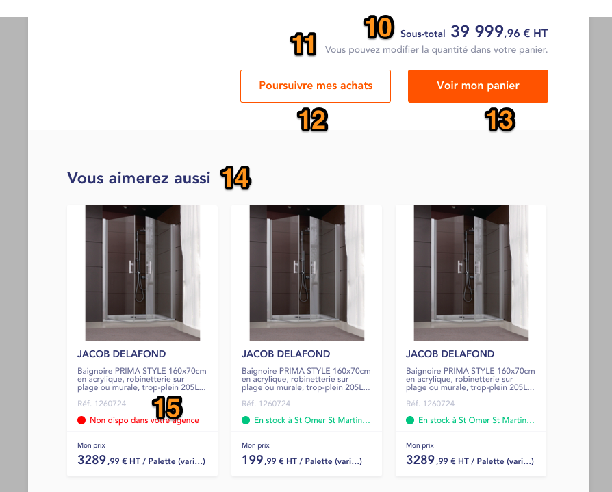

10\.  **Sub-total** : sum of all line items \* quantities. It concerns
     ONLY product(s) which just have been added to Cart (and not full
     cart sub-total). Note that tax label depends on user profile.
     Label “sous-total” is translatable from Translate Interface

11\.  **Description text** : translatable from Translate Interface

12\.  **Continue shopping button** : on-click, closes the pop-in. Label is
     translatable from Translate Interface

13\.  **See cart button** : on-click, redirects user to his cart. Label is
     translatable from Translate Interface

14\.  **Cross-sell section title** : translatable from Translate Interface

15\.  **Cross-sell products**. For each, display :

-   Product thumbnail

-   Product Brand

-   Product title

-   Product site reference

-   Agreement to sell

-   Price, price label tax label, product unit. Note that tax label /
     price label depend on user profile

#### Added to cart pop-in - Quantities management

*(Update release 1.18 - August 2019)*

When adding a product to Cart from next places :

-   Product detail page

-   Products Listing pages (including search)

-   Carousels

**!!** Note that this feature does not apply to VUE.JS apps (My Account,
Bulk Add to Cart) and multiple-products adding to the cart at once from
the regular site (i.e. Variants pop-in).

=&gt; Once product is added to cart, Added to Cart pop-in opens. From
the pop-in, it is possible to manage quantities in order to add more /
less quantities of the product to the cart (either Quantity Widget or
Calculation tool is displayed depending on Product).

**Process is next : **

User adds a Product to the Cart, Added to Cart pop-in is displayed as
following :


1.  **Quantity widget / Calculation tool** : when pop-in opens, value to
     be displayed is the one selected initially, when User added the
     product to Cart. From here, User can then increase / decrease
     Quantity. As soon as he does so, pop-in dynamically updates to
     screen below.

**!!** Note that Stock quantities rules must apply exactly as on the
Product detail page.


1.  **Modify Quantity button** : (label is translatable from Translate
     Interface) displayed as soon as User changes initial quantity.
     Note that if User goes back to initial quantity, button remains as
     displayed.

Rules are next :

-   Quantity **N** is added to Cart, Added to Cart pop-in opens with
     (**N** + *already added to cart quantity* *(if exists)*). Sum is
     called **X**.

-   User adds 2 to **X** =&gt; Button appears, and on click, Cart is
     updated. New quantity in Cart is **X**+2

-   Same logic applies if decreasing quantities ;

	-   Quantity N is added to Cart, Added to Cart pop-in opens with
         (**N** + *already added to cart quantity* *(if exists)*). Sum
         is called **X**.

	-   User removes 1 to **X** =&gt; Button appears, and on click, Cart
         is updated. New quantity in Cart is **X**-1

**!!** On top of the Quantity widget, a static text (translatable) must
be displayed : ***Quantité dans votre panier :***

2\.  **Totals** : when modifying quantities using the Quantity widget,
     sub-totals HT and TTC dynamically update (even if User does not
     click on Add to Cart). This way, User knows what would be price if
     he adds new quantities to the Cart.

On click on button, selected quantity is added to Cart, and pop-in
dynamically updates to show this state :


2\.  **Confirmation message**. Base string :

  ```
  Le produit a été ajouté au panier
  ```

Translatable from Translate Interface.

Message is displayed in green.

User can then add new quantities again to Cart, or close pop-in and
continue his navigation.


### Save my Cart

A feature on Cart page allows to save Cart content (= products) into a
Wishlist.


This CTA is displayed only if there are Products in the Cart. Label
*Enregistrer mon panier* is translatable.

If User is anonymous (in case Cart is enabled for Anonymous), clicking
on this CTA redirects User to login page, and after login, redirects
User back to Cart page.

On-click, the Add to Wishlist pop-in opens, with slight differences
comparing to the default one :


The Add to Wishlist pop-in version to display is the same as the one
used within the Bulk Add to Cart feature (no product block shown +
ability to add multiple products at once to a list).\
From here, User can add products to an existing list, or choose to
create a new one.

**!!** If User decides to create a new one, then Wishlist name input
field must be prefilled with next value :

  ```
  Panier du DD/MM/YYYY
  ```

Where DD/MM/YYYY corresponds to current date. Whole string is
translatable.


Mini-cart
---------

### Mini cart v2 implementation

[*It is related to cart page v2
implementation.*](#procart-page-design---v2-implementation)

  
*Current implementation*

  
*Wireframes*


Updates to implement in the mini cart - To be completed/updated with FE
team

-   Display HT/TTC prices

-   Display “save the whole cart”

-   Display C&C express icon

-   Palettes design update

-   Progressive prices

### Mini-cart v1 implementation

From Header, it is possible to open the Mini-Cart by clicking on the
Cart icon. Rules are next :

-   If no product in the cart, clicking on the Cart icon redirects User
     to Cart page

-   If at least 1 product in the cart, clicking on the Cart icon opens
     the Mini-Cart

-   Mini-Cart is not shown on mobile in any case

 

1.  **Label** : *Mon panier*, translatable

2.  **Sub-total** : Translatable. Tax type (HT / TTC) and price to show
     depends on User prices configuration. Regarding labels :

	-   If tax type is HT : Sous Total HT : \[price\] €

	-   If tax type is TTC : Sous Total TTC : \[price\] €

3.  **Product info**, composed of :

	-   Product image

	-   Product Brand

	-   Product title

	-   Product reference

	-   Product unit price / product unit. Note that Product unit price
     depends on User price configuration (HT or TTC prices).

	-   Quantity

	-   Product unit price \* quantity. Note that price depends on User
     price configuration (HT or TTC prices)

4.  **Remove product icon** : on-click, removes product from Cart

5.  **Validate order CTA :** on-click, redirects User to the Checkout
     Step 1 (delivery). Label : *Valider ma commande* (translatable). A
     setting in BO allows to show / hide this CTA

6.  **See my Cart CTA** : on-click, redirects User to Cart page. Label :
     *Voir mon panier* (translatable)

If more than 3 products, then a scroll bar is displayed. Mini-cart
header (“Mon panier” line) and footer (Voir mon panier CTA) are fixed,
and scroll is only within the product list.

On-click on a product, User gets redirected to the corresponding product
page.

Note that Wishlist and Save for Later features are not present on
mini-cart (only the Remove product option is present).

## **Simple page**

Simple page is built using dedicated Content Type. It is possible to
define page visibility per role, using checkboxes. By default, all roles
have access to the page (all checkboxes are checked).

Also, it is possible to link Simple Page to a [*Sidebar
menu*](#sidebar-menus), in this case front-end displaying adjusts
accordingly.

**Settings**

| URL alias                    | ../[node:title]            |
|------------------------------|----------------------------|
| Breadcrumbs                  | [site:name] > [node:title] |
| Meta-title                   | [node:title]               |
| Meta-description             | -                          |
| Translate Interface Context  | -                          |


In BO in the simple page node, webmaster shall be able to contribute
meta tags module and edit :

-   Meta title

-   Meta description


1.  **Breadcrumbs**

2.  **Page title**

3.  **Body** : filtered HTML is used. See related section for CKEditor
     options.

If Simple Page is added to a [*Sidebar menu*](#sidebar-menus), then
rendering is as following :


**!!** Note that page title and Breadcrumbs are missed on this
screenshot (design mistake).

### CKEditor - Filtered HTML profile

| Option                                     | Comment                                                                                                                                        |
| ------------------------------------------ | ---------------------------------------------------------------------------------------------------------------------------------------------- |
| Cut, Copy, Paste, Paste without formatting |                                                                                                                                                |
| Bold, Italic, Underlined, Strikethrough    |                                                                                                                                                |
| Text styles                                | H2 -> H5, normal                                                                                                                               |
| Link                                       | Can be either internal path or external URL. Target\_blank is an option                                                                        |
| Text alignment                             | Left / Center / Right / Justified                                                                                                              |
| Ordered and unordered list                 |                                                                                                                                                |
| Image                                      | drupalimage                                                                                                                                    |
| iFrame                                     |                                                                                                                                                |
| Video                                      | YouTube embed video                                                                                                                            |
| File                                       | Ability to attach a file                                                                                                                       |
| Horizontal separator                       |                                                                                                                                                |
| Quote                                      |                                                                                                                                                |
| Table                                      | With and Without borders                                                                                                                       |
| Button                                     | Link with dedicated class. Alignments left / center / right                                                                                    |
| Accordion                                  |                                                                                                                                                |
| Text block with color background           |                                                                                                                                                |
| Outline                                    | Allows to outline a text block                                                                                                                 |
| Open CKEditor in full screen               |                                                                                                                                                |
| Text size management                       | [http://ckeditor.com/addon/font](http://ckeditor.com/addon/font) (style rule <span style=' font-sizer\*'>)                                     |
| Text color management                      | [http://ckeditor.com/addon/colorbutton<br>](http://ckeditor.com/addon/colorbutton)Colors to add : f68a3c (style rule <span style='color\*'>) 
| Anchor                                     | Ability to add anchor                                                                                               


## **Home Page**

**Settings **

| Expected URL alias          | /              |
| --------------------------- | -------------- |
| Breadcrumbs                 | \-             |
| Meta-title                  | \[site:name\]  |
| Meta-description            |                |
| Translate Interface Context | Page d’accueil |

Home Page is built using the “Lines principles”. A set of Lines is
defined and implemented, and Contributors can then :

-   Add as many Lines of defined types as they want

-   Order Lines as they want

-   Use several Lines of same type on the page

There are 2 main types of Lines :

-   Lines which are common to all Users / Agencies / Regions

-   Lines which are specific to User profiles / Agencies / Regions

### Main Slider Line

Main slider line is user profile-sensitive, as well as agency /
region-sensitive. This means that it is possible to configure sliders
which are specific to defined role(s) and agency(ies) / region(s).
Details about Regions are available in the related section.

A [*visibility block*](#visibility-block) allow admins/contributors to
choose which user can see the slider :

**Note** : If no checkboxes are checked, ALL users will see the slider.

**Note** : a slide visibility checkbox is also available on each slide
so chosen slide can be visible by CLUB user

So if admins/contributor want to create a new slider only visible for
CLUB users :

- they need to check the visibility CLUB checkbox to see the slider
(contenant)

- they need to check each slide's visibility checkbox.

in order to reuse an existing slider :

- they need to check the visibility CLUB checkbox so CLUB user see the
slider (contenant)

- they need to check needed slide's CLUB visibility checkbox so CLUB see
this specific slides

- the other slides (the ones non checked for CLUB) will be visible for
all other roles that can see the slider.


#### Anonymous state (VA / VAR)


1.  **Slide** : all texts are part of the image. For each slide, it is
     possible to configure 1) Image and 2) redirect link (with option
     Open in a new tab). Amount of slides is not limited. Slider is
     automatic (circle effect), with a 5 seconds period for each slide.

2.  **Dots** : Indicates the amount of slides in Slider. Current slide
     dot is highlighted. Clicking on dot shows corresponding slide.

3.  **Content block 1**, composed of :

	-   Title (optional)

	-   Background image

	-   Redirect link (with option Open in a new tab)

4.  **Content block 2**, composed of :

	-   Title (optional)

	-   Description

	-   Background image

	-   Redirect link (with option Open in a new tab)

**!!** Note that Content block 1 & 2 are not user profile-sensitive /
agency / region-sensitive, they are always displayed for anonymous users
(and it is same content).

#### Logged-in state

If User is logged in, then Content block 1 and Content block 2 are not
shown anymore. Instead, the following block is displayed. It allows to
quickly add products to the cart.


1.  **Icon** : set in template

2.  **Title part 1** : translatable from Translate Interface

3.  **Title part 2** : translatable from Translate Interface

4.  **Description** : translatable from Translate Interface

5.  **Input fields**, composed of :

	-   Product reference

	-   Product quantity  
Notes :

	-   Calculation tool is not taken into account in this case

	-   Switching from one input field to the other is possible using
     Tabulation key

	-   Pressing Enter key triggers the process

6.  **Add to cart button** : disabled state if no product / quantity
     input. If enabled, on click adds product to the cart (if product
     exists) - and a validation message is shown below input fields.
     Note that case when product does not exists / is already in the
     cart are also covered.

### Categories Line

This block allows to entityreference Categories. Order of categories can
be managed from back-office. For each category, it is possible to
configure color using Color picker. This color will be shown on
mouse-over for each category. Block does not have any specific
visibility rules, meaning that it will be shown for all Users, no matter
their role / agency.


1.  **Block title** : configurable from back-office

2.  **Categories items** : for each, icon (SVG) is configurable. Title
     is retrieved from Category entity. For each, specific color can be
     set (to be displayed on mouse-over).

### Products Grid Line

This block allows to entityreference products to be displayed on front.
<del>Block does not have any specific visibility rules (except for Product
prices and tax info), meaning that it will be shown for all Users, no
matter their role / agency. </del>

Amount of products to add is not limited. Carousel switches items 6 by
6. Note that item on top left (“Presentation block”) is displayed ONLY
on 1st slide of the Carousel.

Product grid line is user profile-sensitive. A [*visibility
block*](#visibility-block) allow admins/contributors to choose which
user can see the slider

**Note** : a slide visibility checkbox is also available on each slide
so chosen slide can be visible by CLUB user

So for creating a slider ONLY visible for CLUB users, visibility
checkbox for the slider shall be checked + slide visibility checkbox for
all slides that CLUB users need to see.


1.  **Presentation block**, composed of :

	-   Upper title

	-   Title

	-   Background image OR background color (if both are set, then image
     gets displayed on front-end)

	-   Color line  
  
=&gt; all points configurable from back-office

2\.  **Products**. For each, display :

-   Image

-   Promotion label if exists

-   Brand

-   Product title

-   Price / tax info (HT / TTC) =&gt; specific to user role. See
     [*related section*](#prices-displaying) for additional details

-   Product unit  

=&gt; on-click, User is redirected to Product page

3\.  **Carousel dots** : active dot color is taken from Brand Secondary
     color

### Marketing Blocks Line

Marketing Blocks line is user profile-sensitive, as well as agency /
region-sensitive. This means that it is possible to configure lines
which are specific to defined role(s) and agency(ies) / region(s).
Details about Regions are available in the related section.

For each item in Marketing block, it is possible to configure banner +
link (with option Open in a new Tab).

Several Marketing block lines can be displayed on Home Page.

There are several configurations possible for Marketing Blocks line :

-   1 item, full width

-   2 items, 50% width each

-   3 items, 33% width each

-   4 items, 25% width each

-   2 items, 1st 66% width, 2nd 33% width

-   2 items, 1st 33% width, 2nd 66% width

-   3 items, 1st 50% width, 2nd 25% width, 3rd 25% width

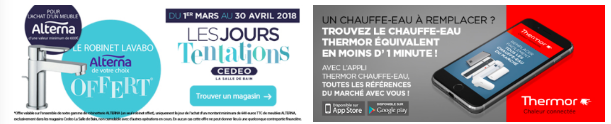  
*2 items, 50% width each - representation*

**!!** Note : it is up to contributor to make sure that Banners within a
marketing block have height / ratio, no matter what configuration is
chosen.

### Products Carousel Line

Label : Carrousel de produits Page d'accueil (homepage\_products\_list)

This block allows to entityreference products to be displayed on front.
<del>Block does not have any specific visibility rules (except for Product
prices and tax info), meaning that it will be shown for all Users, no
matter their role / agency.</del> This block is [*user sensitive, see
related section*](#visibility-block).

Amount of products to add is not limited. Carousel switches items 4 by
4.


1.  Block title : configurable from back-office

2.  **Products**. For each, display :

	-   Image

	-   Promotion label if exists

	-   Brand

	-   Product title

	-   Price / tax info (HT / TTC) =&gt; specific to user role. See
     [*related section*](#prices-displaying) for additional details

	-   Product unit  
  
=&gt; on-click, User is redirected to Product page

3\.  **Carousel dots** : active dot color is taken from Brand Secondary
     color

4\.  **Publication date** : [*see concerned
     section*](#content-scheduling).

### Brands List Line

This block allows to entityreference Brands to be displayed on front.
Block does not have any specific visibility rules, meaning that it will
be shown for all Users, no matter their role / agency.

Amount of Brands to add is not limited.

Note that this block is a slider, which displays 8 items per slide. If
there are 8 items or less, then Slider dots are not shown.


1.  **Block title** : configurable from Back-office

2.  **See all brands button** : onclick, redirects User to the Brands
     Landing page. Button label is translatable from Translate
     Interface

3.  **Brand items** : for each, only Logo is displayed. Onclick,
     redirects User to the corresponding Brand detail page

### <del>Instagram feed Line</del>

Instagram feed module has been disabled as it is not used anymore.

This block allows to display Instagram pictures, retrieved from
Instagram account defined in back-office.\
Instagram Client ID and Client Secret are configured in settings.inc.

Note that on block level, it is possible to define tag(s) to be used for
Pictures filtering.

It is also possible to define amount of pictures to be retrieved.


1.  **Block title** : defined on block level

2.  **Instagram account avatar** : automatically retrieved from
     Instagram account

3.  **Instagram account name** : automatically retrieved from Instagram
     account

4.  **CTA** : on-click, opens Instagram page in a new tab. Button label
     is configured on block level. If label is not filled in
     back-office, do not show the icon

5.  **Amount of Comments / Likes** : show amount of total Comments and
     Likes from the Account. Both icons (SVG) can be configured from
     back-office

6.  **Instagram pictures**, retrieved from configured Instagram account.
     Based on criteria(s) set (potential tag(s) filtering / amount of
     pictures defined), order is the following :

	-   Sum up the amount of likes and comments, then order by most likes /
     comments.

Example : if picture A has 3 likes and 7 comments (total = 10), and
picture B has 8 likes and 1\
comment (total = 9), then show Post A in 1st position, and Post B in 2nd
position.

7\.  **Carousel dots** : show 4 images per slide. If 4 or less pictures
     retrieved on the block, then do not show dots

### WYSIWYG Line


**Content** : filtered HTML (full WYSIWYG)

### WYSIWYG no JS Line


Content : advanced decorated text

Contributors will use this block to add Product names + Product URLs,
for SEO purposes.  
If used, this line must be output on front-end ONLY in no JS mode
(disabled JavaScript).  
In terms of SEO, goal is to print block content in page HTML, so
crawlers will be able to read it.

## **403/404 page**


Translation Context : Page 404


1.  **Page title** : translatable from Translate Interface

2.  **Page description** : translatable from Translate Interface  
**!!** it should be possible to display several lines for description

3.  **Search block** : behaves as a CTA, on-click triggers the header
     Search Layer

4.  **Additional description** : configurable from Translate Interface

## **Light PDP VA - notInAgencyPortfolio article case for VA**


<del>A dedicated 404 page is used when trying to access an article which
does not exist in current agency. It applies when service **GET
/articles/{id}** responds with status 422 Unprocessable Entity and key
“article.not.in.agency.portfolio”.</del>

For all articles not available in agency portfolio BUT available in
nation-wide ( /v1/articles/{id}/nation-wide response is 200) display :

-   ONLY detail information from nation-wide

-   on right side of the page "CTA to product locator" (see pt 5
     underneath)

**New** : this behaviour is ONLY for VA users, for VAR and VI users see
[*concerned
section*](#light-pdp-varvi---notinagencyportfolio-article-case-for-var-vi).

  
*wireframe*

  
*New implementation*

For all other cases (product not in portfolio i.e. product does not
exist AT ALL -nation-wide return null), default 404 page is used.

Sample call :
[*http://ingress.ibm.ppr.docker4sg.saint-gobain.net:12090/impulse-article-query/api/v1/articles/1090527?agencyId=1295&websiteId=cedeo*](http://ingress.ibm.ppr.docker4sg.saint-gobain.net:12090/impulse-article-query/api/v1/articles/1090527?agencyId=1295&websiteId=cedeo)

-   websiteId : cedeo

-   Agency : 1295

-   Product Id : 1090527

  
 *Old implementation*

1.  **Product title** : product that User tried to access.If we don't
     get Product name, then displays static string “Ce produit n'est
     pas disponible dans votre agence” which translatable from
     Translate interface.

2.  <del>**Description** : translatable from Translate Interface. Base
     string :</del>

  
  ><del>Le produit que vous recherchez n’est pas disponible dans cette agence, nous vous proposons les produits similaires suivants :</del>
  

3\.  <del>**Similar products** : retrieved from **GET
     /articles/{id}/related** (show only products with type = SIMILAR).
     Display a carousel if more than 4 products returned. If no SIMILAR
     products are returned, then do not display the block, and replace
     description (point 2) by : </del>

 
  > <del>Le produit que vous recherchez n’est pas disponible dans cette agence. </del>
  

4\.  <del>**Description** : translatable from Translate Interface. Base
     string :</del>

  
  > <del>Cependant vous pouvez rechercher ce produit dans une agence à proximité : </del>
  

5\.  **Product Locator CTA** : on-click, opens the Product Locator.
     Corresponding logic is described in the [*corresponding
     section*](#social-medias-sharing). Button label : “Rechercher ce
     produit à proximité” (translatable from Translate Interface)

## **Light PDP VAR/VI - notInAgencyPortfolio article case for VAR, VI**


Light PDP concerns all articles not available in agency portfolio BUT
available in nation-wide ( /v1/articles/{id}/nation-wide response is
200).

**Note** : this behaviour is ONLY for VAR and VI users.

Display existing blocks like in light PDP (in green) and ADD 3 new
bile display if no similar products available
blocks :

-   Unavailable product block (1)

-   Similar products block (2, 4)

-   Nearest agencies block (3)

  
*Desktop display if no similar products available*

  
*Desktop display if similar products available*


*Mobile display if no similar products available*


*Mobile display if similar products available*

**Important @design !!** :

Even if the height of the similar products block and the nearest
agencies block are different (yellow line), the background underneath
both blocks shall have a rectangular shape and be aligned (blue line).


**Design!! :** change in background color

Webmaster shall be able to configure the background color of this block
in BO : /admin/structure/config\_pages/products\_settings/edit

Add a new tab: Page produit - not in agency

Label : Couleur de background


1.  **Block unavailable product **

It is composed of :

-   Icone : it can be uploaded in BO (1.1) in
     /admin/structure/config\_pages/products\_settings/edit  
 new tab: Page produit - not in agency  

 Label : Icône Produit indisponible

-   Background color (1.2) : webmaster shall be able to choose the
     background color of the block

-   Border and font color (1.3) : webmaster shall be able to choose the
     color of the border AND the font color of the first part of the
     string “Ce produit est indisponible” (product is unavailable)

String is translatable in the translation interface.

  ```
  Ce produit est indisponible dans votre agence @agency-name - @agency-zip-code
  ```

Context : Produit détail


2\.  **Similar products block - if there are similar products available**


If the product has some similar products, display :

-   **Title (1) **

String is translatable in translation interface.

  ```
  Voir les produits similaires dans votre agence @agency-name
  ```

Contexte : Produit détail

**Design** : the words “dans votre agence” (in your agency) shall be
displayed in the secondary color of the brand.

-   **a list of 4 similar products maximum (2)**.

Display the 4 first products sent by the webservice.

**Note (not in design!) OPTIONAL** : if more than 4 similar products are
available AND a similar products carrousel is displayed on the page,
display a translatable link (anchor).

  ```
  Voir plus
  ```

Contexte : Produit détail

On click, the user goes to the carrousel of similar products displayed
in the page.

**4. Similar products block - if there are **

If the product has NO similar products, display the following elements :

l

-   **4.1 Title**

String is translatable in translation interface.

  ```
  Découvrez d'autres produits dans la @category ou contactez votre agence @sitename
  ```

Contexte : Produit détail

**Design** : the category of the product shall be displayed in the
secondary color of the brand.

On click on the category name, the user shall be redirected, in a new
tab, to the concerned category PLP.

-   **4.2 Secondary CTA **

Label is translatable. On click on the CTA, the user is redirected to
the category page of the product (new tab)

  ```
  Voir les autres articles de la catégorie
  ```

Contexte : Produit détail

-   **4.3 Block "Contact your agency"**

**Design** : if possible reuse an existing block

Label is translatable from translation interface.

  ```
  Contacter votre agence
  ```

Contexte : Produit détail

For each agency, display :

-   Agency name ( DO NOT display km, as it might be 0 as it is current
     agency)

-   Adresse

-   Telephone

-   Itinerary (clickable)

-   Email (cicable)

-   Closing hours : same behaviour as in [*My agency
     (pop-up*](#my-agency-pop-in), like in product locator)

3\.  **Nearest agencies block**

Scenario 1) If there are agencies available, display the following
elements :

-   **3.1 Title**

Translatable in the translation interface.

  ```
  Voir la disponibilité du produit à proximité
  ```

Contexte : Produit détail

**Design** : the words “à proximité” (near) shall be displayed in the
brands’ secondary color


-   **3.2 List of 5 agencies max**

Display the five nearest agencies maximum. If there are less than 5
agencies, display less. If there are no agencies near, see scenario 2)
underneath.

The user can choose which one he prefers by checking the checkbox.

Display :

-   City - (distance)

-   Product availability

On hover on an agency, the agency will turn grey.

-   **3.3 Swipe effect**

On click on the arrow, a “swipe” effect will be implemented. The user
will have the choice of confirming this choice. If the new agency is
chosen, the page will reload and the user will be attached to the new
agency.

Label : Confirmer


-   **3.4 Link to product locator**

Translatable label : Voir la disponibilité à proximité.

On click, the user is redirected towards [*the product
locator.*](#product-locator) (new tab)

Scenario 2) If there are NO nearest agency, display the following
elements :


-   **3.1 Title** (same as previous)

-   **3.2 Description**


Translatable in the translation interface.

  ```
  Les agences à proximité ne disposent pas de ce produit, pour plus d'information :
  ```

Contexte : Produit détail

-   **3.3 CTA “contact your agency”**

Translatable label : Contacter mon agence

On click, open the pop-up “[*Request information
form*](#request-information-form)”


## **Request information form** 


This form opens in a pop-in, when clicking on a Product CTA button which
has cta field value = INFO.

It triggers the sending of an email to the User and to the Agency.

Functionally, this pop-in is used to send a request directly to the
Agency, so then transaction can be processed offline : client inputs his
needed quantity, fills in form with his personal information, and
submits. Then, an email is sent to the Agency, which will contact the
User to arrange the transaction (offline).

Translate Interface Context : Popin demande d’informations

### Form pop-in

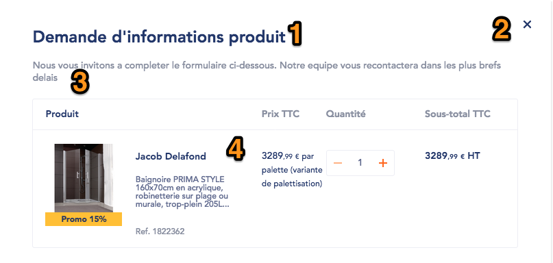

1.  **Pop-in title** : translatable from Translate Interface

2.  **Closing cross** : on-click, closes the pop-in. Clicking outside of
     the pop-in also closes it.

3.  **Pop-in description** : translatable from Translate Interface

4.  **Product info** from which Request Information pop-in was
     triggered. It is composed of

	-   ***Table headers*** :

		-   Produit (label translatable from Translate Interface)

		-   Prix \[tax label\] : tax label is specific to the User

		-   Quantité (label translatable from Translate Interface)

		-   Sous-total \[tax label\] : tax label is specific to the User

	-   ***Table data*** :

		-   Product main image

		-   Product Promo label (if exists)

		-   Product “New” label (if exists)

		-   Product Brand

		-   Product title

		-   Product ID (“Ref.” label is translatable from Translate
         Interface)

		-   Unit Price / Product Unit

		-   Quantity widget (can be either standard quantity widget or
         calculation tool, depending on Product). Note that Quantity
         widget is NOT related to stacQuantity / availableQuantity, so
         there is no limit regarding input quantity.

		-   Unit Price \* selected Quantity. Tax label is specific to the
         User


5\.  **Form title** : translatable from Translate Interface

6\.  **Form components**, composed of :

-   Civility (mandatory)

-   First Name (mandatory)

-   Last Name (mandatory)

-   Phone number (mandatory)

-   Additional info (text area, optional)

=&gt; If User is logged-in fields are prefilled with his info.

7\.  **Submit button** : on-click, if all mandatory fields are filled,
     pop-in updates to the confirmation state, and emails (to User and
     to Agency) are sent.

**!!** 2 additional fields are displayed on the form, for ***VA Users
only*** :

-   Region (mandatory)

-   Agency (mandatory)


Both are displayed below the “Additional info” field.

Région drop-down :

-   Label : Région

-   Placeholder : Sélectionnez votre région

-   Content is retrieved from **GET /agencies/regions**

Agency drop-down :

-   Label : Agence

-   Placeholder : Sélectionnez votre agence

-   Conditional field, depending on value selected for Région. Service
     **GET /agencies/agencies-by-lov** is used to retrieved agencies
     corresponding to selected region.

	-   If no Region was selected, then Drop-down 2 shows empty list.

Once VA User submits the form, email is then sent to selected Agency
email address.  
Also, User gets linked to selected agency, thus becomes a VAR User.

### Confirmation pop-in

Once User has submitted the form, the following Confirmation pop-in
appears :

1.  **Pop-in title** : translatable from Translate Interface

2.  **Closing cross** : on-click, closes the pop-in. Clicking outside of
     the pop-in also closes it.

3.  **Pop-in description** : translatable from Translate Interface

4.  Product info, composed of :

	-   Main image

	-   Brand

	-   Product title

	-   Product ID (“Ref.” label is translatable from Translate Interface)

### Email sent to User

Once User has submitted the form, a Confirmation email is sent to him
(simple email template is used for it) :

**Subject** : cedeo.fr – Demande d’informations sur le produit \[product
ID\]

  ------------------------------------------------------------------------------------------------------------------------------------------------
  Bonjour \[civility\] \[Last Name\],
  
  Merci pour votre demande d’informations sur le produit \[product ID\].
  
  Nous nous efforçons de vous apporter une réponse dans les meilleurs délais. Pour rappel, les éléments liés à votre demande sont les suivants :
  
  Code produit : \[product ID\]
  
  Descriptif produit : \[product name\]
  
  Quantité souhaitée : \[quantity input by User\]
  
  Informations complémentaires : \[comment input by User\]
  
  -   
  
  Cordialement,
  
  L’équipe cedeo.fr
  ------------------------------------------------------------------------------------------------------------------------------------------------

### Email sent to Agency

Once User has submitted the form, a Confirmation email is sent to Agency
(to which User is currently linked).

It is also possible to manually configure from BO email address(es) to
which email will be sent in copy.

Simple email template is used for it) :

**Subject** : cedeo.fr – Demande d’informations sur le produit \[product
ID\]

------------------------------------------------------------------------------------
 Bonjour,                                                             
 La demande suivante vient d'être effectuée sur le site cedeo.fr       
 concernant le produit \[product ID\].                                 
                                                                       
 **Information produit**                                               
                                                                       
 Code produit : \[product ID\]\                                        
 Descriptif produit : \[product name\]\                                
 Quantité souhaitée : \[quantity input by User\]\                      
 Informations complémentaires : \[comment input by User\]              
                                                                       
 **Information client**                                                
                                                                       
 Contact : \[civility\] \[first name\] \[last name\]\                  
 E-mail : \[User email address\]                                       
                                                                       
 Téléphone : \[Phone number\]\                                         
 Code client : \[company ID, if exists\]\                              
 Nom de la société : \[company name, if exists\]                       
                                                                       
 Demande faite à l’agence \[agency:name\]                              
                                                                       
 Merci de recontacter le client dans les plus brefs délais.            
                                                                        
 L’équipe cedeo.fr                                                     
--------------------------------------------------------------------------------------

## **User registration**

 [*See new registration implementation here.*](https://docs.google.com/document/d/15z5HdhxrM8DVCBiV6EETW-4yd4Ly7jgVcV6prSrLe5Y/edit#)
 

### <del>VI Registration</del>

<del>**Settings**</del>

| <del>Expected URL alias</del>          | <del>/inscription/nouveau-client</del>                                |
| --------------------------- | ---------------------------------------------------------- |
| <del>Breadcrumbs</del>                 |<del>\[site:name\] > Créer mon compte en ligne > Nouveau client</del> |
|<del> Meta-title</del>                  | <del>Configurable from back-office</del>                              |
| <del>Meta-description</del>            | <del>Configurable from back-office</del>                              |
| <del>Translate Interface Context</del> | <del>Inscription, Placeholders</del>                                  |

<del>VI Registration can be enabled / disabled from back-office. If
enabled, then :</del>

-   <del>On login page, clicking on “Register” button will open the
     “registration form selection pop-in”</del>

-   <del>On Registration pages, VI registration menu entry is shown </del>

#### <del>Registration form selection</del>

<del>If VI Registration is enabled from back-office, then clicking on
“Register” button opens the “registration form selection pop-in” (if VI
Registration not enabled, clicking on this button directly leads to the
VI CLI registration form page). </del>

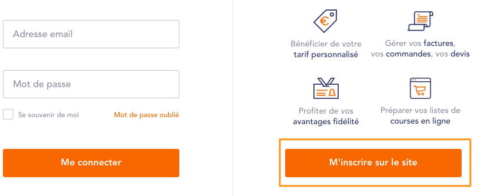

<del>*Old implementation*</del>

  
<del>*Old implementation*</del>

1.  <del>Pop-in title : S’inscrire - translatable from Translate
     Interface/<del>

2.  <del>Closing cross : on-click, closes the pop-in (same as clicking
     outside pop-in)</del>

3.  <del>Pop-in description : Êtes-vous déjà titulaire d’un compte client
     dans une agence CEDEO ? translatable from Translate Interface</del>

4.  <del>Radio-buttons (Oui / Non) :</del>

	-   <del>Oui (yes) : redirects to the VI CLI registration form</del>

	-   <del>Non (no) : redirects to the VI Registration form </del>

5.  <del>Validate button : Valider - translatable from Translate Interface
     ; on-click, redirects to corresponding form according to User
     choice on radio-buttons</del>

#### <del>VI Registration form</del>

  
<del>*Old implementation*<del>

1.  <del>Breadcrumbs</del>

2.  <del>Sidebar menu : menu entry “Nouveau client” (label translatable
     from Translate Interface) is shown is VI Registration is enabled</del>

3.  <del>**Page title** : translatable from Translate Interface</del>

4.  <del>**Page description** : translatable from Translate Interface</del>

5.  <del>**User information form**, composed of :</del>

	-   <del>Email address : mandatory, email input format</del>

		-   <del>If not filled: “Veuillez renseigner votre adresse email”</del>

		-   <del>If not valid: “Le format de votre adresse email est
         invalide”</del>

	-   <del>Password : mandatory, must contain at least 8 chars, with 1 digit,
     1 letter and 1 special char </del>

		-   <del>If not filled: “Veuillez renseigner votre mot de passe”</del>

		-   <del>If not valid: “Votre mot de passe doit contenir 8 caractères
         minimum, au moins une lettre, un chiffre et un caractère
         spécial”</del>

	-   <del>Confirm password : mandatory, must contain at least 8 chars, with
     1 digit, 1 letter and 1 special char </del>

		-   <del>If not filled: “Veuillez confirmer votre mot de passe”</del>

		-   <del>If not matching “Les mots de passe saisis ne sont pas
         identiques”</del>

	-   <del>Civility : mandatory, “M” is selected by default</del>

	-   <del>Last Name : mandatory</del>

		-   <del>If not filled: “Veuillez renseigner votre nom”</del>

	-   <del>First Name : mandatory</del>

		-   <del>If not filled “Veuillez renseigner votre prénom”</del>


<del> =&gt; All labels / placeholders are translatable from Translate
Interface.</del>


6\.  <del>**“Are you a professional user?” selection** : choice determines
     if User will be VI Part or VI Pro. </del>

-   <del>If “Oui” (yes) is selected, then show fields 7 and 8. User will be
     VI Pro</del>

-   <del>If “Non” (non) is selected, then do not show fields 7 and 8. User
     will be VI Part</del>

<del>=&gt; Labels are translatable from Translate Interface</del>

7\.  <del>**SIREN field** : shown only if “Oui” was selected on previous
     field. Field is mandatory. Rule : 9 chars max, only digits. Label
     is translatable from Translate Interface</del>

a.  <del>If not filled: “Veuillez renseigner votre numéro de SIREN”</del>

b.  <del>If not valid: “Votre numéro de SIREN doit comporter au maximum
         9 chiffres”</del>

8\.  <del>**Company name field** : shown only if “Oui” was selected on
     previous field. Field is mandatory. Label is translatable from
     Translate Interface</del>

a.  <del>If not filled: “Veuillez renseigner votre raison sociale”</del>

9\.  <del>**Agency selection** : **!!** Field on design must be replaced by
     2 drop-down fields (both mandatory) :</del>

-   <del>Drop-down 1 :</del>

	-   <del>Label : Région</del>

	-   <del>Placeholder : Sélectionnez votre région</del>

	-   <del>Content is retrieved from **GET /agencies/regions**</del>

-   <del>Drop-down 2 : </del>

	-   <del>Label : Agence</del>

	-   <del>Placeholder : Sélectionnez votre agence</del>

	-   <del>Conditional field, depending on value selected for Région.
         Service **GET /agencies/agencies-by-lov** is used to retrieved
         agencies corresponding to selected region. </del>

	-   <del>If no Region was selected, then Drop-down 2 shows empty list.
         </del>

		-   <del>If not selected: “Veuillez sélectionner l’une de nos
             agences”</del>

10\.  <del>**Checkbox** : label is translatable from Translate Interface</del>

11\.  <del>**Validate button** : Label is translatable from Translate
     Interface. On-click, if all mandatory fields are filled, then User
     is redirected to the Registration request confirmation page, and
     email address confirmation email is sent to User. </del>

<del>***Registration request confirmation page :***</del>


<del>Title and description are translatable from Translate Interface.</del>

<del>Email address (in orange) is the one that was input by User on previou
step. </del>

 <del>Note that if User tries to login (via Login page) without having
 validated his email address, then an error message is displayed on
 Login page “Vous devez valider votre adresse email avant de pouvoir
 vous connecter.“ (You must validate your email before being able to
 login) </del>

<del>***Form fields :*** </del>

| <del>Field Label</del>                                                                             | <del>JSON mapping</del>  | <del>Example</del>                     |
| --------------------------------------------------------------------------------------- | ------------- | --------------------------- |
| <del>Adresse email</del>                                                                           | <del>email</del>         | <del>lbaron@adyax.com</del>            |
| <del>Mot de passe</del>                                                                            | <del>password</del>      | <del>Impulse2017!</del>                |
| <del>Confirmation mot de passe</del>                                                               | <del>NA</del>            | <del>Impulse2017!</del>                |
| <del>Civilité (M, Mme)</del>                                                                       | <del>civility</del>      | <del>M</del>                           |
| <del>Nom</del>                                                                                     | <del>lastName</del>      | <del>Lucas</del>                       |
| <del>Prénom</del>                                                                                  | <del>firstName</del>     | <del>Baron</del>                       |
| <del>Êtes-vous un professionnel ? (Oui, Non)</del>                                                 | <del>NA</del>            | <del>Oui</del>                         |
| <del>SIREN (numéro à 9 chiffres)</del>                                                             | <del>companySIREN</del>  | <del>123456789</del>                   |
| <del>Raison sociale</del>                                                                          | <del>companyName</del>   | <del>Adyax</del>                       |
| <del>Sélectionnez votre agence</del></br><del>Région / Agence</del>                                              | defaultAgency | 1002                        |
| <del>Je souhaite recevoir par e-mail les infos, conseils et les offres commerciales de Cedeo</del> | <del>newsletter</del>    | <del>Checked: true</del><br><del>Empty: false</del> |


### ***Error cases* :**

-   If users already have an account but didn’t confirm his email yet,
     service will respond 400 Bad Request with an error object as below
     from which to map “error\_description” value, we’ll reload the
     page and display the following error message: Il semble que votre
     inscription n’ait pas été finalisée via le lien de confirmation de
     création de compte envoyé par email. Si le lien n’est plus valide,
     vous pouvez utiliser la fonctionnalité “Mot de passe oublié” pour
     compléter votre inscription.

```
400 Bad Request
{
   "error": "invalid_grant",
   "error_description": "User account is locked"
}
```

-   If users already have an active account, then service will respond
     422 with a key “email.already.in.use” and we’ll display the
     following message: “Un compte Internet est déjà associé à
     l’adresse email renseignée. Veuillez vous connecter à votre espace
     pro via le formulaire de login ou utilisez une autre adresse
     email.”

-   If service responds with 40X / 50X then the default message will
     apply: ““Une erreur est survenue. Nous sommes désolés pour la gêne
     occasionnée et vous invitons à contacter notre service Internet si
     le problème persiste.”

## **Edito : Advices section**


The “Advices” (Conseils) section is composed of 2 templates :

-   Landing page that shows highlighted Advices, categories bar and
     Listings

-   Detail page

### Advices Detail page

**Settings **

| Expected URL alias          | conseils/\[node:title\]                   |
| --------------------------- | ----------------------------------------- |
| Breadcrumbs                 | \[site:name\] > Conseils > \[node:title\] |
| Meta-title                  | Configurable from back-office             |
| Meta-description            | Configurable from back-office             |
| Translate Interface Context | Conseils                                  |


1.  **Breadcrumbs**

2.  **Category** : there can be 1 category assigned per node
     (mandatory). Category is not clickable.

3.  **Creation date** : can be changed from back-office.

4.  **Page title**

5.  **Main image** : optional

6.  **Description text** : mandatory, decorated text

7.  <del>**Author** : optional. Auto-complete to Author entity. Composed of
     :</del>

	-   <del>Thumbnail (optional)</del>

	-   <del>First Name (mandatory)</del>

	-   <del>Last Name (mandatory)</del>

	-   <del>Description (plain text) (optional)</del>
 **Note :** on [*new design advice detail
 page*](#new-advices-detail-page), there is no author block any more.
 Client requested to delete this block from BO.


8\.  **Sharing tools**

9\.  **Node body** : WYSIWYG (mandatory)

10\.  **Related articles** : display the last <del>5</del> 3 nodes from the same
     Category as current node, ordered by publication date. On click on
     the block, go to related Conseils node. For each, display :

-   Thumbnail (mandatory)

-   Category

-   Publication date

-   Title


11\.  **Download section** :

 Can be contributed in BO in the content type page (tab:
 téléchargement)

 amount of items is not limited. Authorized extensions : png, jpg,
 jpeg, doc, docx, ppt, pptx, xls, xlsx, pdf. Items are ordered as
 following :

1 - 2

3 - 4

Etc…

For each item, display :

-   Title (mandatory)

-   Thumbnail optional, not clickable, and they are uploaded from BO.

 if it does not exist, then the default thumbnail is displayed. This by
 default thumbnail can be contributed in BO in configuration page of
 ESDB landing page :
 /admin/structure/config\_pages/advice\_settings/edit\
 Thumbnails are File extension - file weight

-   Download button : on-click, either downloads file or open it in a
     new browser tab (depending on Browser settings / field type)

12\.  **Tags** : amount of tags is not limited. Tags are not clickable.

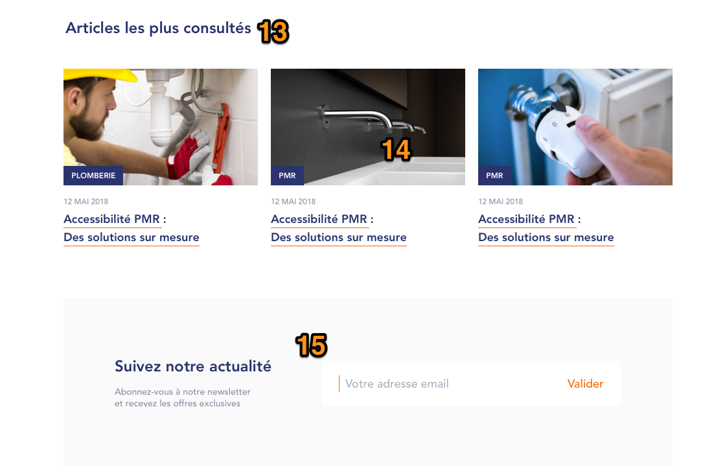

13\.  **Block title** : translatable from Translate Interface

14\.  **Most read Conseils nodes** : display the 3 most viewed nodes. On
     click on the block, go to related Conseils node.For each, display
     :

15\.  **Newsletter block**, composed of :

-   Title (translatable from Translate Interface)

-   Description (translatable from Translate Interface)

-   Email input field : with front-end validation. Placeholder and
     “Valider” link labels are translatable from Translate Interface.

NEWSLETTER PROCESS TO BE DEFINED.

### Advices Landing page

**Settings **

| Expected URL alias          | /conseils                     |
| --------------------------- | ----------------------------- |
| Breadcrumbs                 | \[site:name\] > Conseils      |
| Meta-title                  | Configurable from back-office |
| Meta-description            | Configurable from back-office |
| Translate Interface Context | Conseils                      |


 In BO, Webmaster can configure this page in
 /admin/structure/config\_pages/advice\_settings/edit

1.  **Breadcrumbs**

2.  **Main highlighted Conseil node**. Manually entity-referenced from
     Back-office. Composed of :

	-   Thumbnail

	-   Category

	-   Title

=&gt; On-click on block, redirects to detail page

**!!** Note that ****those 3 items are common to all categories**** (no
specific highlighted Conseil nodes\
depending on selected category (see point 4).

3\.  **Secondary highlighted Conseil nodes**. Manually entity-referenced
     from Back-office. Composed of :

-   Thumbnail

-   Category

-   Title

=&gt; On-click on block, redirects to detail page


4\.  **Categories bar** : term-reference to Conseils Categories (selected
     manually - order of categories can be defined using Drag & Drop).
     Amount of categories to reference is not limited, it is up to
     contributors to make sure that rendering on front-end will be
     correct.

First item “Tout” (“all”) is always displayed (not configurable, label
is translatable), and shows the list of\
all Conseils nodes (displayed below), ordered by Publication date.\
Clicking on a category reloads the page (with dedicated URL) and shows
content filtered on selected\
category.
Selected item from bar is highlighted.

5\.  **Search icon**

6\.  <del>**Highlighted nodes** : for each category listing (including
     “Tout” item), the 3 1st items are displayed in Grid mode ONLY of
     1st page of pagination. For each, display :</del>

-   <del>Thumbnail</del>

-   <del>Category</del>

-   <del>Publication date</del

-   <del>Title</del>

7\.  <del>**Content listing** : 4 items are displayed below the highlighted
     nodes. For each, display :</del>

-   <del>Publication date</del>

-   <del>Title</del>

-   <del>Thumbnail</del>

-   <del>Category </del>

-   <del>Short description (automatically retrieved from node)</del>


8\.  **Pagination** : there are 7 items displayed per page (3 in Grid
     mode, 4 in List mode on 1st page of Pagination, and 7 in List mode
     starting from page 2). Current page is highlighted. See behavior
     in [*corresponding section*](#pagination) (screenshot does not
     reflect correct design).

9\.  **Newsletter block**, composed of :

-   Title (translatable from Translate Interface)

-   Description (translatable from Translate Interface)

-   Email input field : with front-end validation. Placeholder and
     “Valider” link labels are translatable from Translate Interface.

NEWSLETTER PROCESS TO BE DEFINED.

## **New design - Advices section**


A new design and some new blocks are to be implemented in the advice
section (also to [*ESDB advice
section*](https://docs.google.com/document/d/1NE2eRXNbU4BfTyHM_3yglWRJYYytdvw6UFqmBmCxSGU/edit#heading=h.ybwr0g3bi97f)).
This new design applies to the following templates :

-   Landing page

-   Detail page

### New advices Detail page

Only new design, new blocks and new behaviours [*from v1
implementation*](#advices-detail-page) will be described here.

Webmaster can contribute/create this content in BO :
[*https://pointp.test.white.adyax-dev.com/node/add*](https://pointp.test.white.adyax-dev.com/node/add)
&gt; Conseils

  
*New design*

Advices detail page are composed of :

-   Top part (A) : image, title, description, category label, theme
     label (NEW), publication date

-   \(B) Body : wysiwyg with new design

-   © NEW : marketing block

-   \(D) : NEW social network sharing

-   \(E) related articles

-   \(F) Tags

-   \(G) download section

 **@design** : is missing in the design, keep existing block with
 existing design.

A.  **Top part of the content detailed page**


The following existing elements are displayed with a new design :

-   Image (1)

-   Category taxonomy (3).

**@design** : to be displayed with a round board, after the theme label
(see pt 2 below)

-   Date (4)

-   Title (5)

-   Description (6)

**2. Theme**

It is a mandatory field that can be contributed in BO by webmaster in
the content page.

In the node, it is displayed before the category taxonomy. Non
clickable.


A new taxonomy is to be created.

Label : Theme Conseils

Webmaster can access it here and add new items
:/admin/structure/taxonomy


**3. Category label**

New design

**4. Publication date**

Change in the wording.

Display : day month year

**5. Title**

New design

**6. Description**

New design

A.  **Body**

Keep the same [*behaviour as in V1
implementation*](#advices-detail-page).

**@design** : Reuse existing styles on wysiwyg. Adjust styles if needed
but do not implement a specific wysiwyg.


 **C. Marketing block (NEW)**


Webmaster can contribute an optional marketing block in BO in the
advice’s node.

If the block is not filled, do not display it.

The block is composed of :

-   Image

-   Link. if it is an external link, the page shall be opened in a
     different tab.

**F. Tags **


Keep the same implementation as in V1.

New design.

(NEW) Title is a static string translatable.

  ```
  Les tags
  ```

Contexte : Conseils

If tags are not filled, do not display the title

If there is no marketing block displayed, display the tags underneath
the top banner.


**D. social Sharing block (NEW)**

The user shall be able to share the article in FB, linkedin, Twitter,
Instagram and by mail.

Label is a static string translatable

  ```
  Partager l’article
  ```

Contexte : Conseils


**@design** : reuse existing behaviour and design from [*social sharing
on PDP*](#social-medias-sharing). Put it in blue.

On click on “share” (partager), a pop-up will open displaying all
available social media and mail possibilities.

**E. related articles**


Keep the same general behaviour as in v1 (display nodes of the same
category)

**@design** : attention, error in design (we see articles of the same
theme)

New design.

(NEW) Display a maximum of 3 nodes.

(NEW) Title of the block is a static string.

  ```
  Cela peut vous intéresser
  ```

Contexte : Conseils

For each article teaser, display the following elements :

-   Thumbnail (3)

-   Theme (2). New

**Note** : if only one theme is available in BO, do not display the
theme label.

-   Category (4)

-   Title (5)

-   No date

-   Sponsored article (6). New

**6. Sponsored articles (NEW)**

A checkbox will be available in BO, whenever checked, the article will
be considered as a sponsored one.

A static string translatable.

  ```
  Article sponsorisé
  ```

This label will be display in the teaser of the node :

-   In the detail page : in the related articles block

-   In the landing page : in the All advices’ section ([*see concerned
     section*](#new-advice-landing-page), pt 5)


**G. download section**

Keep [*existing implementation and design as in v1 (pt
11).*](#edito-advices-section)

**@design** : is missing in wireframes.


*Reminder : existing implementation and design*

### New advice Landing page

Only new design, new blocks and new behaviours from [*v1
implementation*](#advices-landing-page) will be described here.


1.  **Top banner**


The height is adjusted according to the height of the image.

This banner is optional.

**Devs** : H1 is the alt of the image banner. Not to be displayed in the
page. It is only needed for SEO purpose.

**Note** :

If filled, the banner will be displayed for both landing pages : Advice
and ESDB advice (/conseils and /inspirations-tendances)

If not, display only the tabs. If there are no tabs either, page will
look like this :


All new elements that can be contributed will be available to webmaster
in the same config\_pages as in v1, in
/admin/structure/config\_pages/advice\_settings/edit


2\.  **ESDB Advice Landing page tabs**

[*See concerned
section.*](https://docs.google.com/document/d/1NE2eRXNbU4BfTyHM_3yglWRJYYytdvw6UFqmBmCxSGU/edit#heading=h.nn9pmdb6uf2r)
Note that some changes are applied to existing behaviour.

3\.  **Highlighted nodes’ section**

  
*New implementation*

  
*V1 implementation*

**@design** : please note the following differences :

-   The design of the category label has changed : “reglementation”

-   a new theme label, in blue, is displayed (“infos techniques”, “actus
     produits”) ([*see concerned section pt
     A2*](#new-advices-detail-page)).

**Note** : if only one theme is available in BO, do not display the
theme label.

-   The title’s design has changed

Keep the current [*implementation for highlighted
nodes*](#advices-landing-page), plus :

-   add a **Title**.

Translatable static string.

  ```
  Expertise et solutions
  A LA UNE
  ```

Context : Conseils

@design : apply two different styles.

-   Add the possibility for the webmaster to choose the color of the
     title’s font and the color of the categorie’s font for articles
     teaser (same color for both).


4\.  **Marketing block**


Webmaster shall be able to contribute a maximum of 2 marketing blocks.
They are optional.

If only one is contributed it will be displayed on 100% width.

Each block is composed of :

-   Image

-   Link. if it is an external link, the page shall be opened in a
     different tab.

In BO, those blocks will be contributed here :
/admin/structure/config\_pages/advice\_settings/edit


5\.  **All advices’ section**

  
*V1 implementation*

  
*New implementation*

6 articles will be displayed by publication date.

**5.1 Title**

Static string translatable in BO

  ```
  Tous les articles
  ```

Contexte : Conseils

**5.2 NEW : Theme bar**

In BO, the webmaster can choose which themes will be displayed in the
navigation bar.

  
*Current implementation for categories in navigation bar*

Use new taxonomy : Conseils Theme ([*see related section, pt
A2*](#new-advices-detail-page))

The user can select manually the themes to display.

The order of the themes can be defined using Drag & Drop.

The amount of themes to reference is not limited, it is up to
contributors to make sure that rendering on front-end will be correct.

No theme nor category filter will be applied by default.Thus, articles
from ALL themes AND ALL categories will be displayed by default.

Whenever the user clicks on a theme, reload the page (with a dedicated
URL) and show content filtered on the selected theme. Selected item from
the bar is highlighted.

**Note** : In order to avoid having a no results page, automatically
check all articles of the chosen theme and :

-   Display category labels of those articles as in design (in blue).
     They will be clickable.

-   On click on a category, reload the page and apply the concerned
     filters. If the user chooses a theme AND a category, display
     articles belonging to BOTH taxonomies (AND).

URL will be based on existing URLS (
[*www.cedeo.fr/conseils/chauffage\#articles*](https://www.cedeo.fr/conseils/chauffage#articles))
+ add a theme.

Ex with “actualites” being the theme :
[*www.cedeo.fr/conseils/chauffage/actualites\#articles*](https://www.cedeo.fr/conseils/chauffage#articles)

-   The other categories (categories with no articles related to the
     chosen theme), will NOT be clickable. They will be greyed.

In order for a user to unselect a theme, he needs to click on the active
theme.

**@design** :

-   if one theme or no themes are available : do not display the label.

-   if 2 themes are available : displayed them in 50% width

-   If 3 theme : follow design

-   If 4 theme : put them in the same line

-   If +, the 5th and more theme goes to the second line.

**Note**: if a theme label has no content related to him, then the theme
CTA is greyed out and not clickable (like for the categories). This will
avoid the user to click on it and go to a 404 page.

**5.3 Categories bar**

[*Same implementation as in v1.*](#advices-landing-page)

New design.

**5.4 Articles teaser**

**Note** : no more differences between highlighted nodes and content
listing. All articles are displayed following the new designs :

-   image

-   Title

-   Category

-   (NEW) Theme ([*see concerned section, pt
     A2*](#new-advices-detail-page))

**Note** : if only one theme is available in BO, do not display the
theme label.

-   (NEW) Sponsored article ([*see concerned section,
     pt 6)*](#new-advices-detail-page)

**5.5 Pagination**

**@design** : error. Do not apply the behaviour on wireframes. [*Keep
existing behaviour*](#pagination). Eventually adjust design.

1.  **Video block (NEW)**


Webmaster shall be able to contribute a video block. This block can
contain one or 2 videos maximum..

If only one video is contributed it will be displayed on 100% width.

If no videos are contributed, the video block is not displayed.

In BO, this block will be contributed here :
/admin/structure/config\_pages/advice\_settings/edit


**6.1 Image of the video block**

In BO, Webmaster can upload an image (png).

Label : Image du bloc vidéo de la page Conseils

**6.2 Title of the video block**

Static string translatable in BO

  ```
  Vidéos à la une
  ```

Contexte : Conseils

**6.3 Video**

Up to 2 videos can be contributed.

Each video has the following fields :

-   Image

**@design :** on top of the image please add a “overlay” with a “fake”
player icon in white.

-   External link : the page shall be opened in a new tab.

**6.4 bottom text**

Static string translatable in BO.

  ```
  Disponible sur
  ```

Context : Conseils

**6.5 Image of the bottom text**

In BO, the webmaster can upload an image (png). Non mandatory.


## **Brands section**


Brand section is composed of a Brands Listing page, and of Brand details
pages.

Note that it is possible to configure Early Birds widget for Brand
section. If defined, it will apply on :

-   Brand List page &gt; Highlighted products

-   Brand detail page &gt; Highlighted products

See additional information in the [*related section*](#brand-pages).

### Brand detail page

| Expected URL alias          | /les-marques/\[node:title\]              |
| --------------------------- | ---------------------------------------- |
| Breadcrumbs                 | \[site:name\] > Marques > \[node:title\] |
| Meta-title                  | Configurable from back-office            |
| Meta-description            | Configurable from back-office            |
| Translate Interface Context | Marques                                  |


 Apply [*new design and behaviours as in PLP*](#products-listing-page)
 (but keep top block design, see screenshot underneath)

1.  **Breadcrumbs**

2.  **Page logo** : mandatory  
 (it can be hidden in FE, see [*premium
 version*](#brand-detail-page---premium-version))

3.  **Short description** : plain text  
 **Brand ID** : mandatory. It is used to link a product to its brand in
 the product detail page.

4.  **Link** : optional, label and link are configurable. Opens page in
     a new tab by default.

5.  **Page title**

6.  **Highlighted products** : optional. Contributor can select up to 3
     products to highlight, using entityreference.

  

@design : within new PLP design, keep this block displayed as currently if it is contributed


7\.  **Marketing block 1** : Marketing item : image field. A link can be
     set (with option “open in a new tab”) (optional).

As for Home Page Marketing lines, there are several available displaying
modes :

-   100

-   50 / 50

-   66 / 33

-   33 / 66

-   33 / 33 / 33

-   50 / 25 / 25

-   25 / 50 / 25

-   25 / 25 / 50

-   25 / 25 / 25 / 25

Marketing blocks are managed as paragraph. For each paragraph, it should
be possible to define Role\
visibility (using checkboxes).

8\.  **Amount of products** : \[amount\] produits, where static string is
     translatable from Translate Interface

 For new style, see [*PLP section*](#products-listing-page)

9\.  **Sorting tool**

 For new style, see [*PLP section*](#products-listing-page)

10\.  **Filters** : retrieved from Search service. Brand ID (configured on
     node level) is passed to the Search request, to retrieve
     corresponding filters. Using filters redirects User to the Search
     Results page, where current Brand + selected filter will be
     applied. Note that on the Brand Detail page, Brand filter should
     NOT be displayed.

 For new style, see [*PLP section*](#products-listing-page)

11\.  **Products** : retrieved from Search service. Brand ID (configured
     on node level) is passed to the Search request, to retrieve
     corresponding products. By default, 24 products are shown per
     page.


12\.  **Amount of items per page** :

 For new style, see [*PLP section*](#products-listing-page)

 by default, show 24 products. Labels are transatable from Translate
 Interface. Others options :

-   48 items

-   96 items

13\.  **Pagination** : current page is highlighted. See behavior in
     [*corresponding section*](#pagination) (screenshot does not
     reflect correct design).

14\.  **Marketing block 2** : Marketing item : image field. A link can be
     set (with option “open in a new tab”) (optional).

As for Home Page Marketing lines, there are several available displaying
modes :

-   100

-   50 / 50

-   66 / 33

-   33 / 66

-   33 / 33 / 33

-   50 / 25 / 25

-   25 / 50 / 25

-   25 / 25 / 50

-   25 / 25 / 25 / 25

Marketing blocks are managed as paragraph. For each paragraph, it should
be possible to define Role\
visibility (using checkboxes).


15\.  **Edito block**

16\.  **Long description** : optional, decorated text.


17\.  **Brands carousel** : contributed from Back-office. Block title “Ces
     marques pourraient aussi vous intéresser” is translatable from
     Translate Interface. Title is not displayed if no Brands added for
     current Brand detail page. Contributor can add brands using
     entityreference (amount is not limited), but only 4 first are
     displayed on front-end.


18\. **Catalogue filter**

See concerned section on PLP, [*catalogue filter (pt
14)*](#products-listing-page)


<del>**NEW** : For SEO reasons, all filters from facets shall have the
"data-white-navigation" attribute available in a HREF attribute.</del>

### Brand detail page - premium version

The contributor can contribute new elements to the existing brand detail
page template in order to enhance it and make a “premium version”. He
can add as many items as he wants. He can drag and drop them to define
the FE display.

All these elements are available in a new tab :

Label : Version premium


**Note** : All these elements are **optional** and are displayed in FE
on top of non-premium elements


  
*Desktop display*

  
*Mobile display*

**Hide Top block** : A checkbox is available, if checked, the top block
of the [*standard brand detail page*](#brand-detail-page) (logo (1),
short description (2), highlighted products (3)) is NOT displayed


#### Bannière block (1)

Contributor is able to upload a :

-   Desktop image

-   Mobile image

#### WYSIWYG block (2)

Composed of :

-   full wysiwyg field

#### Slider (3)


 Composed of as many images as wanted. There is no limitation on the
 number of slides to be contributed, it is a contribution issue.

**@design** In mobile view, display only one slide each time.

1.  Whole block is clicable. On click <del>on the “+”,</del> the image is
     displayed in an overlayer and it is zoomed (reuse existing
     behaviour). To be displayed in ALL images.

**Note** : on zoomed image respect ratio scale (thus image is downgraded
in the slider)

2\.  **3.** On click, on arrows “&lt;/&gt;”, the slider shows the
     previous/next slide. No infinite loop.

 No left arrow to be displayed, when the slider is showing the first
 slide. On click on the right arrow, display the next slide. A left
 arrow will then appear on the left side of the slider, on click on it,
 the slider will display the previous slide.

A hover effect is to be applied on the arrows.

4\.  A “decorated dots” (not a progress bar) are displayed underneath the
     slider.

#### Univers block


***@design** : a grey background is to be displayed for this block*

Composed of :

-   **Title (1)**

-   **Logo (2)**


-   **Univers line** : a maximum of 3 items can be contributed per line.
     Depending on the number of items contributed, display in FE will
     be adapted to display 2 or 3 items according to designs.

 For each line, the contributor can choose:

-   **Image location** : it is applied to ALL the images of the line

	-   Left (by default) : display image to the left and description to
         the right

	-   Right : display image to the right and description to the left

 For each item, the contributor can contribute :

-   **Desktop Image** . Mandatory

 **NOTE for contributor** : the FE display will adapt to the size of
 the uploaded image, so the image for 2 items line shall be a squared
 image (5) to match designs. The image for the 3 items line shall be a
 rectangular image (6) to match designs.

-   **Mobile image.** Mandatory


-   **Item title (7).** Text field

-   **Item description (8)** Text field

-   **Link (9).** Mandatory. Whole block is clicable. On click <del>on the
     “&gt;”,</del> the user is redirected to the contributed link.
     Possibility to choose to open in a new tab (checkbox).

**@design** In mobile view, display each item on top of each other.


#### Premium promoted products


***@design :** a half grey half white background is to be displayed for
this block*

  
*Mobile view*

Composed of :

-   **Title (1).** Text field

-   **Description (2)**. Text field

-   **Background color (3)** (color picker)

-    **CTA field (4) :** a label and a link can be contributed. Ability to open link in a new tab (checkbox)\
    Possibility to add an anchor \#product-list. On click on the anchor, the user is redirected to the list of products displayed underneath the page.

-   **Promoted products (5)** : a maximum of 3 products can be added
     (entity reference)

#### Full HTML block

Contributor can add a full html block. All tags except script are
allowed.

### Brand landing page

**Settings **

L alias          | /les-marques                  |
| --------------------------- | ----------------------------- |
| Breadcrumbs                 | \[site:name\] > Marques       |
| Meta-title                  | Configurable from back-office |
| Meta-description            | Configurable from back-office |
| Translate Interface Context | Marques                       |


1.  **Breadcrumbs**

2.  **Page title** : translatable from Translate Interface

3.  **Page description** : <del>translatable from Translate Interface</del>
     configurable from Back-office

4.  **Highlighted brand block title** : translatable from Translate
     Interface

5.  **Brand logo** : retrieved from Brand which is set as highlighted
     brand

6.  **Brand title** : retrieved from Brand which is set as highlighted
     brand

7.  **Brand description** : configurable from Back-office. If left
     empty, fallback is the short description from Brand which is set
     as highlighted brand

8.  **Discover all products link** : onclick, redirect to the brand
     detail page set as highlighted brand. Link label is translatable
     from Translate Interface

9.  **Highlighted products** : retrieved from brand detail page set as
     highlighted brand


10\.  **Block title** : translatable from Translate Interface

11\.  **“Selection” filter**, composed of :

-   Block label : translatable from Translate Interface

-   Checkbox 1 : Top brands. Label is translatable from Translate
     Interface. Amount of Brands flagged as “Top brand” is displayed
     into brackets (). Enabling checkbox reloads page, to show Top
     brands results only

 **!!** If there is no brand flagged as Top Brand, then checkbox and
 label are not displayed.

-   Checkbox 2 : promotions. Label is translatable from Translate
     Interface. Amount of Brands flagged as “Promotion” is displayed
     into brackets (). Enabling checkbox reloads page, to show
     Promotions brands only.

 **!!** If there is no brand flagged as Promotion, then checkbox and
 label are not displayed.

**!!** Both checkboxes can be combined

!! Brand detail pages must have ability to be flagged as “Top Brand” and
/ or as “Promotion”.

**!!** If there are no brands flagged as Top Brand and as Promo, then
block title ***Sélections*** is not
displayed

!! When page reloads, there must be an anchor to the ***Toutes nos
marques*** block title

12\.  **Categories filter**, composed of :

-   “Tous les univers” (label is translatable) =&gt; corresponds to “All
     categories”. Default value

-   Level 1 categories

!! Clicking on an item reloads page, and item is highlighted

!! Category(ies) are assigned to Brand on Brand detail level. Only level
1 categories can be used.
Several level 1 categories can be assigned to a Brand.

!! When page reloads, there must be an anchor to the ***Toutes nos
marques*** block title

13\.  **Search input field** : only Brand titles are indexed. If there is
     only 1 result, then directly go to corresponding Brand detail
     page. If there are no results, then display the following :


Title and description are translatable from Translate Interface.

!! When page reloads, there must be an anchor to the ***Toutes nos
marques*** block title

14\.  **Sort by drop-down**, composed of the following options :

-   Most popular (by default) : shows Top Brands ordered alphabetically
     first, then other Brands ordered alphabetically

-   A -&gt; Z : shows all brands ordered alphabetically, no matter if
     they are Top Brand or not

Labels are translatable from Translate Interface

15\.  **Brand block**. For each, display :

-   Top Brand element, if Brand is flagged as Top Brand. Label is
     translatable from Translate Interface

-   Star (favorite brand) : do not implement

-   Brand logo

-   Promotion element, if Brand is flagged as Promotion. Label is
     translatable from Translate Interface

-   Brand title

-   Brand short description

-   See all products link : on-click, redirects to Brand detail page.
     Label is translatable from Translate Interface


16\.  **Amount of results per page** : 24 by default. Other options :
     48, 96. Labels are translatable from Translate Interface

17\.  **Pagination** : current page is highlighted. See behavior in
     [*corresponding section*](#pagination) (screenshot does not
     reflect correct design).

## **Service detail page**


**Settings **

| Expected URL alias          | /\[node:title\]                |
| --------------------------- | ------------------------------ |
| Breadcrumbs                 | \[site:name\] > \[node:title\] |
| Meta-title                  | Configurable from back-office  |
| Meta-description            | Configurable from back-office  |
| Translate Interface Context | Services                       |

The Service detail page is built using Lines, that can be ordered via
drag & drop in back-office. Several occurrences of the same Line type
can be used on the page. Only Top block (header) is not managed as a
Line, but as a fixed part. It is composed of the following Line types :

-   Presentation Line

-   Benefits Line

-   Offers Line : 3 variants

	-   Rich Offers Line

	-   Standard Offers Line

	-   Simple Offers Line

-   Know more Line

Each Line has different front-end configurations, see explanations
below.

Also, it is possible to define node visibility per role, using
checkboxes.

### Header

!! Header is not managed as a Line, but as a fixed part.


1.  **Breadcrumbs**

2.  **Back link :** displayed if filled in back-office, else not
     displayed. Label “Retour” is translatable from Translate Interface

3.  **Node title**

4.  **Node description** : decorated text

5.  **Logo**

### Presentation Line

Presentation Line is composed of :

-   Background color

-   Text color

-   Description text (decorated text)

-   Media (either image or video, not both at the same time) :

	-   Image

	-   Video : YouTube video. If video is used, thumbnail is required.
         A “Play” logo will be displayed on front-end, onclick video
         player will open in a pop-in

=&gt; Play logo is SVG, it uses the Brand secondary color

=&gt; If both image and video are filled, video gets the priority

It can have the next displaying options (knowing that text will ALWAYS
be displayed on the left) :

-   ⅓ text - ⅔ media

-   ⅔ text - ⅓ media

-   ½ text - ½ media


Example of a Presentation block, with next configuration :

-   ⅔ text - ⅓ media

-   Video as a Media


### Benefits Line

Benefits Line is composed of :

-   Line title

-   2, 3 or 4 Benefit items (front-end must support rendering for all)

-   For each Benefit :

	-   PNG icon

	-   Description (with decorated text)


Example of a Benefits Line with 4 Benefits. Note that grey background
below each PNG icon is NOT part of the icon.

### Rich Offers Line

Rich Offers Line is composed of :

-   Line Title (optional)

-   Rich Offer paragraphs

-   Call to Action (optional, link / label are configurable, with option
     “open in a new tab”)

-   Description text (decorated text, optional)

Front-end must support rendering for 2, 3 or 4 items.

Screen below displays all fields composing the Rich Offer items. All
fields are optional.


6\.  **Title 1**

7\.  **Advantages list**, composed of :

-   Icon (PNG)

-   Description (text field)

=&gt; amount of items is not limited

8\.  **Price info 1**, composed of 2 text fields :

-   Price field (text field)

-   Currency + tax label (text field) (note that tax label is NOT
     specific to User here)

9\.  **Icon** : SVG, secondary color applies on it. This icon is defined
     on Icons Configuration Page.

10\.  **Title 2**

11\.  **Price info 2**, composed of 2 text fields :

-   Price field (text field)

-   Currency + tax label (text field) (note that tax label is NOT
     specific to User here)

12\.  **Description** : text field

On mouse-over, bottom line appears on the block. Also, it is possible to
define a link (with option “open in a new tab” unchecked by default) for
each of the blocks. If link is configured, then whole block is
clickable.

On mobile, blocks are displayed each one on top of the other (no
carousel).

### Standard Offers Line 

Standard Offers Line is composed of :

-   Line Title (optional)

-   Standard Offer paragraphs

-   Call to Action (optional, link / label are configurable, with option
     “open in a new tab”)

-   Description text (decorated text, optional)

Front-end must support rendering for 2, 3 or 4 items.

Screen below displays all fields composing the Standard Offer items. All
fields are optional.

**!!** Note that there are adjustments to make on HTML comparing to
initial design, see explanations below.


13\.  **Icon** (PNG)

14\.  **Top text** : text field. If Icon (point 12) and Top text
     (point 13) are configured, then Icon takes the priority.

15\.  **Title**

16\.  **Text above price** : text field

17\.  **Price info** , composed of 2 text fields :

-   Price field (text field)

-   Currency + tax label (text field) (note that tax label is NOT
     specific to User here)

18\.  **Text below price** : text field

19\.  **Horizontal separator** : there is one on top, one on bottom

20\.  **Bottom text : do not implement specific color for this part **

Regarding colors, rules are the following :

-   Background color is configurable using Color Picker. If left empty,
     white color is applied by default.

-   Regarding horizontal separators (point 18) :

	-   Apply X% opacity of the configured background color

	-   If no configured background color (so background is white), then
         use Grey for horizontal separator color

-   Text color is configurable using Color Picker. Apply this color to
     ALL texts of the item (!! update comparing to design).

It is possible to define a link (with option “open in a new tab”
unchecked by default) for each of the blocks. If link is configured,
then whole block is clickable.

On mobile, blocks are displayed each one on top of the other (no
carousel).

### Simple offers Line

Simple Offers Line is composed of :

-   Line Title (optional)

-   Simple Offer paragraphs

-   Call to Action (optional, link / label are configurable, with option
    > “open in a new tab”)

-   Description text (decorated text, optional)

Front-end must support rendering for 1, 2, 3 or 4 items.

Screen below displays all fields composing the Rich Offer items. All
fields are optional.


21\.  **Logo** : if more than 1 Simple Offer item, then logo is displayed
     on top of Title (point 21)

22\.  **Title**

23\.  **Text paragraph**, composed of :

-   Title : text field

-   Description : text field

Amount of text paragraphs is not limited

It is possible to define a link (with option “open in a new tab”
unchecked by default) for each of the blocks. If link is configured,
then whole block is clickable.

On mobile, blocks are displayed each one on top of the other (no
carousel).

### Know more Line

Know more Line is composed of :

-   Line title

-   Image : displayed on left, takes ⅔ of the width

-   Text block : displayed on the right, text ⅓ of the width

Block background color is configurable using Color picker.


24\.  **Line title**

25\.  **Image**

26\.  **Description** : decorated text. Text is white, if any links they
     are displayed using Brand secondary color

27\.  **CTA / download link** : link and label are configurable (with
     option “open in a new tab”). It is also possible to upload a PDF
     file to be downloaded by User, onclick (CTA label would still be
     configurable). If both Link and PDF are configured, PDF takes the
     priority.

## **Promotions section**


This section is composed of 2 pages (Web Promotions and Agency
Promotions). Switch between pages can be done using Tabs. Clicking on a
Tab loads corresponding page (each page has its dedicated URL /
breadcrumbs / Title).

The Promotions section is based on the Search Results template.

**!!** Note that it is possible to configure Pushes on the Promotions
pages. See [*related section*](#pushes-on-product-listing-pages) for
details.

### Web promotions page

**Settings **

| Expected URL alias          | /promotions-web                |
| --------------------------- | ------------------------------ |
| Breadcrumbs                 | \[site:name\] > Promotions Web |
| Meta-title                  | Configurable from back-office  |
| Meta-description            | Configurable from back-office  |
| Translate Interface Context | Promotions                     |

**Important! :** For new general behaviours/style, see [*PLP
section*](#products-listing-page)

Products are retrieved from **GET /articles/promotion/web**. Response is
an array of articles built upon articleDTO structure (same as used on
Product Listing Page), but without any search objects such as “query”,
“suggestion” or “filters”. As a result, there will be no filters
displayed on the left bar on the page. Instead, Contributors have
ability to define an image in Back-office that will be displayed on the
left bar.

<del>**!!** Note that “Web Promotion” label and background color must be
applied to all Products on page generation (without waiting for
***/pricing*** service response)</del>.

Prices are loaded via AJAX using ***/pricing*** service. Depending on
/pricing response :

-   If product has ***promotion*,** then display “Web promotion” label
     with corresponding background color, + corresponding price label
     (see [*related section*](#labels-tax-information-management) for
     details)

-   If product does not have ***promotion*** label, then do not display
     the “Web promotion” label, + use corresponding price label (see
     [*related section*](#labels-tax-information-management) for
     details)

**!!** Note that it is possible that service will return no products to
display. In this case, a specific message is displayed.\
See [*related sub-section*](#web-promotions---no-products) for details.


1.  **Breadcrumbs**

2.  **Page title** : translatable from Translate Interface. **!!**
     default string must be “Nos promotions”  
For new style, see [*PLP section*](#products-listing-page)

3\.  **Page description** : translatable from Translate Interface. **!!**
     default string must be “Retrouvez l'intégralité de nos promotions
     web et agence actuellement en cours.”

 For new style, see [*PLP section*](#products-listing-page)

4\.  **Web Promotions tab (active)** : amount of results is retrieved
     from the webservice, label is translatable from Translate
     Interface

**!!** Design update : amount of results must be placed after the label,
between brackets. For example :

-   PROMOTIONS WEB (1026)

Note that if there are no results, “0” is displayed as following :

-   PROMOTIONS WEB (0)

New : add a field for background color of the tab.

Contributor can edit these colors in BO in here :
/admin/config/sgdbf/config\_overrides &gt; recherche

Label for web promotion tab: Couleur du background de l’onglet
Promotions web

By default color : \#FDC000

 For new style and behaviours, see [*PLP
 section*](#products-listing-page)

5\.  **Agency Promotions tab (inactive)** : label is translatable from
     Translate Interface

New : add a color picker for background color of the tab.

Contributor can edit these colors in BO in here :
/admin/config/sgdbf/config\_overrides

Label for web promotion tab: Couleur du background de l’onglet
Promotions agence

By default color : \#FDC000

 For new style and behaviours, see [*PLP
 section*](#products-listing-page)

6\.  **Left sidebar image** : configurable from Back-office

 For new styles, see [*PLP section*](#products-listing-page)

7\.  **Amount of results per page** : same logic as on [*Product Listing
     Page*](#products-listing-page)

 For new style and behaviours, see [*PLP
 section*](#products-listing-page)

8\.  **Sort results** : by default, products are shown as retrieved via
     the web service. Default item is Pertinence (translatable via
     Translate Interface). Other available options : Du moins cher au
     plus cher (“from less expensive to most expensive”), Du plus cher
     au moins cher (“From most expensive to less expensive”)

Labels are translatable from Translate Interface.

 For new style and behaviours, see [*PLP
 section*](#products-listing-page)

9\.  **Web Promotion label + background color** : <del>displayed for ALL
     products on page load. Prices are then loaded from /pricing
     service.</del> Displayed only for products which have a
     ***promotion*** object.

Note that page has standard pagination at the bottom, as on Product
Listing Page / Search Results Page.

#### Web promotions - no products

If Service does not return any products, then page display is as
following :


**Important! :** For new general behaviours/style, see [*PLP
section*](#products-listing-page)

**!!** Page description is missing on screenshot, it should be
displayed.

Message to be displayed is the following :

  ---------------------------------------------------------------------------------------------------------------------------------------------------
  Aucune exclusivité web en ce moment. Vous pouvez parcourir notre catalogue via la barre de recherche ou l'onglet "Produit" du menu de navigation.
  ---------------------------------------------------------------------------------------------------------------------------------------------------

Text is translatable from Translate Interface.

### Agency promotions page

**Settings **

| Expected URL alias          | /promotions-agence                |
| --------------------------- | --------------------------------- |
| Breadcrumbs                 | \[site:name\] > Promotions Agence |
| Meta-title                  | Configurable from back-office     |
| Meta-description            | Configurable from back-office     |
| Translate Interface Context | Promotions                        |

**Important! :** For new general behaviours/style, see [*PLP
section*](#products-listing-page)

Products are retrieved from **GET /search/articles** which accepts a
boolean as parameter : 'promotion'. Response is an array of articles
built upon articleDTO structure (same as used on Product Listing Page).

<del>**!!** Note that “Agency Promotion” label and background color must be
applied to all Products on page generation (without waiting for
***/pricing*** service response). ***/pricing*** response will be used
only to display prices. </del>

Prices are loaded via AJAX using ***/pricing*** service. Depending on
/pricing response :

-   If product has ***promotion*,** then display “Agency promotion”
     label with corresponding background color, + corresponding price
     label (see [*related section*](#labels-tax-information-management)
     for details)

-   If product does not have ***promotion*** label, then do not display
     the “Agency promotion” label, + use corresponding price label (see
     [*related section*](#labels-tax-information-management) for
     details)

**!!** Note that it is possible that service will return no products to
display. In this case, a specific message is displayed.\
See [*related sub-section*](#agency-promotions---no-products) for
details.


1.  **Breadcrumbs**

2.  **Page title** : translatable from Translate Interface. **!!**
     default string must be “Nos promotions”  
For new style, see [*PLP section*](#products-listing-page)

3.  **Page description** : translatable from Translate Interface. **!!**
     default string must be “Retrouvez l'intégralité de nos promotions
     web et agence actuellement en cours.”  
 For new style, see [*PLP section*](#products-listing-page)

4.  **Web Promotions tab (inactive)** : label is translatable from
     Translate Interface

 For tab’s background color, see [*concerned section on web promotion
 page*](#web-promotions-page)

 For new general behaviour and styles, see [*PLP
 section*](#products-listing-page)

5\.  **Agency Promotions tab (active)** : amount of results is retrieved
     from the webservice, label is translatable from Translate
     Interface**

     !!** Design update : amount of results must be placed after the
     label, between brackets. For example :

-   PROMOTIONS AGENCE (1026)

Note that if there are no results, “0” is displayed as following :

-   PROMOTIONS AGENCE (0)

For tab’s background color, see [*concerned section on web promotion
page*](#web-promotions-page)

 For new general behaviour and styles, see [*PLP
 section*](#products-listing-page)

6\.  **Filters** (retrieved via the webservice)

 For new general behaviour and styles, see [*PLP
 section*](#products-listing-page)

7\.  **Amount of results per page** : same logic as on [*Product Listing
     Page*](#products-listing-page)

 For new general styles, see [*PLP section*](#products-listing-page)

8\.  **Sort results** : by default, products are shown as retrieved via
     the web service. Default item is Pertinence (translatable via
     Translate Interface). Other available options : Du moins cher au
     plus cher (“from less expensive to most expensive”), Du plus cher
     au moins cher (“From most expensive to less expensive”)

Labels are translatable from Translate Interface.

 For new general styles, see [*PLP section*](#products-listing-page)

9\.  **Agency Promotion label + background color** : <del>displayed for ALL
     products on page load. Prices are then loaded from /pricing
     service.</del> Displayed only for products which have a
     ***promotion*** object.

Note that page has standard pagination at the bottom, as on Product
Listing Page / Search Results Page.

#### Agency promotions - no products

If Service does not return any products, then page display is as
following :


**Important! :** For new general behaviours/style, see [*PLP
section*](#products-listing-page)

**!!** Page description is missing on screenshot, it should be
displayed.

**!!** Image must NOT be displayed (screenshot is the one from Web
promotions).

Message to be displayed is the following :

  ----------------------------------------------------------------------------------------------------------------------------------------------------
  Aucune promotion agence en ce moment. Vous pouvez parcourir notre catalogue via la barre de recherche ou l'onglet "Produit" du menu de navigation.
  ----------------------------------------------------------------------------------------------------------------------------------------------------

Text is translatable from Translate Interface.

## **Claims form**


**Settings **

| Expected URL alias          | /\[node:title\]                            |
| --------------------------- | ------------------------------------------ |
| Breadcrumbs                 | \[site:name\] > \[node:title\]             |
| Meta-title                  | Configurable from back-office, in the node |
| Meta-description            | Configurable from back-office, in the node |
| Translate Interface Context | Reclamations                               |

A dedicated Content Type allows to create pages that embed the Claims
form.

**!!** Note that form will be exactly the same (fields, labels, mapping
with services) on every node of this Content Type.\
**Content Type name** : Page Formulaire

This form is built directly within code (it does not use Webform
module). Page can be added to a left sidebar menu (like Simple pages),
but can also be without (up to contributors).

On form submit, an email must be sent to one or several recipients which
are configured on node level. On form submit, a confirmation email must
be sent to user who submitted the form.

Form supports front-end validations / errors management. Also, all form
labels / placeholders are translatable from Translate Interface.

Note that for logged-in users, some fields will be pre-filled.


1.  **Breadcrumbs**

2.  **Sidebar menu** (if page is linked to sidebar menu item)

3.  **Page title** : configured on node level

4.  **WYSIWYG block 1** : optional, configurable on node level (filtered
     HTML).

5.  **Agency block label** : translatable from Translate Interface. Base
     string : *Agence concernée*

6.  **Agency fields**, composed of :

|Field label|Translation|Description                                                                                                                                                                                                                                                                                   |
|-----------|-----------|----------------------------------------------------------------------------------------------------------------------------------------------------------------------------------------------------------------------------------------------------------------------------------------------|
|Région     |Region     |Placeholder : “Sélectionnez votre région” Drop-down, mandatory </br> Content is retrieved from **GET /agencies/regions**                                                                                                                                                                                |
|Agence     |Agency     |Placeholder : “Sélectionnez votre agence” Drop-down, mandatory.</br>  Conditional field, depending on value selected for Région. Service **GET /agencies/agencies-by-lov** is used to retrieve agencies corresponding to selected region.</br> If no Region was selected, then Drop-down 2 shows empty list.|
|Demande    |Request    |Placeholder : “Votre demande concerne” Drop-down, mandatory.</br>  Service **GET /claims/topics** is used to retrieve subTopics corresponding to id = 232. It is not possible to select another ID (i.e. no Theme selection), so subTopics of id 232 are always shown. Image* (voir ci dessous)        |

*Image  


7\.  **Personal info block label** : translatable from Translate
     Interface. Base string : *Vos informations*

8\.  **Personal information fields**, composed of :

| Field label   | Translation    | Description                                                                                                                                                                                            |
| ------------- | -------------- | ------------------------------------------------------------------------------------------------------------------------------------------------------------------------------------------------------ |
| Civilité      | Civility       | Radio-buttons, mandatory. Observed 3 types of civility: M, MME, Ent. Pre-filled for logged in Users. For anonymous used first radio-button !! radio-buttons must be one 1 single line (design mistake) |
| Nom           | Last Name      | Text field, mandatory. Pre-filled for logged in Users                                                                                                                                                  |
| Compte client | Account number | Text field, optional. Pre-filled for logged in Users                                                                                                                                                   |
| E-mail        | Email address  | Email field, front-end validation. Mandatory. mandatory. Pre-filled for logged in Users                                                                                                                |
| Téléphone     | Phone          | Text field, front-end validation. Mandatory. mandatory. Pre-filled for logged in Users (“mobile phone”)                                                                                                |


9\.  **Request Block label** : translatable from Translate Interface.
     Base string : *Description de votre demande*

10\.  **Request field** : plain text, limited to 1000 chars. Field Help
     Text is translatable from Translate Interface. Placeholder :
     “Rédigez votre message ici”

11\.  **File upload field** (**!!** not represented on screenshot) :

-   Field label : *Ajouter un fichier* (translatable)

-   Field help text : *Formats autorisés : pdf, png ou jpg. 2 Mo
     maximum* (translatable)

Error messages (both are translatable) :

-   ***File extension not allowed*** : *Le fichier sélectionné
     \[file:name\] ne peut pas être transféré. Seuls les fichiers avec
     les extensions suivantes sont autorisés : pdf, png, jpg, jpeg.*

-   ***File is too big*** : *Le fichier spécifié \[file:name\] n’a pas
     pu être transféré. Le fichier fait \[file:size\], ce qui dépasse
     la taille maximale autorisée (2 Mo). *

12\.  **Validate button** : on-click, if all mandatory fields and
     conditions are respected, then there are 2 scenarios :

-   ***If no file was uploaded by User*** : *POST /claims* is triggered.

-   ***If file was uploaded by User*** :

	-   *POST /api/v1/claims/uploadFile* is triggered to pass the file.
         Service will return next response :

```
{
      "content": "string",
      "contentType": "string",
      "fileName": "string" 
    }
```

-   This response must then be passed to *POST /claims*, within the
     *file* object :

```
{
      "agencyId": "string",
      "city": "string",
      "customerCode": "string",
      "description": "string",
      "email": "string",
      "file": {
        "fileName": "string",
        "contentType": "string",
        "content": "string" 
      },
      "name": "string",
      "phoneNumber": "string",
      "regionId": "string",
      "street": "string",
      "subTopicId": 0,
      "zipcode": "string" 
    }
```

=&gt; In case of success, page reloads, and a Drupal success message is
displayed on top of the page :

  ----------------------------------------------------------------------------------
  Votre demande a bien été prise en compte sous la référence \[reference\].\
  \
  Vous allez recevoir d’ici quelques minutes un email récapitulant votre demande.\
  \
  Merci de votre confiance\
  \
  Le Service Internet
  ----------------------------------------------------------------------------------

Note : \[reference\] is claim ID returned by service. Message is
translatable from Translate Interface.

In case of error, a specific message can be configured from the Errors
messages management in Drupal back-office.

13\.  **WYSIWYG block 2** : optional, configurable on node level (filtered
     HTML).

### Submission email 

#### To User

On Submit, email is sent to the user who submitted the form. Default
email template is used.

**Topic** : \[site:name\] - Réclamation - \[claim:subTopic\]

**Content** :

  ---------------------------------------------------------------------------------------------------------------------------------------------
  **\[Site:logo\]**
  
  Bonjour \[civility\] \[Last Name\],
  
  Merci d’avoir pris le temps de nous faire part de votre demande. Nous nous engageons à vous apporter une réponse dans les meilleurs délais.
  
  Pour rappel, les éléments liés à votre demande sont les suivants :
  
  **Informations Agence**
  
  \[agency:name\]
  
  Numéro de téléphone : \[agency:phone\]
  
  **Vos informations**
  
  Contact : \[civility\] \[Last name\]
  
  Code client : \[account:number\] *(if exists)*
  
  Email : \[user:email\]
  
  Téléphone : \[user:phone\]
  
  **Votre demande**
  
  Numéro de votre réclamation : \[claim:reference\]
  
  Nature de votre réclamation : \[claim:topic\]
  
  Description : \[claim:request\]
  
  Pièce jointe : \[file:name\] *(if exists)*
  
  Cordialement,
  
  Service client \[site:name\]
  ---------------------------------------------------------------------------------------------------------------------------------------------

**!!** If User attached a file to his Claims request, file must be
attached to the Email.


#### To email address(es) configured in back-office

On Submit, email is sent to email address(es) configured on node level.
Default email template is used.

**Topic** : \[site:name\] - Réclamation - \[claim:subTopic\]

**Content** :

  ------------------------------------------------------------------
  **\[Site:logo\]**
  
  Bonjour,
  
  Une nouvelle réclamation a été postée sur le site \[site:name\].
  
  Les éléments liés à la demande sont les suivants :
  
  **Informations Agence**
  
  \[agency:name\]
  
  Numéro de téléphone : \[agency:phone\]
  
  **Informations client**
  
  Contact : \[civility\] \[Last name\]
  
  Code client : \[account:number\] *(if exists)*
  
  Email : \[user:email\]
  
  Téléphone : \[user:phone\]
  
  **Demande**
  
  Numéro de votre réclamation : \[claim:reference\]
  
  Nature de votre réclamation : \[claim:topic\]
  
  Description : \[claim:request\]
  
  Pièce jointe : \[file:name\] *(if exists)*
  
  Cordialement,
  
  Service client \[site:name\]
  ------------------------------------------------------------------

**!!** If User attached a file to his Claims request, file must be
attached to the Email.

#### To Agency

**!!** Email sending to the Agency can be enabled / disabled on node
level.

On Submit, email is sent to the Agency selected in the Claims form.
Default email template is used.

**Topic** : \[site:name\] - Réclamation - \[claim:subTopic\]

**Content** :

  ------------------------------------------------------------------
  **\[Site:logo\]**
  
  Bonjour,
  
  Une nouvelle réclamation a été postée sur le site \[site:name\].
  
  Les éléments liés à la demande sont les suivants :
  
  **Informations Agence**
  
  \[agency:name\]
  
  Numéro de téléphone : \[agency:phone\]
  
  **Informations client**
  
  Contact : \[civility\] \[Last name\]
  
  Code client : \[account:number\] *(if exists)*
  
  Email : \[user:email\]
  
  Téléphone : \[user:phone\]
  
  **Demande**
  
  Numéro de votre réclamation : \[claim:reference\]
  
  Nature de votre réclamation : \[claim:topic\]
  
  Description : \[claim:request\]
  
  Pièce jointe : \[file:name\] *(if exists)*
  
  Cordialement,
  
  Service client \[site:name\]
  ------------------------------------------------------------------

**!!** If User attached a file to his Claims request, file must be
attached to the Email.

## **Spare parts form**
----------------

Spare parts form can be enabled / disabled per site, via back-office. If
disabled, trying to access it via direct URL will lead to 404 page.

Note that Spare Parts form can be added to a Sidebar menu.

Also, note that all field labels / form section labels are translatable
from Translate Interface.

**Settings **

| Expected URL alias          | /pieces-detachees                |
| --------------------------- | -------------------------------- |
| Breadcrumbs                 | \[site:name\] > Pièces détachées |
| Meta-title                  | Configurable from back-office    |
| Meta-description            | Configurable from back-office    |
| Translate Interface Context | Pieces detachees                 |

**!!** Screenshots below will be updated when slice will be ready.


1.  **Breadcrumbs**

2.  **Page title** : configurable from back-office

3.  **Description** : filtered HTML, configurable from back-office

4.  **Sidebar menu** : page can be linked to a sidebar menu

5.  **Form first part**, composed of :

| Field label     | Translation          | Description                                                                            | Pre-filled for logged-in users? |
| --------------- | -------------------- | -------------------------------------------------------------------------------------- | ------------------------------- |
| Civilité\*      | Civility             | Radio-buttons                                                                          | Yes                             |
| Nom\*           | Last Name            | Text field                                                                             | Yes                             |
| Prénom          | First name           | Text field                                                                             | Yes                             |
| E-mail\*        | Email address        | Email field. Must respect email structure xxx@yyy.zz                                   | Yes                             |
| Téléphone\*     | Phone                | Text field, mobile and landline numbers shall be authorised. With front-end validation | Yes                             |
| Votre adresse   | Address              | Text area - plain text                                                                 | Yes                             |
| Code postal     | Zip code             | Text field - Limited to 5 chars maximum                                                | Yes                             |
| Ville\*         | City                 | Text field                                                                             | Yes                             |
| Raison sociale  | Company name         | Text field                                                                             | Yes                             |
| Numéro de SIREN | Company legal number | Text field. Same limitations as SIREN field on Registration form                       | Yes                             |

6\.  **“Are you already a Vega Customer” question, with radio-buttons**.
     For anonymous users, ‘no’ option is selected by default. Depending
     on selected radio-button, following conditional fields display :

-   Oui (yes) (selected by default if user is VI CLI) :


a.  Account number : value taken from current CUSTOMER &gt;
     customers.customerCode

b.  Region / Agency : drop-down list values are taken from User’s
     different CUSTOMER objects combined. Default value taken from
     current CUSTOMER &gt; customers.agencies =&gt; default agency.
     **!!** Note that Region drop-down must be displayed on top of the
     Agencies drop-down - and its default value is region corresponding
     to default agency.

-   Non (no) (selected by default if user is VI) :


a.  Profession : drop-down list (pre-filled for logged in VI users)


7\.  **Form 3rd part**, composed of :

| Field label              | Translation           | Description                                                                                                                                                                                       |
| ------------------------ | --------------------- | ------------------------------------------------------------------------------------------------------------------------------------------------------------------------------------------------- |
| Attestation de Capacité  | \-                    | Section name                                                                                                                                                                                      |
| Numéro ADC               | ADC Number            | Text field                                                                                                                                                                                        |
| Date de validité         | ADC Valid date        | Text field                                                                                                                                                                                        |
| Organisme                | ADC Organization      | Text field                                                                                                                                                                                        |
| Information Produit      | \-                    | Section name                                                                                                                                                                                      |
| Marque\*                 | Brand                 | Text field                                                                                                                                                                                        |
| Référence du produit     | Product ref           | Text field                                                                                                                                                                                        |
| N° de série du produit\* | Product serial number | Text field                                                                                                                                                                                        |
| Pièces recherchées \*    | Needed spare parts    | Text field                                                                                                                                                                                        |
| Référence de la pièce\*  | Spare part reference  | Text field                                                                                                                                                                                        |
| Descriptif de la demande | Request               | Text area (plain text).                                                                                                                                                                           |
| Fichier                  | File                  | File field. Description (displayed above field) is translatable via translate interface (“Vous pouvez nous transmettre…”). Authorized formats : .png, .jpg, .jpeg, .xls, .xlsx, .doc, .docx, .odt |

8\.  **Submit button** : on-click, if all mandatory fields and conditions
     are respected, then page reload, and a Drupal success message is
     displayed on top of the page :

  ------------------------------------------------------------
  Nous avons bien reçu votre demande et vous en remercions.
  Elle sera traitée dans les plus brefs délais.
  Merci de votre confiance
  Le Service SAV
  ------------------------------------------------------------

An email is also sent to recipient(s) email address(es) configured in
back-office. See [*section below*](#submission-email-1) for details.

9\.  **Bottom description** : filtered HTML, configurable from
     back-office

### Submission email 

On Submit, email is sent to the recipient(s) email addresses which are
configured in back-office for that form. Email uses the default email
template. Email content is translatable from Translate Interface.

Email subject : \[site:name\] - Demande de devis pièce détachée

***Email content :***

--------------------------------------------------------------------------
 Bonjour,                                                            
 Une demande de devis de pièce détachée vient d'être effectuée sur le  
 site CEDEO :                                                                                                                              
 Marque : \[brand\]\                                                   
 Réf du produit : \[product reference\]\                               
 N° de série du produit : \[Product serial number\]\                   
 Pièces recherchées : \[Needed spare parts\]\                          
 Référence de la pièce : \[Spare part reference\]\                                                                                          
 Descriptif de la demande : \[request\]\                                                                                                    
 Pièce jointe : \[file\]\                                              
                                                                      
 INFORMATION CONCERNANT LE DEMANDEUR :\                                
                                                                      
 - Demandeur: \[civility\] \[First name\] \[Last name\]\               
 - Client : \[Are you already a Vega Customer radio-button answer\]\   
 - Numéro de compte : \[account number\]\                              
 - Agence de rattachement : \[agency\]                                 
                                                                       
 - Profession : \[profession\]\                                        
 - Adresse : \[address\]\                                              
 - Code postal : \[zip code\]\                                         
 - Ville : \[City\]\                                                   
 - Téléphone : \[Phone\]\                                              
 - E-mail : \[Email\]\                                                 
 - Raison sociale : \[Company name\]\                                  
 - SIREN : \[Company legal number\]\                                   
                                                                     
 ATTESTATION DE CAPACITÉ :                                             
                                                                       
 - ADC numéro: \[ADC number\]\                                         
 - ADC date de validité : \[ADC valid date\]\                          
 - ADC organisme : \[ADC organization\]\                               
                                                                      
 Le Service Internet                                                   
------------------------------------------------------------------------

## **Edito Landing page**


Edito Landing page is based on the Category Landing page template - main
difference is that it has no relationship with Product categories.

**Settings **

| Expected URL alias          | /\[node:title\]                |
| --------------------------- | ------------------------------ |
| Breadcrumbs                 | \[site:name\] > \[node:title\] |
| Meta-title                  | Configurable from back-office  |
| Meta-description            | Configurable from back-office  |
| Translate Interface Context | Edito Landing                  |

The Edito Landing Page is composed of several block types (=Lines). Each
block is optional (except header, which has fixed position) - so if not
filled, it is not displayed on front-end.


1.  **Breadcrumbs**

2.  **Page title** : mandatory, configured from back-office

3.  **Page description** : mandatory, configured from back-office

4.  **Background image** : displayed screen-wide, up to the maximum
     defined resolution (mandatory).

5.  **Color** : optional, defined on node level. If left empty, Brand
     color 2 applies

### Tiles block 


Amount of items to be configured is not limited. Order is defined as
following :

- 1 - 2 - 3

- 4 - 5 - 6

- Etc

6\.  **Tile block title** : mandatory, configurable from back-office

7\.  **CTA** : optional. Not displayed is not configured. Label and link
     (with option “open in a new tab”) are configurable on block level

8\.  **Item background image** : configurable on block level

9\.  **Item name** : configurable on block level. Note that for each
     item, redirection link is configurable (with option “open in a new
     tab”).

10\.  **Mouse-over state** : use Color defined on node level (see point
     5). If not configured, then default mouse-over color applies
    > (brand color 2).

### Marketing block 


11\.  **Marketing item** : image field. A link can be set (with option
     “open in a new tab”) (optional).

As for Home Page Marketing lines, there are several available displaying
modes :

-   100

-   50 / 50

-   66 / 33

-   33 / 66

-   33 / 33 / 33

-   50 / 25 / 25

-   25 / 50 / 25

-   25 / 25 / 50

-   25 / 25 / 25 / 25

Marketing blocks are managed as paragraph. For each paragraph, it should
be possible to define Role\
visibility (using checkboxes).

### Products carousel block


12\.  **Block title** : configurable from back-office

13\.  **Product items**

Amount of products is not limited. <del>Only 4 first will be shown on
mobile</del>. Order is defined as following :

-  1 - 2 - 3 - 4

-  5 - 6 - 7 - 8

### Brands block


Contributor can select Brand nodes, using autocomplete (node reference
to Brand CT). Amount of items is not limited.

14\.  **Block title** : configurable from BO

15\.  **“Voir toute la gamme” link** : on-click, redirects to the [*Brands
     Landing Page*](#brand-landing-page). Label is translatable from
     Translate Interface

16\.  **Brand item** : display logo. On-click, redirects user to the
     corresponding Brand detail page.

### SEO block


17\.  **SEO text** : Decorated text
