# **Users**
## **Users management**
Users and their related information are sent to Drupal via dedicated services. When user logs in for the first time, it will create a corresponding User entity in Drupal. This User Drupal entity will not store any user information (first name, last name…) except User ID and role provided by service. 
User Drupal entities are used to make sure all Drupal internal session management system / permissions system / related contributed modules work as expected and can be maintained in standard conditions. 
## Business roles
This section describes the different roles from a Business perspective. Drupal roles are described in the next section. Each role has its own specificities in terms of management / information display on front-end. There are several layers regarding roles :

* Anonymous users
* Logged in users
* Professional users
* Private person users

### General statements :

* All users can see prices - products and their prices shown depend on selected agency
* For each User role, adding products to Cart triggering comes from a dedicated web service

**VA (Visiteur Anonyme)** : Anonymous User which didn’t select any specific agency. This is the most basic role. For such user, Products catalog shown is the one from Site default agency (since user did not select any specific agency yet). Prices on front-end are displayed *with taxes* (“TTC” label is used). VA can’t add products to cart (buttons Add to Cart will always redirect to Agencies Landing page). 

**VAR (Visiteur Anonyme Rattaché)** : Anonymous User which did select a specific agency. As a result, Products catalog shown is the one from selected agency. Prices on front-end are displayed *with taxes* (“TTC” label is used).

**VI Part (Visiteur Internet Particulier)** : Logged in User who is a private person. Such User is linked to an agency (since he must select his agency on registration). Products catalog shown is the one from selected agency.  Prices on front-end are displayed *with taxes* (“TTC” label is used).

**VI Pro (Visiteur Internet Professionnel)** : Logged in User who is a Professional. Such User is linked to an agency (since he must select his agency on registration). Products catalog shown is the one from selected agency.  Prices on front-end are displayed *without taxes* (“HT” label is used).
 
**VI CLI (Visiteur Internet Client)** : Logged in User who is a Professional. His company is already registered in SGDBF Invoicing system. Products catalog shown is the one from his default agency.  Prices on front-end are displayed *without taxes* (“HT” label is used).

## **Drupal roles**
### Back-office administration roles
Following Admin role will be implemented on the website :

* **Administrateur du site** *(website admin)* : this role has full rights over the website, and will only be restricted regarding sensitive parts of the back-office, such as modules configuration for example (to prevent from any wrong action that could break the website)
* **Contributeur** *(contributor)* : this role has limited rights over the website - and has access to the content-related elements in the back-office. Contributor should also have the right to manage taxonomies (creade, edit and delete terms)

Note : UID 1 is not described, and is used only by development team. 

### Administration Permissions

|   |Contributeur|Administrateur du site|
|---|---|---|
|Site Settings CP|No|Yes|
|Content Site Settings CP|Yes|Yes|
|Connection Settings|No|No|

### User roles 
Following User roles will be implemented on the website :

* **Utilisateur VI Part** : (VI Part Customer). User is set as VI Part if ‘company.siren’ is empty within his Account DTO info. 
* **Utilisateur VI Pro** : (VI Pro Customer). User is set as VI Pro if ‘company.siren’ is filled within his Account DTO info. 
* **Utilisateur VI CLI** : (VI CLI Customer). User is set as VI CLI if ‘CUSTOMER’ object is filled within his Account DTO info. 
* **Utilisateur COCKPIT** : see related section for details 

**Note** : Anonymous role covers both VA (Visiteur Anonyme) and VAR (Visiteur Anonyme Rattaché) in terms of Drupal roles management.

#### VI CLI CLUB case
VI CLI Users can be flagged as VI CLI CLUB based on next property :

* AccountDTO > account.services.ga.isSubscribed = true
* **NEW** : users that have subscribed to the “sficetvous” service will also be considered as CLUB user
This concerns sfic users. So please, set user_program = CLUB for all users with service "SFICETVOUS".

```
"services": [
    {
      "code": "GA",
      "isSubscribed": true,
      "creationDate": "2018-11-16T15:46:24.834+0100",

      "updatedDate": "2018-11-16T15:47:54.344+0100"
    }
  ]
```

VI CLI CLUB permission implies ability to define visibility for next elements :

* Simple page
* Drupal main menu items
* Pre-footer items
* Footer item
* Cedeo Service detail page
* Sidebar menu

<span style="color:red">!!</span> Note that VI CLI CLUB Users will see VI CLI-related items, since VI CLI CLUB User is VI CLI with “CLUB extension”. 

Dedicated blocks to VI CLI CLUB are available for Home page. See related section for details. 

## **User roles update**
Update October 2019 

### <u>**Context :**</u>

Following implementation of the ODC (new registration tunnels), ALL new Users will have a CUSTOMER object, so will fall into the « VI CLI » case. On top of this, we need to handle the PRO / PART notion. 
 We then need to :

* make sure that it will be transparent for existing Users, since after the switch VI Users will be turned into VI CLI (either Part or Pro) - so there will be no « content loss » in terms of content visibility / management rules

When a User will log in (considering that they will all have a CUSTOMER object), we will then :

* Check if company.siren or company.siret will be filled :
	- If yes, then User is PRO
	- If no, then User is then PART

### <span style="color:red">**Update :**</span>
Users with an CUSTOMER role will be automatically granted with the contact_price permission so they will see prices
Users with CUSTOMER object=null (NOT CLI users) will be considered as ACCOUNT users (SG terminology). They will automatically have contact_price role so they will see prices.


### <u>**New implementation :**</u>

There will be no changes regarding existing roles - only their application (usage) will evolve. So we will still have :

* VI Part
* VI Pro
* VI CLI, who will be either PART or PRO (VI CLI on its own will not be relevant anymore)

Currently, roles are exclusive. This means a User can’t have 2 of them at the same time. 
After update, VI Part and VI Pro will still be exclusive (and used for « Legacy VI Users »), but VI CLI will be either PART or PRO (i.e. CLI+PRO / CLI+PART)

In terms of content visibility, it means that :

* All content available to "current" PRO will be available to Legacy PRO and "VI CLI + PRO" 
* All content available to "current" PART will be available to Legacy PART and "VI CLI + PART"
* All content available to "current" VI CLI will be available to "VI CLI + PART" and "VI CLI + PRO" 

In other words, roles structure can be explained as following :

* All Users are either PRO or PART
	- Users either have a CUSTOMER object (CLI property) or not (Legacy VI users)

As a result, we can consider next « types » of Users (based on roles combinations) (!! this list does NOT correspond the the list of roles, only to the list of « usages ») :

* (Legacy) VI Part
* (Legacy) VI Pro
* PART (CLI+Part)
* PRO (Cli+Pro)

Note : it might be interesting to update Roles names, i.e. VI Part => PART, and VI Pro => PRO, and VI CLI => CUSTOMER (to avoid confusion)

### <u>**Elements that will be impacted by the Roles update :**</u> 


** *My Account menu structure :* **
* (Legacy) VI Pro => use the existing VI menu
* (Legacy) VI Part => use the existing existing VI menu
* PRO => use the existing « VI CLI » menu
* PART => use the existing « VI CLI » menu (!! some items are displayed depending on specific conditions, such as access to Outstanding Amount page)

### ** *Prices mapping :* **
* It is possible to define prices mapping for each role, in settings.inc
* A new setting must be added for CLI+PART
* A new setting must be added for CLI+PRO

### ** *Translations :* **
* Some translations are specific to the role (i.e. Price labels) (VA / VAR / VI Part / VI Pro / VI CLI)
* For strings with such configuration, it should also be possible to add translations for CLI+PART and CLI+PRO

### ** *Billing address :* **
* Currently, VI CLI Users can’t update their billing address (My Account / Address Book)
* We keep the “CLI” condition (CLI+Part and CLI+Pro can’t edit Billing address)

### ** *Default address :* **
* Currently, VI CLI Users take their default address from customer object, while PART/PRO from address book
* Legacy users would still use Address Book
* CLI+PRO and CLI+PART will take them from customer object

### ** *My Account > Personal information :* **
* Currently we have different display for VI users and VI CLI Users
* PRO will see the part about Company info
* PART will not see the part about Company info

### ** *Cart page :* **
* Outstanding amount warning message is currently displayed for CLI Users only (if they match conditions)
* After update, Outstanding amount warning message is currently displayed for Users with customers.invoicing != 5, 6 (if they match conditions)

<span style="color:red">[Add part about My Account documents totals]
Implemented so far :</span>

* <span style="color:red">PRO see as “cli users saw previously on before 1.23”</span>
* <span style="color:red">Part see as “pro / part users saw previously on before 1.23”</span>


## **Multi-customers case**
<span style="color:red">!!</span> Note that this section applies only to VI CLI (and CLUB) Users, since other logged-in profiles do not have a fulfilled “CUSTOMER” object in their Account DTO. 

Business-wise, Users have different “CUSTOMER” settings depending on Agencies. For example :

* In Agency A, User has Outstanding amount = XXX€
* In Agency B, User has Outstanding amount = YYY€
* In Agency C, User can’t order (canOrder = false)
* Etc

In terms of data, VI CLI Users can have several CUSTOMER objects in their Account DTO. Each CUSTOMER object is related to one or several agencies. 
If User selects an agency which is part of one of his CUSTOMER object, then corresponding CUSTOMER object settings are used (canOrder, Outstanding amount values, reqSiteRef, refSiteCode…). All settings from related CUSTOMER object used on site must be applied. See detailed information below. 

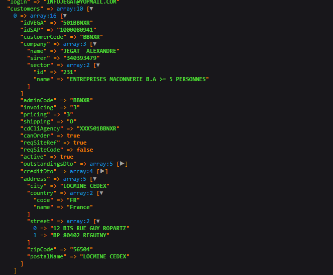

<span style="color:red">!!</span> Note that User is not able to select an agency which is not part  of one of his CUSTOMER object.
It implies that for such agencies (which are not part of User’s CUSTOMER(S) agencies), button “Select this agency” is disabled.

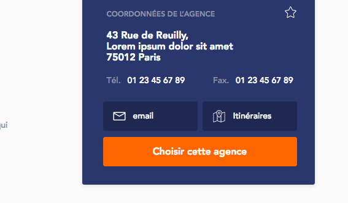

It must be applied on :

* Agency Map page
* Agency / Showroom detail pages

Regarding Agency selection pop-in (see related section) - it must only show Agencies (and their corresponding Regions) that are part of User’s CUSTOMER(S). 

<span style="color:red">!!</span> List of agencies of the User must be “extracted” from his different CUSTOMER objects combined. 

### VI Users case
This section concerns VI Part and VI Pro Users.
VI Users always have an empty CUSTOMER object. VI Users don’t have any restrictions on agencies, they can link themselves to all agencies. 
“Agencies” object sends back default agency. Note that “agencies” object might be empty - in such case, agency defined in settings.inc for that purpose is used as default agency. 

### Front-end impacts
This section lists places where info shown on front-end changes depending on selected CUSTOMER (for VI CLI Users only). 

#### My Account Home page
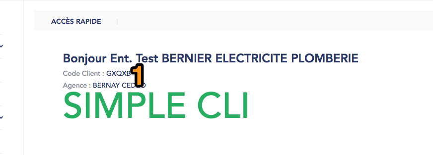

1. **Code client :** value taken from current CUSTOMER > customers.customerCode

#### My Account - personal information
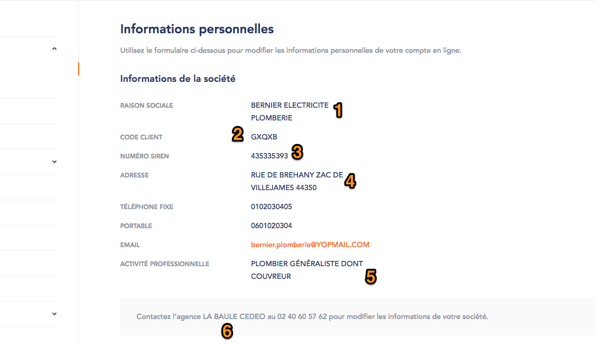

1. **Company name :** value taken from current CUSTOMER > customers.company.name
2. **Client code :** value taken from current CUSTOMER > customers.customerCode
3. **SIREN number :** value taken from current CUSTOMER > customers.company.siren
4. **Address :** value taken from current CUSTOMER > customers.address (use ‘street’, ‘zipCode’ and ‘postalName’)
5. **Sector :** value taken from current CUSTOMER > customers.company.sector.name
6. **Agency info :** value taken from current CUSTOMER > customers.agencies, use Name and Phone number of default agency from the CUSTOMER’s agencies list

#### My account - Address book
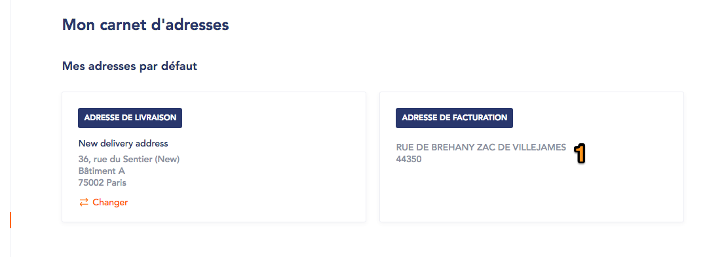

1. **Address :** value taken from current CUSTOMER > customers.address (use ‘street’, ‘zipCode’ and ‘postalName’)

#### My account - Outstanding amounts
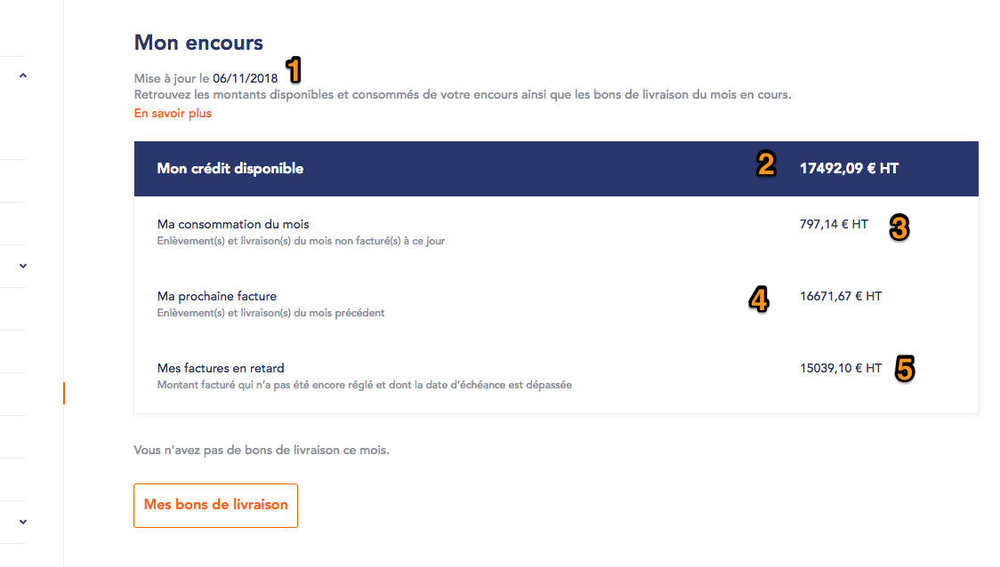

1. **Date :** value taken from current CUSTOMER > customers.outstandingsDto.date
2. **Outstanding currently available :** value calculated from current CUSTOMER > customers.creditDto.granted - customers.outstandingsDto.total
3. **Monthly total outstanding :** value taken from current CUSTOMER > customers.oustandingsDto.delivered
4. **Outstanding consumed this month :** value taken from current CUSTOMER > customers.outstandingsDto.left
5. **Due amount :** value taken from current CUSTOMER > customers.outstandingsDto.due (If value is negative, display 0,00 €)

#### Checkout step 2  - Outstanding amount table
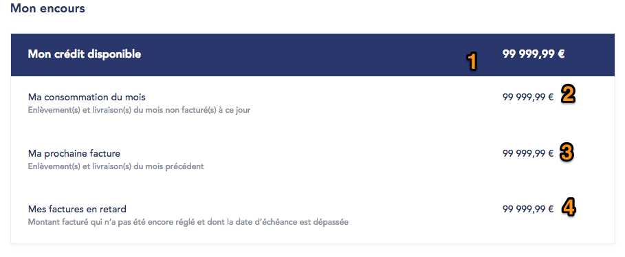

1. **Outstanding currently available :** value calculated from current CUSTOMER > customers.creditDto.granted - customers.outstandingsDto.total
2. **Monthly total outstanding :** value taken from current CUSTOMER > customers.oustandingsDto.delivered
3. **Outstanding consumed this month :** value taken from current CUSTOMER > customers.outstandingsDto.left
4. **Due amount :** value taken from current CUSTOMER > customers.outstandingsDto.due (If value is negative, display 0,00 €)

#### Checkout Step 1 - reqSiteCode & reqSiteRef
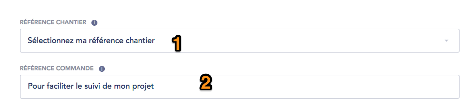

1. **reqSiteCode drop-down :** behavior (mandatory / optional) depends on value taken from current CUSTOMER > customers.reqSiteCode (if true, then field is mandatory, else optional)
2. **reqSiteRef text field :** behavior (mandatory / optional) depends on value taken from current CUSTOMER > customers.reqSiteRef (if true, then field is mandatory, else optional)

#### canOrder case
canOrder process (see related section) applies based on current CUSTOMER > customers.canOrder value. 

#### Shipping costs case
Shipping costs options (see related section) apply based on current CUSTOMER > customers.shipping value. 

#### Spare parts form
See specs in related section. Next update applies for VI CLI : 
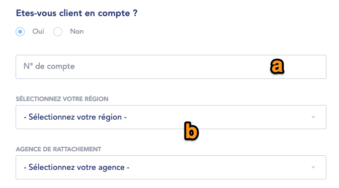

a. **Account number :**  value taken from current CUSTOMER > customers.customerCode
b. **Region / Agency :** drop-down list values are taken from User’s different CUSTOMER objects combined. Default value taken from current CUSTOMER > customers.agencies => default agency. <span style="color:red">!!</span> Note that Region drop-down must be displayed on top of the Agencies drop-down - and its default value is region corresponding to default agency.

In addition, next fields must be pre-filled using values from current CUSTOMER object :

* Address
* Zipcode
* City
* Company name
* SIREN 
* Profession

Note that after submission, email sent to email address(s) set in back-office must reflect selected values. 

#### Claims form
See specs in related section. Next update applies for VI CLI. Next fields must be pre-filled using values from current CUSTOMER object :

* Region / Agency fields : drop-down list values are taken from User’s different CUSTOMER objects combined. Default value taken from current CUSTOMER > customers.agencies => default agency.
* Company name 
* Account number > customerCode
* Address
* Zipcode
* City

Note that after submission, email sent to User / email address(s) set in back-office must reflect selected values. 

### Agency selection pop-in case
Once the muti-customers feature is deployed to the site :

* If VI CLI User agency stored in cookie is not part of his CUSTOMERS, then on login load site with User’s default agency from hist first CUSTOMER in the list (since he will not be able to link to an agency which is not part of his CUSTOMERS).

Updated agency selection pop-in logic is described in corresponding section. 

---

NOTES & Questions: 

Currently, default agency is used in :

* Spare parts form (as pre-defined value) / Claims form emails
* Agency selection pop-up
* Payment => we pass default agency in Update Billing (we set payment method and agency as arguments) => WE MUST PASS CURRENT AGENCY
* !! For VI Part / VI Pro we still need default agency as it is right now => Default agency will still be sent
* VUE Information form => to check http://prntscr.com/mlko2g
* COMPANY info on Informations personnelles => should we use from CUSTOMER ? (currently we use the one outside of customer) => WE USE THE ONE FROM CURRENT CUSTOMER
* What about Billing address for VI CLI which can’t be modified : should we update it based on agency? => WE USE THE ONE FROM CURRENT CUSTOMER 
* what to do if user already on a such agency - we change it to what?  => we could update cookie to default agency, but need to clarify how to get default agency => TO CHECK, not critical
* <span style="color:red">Do we use next fields currently ?</span>
	* idVEGA => looks to be used in Mitsubishi feature 
	* idSAP
	* adminCode
	* Invoicing
	* Pricing
	* cdCliAgency
	* Active
	* => http://prntscr.com/mn7ukt

## **User <> Agency relationship**
When user visits the website for the first time, he is VA by default, since he is anonymous and didn’t select any agency yet. 
While on the website, priority is to drive him to either select an agency or log in (if he already has an account). This will allow to push him relevant prices / stock, etc... information. 
It is the a Business goal to make sure he will not get back to the VA state (so he will either be VAR after selecting an agency, either logged in (VI Part / VI Pro / VI CLI). 


As soon as user gets linked to an agency, the corresponding agency ID must be stored in a cookie (for 13 months, maximum allowed cookie duration). <span style="color:red">!! Note that cookie MUST be specific to User.</span> 

Note that linking to an agency can be achieved via several places :

* Store locator (Agencies Map page)
* Agency detail page
* Product Locator
* User authentication (since user would switch from VA/VAR to logged-in user which always has a default agency)

<u>**Note that as soon as User selects another agency, cookie is then updated with the related Agency ID.**</u> 
This rule applies whatever user role is. 
Also, note that logged-in users (VI Part / VI Pro / VI CLI) can be linked to several agencies, even though they can only select one at a time on the website. Even if user is linked to several agencies, there will always be a single one as Default. 


Agency ID stored in cookie is used in 2 cases :

1. **User visits the website as an anonymous user.** If he already selected an agency previously, then he is automatically linked to agency stored in cookie. He is then a VAR. 
2. **The user triggers the login process :**
* If user only has 1 related agency, then this agency is selected by default, and Cookie is updated. 
Use case example :
	* User visits the website => since (let’s say) he visited the website earlier and linked to agency 1234, then agency 1234 is stored in cookie. 
	* So, User gets automatically linked to agency 1234
	* User then decides to login, since he already has an account. His account is linked to agency 2345
	* After login, agency 2345 is then used, and cookie is updated to store agency 2345 ID


* If user has several related agencies, then after login a pop-in opens, to present his different available agencies via a drop-down list (note that if there are agencies from different regions, then pop-in will show 2 drop-down lists, 1 for region, and 1 for agencies (conditional values to the 1st drop-down list value selected)). Drop-down list by default selected value is either :
	* Agency ID stored in cookie, if this Agency ID is also part of User’s related agencies
	* 1st CUSTOMERS default agency if no Agency ID stored in cookie at all
	* 1st CUSTOMERS default if Agency ID stored in cookie is not part of User’s related agencies

<span style="color:red">!!</span> If User default agency is onWeb = false, then the agencies selection pop-in must open. 

Note that Logged-in user can choose to select any other agency even if not from his agency list if he is VI Part / Pro, but not from the “Agency select pop-in” (meaning that Agency select pop-in will only show User’s agencies). VI CLI can only select an agency which is part of his CUSTOMERS. 

User agencies are retrieved via calling ** *GET /api/v1/accounts/{id}* ** (agencies property section) for VI Part / Pro, and from CUSTOMERS objects for VI CLI. If for a VI Part / Pro, ‘agencies’ object is empty, then default agency to use is the one set on settings.inc level. 
Default agency corresponds to the one marked as ** *isDefault = true* **.

<span style="color:red">!!</span> A specific case can be enabled / disabled on site, thanks to a dedicated setting in settings.inc :

* Setting name : *notRequestingAgencyatLogin* (must be set to 0 by default)

If this setting is enabled, then logic is applicable only if  :

* User does not have any agencyId set in browser cookie
* User has only 1 CUSTOMER object
* User has only 1 default agency (isDefault = true)

If this rule is matched, then when User login, the Agency selection pop-in is not displayed, and User gets automatically linked to his default agency.
=> the default agencyId is then placed into the cookie. 

Schemes of the different scenarii can be found here : https://prj.adyax.com/documents/3225

Screenshots below present the different pop-ins to display, depending on User case. Note that all pop-ins static strings are translatable from Translate Interface (context : pop-in selection Agence).

1. **User is a VI CLI, does not have any agency cookie set, and has several related agencies within 1 single region :**
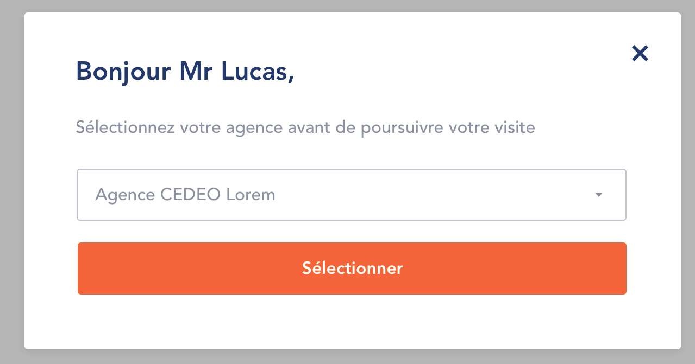

2. **User is a VI CLI, does not have any agency cookie set, and has several related agencies within several regions :**
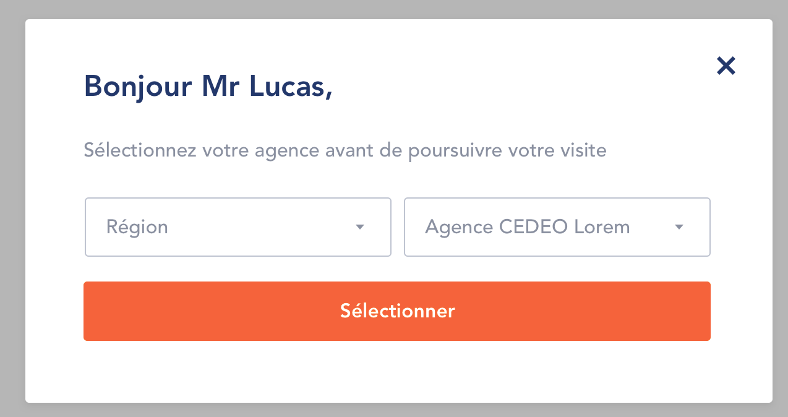

3. **User is a VI CLI, does have an agency cookie set which does not match with his related agency, and has only 1 related agency :**
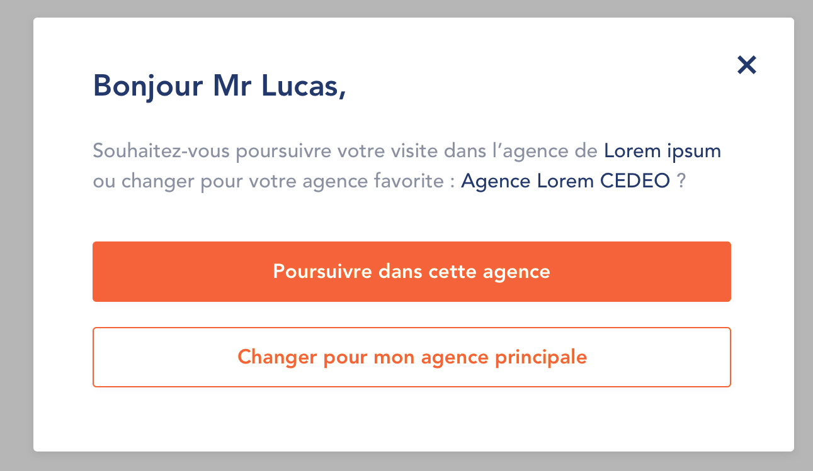

4. **User is a VI CLI, does have an agency cookie set which does not match with his related agencies, and has several related agencies within 1 single region :**
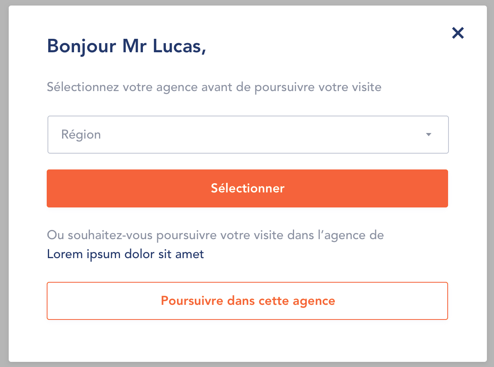
<span style="color:red">!!</span> Drop-down list must show Agencies list, not Region (design mistake).

5. **User is a VI CLI, does have an agency cookie set which does not match with his related agencies, and has several related agencies within several regions :**
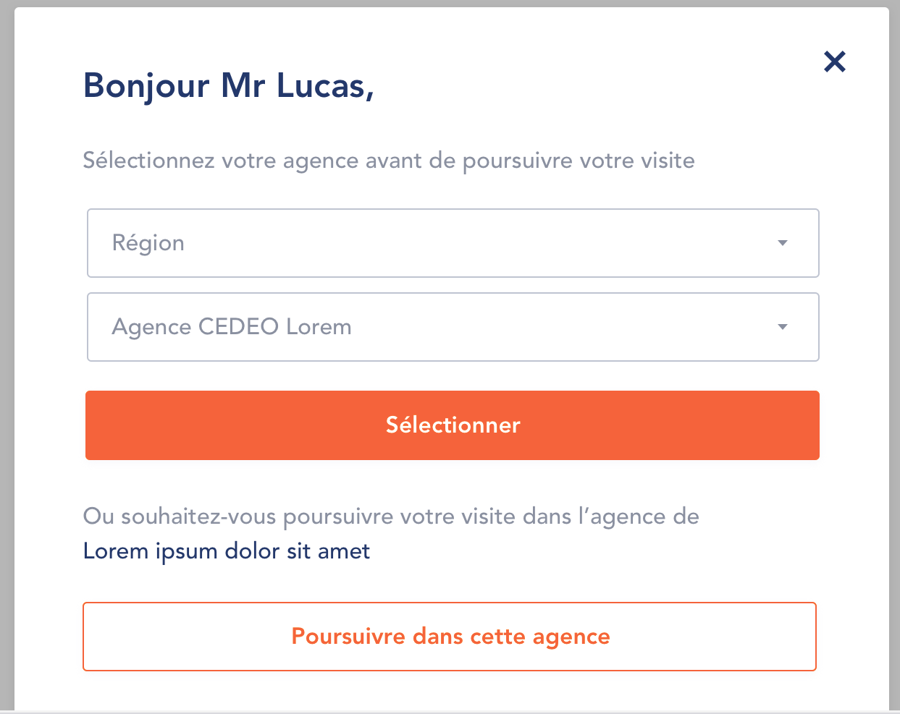

6. **User is a VI Pro or VI Part, and does have an agency cookie set which does not match with his related agency :**

<span style="color:red">!!</span> Second button label must be “Changer pour mon agence favorite” (design mistake).

### VI CLI users ordering rights
All user profiles will be able to switch to all available agencies from within the website at anytime, from both the store / product locators. When selecting another agency, we’ll update the cookie accordingly – as well as the cookie duration to 13 months.

Business teams should though be able to enable/disable rights over checkout for VI_CLI users when these are browsing the catalog in an agency where they didn’t open an account (meaning, they don’t have this agency listed in account DTO). This configuration must be managed from Drupal Back-Office.

If they decide to disable such rights, then VI_CLI users won’t even be able to add products to cart (whether from product listing page, product detail page or from products listing in “My Account” (wishlists, orders and so on). When trying to do so, a message will be displayed to invite them to select an agency where they can order <span style="color:red">(display a dropdown for them to switch?</span>

## **Session validation**
Since SGDBF allows their customers to proceed with payment settlements by line of credit ( =Outstanding
amount payment),  we will require them to enter their password at the cart validation step on Cart page.
Same logic will apply if trying to access the “My Account” section. 

This process is called “trusted session validation”.

The process must be triggered on certain conditions (it is not meant to be triggered each time).
In addition to the regular session cookie, an additional cookie “trusted session cookie” will be created when
User logs in. This cookie lifetime is defined from settings.inc. 

Based on Trusted session cookie expiration (= if, when trying to access one of the pages listed below, Trusted
session cookie is expired), a dedicated page to re-enter password will be displayed, when
trying to access :

| Page  | URL  | Comment  |
|---|---|---|
| Cart  | /panier  | Click on Validate for access to delivery page  |
| Checkout delivery  | /commande/livraison  |   |
| Checkout payment  | /commande/paiement  |   |
| My Account  | /mon-compte  | All pages from My account section (not only Account HP)  |

<span style="color:red">!!</span> Note that Input password must be a page, and not a pop-in - because pop-in implies that page is actually
loaded below pop-in, thus its content remains as accessible. 

<span style="color:red">!!</span> Note that User will not be logged out if the Trusted session validation process is triggered.

Note that we will force the removal of the Trusted session cookie when User closes browser - but this is up to
browser to actually delete it (we can’t guarantee that it will be actually removed by browser).

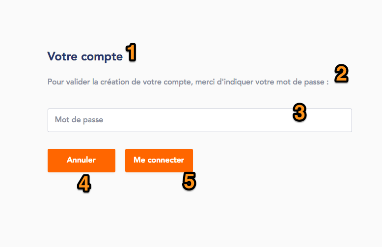

1. **Page title :** translatable from Translate Interface
2. **Page description :** translatable from Translate Interface. Default string : “Afin d’assurer la sécurisation et la confidentialité de vos données client nous vous demandons de bien vouloir saisir votre mot de passe.”
3. **Password input field**
4. **Cancel button :** <span style="color:red"> !!</span> must use button style 2 (design mistake). Clicking on it redirects User to previous page. Label is translatable from translate Interface. 
5. **Validate button :** clicking on it triggers a call to Authentication service. a loader may be displayed pending from service response in case of failure. If authentication fails, a red message will appear on top of the page. Apply the same alerts as specified in “Error management” section (configured in BO). Button label is translatable from Translate Interface. Default string is “Me connecter”. 
6. **Logout link :** on-click User gets logged out and redirected to Home Page. 
